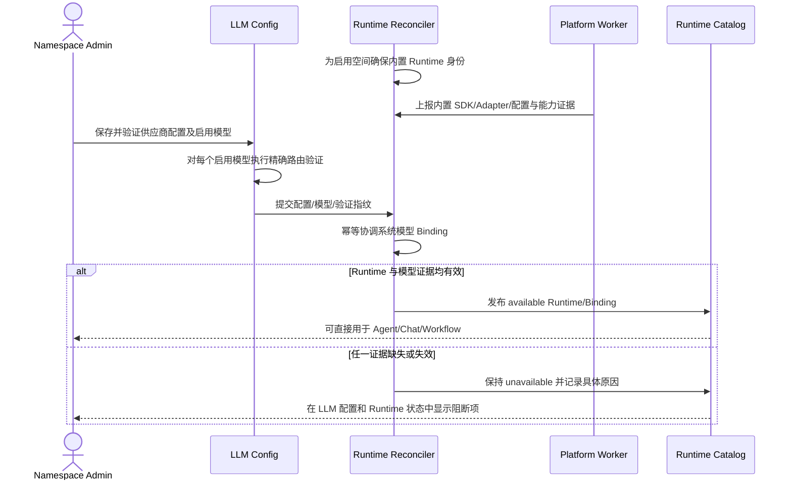

# 平台内置 Runtime

## 1. 目标声明

### 背景

v0.9 把平台执行环境实现成了可由空间 Admin 手工创建的 Runtime Instance。创建流程要求填写名称、安装标识、Claude Code/Codex 引擎、可执行文件和配置修订，模型还要在 Runtime 页面再次声明和验证 Binding。这与平台能力的产品边界不符：平台已经内置 Claude Agent SDK，用户只需要在空间侧配置好大模型接入，就应当能够直接使用平台执行能力。

### 目标

- 每个启用空间自动拥有且仅拥有一个正式的 `platform_builtin` Runtime，不提供创建、删除、启用或可执行文件配置操作。
- 平台 Runtime 固定使用平台发布的 `claude_agent_sdk` 引擎与适配器，版本、命令和进程环境属于平台部署事实，不属于空间业务配置。
- 空间 Admin 在大模型接入页完成配置、模型启用和真实验证后，系统自动生成或更新平台 Runtime 的精确模型 Binding，不再要求进入 Runtime 页面二次配置。
- Agent、Project、Conversation 和 Workflow 可从统一目录读取平台 Runtime 及其可用模型，并继续保存精确 Runtime/Binding ID。
- 保留配置摘要、能力报告和模型验证证据，以满足任务冻结与审计；这些证据由系统生成，对业务用户只读。

### 不在范围内

- 在平台 Runtime 上选择 Claude Code、Codex 或用户上传的执行引擎。
- 允许空间用户修改平台 Runtime 的 executable、arguments、工作目录、环境变量或 Adapter 版本。
- 未经模型级验证，仅凭供应商配置存在或模型名称相似就把模型标为可用。
- 平台 Runtime 不可用时自动改用服务节点、客户端 Runtime、另一供应商或另一模型。
- 删除或重写 v0.9 以前的平台 Runtime、Binding、Task 和历史执行证据。

## 2. 模块影响

| 模块 | 影响类型 | 说明 |
|---|---|---|
| `runtime_management` | 修改 | 自动维护空间级平台 Runtime、系统配置证据、能力报告和自动模型 Binding；关闭业务创建/配置入口 |
| `llm_configs` | 修改 | 对启用模型执行精确验证，并向 Runtime 协调器提供可审计的路由事实 |
| `namespaces` | 修改 | 空间创建/启用时产生持久化平台 Runtime 协调请求，不直接拥有 Runtime 实体 |
| `agent_management` | 修改 | 兼容目录和 Activation 读取系统管理的平台 Runtime，不展示可写 Harness/命令配置 |
| `project_management` | 修改 | 项目默认 Runtime 可选择自动存在的平台 Runtime |
| `conversation_management` | 修改 | Chat/Agent 会话从平台 Runtime 的自动模型目录选择 exact Binding |
| `workflow_management` | 修改 | 模板执行配置从平台 Runtime 的自动模型目录选择精确执行资源 |

## 3. 功能描述

### 3.1 平台 Runtime 自动引导

正常流程：

1. `runtime_management` 在空间创建、重新启用、版本迁移和周期对账时接收持久化协调任务。
2. 协调器以固定系统键 `platform:claude-agent-sdk` 幂等创建空间级 Runtime Instance；并发或重复任务只能得到同一实例。
3. 实例的管理类型固定为 `platform_builtin`，位置为 `platform`，引擎固定为 `claude_agent_sdk`，默认启用且不允许空间用户删除或改型。
4. Platform Worker 从受签名的平台发布清单加载实际 SDK/Adapter，生成系统配置摘要并上报能力报告。只有部署版本兼容、配置摘要匹配且能力报告未过期时，Runtime 才可进入可用目录。
5. 新空间即使尚未配置模型，也能看到平台 Runtime 身份；其状态明确显示“等待可用模型”，不能执行任务。

边界条件：

- 一个 namespace 只能有一个正式 `platform_builtin` Runtime；平台 Worker 可以多副本运行，但副本不是多个业务 Runtime。
- Runtime 名称为系统本地化展示名，不作为任务选择键，不允许通过改名创建第二个实例。
- 平台部署环境需要的进程变量和 secret 继续由部署配置注入，不复制到 namespace 配置或浏览器响应。
- 内部仍可生成不可变配置修订和能力报告作为执行证据，但其 `origin=system_builtin`，业务 API 只读。

异常处理：

- 内置 SDK 缺失、签名发布清单不匹配、Adapter 不兼容或能力报告过期时，Runtime 状态为 `unavailable/incompatible` 并显示稳定错误码。
- 自动引导失败保留协调任务和脱敏错误，由平台运维修复；不得临时允许用户填写 executable 绕过。
- 同一空间出现多个候选平台实例时进入迁移冲突，所有候选均不进入新任务目录，等待正式迁移处理。

### 3.2 大模型接入自动形成平台 Binding

正常流程：

1. Admin 在 `/system/llm-providers` 创建或更新供应商接入配置，选择需要启用的精确模型。
2. “配置完成”必须同时满足：Provider Config 已启用、连接验证成功、模型拥有精确稳定身份、目标模型完成最小真实调用验证，并且 Model Gateway 能无损提供 Claude Agent SDK 所需协议。
3. 对支持模型发现的供应商，系统逐个验证启用模型；对手工模型也使用明确 `provider_family + model_id` 验证，不做模糊映射。
4. 验证成功后，`llm_configs` 写入模型级验证证据并产生协调任务。Runtime 协调器为内置 Runtime 创建系统来源的 `provider_config` Binding。
5. Binding 的路由键、Provider Config、Provider Model、稳定模型身份和验证指纹均由系统确定。用户无需也不能在 Runtime 页面再次声明或点击验证。
6. Provider/模型被禁用、密钥或地址变化、验证过期或 Gateway 合同变化时，协调器保留 Binding 历史但立即从新任务目录移除；恢复验证后可重新可用。

边界条件：

- 同一模型可通过多个 Provider Config 形成多条明确 Binding；目录不擅自选择默认路由。上层若需要 exact 模式，必须选择 Binding ID。
- Provider Config 的普通连接探活不能替代模型级真实验证。UI 将两者放在同一大模型配置流程中完成，但证据粒度保持独立。
- 不支持 Claude Agent SDK 协议转换的供应商在 LLM 配置页显示 `platform_runtime_route_unsupported`，不能靠 Runtime 页面手填地址继续。
- 平台 Runtime 不使用 `runtime_native` 登录，也不读取节点本地凭证。

异常处理：

- 鉴权、额度、区域、模型不存在、协议不兼容和验证超时分别保存脱敏错误码；失败模型不影响同配置下已独立验证成功的其他模型。
- 配置更新期间，旧 Binding 只在旧验证仍与当前配置指纹一致时保持可用；不能把旧地址/密钥的成功结果套到新配置。
- 协调任务失败时 LLM 配置页显示“模型已验证、平台路由协调失败”，Runtime 目录保持不可用，不伪装为成功。

### 3.3 统一目录与历史迁移

正常流程：

1. Runtime 目录按“平台内置 / 服务节点 / 客户端”分组，平台区域固定显示内置 Runtime 的部署、能力、模型和最近协调状态。
2. Agent Activation、项目、会话和 Workflow 仍提交精确 Runtime Instance ID；模型仍提交 exact Binding 或经过严格唯一解析的偏好。
3. v0.10 迁移为每个现有启用空间创建新的系统内置 Runtime。旧手工平台 Runtime 标记为 `legacy_manual`，保留历史读取但不进入新配置选择器。
4. 旧 Task/Session/Activation 继续引用原 Runtime 和证据，不原地改写到新内置 Runtime。

边界条件与异常处理：

- 旧平台 Binding 只有在能精确证明 Provider Config、Provider Model、稳定身份和当前模型验证全部一致时，才可为新内置 Runtime生成新的系统 Binding；否则列入迁移诊断。
- 历史 Runtime 上仍在执行的 Task 可按旧冻结证据完成；切换后创建的新 Task 只接受 v0.10 正式目录。
- 不提供“找不到内置 Runtime 时继续使用第一个旧平台 Runtime”的兼容回退。

## 4. 数据变更

遵循只增不改不删；旧字段和历史记录保留。

新增表：

| 表名 | 用途说明 |
|---|---|
| `platform_runtime_reconcile_job` | 持久化空间创建、部署变化、LLM 配置变化和周期对账触发的幂等协调任务 |
| `platform_runtime_reconcile_attempt` | 追加记录每次内置 Runtime/Binding 协调的输入指纹、结果与脱敏诊断 |
| `llm_provider_model_validation` | 保存 Provider Config 下每个精确模型的真实验证状态、证据摘要、配置指纹和有效期 |

新增字段：

| 表名 | 字段名 | 类型 | 业务含义 |
|---|---|---|---|
| `runtime_instance` | `management_type` | enum | `platform_builtin`、`service_managed`、`client_discovered`；本需求使用 `platform_builtin` |
| `runtime_instance` | `lifecycle_source_key` | varchar | 系统稳定来源键；平台固定为 `platform:claude-agent-sdk` |
| `runtime_configuration_revision` | `origin` | enum | 配置来源；平台内置修订为 `system_builtin` |
| `runtime_model_binding` | `origin` | enum | Binding 来源；平台自动路由为 `llm_config_reconciled` |
| `runtime_model_binding` | `provider_model_validation_id` | uuid，可空 FK | 指向产生当前可用结论的模型级验证证据 |

调整已有字段说明：

| 表名 | 字段 | 调整说明 |
|---|---|---|
| `runtime_instance` | `name` | 平台内置实例为系统展示字段，不再允许业务修改 |
| `runtime_instance` | `enabled` | 平台内置实例由空间和平台部署状态推导，不接受单独开关 |
| `runtime_configuration_revision` | `executable/arguments/environment_allowlist` | 对 `platform_builtin` 为系统生成的执行证据，业务接口只读 |
| `runtime_model_binding` | 手工创建语义 | `platform_builtin` 不接受手工 Binding；旧记录标记历史来源并保留 |

关键约束：

- `runtime_instance(namespace_id, management_type)` 对 `platform_builtin` 部分唯一。
- 同一协调输入指纹重复执行必须幂等，不产生第二个 Runtime、重复 Binding 或重复有效验证。
- Binding 可用性必须同时引用当前 Provider 配置指纹、模型验证、Runtime 配置摘要和能力指纹。

## 5. API 与 UI 页面

### API 调整

| Method | Path | 用途 |
|---|---|---|
| GET | `/runtime-instances` | 返回自动存在的平台 Runtime，并携带 `management_type` 与只读状态摘要 |
| GET | `/runtimes/{runtime_id}` | 平台 Runtime 只读返回部署配置证据、能力、自动 Binding 与协调诊断 |
| POST | `/runtimes/platform` | v0.10 正式语义返回 410 `platform_runtime_system_managed` |
| PUT/POST | `/runtimes/{id}/configuration[/apply]` | 对平台内置 Runtime 返回 409/410，不接受业务配置 |
| POST | `/runtimes/{id}/model-bindings` | 对平台内置 Runtime 返回 409/410，Binding 只能由 LLM 协调器产生 |
| POST | `/llm/provider-configs/{id}/validate` | 同一流程返回连接验证与逐启用模型的精确验证结果 |
| GET | `/llm/provider-configs/{id}/runtime-readiness` | 返回该配置在平台 Runtime 上的模型级可用/阻断摘要 |

所有 LLM 配置 mutation 继续使用现有权限、CSRF/CAS/幂等约束。协调为持久异步过程，API 不以进程内 fire-and-forget 任务冒充完成。

### UI 页面

| 变更类型 | 页面名 | 路由 | 说明 |
|---|---|---|---|
| 修改 | Runtime 管理 | `/system/runtimes` | 平台区域固定展示内置 Runtime，删除“创建平台 Runtime”按钮 |
| 修改 | 平台 Runtime 详情 | `/system/runtimes` 或 `/system/runtimes/:runtimeId` | 只读展示 SDK/Adapter、能力、自动模型路由和诊断，不展示命令配置表单 |
| 修改 | 大模型接入配置 | `/system/llm-providers` | 在同一配置流程展示每个启用模型的“平台 Runtime 可用性” |
| 修改 | Agent/项目/工作台/Workflow 选择器 | 既有路由 | 按三类 Runtime 分组，继续保存精确 ID |

页面交互：

- 平台 Runtime 卡片固定在 Runtime 目录顶部，名称旁显示“平台内置 / 无需配置”。
- 未配置模型时提供前往大模型接入配置页的明确入口，不显示 Runtime 创建或 executable 输入。
- 模型验证成功但协调尚未完成时显示 `reconciling`；失败显示具体配置与模型，不把整个 Runtime 简化成一个红点。
- Developer 只读；Admin 的模型修复入口位于 LLM 配置页，而不是 Runtime 页面。

## 6. 验收标准

- [ ] 新空间无需任何 Runtime 创建操作即可看到唯一的平台内置 Claude Agent SDK Runtime。
- [ ] Runtime 页面不存在创建平台 Runtime、选择引擎、填写安装标识、可执行文件、参数或环境变量的入口。
- [ ] Admin 在大模型配置页完成启用模型的真实验证后，系统自动形成平台 Runtime Binding，无需二次声明或验证。
- [ ] Provider 配置、模型或验证失效后，对应 Binding 立即退出新任务目录，且不会切换到其他路由或模型。
- [ ] 平台 Worker 的 SDK/Adapter/配置或能力证据不匹配时 Runtime 明确不可用，不能通过业务配置绕过。
- [ ] Agent、Project、Conversation 和 Workflow 能选择自动存在的平台 Runtime，并继续保存精确 Runtime/Binding ID。
- [ ] 多条可用 Provider 路由不会产生隐式默认；exact 选择和 Agent 偏好歧义继续按既有严格规则处理。
- [ ] 旧手工平台 Runtime、Binding 和 Task 保持可审计；新任务不回退使用旧平台 Runtime。
- [ ] 并发空间引导和重复 LLM 协调不会创建重复 Runtime、Binding 或验证记录。
