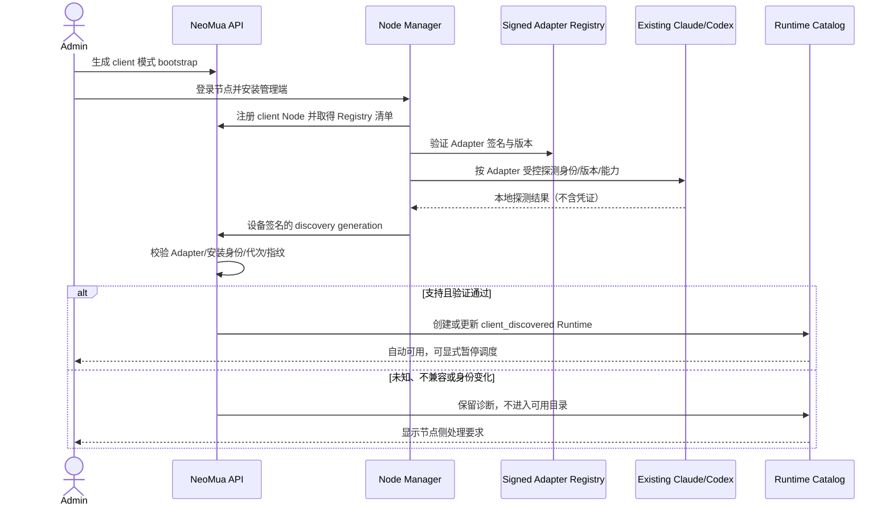

# 客户端 Runtime 自动发现与控制

## 1. 目标声明

### 背景

客户端 Runtime 面向已经安装并由机器管理员维护 Claude Code、Codex 或其他受支持 Agent Runtime 的节点。管理员只需要安装 NeoMua 管理端，管理端应通过平台内置的受信任 Adapter 自动发现、验证和控制这些现有引擎，而不是要求用户在 Web 页面手工填写 executable、安装标识或能力 JSON。

客户端模式与服务节点不同：NeoMua 不安装、不升级、不降级、不替换被发现的引擎，也不把本机登录凭证上传到平台。管理端负责安全探测、任务控制、事件归一化和状态回报；引擎本身的生命周期仍由节点机器管理员负责。

### 目标

- Admin 可生成 `client` 模式 bootstrap，会在目标节点仅安装 NeoMua Node Manager 与受签名 Adapter Registry。
- Node Manager 启动后自动发现本机受支持的 Claude Code、Codex 等安装，并为每个经过身份、版本和能力验证的安装创建稳定 Runtime Instance。
- client bootstrap 本身构成“允许 NeoMua 管理本机所有受平台支持 Adapter”的节点级授权；符合范围的实例验证成功后自动启用，Admin 可显式暂停后续调度。
- 控制面不保存本机绝对 executable 路径、OAuth token、API Key 或用户配置内容；任务通过节点本地逻辑执行引用定位目标安装。
- 引擎消失、升级、身份变化、登录失效或能力变化时保留 Runtime 身份和历史，停止新任务并给出具体诊断。
- Claude Code、Codex 和后续引擎都通过同一规范 TaskExecutionSpec/Agent Event 合同运行；Adapter 无法表达的能力在预检阶段阻断。

### 不在范围内

- 客户端安装流程部署或修改 Claude Agent SDK、Claude Code、Codex、模型登录、MCP executable 或其插件。
- 扫描整块磁盘、执行用户 Shell 配置、按可执行文件名猜测身份或接受用户提交任意路径。
- 从节点上传本地凭证、完整配置文件、绝对路径、命令输出原文或其他无关环境信息。
- 一个引擎不可用时自动切换到同机另一引擎、服务节点或平台 Runtime。
- 对未知 Adapter、版本不兼容或能力不足的引擎提供“尝试运行”开关。
- 自动升级或修复外部引擎；只能提示机器管理员在节点按该引擎的正式方式处理。

## 2. 模块影响

| 模块 | 影响类型 | 说明 |
|---|---|---|
| `runtime_management` | 修改 | 增加 client 节点 bootstrap、Adapter Registry、节点本地安装引用、发现观察、控制授权与失效对账 |
| `namespaces` | 只读依赖 | client bootstrap 绑定空间和 Admin 权限 |
| `agent_management` | 修改 | 对 Claude Code/Codex Adapter 使用同一能力合同和精确 Runtime Activation |
| `project_management` | 修改 | 工作区证明与仓库探测绑定具体 client Runtime，不绑定整台 Node |
| `conversation_management` | 修改 | 会话只选择已验证可用的 client Runtime/模型，不按 Node 自动换引擎 |
| `workflow_management` | 修改 | 节点执行配置冻结精确 client Runtime、Adapter、能力与模型证据 |

## 3. 功能描述

### 3.1 客户端管理端安装与授权

正常流程：

1. Admin 在 Runtime 管理页选择“添加客户端节点”，生成绑定 namespace 和 `client` 模式的一次性 bootstrap 会话。
2. 管理员登录目标节点执行 `neomua-node install --mode client`，安装器沿用服务节点需求中的 TLS、OS/架构/systemd、签名发行、staging、设备密钥和原子身份保存流程。
3. client 发行清单只包含 Node Manager、协议组件和受签名 Adapter Registry，不包含或安装 Claude Agent SDK/Claude Code/Codex。
4. Node Manager 首次连接时上报 `management_mode=client`。client 模式固定到该设备身份，不能在 Web 页面改成 service。
5. 执行 client bootstrap 表示管理员授权 NeoMua 管理该节点上所有“平台已发布且签名验证通过”的 Adapter 安装。未知 Adapter 只能显示诊断，不能执行。

边界条件：

- client 与 service 使用不同模式绑定的 bootstrap 凭证和发行清单；跨模式提交返回冲突。
- 本机已有其他平台、namespace 或管理模式的 NeoMua 身份时停止，不覆盖其状态目录。
- 首期平台支持的 Adapter 清单必须明确列出 Claude Code 与 Codex 的探测/执行合同；“其他类似 Runtime”只有发布正式 Adapter 后才进入支持范围。

异常处理：

- 管理端安装失败沿用服务节点的事务化 attempt 和同身份恢复语义，不使用临时守护进程。
- Adapter Registry 签名、版本或协议不匹配时整个发现周期失败并保留上一可信观察；新安装不能进入目录。

### 3.2 受信任的自动发现

正常流程：

1. Node Manager 在启动、Adapter Registry 更新、受控周期和管理员显式重新扫描时执行发现。
2. 每个 Adapter 声明有限且精确的标准安装绝对路径、可执行文件身份校验、版本探测参数、超时、最大输出、能力探测和模型/登录就绪检查；首期不得依赖 PATH 查找，以免同机多安装时静默切换目标。
3. 管理端不执行用户 shell，不加载 `.bashrc/.zshrc`，不遍历任意目录；只检查 Adapter 声明的有限候选。
4. 初次确认安装时，节点本地注册表分配稳定 installation UUID，并保存 Adapter ID、逻辑位置、可执行文件指纹和最近可信版本。控制面只接收 installation key、不可逆指纹、版本、能力和 Adapter 签名摘要。
5. Node Manager 将完整发现集合以递增 generation 和设备签名上报。控制面验证 Node 模式、Adapter、代次、重复 key 和载荷上限后幂等创建/更新 `client_discovered` Runtime。
6. 新发现实例在身份、版本、Adapter 合同、能力与本地登录/模型路由验证全部通过后自动启用；Admin 可以显式暂停新任务调度。

边界条件：

- 同一节点可发现多个不同引擎或同引擎的多个明确安装，每个拥有独立 Runtime ID 和本地 installation UUID。
- Runtime 名称用于展示；任务和审计使用 UUID，不按 `claude`、`codex` 等名称解析。
- 本地绝对路径只保存在权限受限的节点注册表。控制面配置使用 `adapter_execution_ref`，节点在任务准备时解析并复核指纹。
- 仅能读取完成探测所需的最少元数据；Adapter 不得上传配置文件正文、环境变量值、登录 token 或未经脱敏的 stdout/stderr。

异常处理：

- 未知 Adapter、版本解析失败、探测超时、输出超限或签名不匹配时记录结构化诊断，不创建可执行 Runtime。
- 同一 generation 载荷不同视为协议冲突；旧 generation 不覆盖新状态。
- 发现周期失败不能把“未扫描到”当成所有引擎已卸载；只有一次完整、签名且成功的 generation 才能推进消失状态。

### 3.3 控制现有引擎与模型凭证边界

正常流程：

1. 任务选择精确 client Runtime Instance。控制面冻结 Adapter、引擎/版本、配置/能力指纹、模型 Binding 和策略。
2. Node Manager 在任务领取后通过本地 `adapter_execution_ref` 定位安装，重新核对可执行文件指纹、版本、登录状态、工作目录和能力。
3. Adapter 把规范 TaskExecutionSpec 翻译为结构化 argv/env，不经过 Shell 拼接；只允许平台发布合同内的参数和权限模式。
4. Claude Code/Codex 的本地登录或凭证继续留在节点。管理端只上报“可用/失效”的验证证据和不可逆摘要，不上传 token 或配置内容。
5. Adapter 将输出归一化为 Agent Event。不能无损表达 Tool、Skill、MCP、权限或会话能力时，在 Activation/Task precheck 返回 `adapter_contract_unsupported`。

边界条件：

- client Runtime 的默认模型来源为经过节点实测的 `runtime_native` Binding；没有精确可用 Binding 时不能执行。
- 若未来允许 Provider Config 路由，必须另行明确凭证和 Gateway 边界；本需求不把平台 LLM 配置自动注入客户端引擎。
- Admin 的“暂停”只阻止新任务，不终止在途任务或修改本地引擎。
- Node Manager 不拥有外部引擎的安装/升级生命周期，UI 只能给出节点侧正式处理建议。

异常处理：

- 任务准备时指纹、版本、能力或登录证据与冻结快照不一致，任务在启动模型前失败；不得调用另一个本地安装。
- Adapter 进程异常、事件无法解析或能力字段丢失时写入脱敏错误并中断任务，不返回伪造的通用成功结果。
- 本地凭证失效时 Binding 立即不可用；不得回退使用平台 Provider Config。

### 3.4 安装变化、消失与恢复

正常流程：

1. 外部引擎升级后，Adapter 在完整发现周期中识别新版本和指纹，先把 Runtime 标为 `change_detected`。
2. 管理端重新执行版本兼容、能力和模型/登录验证；全部通过后追加新能力报告并恢复可用。历史 Task 仍引用旧指纹。
3. 完整发现 generation 确认安装消失时，Runtime 保留身份并标记 `unavailable: installation_missing`，不删除后重建。
4. 同一节点本地注册表确认原安装恢复时复用 Runtime 身份；若 installation UUID/Adapter 身份冲突则创建迁移诊断，不自动合并。

边界条件与异常处理：

- 引擎变更不触发 NeoMua 自动升级、降级或重装。
- 能力减少会使依赖该能力的新 Activation/Task 阻断；不会丢弃需求继续执行。
- 节点离线时所属 Runtime 统一连接不可用，但各自最近安装观察、能力和错误保持独立。
- 本地注册表丢失时无法证明旧 installation UUID，必须阻断身份恢复；不能仅按路径或名称绑定旧 Runtime。

### 3.5 历史节点迁移

1. 旧 Node/Runtime 没有 `management_mode`、签名 Adapter Registry 和本地 installation UUID 证据时标记 `legacy_unclassified`。
2. 管理员需在目标节点执行 v0.10 client adopt/install 流程。只有节点提交可验证的本地注册表和完整 discovery generation 后，才可建立 client Runtime。
3. 若新发现能以受信任迁移 receipt 精确关联旧 Runtime，可保留其业务 ID；无法唯一证明时保留旧 Runtime 为历史并创建新 Runtime，不猜测合并。
4. 在途旧任务按冻结证据处理；新任务只接受 v0.10 正式 client 目录。

## 4. 数据变更

新增表：

| 表名 | 用途说明 |
|---|---|
| `runtime_adapter_release` | 保存平台发布的不可变 Adapter ID、引擎类型、协议/版本范围、发现合同、执行合同、摘要和签名 |
| `runtime_discovery_observation` | 追加保存每次完整 generation 中各安装的存在/变化/消失、版本、指纹、能力摘要和诊断 |
| `runtime_control_decision` | 记录 client bootstrap 自动授权、Admin 暂停/恢复及操作者，不用单一布尔值丢失历史 |
| `runtime_installation_migration_receipt` | 保存旧 Runtime 与 v0.10 本地 installation UUID 的设备签名关联证明 |

新增字段：

| 表名 | 字段名 | 类型 | 业务含义 |
|---|---|---|---|
| `runtime_node` | `management_mode` | enum | 客户端节点为 `client` |
| `runtime_node` | `adapter_registry_digest` | varchar，可空 | 当前已应用的受签名 Adapter Registry 摘要 |
| `runtime_instance` | `management_type` | enum | 客户端发现实例为 `client_discovered` |
| `runtime_instance` | `lifecycle_source_key` | varchar | 由 Node ID、Adapter ID 与本地 installation UUID 组成的稳定来源键 |
| `runtime_instance` | `current_discovery_observation_id` | uuid，可空 FK | 当前可信安装观察 |
| `runtime_configuration_revision` | `origin` | enum | 客户端系统修订为 `client_adapter` |
| `runtime_configuration_revision` | `adapter_execution_ref` | varchar，可空 | 节点本地解析的逻辑引用，不含绝对路径 |
| `runtime_capability_report` | `adapter_release_id` | uuid，可空 FK | 产生能力报告的精确签名 Adapter 版本 |

调整已有字段说明：

| 表名 | 字段 | 调整说明 |
|---|---|---|
| `runtime_instance` | `installation_key` | client 模式由节点本地 installation UUID 派生，不接受 Web 表单输入 |
| `runtime_instance` | `executable_fingerprint` | 继续保存不可逆摘要；本地实际路径不上传 |
| `runtime_instance` | `enabled` | client 模式由最近 `runtime_control_decision` 与当前验证状态共同推导 |
| `runtime_configuration_revision` | `executable/arguments` | 对 `client_discovered` 标记为 v0.10 新写路径废弃；使用签名 Adapter 与本地执行引用 |

关键约束：

- `runtime_instance(runtime_node_id, lifecycle_source_key)` 唯一。
- 只有完整、设备签名、Adapter Registry 匹配的 generation 才能推进 `current_discovery_observation_id`。
- 不同 Adapter ID 或 installation UUID 不能因名称/路径相同而合并。
- Control decision 只控制调度授权，不能把不兼容或证据过期的 Runtime 强制变为可用。

## 5. API 与 UI 页面

### API/协议/CLI

| Method/消息/命令 | Path/类型 | 用途 |
|---|---|---|
| POST | `/runtime-nodes/bootstrap-sessions` | Admin 创建绑定 `client` 模式的 bootstrap 会话 |
| CLI | `neomua-node install --mode client --platform-url ...` | 仅安装管理端和 Adapter Registry |
| WSS | `runtime_discovery_report` | 上报完整 generation、Adapter release 和安装观察 |
| WSS | `runtime_capability_report` | 按实例上报能力、配置、模型与登录就绪证据 |
| POST | `/runtime-nodes/{node_id}/discovery/refresh` | Admin 请求下一次受控重新扫描；不执行任意命令 |
| POST | `/runtimes/{runtime_id}/pause` | Admin 暂停新任务调度并写入 control decision |
| POST | `/runtimes/{runtime_id}/resume` | Admin 恢复授权；仍需重新满足所有可用性证据 |
| GET | `/runtime-nodes/{node_id}/discovery-observations` | 查看每代发现与结构化诊断，不返回路径或凭证 |

旧的 Runtime 手工创建、安装标识和 executable 配置接口对 `client_discovered` 返回 409/410。重新扫描只触发签名 Adapter 的有限探测，不接受路径、命令或 Shell 参数。

### UI 页面

| 变更类型 | 页面名 | 路由 | 说明 |
|---|---|---|---|
| 新增 | 客户端节点安装弹窗 | `/system/runtimes` | 展示 client 模式命令、一次性密文和“不安装引擎”边界 |
| 修改 | Runtime Node 详情 | `/system/runtimes/nodes/:nodeId` | 展示 client 模式、Adapter Registry、发现代次和实例列表 |
| 修改 | Runtime 详情 | `/system/runtimes/:runtimeId` | 展示引擎来源、版本、能力、native 模型、变化诊断和暂停/恢复 |
| 修改 | Runtime 目录 | `/system/runtimes` | 按平台内置、服务节点、客户端分组，不再把所有 Node Runtime 混为一类 |

页面交互：

- 客户端安装弹窗明确说明“只安装 NeoMua 管理端，不安装或修改 Claude Code/Codex”。
- 已发现实例自动展示来源为“本机已有安装”；不提供 executable、arguments、安装标识或能力 JSON 编辑框。
- 重新扫描按钮只显示请求状态和下一 generation；不能输入路径。
- 引擎变化分别显示 `change_detected`、`validating`、`available` 或具体 blocked 原因。
- 暂停/恢复需要确认并形成审计记录；恢复不跳过身份、版本、能力或登录验证。

## 6. 验收标准

- [ ] client bootstrap 只安装 NeoMua 管理端和签名 Adapter Registry，不安装、升级或修改 Claude Agent SDK、Claude Code、Codex。
- [ ] 管理端能自动发现受支持的 Claude Code、Codex 安装，并为多个安装生成稳定、独立的 Runtime Instance。
- [ ] 发现只使用 Adapter 声明的有限候选和受控探测，不扫描整盘、不加载用户 Shell、不按文件名猜测。
- [ ] 控制面不接收本地绝对路径、环境变量值、OAuth token、API Key 或配置正文。
- [ ] 经过身份、版本、能力和 native 模型/登录验证的实例可自动进入目录，无需手工填写 Runtime 配置。
- [ ] 未知 Adapter、不兼容版本、探测失败或能力不足的实例明确阻断，不能通过“强制启用”执行。
- [ ] 任务启动前重新核对精确本地 installation、指纹、Adapter、能力和登录证据；不一致时不改用同机其他引擎。
- [ ] 外部引擎升级或消失时保留 Runtime 身份和历史，重新验证前停止新任务。
- [ ] client Runtime 的 native 凭证失效时不回退使用平台 Provider Config。
- [ ] Admin 可审计地暂停/恢复调度，但恢复不能跳过可用性验证。
- [ ] 旧节点缺少 v0.10 证据时不猜测为 client；无法证明身份关联时保留旧 Runtime 并创建新实例。
