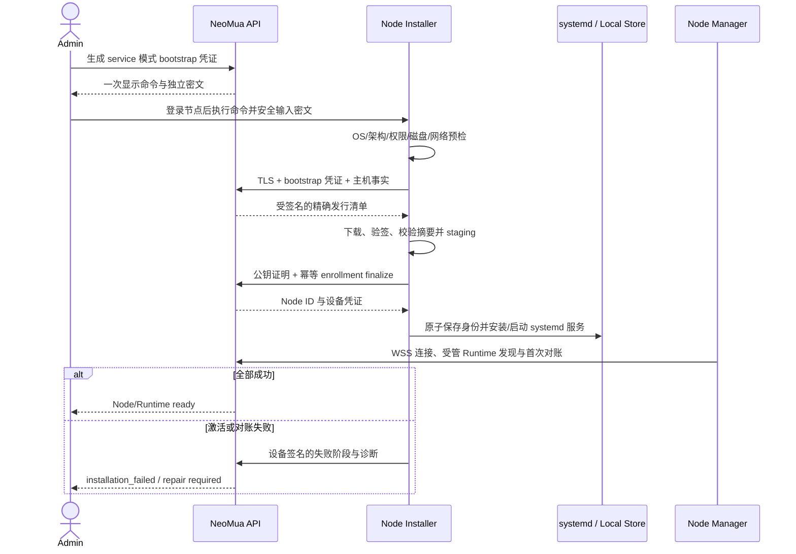

# 服务节点 Runtime

## 1. 目标声明

### 背景

服务节点是由 NeoMua 明确部署和管理的远程执行环境。管理员应登录目标节点并执行平台提供的正式命令，由安装器部署 Claude Agent SDK 与 NeoMua 管理组件，随后自动注册、发现并进入统一 Runtime 目录。平台不应主动 SSH 到节点，也不应要求用户在 Web 页面手工填写节点上的 executable 或伪造安装标识。

现有 `neomua-node install` 在调用注册接口后才写本地身份并安装 systemd 服务，安装失败可能发生在一次性 enrollment 已被消费之后；v0.10 必须以事务化 bootstrap 和可恢复安装状态替代该非原子流程。

### 目标

- Admin 可为当前空间生成绑定 `service_managed` 模式、短时有效且只显示一次的 bootstrap 凭证和安装命令。
- 管理员亲自登录目标 Linux/systemd 节点执行命令；平台不连接节点 SSH、不接收远程登录凭证。
- 安装器先完成环境预检、受签名发布清单下载与本地 staging，再完成设备注册、凭证原子保存、systemd 激活和首次对账。
- 服务节点安装独立、受管的 Claude Agent SDK 与 NeoMua Node Manager，不覆盖系统已有 Claude Code、Codex、Python 包或用户配置。
- 服务启动后自动注册唯一的 `service_managed` Runtime Instance，上报精确版本、配置摘要和能力，不要求 Web 端创建/配置 Runtime。
- 任一步骤失败都保留可诊断、可恢复的正式状态；不使用 `nohup`、临时 Shell、自签名包、全局 pip 或重复消费 enrollment 绕过。

### 不在范围内

- 平台通过 SSH、WinRM、远程桌面或其他远程执行协议安装节点。
- 在不受支持的 OS、架构或服务管理器上退化为后台 Shell 进程。
- 自动升级、降级或卸载节点软件；后续版本操作必须由管理员在节点执行明确命令并另行设计。
- 在服务节点上自动接管机器原有 Claude Code/Codex；该能力属于客户端 Runtime。
- 用户上传自定义 SDK、安装脚本、镜像源、Adapter 或任意启动命令。
- 安装失败后自动删除设备身份、重建节点或申请新的弱认证凭证。

## 2. 模块影响

| 模块 | 影响类型 | 说明 |
|---|---|---|
| `runtime_management` | 修改 | 拥有 bootstrap 会话、签名节点发行版、安装 attempt、节点模式、受管 Runtime 自动注册与状态诊断 |
| `namespaces` | 只读依赖 | bootstrap 凭证绑定当前空间并校验 Admin 权限 |
| `agent_management` | 适配 | Activation 读取服务节点 Runtime 的受管能力和模型证据 |
| `project_management` | 适配 | 项目可选择已就绪的服务节点 Runtime，不接受未完成安装的节点 |
| `conversation_management` | 适配 | 会话目录展示服务节点的精确可用状态 |
| `workflow_management` | 适配 | Workflow 配置只接受已完成 bootstrap 与能力验证的服务节点 Runtime |

## 3. 功能描述

### 3.1 生成 bootstrap 命令

正常流程：

1. Namespace Admin 在 Runtime 管理页选择“添加服务节点”。
2. 平台创建默认 10 分钟有效、一次消费、绑定 namespace、`service_managed` 模式和目标发行通道的 bootstrap 会话。
3. 页面分别一次性展示无密文安装命令和 bootstrap 密文。命令使用 `--mode service`，密文通过交互式隐藏输入提交，不默认拼入 URL、日志或 shell history。
4. Admin 登录目标节点，确认官方安装器已按平台支持的签名发行方式取得后执行命令。

边界条件：

- v0.10 首期只支持发行清单明确列出的 Linux、CPU 架构和 systemd；其他环境在预检阶段返回 `unsupported_host`。
- bootstrap 凭证只能用于其绑定的空间、管理类型和发行通道，不能改成 client 模式或用于第二台节点。
- 数据库只保存凭证哈希；页面关闭后不再返回明文。
- 生成命令不代表节点已注册，列表以独立 `waiting_for_install` 状态展示会话。

异常处理：

- 过期、吊销、模式不符或已被其他设备公钥占用的凭证明确拒绝，不自动签发新凭证。
- Admin 需要重新安装时必须显式吊销旧 bootstrap 会话并生成新的会话；旧节点身份是否保留按设备吊销流程单独处理。

### 3.2 事务化本地安装与设备注册

正常流程：

1. 安装器在产生持久变更前检查 root/所需权限、systemd、磁盘空间、状态目录原子 rename 能力、TLS、平台可达性、时钟偏差和现有 NeoMua 安装状态。
2. 平台根据 OS/架构返回不可变发行清单，包含 Node Manager、隔离 Claude Agent SDK 环境、Adapter、systemd 单元模板的版本、内容摘要、签名、最小协议和兼容范围。
3. 安装器下载到版本化 staging 目录，逐项校验平台发布签名与摘要。SDK 安装在 NeoMua 私有版本目录，不执行全局 `pip install`，不读取或覆盖用户已有 Claude/Codex 配置。
4. 所有文件和服务配置可验证后，安装器生成节点设备密钥；私钥只进入权限受限的本地状态目录。
5. 安装器以 bootstrap session、设备公钥、主机事实和幂等键完成 enrollment。平台原子绑定凭证和设备公钥，创建 `RuntimeNode(management_mode=service)` 并签发设备凭证。
6. 安装器先在经过预检的临时文件中写入身份和配置，fsync 后原子切换；随后安装并启动 systemd 服务。
7. Node Manager 使用设备身份建立出站 WSS，自动上报固定来源的 `service_managed + claude_agent_sdk` Runtime、发行清单摘要、配置和能力。
8. 首次对账全部通过后 bootstrap attempt 才变为 `completed`，Runtime 才进入可用目录。

边界条件：

- enrollment finalize 对同一 bootstrap session、设备公钥和幂等键可安全重放；不同公钥或主机事实返回冲突。
- 如果 enrollment 响应丢失，安装器使用同一设备私钥对恢复挑战签名，恢复同一 Node 身份；不得重新消费 Token 创建第二个节点。
- 首次安装只注册一个由发行清单声明的受管 Claude Agent SDK Runtime。多副本或其他引擎需要后续明确需求。
- 本地绝对安装路径、设备私钥、SDK secret 和模型凭证不上传控制面；控制面保存发行摘要、逻辑执行引用与不可逆指纹。

异常处理：

- 预检、下载或验签失败发生在 enrollment finalize 之前：清理未激活 staging，bootstrap 会话保持可重试或明确失败状态，不产生 Runtime Node。
- 设备凭证已签发后本地保存、systemd 激活或首次对账失败：保留同一设备身份和安装 attempt，回报 `installation_failed`；管理员使用正式 repair 流程修复，不能自动重新 enroll。
- 本地已存在不同模式或不同平台的 NeoMua 身份时停止并提示冲突；不覆盖状态目录。
- 签名、摘要、协议或版本不匹配时立即阻断；不得改用未签名包、系统 Python 或 `nohup`。

### 3.3 自动注册、执行与恢复

正常流程：

1. Node Manager 从本地已应用发行清单读取逻辑安装引用，受管 Adapter 验证实际 SDK 版本和能力后上报 discovery generation。
2. 控制面幂等创建 `service_managed` Runtime Instance；名称可由节点名派生，但 ID 与生命周期来源键稳定。
3. Runtime 配置修订由发行清单自动生成，`origin=service_manifest`。Admin 可读取安全/资源上限和摘要，但不能修改 executable、arguments 或安装路径。
4. 节点离线、发行摘要不符、能力报告过期或 SDK 自检失败时，Runtime 退出可用目录并保留精确诊断。
5. 节点重启后以同一设备身份、安装 receipt 和 Runtime 来源键恢复，完成 spool、任务、配置和能力对账，不新建 Runtime。

边界条件与异常处理：

- Admin 可以显式暂停/恢复新任务调度，但“暂停”不改变安装来源或运行时类型。
- 服务节点的模型必须通过明确 Provider 路由或经正式设计的节点受管路由验证；没有可用模型时 Runtime 保持不可执行。
- 节点上即使存在 Claude Code/Codex，也不由 service 模式自动发现或接管。
- Runtime 状态未知或本地 receipt 与控制面不一致时进入 `reconciliation_required`，不使用控制面旧快照继续派发。

### 3.4 历史节点迁移

1. v0.9 及以前的 Node 没有可信安装 receipt，迁移不得仅根据 `claude_code:bundled` 名称猜测为服务节点。
2. 旧节点和 Runtime 保留历史读取及在途任务证据；新任务目录将其标记为 `legacy_unclassified`。
3. 要转为服务节点，管理员必须在目标机器执行 v0.10 正式 install/adopt 流程，生成签名发行 receipt 和管理类型证明。
4. 如果检测到旧状态目录，安装器必须提供明确的兼容预检和迁移计划；不能覆盖后声称安装成功。没有正式 adopt 实现时直接阻断并要求重新确认方案。

## 4. 数据变更

新增表：

| 表名 | 用途说明 |
|---|---|
| `node_distribution_release` | 保存平台发布的不可变节点发行清单、OS/架构、组件版本、摘要、签名和协议范围 |
| `node_bootstrap_session` | 保存一次性 bootstrap 哈希、namespace、管理模式、发行通道、设备公钥绑定、状态和有效期 |
| `node_bootstrap_attempt` | 追加记录 preflight、staged、enrolled、service_activated、reconciled、failed 等阶段与脱敏诊断 |
| `node_installation_receipt` | 保存设备签名的实际发行摘要、组件版本、逻辑安装引用、首次应用和最近核对时间 |

新增字段：

| 表名 | 字段名 | 类型 | 业务含义 |
|---|---|---|---|
| `runtime_node` | `management_mode` | enum | `service`、`client`、`legacy_unclassified`；本需求使用 `service` |
| `runtime_node` | `current_installation_receipt_id` | uuid，可空 FK | 当前可信受管安装事实 |
| `node_enrollment_token` | `requested_management_mode` | enum，可空 | 兼容旧 enrollment 记录并阻止跨模式消费 |
| `runtime_instance` | `management_type` | enum | 服务节点 Runtime 使用 `service_managed` |
| `runtime_instance` | `lifecycle_source_key` | varchar | 来自签名发行 receipt 的稳定逻辑来源键 |
| `runtime_configuration_revision` | `origin` | enum | 服务节点系统修订为 `service_manifest` |
| `runtime_configuration_revision` | `adapter_execution_ref` | varchar，可空 | 节点本地解析的逻辑执行引用，不是用户输入路径 |

调整已有字段说明：

| 表名 | 字段 | 调整说明 |
|---|---|---|
| `runtime_node` | `sdk_version/agent_version` | 继续作为摘要展示；可信来源改为当前 installation receipt 和能力报告 |
| `runtime_instance` | `installation_key` | 服务节点由签名 receipt 确定，不接受浏览器提交 |
| `runtime_configuration_revision` | `executable/arguments` | 对 `service_managed` 标记为 v0.10 新写路径废弃；执行使用 Adapter + 逻辑引用 |
| `node_enrollment_token` | 旧直接注册语义 | 历史保留；v0.10 新安装使用 bootstrap session 与分阶段 attempt |

关键约束：

- 一个 bootstrap session 只能绑定一个 management mode、一个设备公钥和一个 Node。
- enrollment finalize 的幂等键与设备公钥不一致时必须冲突，不能返回已有设备凭证。
- `node_installation_receipt` 必须通过设备签名和平台发行签名双重核对后才能成为 current。
- 一个 service Node 首期只能拥有一个正式 `service_managed` Runtime 来源键。

## 5. API 与 UI 页面

### API/CLI

| Method/命令 | Path/形式 | 用途 |
|---|---|---|
| POST | `/runtime-nodes/bootstrap-sessions` | Admin 创建绑定 `service` 模式的一次性 bootstrap 会话 |
| POST | `/node/bootstrap/preflight` | 安装器提交主机事实并取得精确签名发行清单 |
| POST | `/node/bootstrap/enroll` | staging 完成后以幂等键和设备公钥 finalize enrollment |
| POST | `/node/bootstrap/recover` | 仅同 bootstrap session 与设备私钥证明恢复同一 enrollment |
| WS | `/node/ws` | 回报安装 receipt、Runtime discovery、首次对账、心跳和任务事件 |
| CLI | `neomua-node install --mode service --platform-url ...` | 在目标节点交互读取 bootstrap 密文并执行正式安装 |
| CLI | `neomua-node repair --state-dir ...` | 对已有设备身份执行显式诊断/修复；具体 mutation 必须另有确认 |

`repair` 首期至少提供只读诊断和恢复同一安装 attempt；若实现需要重装、覆盖或卸载，必须另行设计并获得用户确认，不能借 repair 名义执行破坏性操作。

### UI 页面

| 变更类型 | 页面名 | 路由 | 说明 |
|---|---|---|---|
| 修改 | Runtime 管理 | `/system/runtimes` | 增加“添加服务节点”和“添加客户端节点”两个明确入口 |
| 新增 | 服务节点安装弹窗 | `/system/runtimes` | 一次显示命令/密文、支持环境说明、有效期和撤销 |
| 修改 | Runtime Node 详情 | `/system/runtimes/nodes/:nodeId` | 展示管理模式、bootstrap 阶段、发行 receipt、服务与 Runtime 对账状态 |
| 修改 | Runtime 详情 | `/system/runtimes/:runtimeId` | 服务节点配置只读展示来源清单和能力，不显示 executable 编辑器 |

页面交互：

- 创建 bootstrap 前明确说明“请登录目标节点执行；NeoMua 不会 SSH 连接该机器”。
- 命令与密文只显示一次；关闭弹窗后仅显示会话状态、到期时间和吊销按钮。
- 安装阶段分别显示 preflight、downloaded、verified、enrolled、service started、reconciled，失败停在真实阶段。
- 已签发设备身份后的失败不再提供“重新生成 Token 并覆盖安装”快捷按钮，只提供诊断和正式 repair 指引。

## 6. 验收标准

- [ ] Admin 能生成绑定 service 模式、空间和短时有效期的一次性 bootstrap 会话；数据库不保存明文。
- [ ] 安装必须由管理员登录目标节点执行，平台没有 SSH 凭证字段、远程执行接口或自动登录行为。
- [ ] 不受支持的 OS、架构或非 systemd 环境在变更前明确阻断，不退化为 `nohup`/后台 Shell。
- [ ] 安装器在 enrollment 前完成主机预检、发行下载、签名/摘要验证和 staging。
- [ ] Claude Agent SDK 安装在 NeoMua 私有受管目录，不覆盖系统 Python、Claude Code、Codex 或用户配置。
- [ ] enrollment 响应丢失时可凭同一 bootstrap session 和设备私钥恢复同一 Node，不创建重复节点。
- [ ] 服务激活失败时保留同一设备身份和结构化安装 attempt，不通过重复 enroll 绕过。
- [ ] 服务启动后自动注册唯一 service-managed Claude Agent SDK Runtime，无需 Web 创建或 executable 配置。
- [ ] Runtime receipt、配置或能力不一致时停止新任务并显示对账阻断，不沿用旧快照执行。
- [ ] service 模式不会发现或接管节点上已有 Claude Code/Codex。
- [ ] 旧节点缺少可信 receipt 时标记 `legacy_unclassified`，不自动猜测迁移类型。
