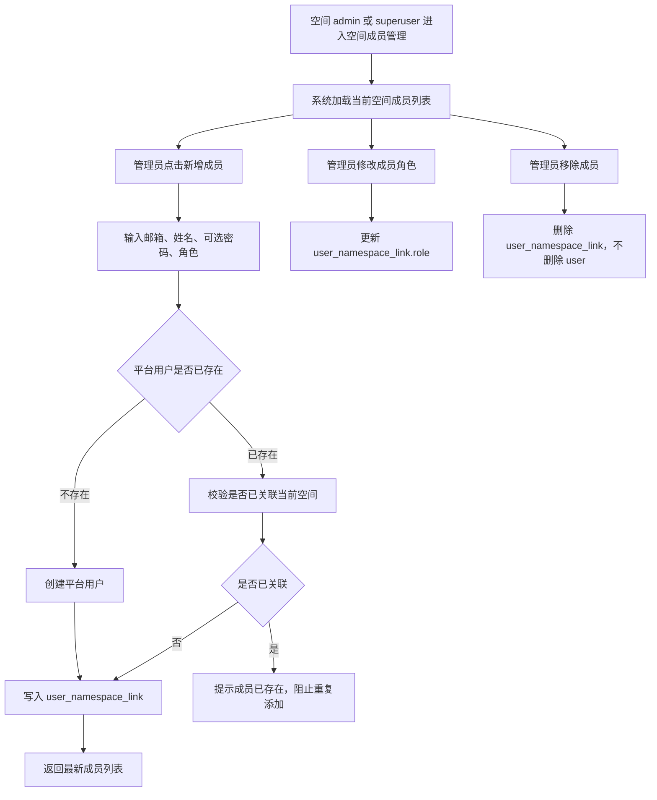

# 空间成员管理

## 目标声明

### 背景
当前系统后端已经具备空间成员管理 API，但前端尚未形成完整页面流，且“空间管理员到底能做什么、与 `superuser` 的边界是什么、已有用户与新用户加入空间时如何处理”仍缺乏完整产品定义。为了让 namespace 真正成为一个可运营的组织单元，需要把空间成员管理闭环补齐。

### 目标
- 让 `superuser` 与空间 `admin` 能在指定空间内查看、添加、移除成员并设置角色。
- 明确空间内成员操作只改变 `user_namespace_link`，不误伤平台用户主体。
- 支持“用户已存在则关联，不存在则创建后关联”的空间加人流程。
- 让空间管理员只管理自己所属空间，不能越权到其他空间或平台治理域。

### 不在范围内
- 不支持空间管理员修改用户的全局 `superuser` 标识。
- 不支持空间管理员删除平台用户主体账号。
- 不支持批量导入成员、批量调岗、邀请链接、邮件邀请等高级流程。
- 不扩展 `developer`、`user` 的业务能力，只定义其角色与可见性边界。

## 模块影响表

| 模块 | 影响类型 | 说明 |
|------|---------|------|
| `namespaces` | 修改 | 完善空间成员查询、创建、移除、改角色的业务闭环 |
| `users` | 修改 | 空间加人流程中需要查询/创建平台用户，并明确“删除成员不删除用户” |
| `auth` | 修改 | 成员接口的空间上下文校验与角色校验需更加明确 |
| `ui-shell` | 修改 | 增加空间成员管理页面或从空间详情页进入成员管理 |

## 功能描述

### 功能点 1：查看空间成员

#### 正常流程
1. `superuser` 或空间 `admin` 进入指定空间的成员管理页。
2. 系统基于当前空间上下文加载成员列表，展示用户姓名、邮箱、当前角色、启用状态、是否为 `superuser`。
3. 管理员可搜索成员、按角色筛选，快速定位目标成员。

#### 边界条件
- `superuser` 可查看任意空间成员。
- 空间 `admin` 仅可查看自己所属空间成员。
- 空间 `developer` 与 `user` 默认不展示成员管理入口。

#### 异常处理
- 当前空间不存在或已被禁用时，页面显示不可操作状态，并提示联系平台管理员。
- 用户失去当前空间管理权限后刷新页面，系统应返回 403 并跳转到安全页面。

### 功能点 2：向空间添加成员

#### 正常流程
1. `superuser` 或空间 `admin` 在成员管理页点击“新增成员”。
2. 系统要求输入邮箱、姓名、角色；当邮箱对应的平台用户不存在时，还需录入初始密码与启用状态。
3. 系统先按邮箱查询平台用户。
4. 若用户已存在且未关联当前空间，则直接创建 `user_namespace_link`。
5. 若用户不存在，则先创建 `user` 记录，再创建 `user_namespace_link`。
6. 保存成功后返回最新成员列表，并高亮新增成员。

#### 边界条件
- 新增成员时角色必须是 `admin`、`developer`、`user` 之一。
- 已存在平台用户被加入空间时，不修改其全局 `superuser` 状态。
- 空间管理员只能给目标用户分配本空间角色，不能授予或取消 `superuser`。
- 同一用户在同一空间只能存在一条关联记录。

#### 异常处理
- 若邮箱已关联当前空间，阻止重复添加并提示“该用户已在当前空间中”。
- 若创建新用户时邮箱冲突，转为“复用已有用户并关联”的提示流。
- 若当前管理员在提交期间失去权限，返回 403 并中止保存。

### 功能点 3：调整空间成员角色

#### 正常流程
1. 管理员在成员列表中选择目标成员，进入角色编辑操作。
2. 系统展示当前角色，并允许切换为 `admin`、`developer`、`user` 之一。
3. 保存后更新 `user_namespace_link.role`，列表即时刷新。

#### 边界条件
- `superuser` 可调整任意成员在任意空间中的角色。
- 空间 `admin` 可调整当前空间内其他成员角色。
- 是否允许空间 `admin` 修改自己角色：本次建议允许 `superuser` 修改任意人，空间 `admin` 不能把自己降级或移除，避免最后一个管理员误操作导致空间失管。

#### 异常处理
- 目标成员关联不存在时返回 404。
- 试图把自己从 `admin` 降级或移除时，若当前操作者不是 `superuser`，则提示不允许自降权。

### 功能点 4：移除空间成员

#### 正常流程
1. 管理员在成员列表中选择“移除成员”。
2. 系统弹出二次确认，明确说明“仅移除空间关联，不删除平台用户账号”。
3. 确认后删除对应 `user_namespace_link` 记录。
4. 成员列表刷新，若被移除的是当前用户且操作者为 `superuser`，则该用户下次进入该空间时失去访问权限。

#### 边界条件
- 移除成员只删除关联，不删除 `user` 主体。
- `superuser` 可以移除任意空间成员。
- 空间 `admin` 不能移除自己，避免空间失去管理员。

#### 异常处理
- 目标关联已不存在时提示“成员关系已失效”，并刷新页面。
- 若移除后当前空间已无管理员，系统应阻止该操作，除非操作者是 `superuser` 且明确接受该空间暂时无管理员。

## 数据变更

新增表：
| 表名 | 用途说明 |
|------|------|
| 无 | 复用现有 `user` 与 `user_namespace_link` |

新增字段：
| 表名 | 字段名 | 类型 | 业务含义 |
|------|------|------|------|
| 无 | - | - | 本次不新增字段，优先补齐操作规则与页面闭环 |

调整已有字段说明（字段本身不变，但行为/值域在本次需求中有扩展）：
| 表名 | 字段名 | 调整说明 |
|------|------|------|
| `user_namespace_link` | `role` | 作为空间内唯一角色来源，成员页对其进行增删改 |
| `user` | `email` | 作为“新增成员时判断是否为已存在平台用户”的唯一匹配键 |
| `user` | `is_active` | 已存在但禁用的用户被加入空间后仍保持禁用，是否启用由平台用户治理流程决定 |

废弃字段（保留字段本身，说明中标注 [废弃]）：
| 表名 | 字段名 | 废弃原因 |
|------|------|------|
| 无 | - | - |

## UI 页面

| 变更类型 | 页面名 | 路由 | 说明 |
|------|------|------|------|
| 新增 | 空间成员管理页 | `/system/namespaces/:namespaceId/members` 或等价路由 | 查看并管理指定空间成员 |
| 修改 | 空间管理页 | `/system/namespaces` | 从空间列表进入成员管理页 |
| 修改 | 顶部空间选择器 | 全局布局 | 当前空间切换后，成员管理页需联动目标空间上下文 |

### 空间成员管理页
- 布局：标题区展示当前空间名称、状态与返回入口；主体为成员列表；右侧或弹窗提供新增/编辑角色表单。
- 功能：查看成员、搜索成员、按角色筛选、新增成员、调整角色、移除成员。
- 交互：新增成员时根据邮箱实时提示“已有平台用户 / 新用户”；移除成员时必须二次确认并强调不会删除平台用户；对自己执行危险操作时按钮禁用并附提示。
- 字段：邮箱、姓名、角色、启用状态、是否 `superuser`、创建密码（仅新用户时显示）。

### 空间管理页
- 布局：空间列表每行增加“成员管理”入口。
- 功能：让 `superuser` 快速进入任一空间的成员管理；若当前用户是空间 `admin`，也可在自己可管理的空间上下文中进入。
- 交互：无权限时不展示入口或点击后提示无权限。
- 字段：空间名称、编码、状态、成员数、管理员摘要、成员管理入口。

## 验收标准

- [ ] `superuser` 可以查看任意空间的成员列表，并对成员执行新增、改角色、移除操作。
- [ ] 空间 `admin` 只能管理自己所属空间的成员，不能访问其他空间成员页，也不能进入平台级用户与空间治理能力。
- [ ] 向空间新增成员时，若邮箱已对应平台用户，则系统只创建空间关联；若邮箱不存在，则先创建用户再关联到空间。
- [ ] 同一用户重复加入同一空间会被阻止，系统给出明确提示。
- [ ] 空间内角色只能设置为 `admin`、`developer`、`user` 三者之一。
- [ ] 移除空间成员只删除 `user_namespace_link`，不会删除平台用户主体账号。
- [ ] 空间 `admin` 不能移除自己，也不能把自己降级，避免空间失去可操作管理员。
- [ ] 成员管理页对禁用空间、失效空间、权限丢失等异常场景都有明确反馈，不会出现静默失败。
