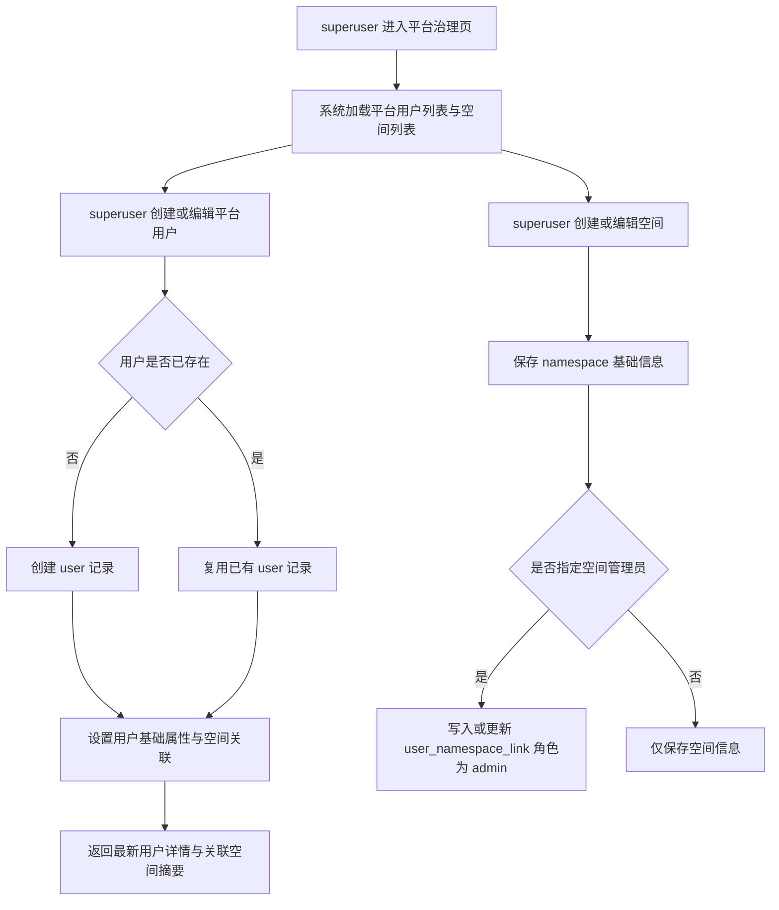

# 平台空间与用户治理

## 目标声明

### 背景
当前系统已经具备基础的 `namespace` 与 `user_namespace_link` 模型，但平台治理能力仍停留在“超级管理员接口存在、前端页面未闭环、角色边界未完全产品化”的阶段。随着系统向多空间后台演进，需要先把“谁能创建空间、谁能创建平台用户、谁能跨空间查看与管理”定义清楚，才能支撑后续更复杂的业务能力。

### 目标
- 让 `superuser` 可以在一个统一的平台治理入口中完成空间管理与平台用户管理。
- 明确 `superuser` 与 namespace 内角色并存时的权限解析规则，避免权限歧义。
- 让平台用户与空间的关联关系可被查询、创建、调整，并支持跨空间访问控制。
- 为后续 Agent、应用接入、AI 接入配置等能力沉淀统一原则：未来所有能力都必须复用 namespace 隔离和 namespace 级可见范围约束。

### 不在范围内
- 不实现 Agent、应用接入实例、AI 接入配置的实体与页面。
- 不实现跨 namespace 的资源共享、委派授权或继承权限。
- 不改造 `items` 等业务模块去消费 namespace 维度数据隔离。
- 不废弃现有 `superuser` 能力，只在本次需求中补齐其与 namespace 角色的关系定义。

## 模块影响表

| 模块 | 影响类型 | 说明 |
|------|---------|------|
| `users` | 修改 | 平台用户列表、创建、编辑、删除、空间关联展示与维护规则补齐 |
| `namespaces` | 修改 | 平台空间 CRUD、空间可见范围、空间访问入口与关联规则补齐 |
| `auth` | 修改 | 登录后身份解析需同时识别全局 `superuser` 与当前 namespace 角色 |
| `ui-shell` | 修改 | 导航、空间切换器、平台治理入口按权限显示 |

## 功能描述

### 功能点 1：平台用户治理

#### 正常流程
1. `superuser` 进入平台治理页，系统加载平台用户列表，展示用户基础信息、是否为 `superuser`、已关联空间数量与角色摘要。
2. `superuser` 发起新增平台用户，可录入邮箱、姓名、密码、启用状态、是否为 `superuser`，并可选择初始空间关联。
3. 若邮箱不存在，系统创建 `user` 记录；若邮箱已存在且当前操作为“关联已有用户到平台治理视图”，系统提示复用已有用户而不是重复创建。
4. 保存成功后，系统展示该用户当前关联的空间与角色摘要。
5. `superuser` 可编辑平台用户的基础资料、启用状态、`superuser` 标识，以及其已关联空间的摘要信息。
6. `superuser` 删除平台用户时，系统删除用户及其空间关联；若目标用户为当前登录 `superuser`，则拒绝删除。

#### 边界条件
- 邮箱在平台范围内全局唯一。
- `superuser` 标识是用户全局属性，不替代 namespace 角色。
- 用户可不属于任何 namespace，但这类用户除被 `superuser` 管理外，不应拥有普通空间访问入口。
- 创建平台用户时，初始空间关联可为空。

#### 异常处理
- 邮箱重复时，前端提示“该邮箱已存在，请改为关联已有用户或使用其他邮箱”。
- 试图删除当前登录 `superuser` 时，返回拒绝提示并保持页面状态不丢失。
- 目标用户不存在时，返回 404 并刷新列表。

### 功能点 2：平台空间治理

#### 正常流程
1. `superuser` 在平台治理页查看空间列表，系统展示空间名称、编码、启用状态、成员数、管理员摘要。
2. `superuser` 创建空间时录入空间名称、编码、启用状态，可选指定一个初始空间管理员。
3. 系统保存 `namespace` 记录；若指定管理员，则同时创建或更新该用户在该空间下的成员关联，角色设为 `admin`。
4. `superuser` 可编辑空间基础信息，并调整默认管理员。
5. `superuser` 删除空间时，系统先移除该空间所有成员关联，再删除空间本身。

#### 边界条件
- `namespace.code` 全局唯一且创建后建议保持稳定，不作为普通文案频繁修改。
- 空间可禁用；禁用后普通用户与空间管理员不能继续进入该空间，但 `superuser` 仍可访问并管理。
- 空间管理员必须首先是平台用户；若指定邮箱不存在，应先创建平台用户或通过空间成员添加流程创建后再绑定。

#### 异常处理
- 空间编码重复时，提示用户更换编码。
- 删除不存在空间时，返回 404。
- 指定的初始管理员不存在时，阻止提交并给出明确提示。

### 功能点 3：全局角色与空间角色的判权规则

#### 正常流程
1. 用户登录后，系统先识别其全局属性，例如是否为 `superuser`。
2. 当用户进入具体 namespace 上下文时，系统再读取其在该 namespace 下的成员关联与角色。
3. 若用户是 `superuser`，则允许其访问任意空间，并在空间上下文中执行任何空间内管理操作。
4. 若用户不是 `superuser`，则必须存在目标 namespace 的成员关联，且其可执行能力受该关联角色约束。
5. 前端导航与页面权限展示依赖上述判权结果动态渲染。

#### 边界条件
- `superuser` 与 namespace 角色不冲突，可同时存在。
- 判权顺序为：先判断是否 `superuser`，再判断是否存在 namespace 成员关联，最后判断 namespace 角色。
- 不允许把 namespace 角色提升为全局能力，例如空间 `admin` 不能管理平台全部用户或全部空间。

#### 异常处理
- 普通用户尝试访问未关联空间时，返回 403 或引导切换到可访问空间。
- 当前已选空间被禁用或关联被移除时，前端清理失效的 `selected_namespace_id`，并要求重新选择可访问空间。

## 数据变更

新增表：
| 表名 | 用途说明 |
|------|------|
| 无 | 本次优先复用 `user`、`namespace`、`user_namespace_link` 三张现有表 |

新增字段：
| 表名 | 字段名 | 类型 | 业务含义 |
|------|------|------|------|
| 无 | - | - | 本次暂不强制新增字段，先通过现有结构补齐治理闭环 |

调整已有字段说明（字段本身不变，但行为/值域在本次需求中有扩展）：
| 表名 | 字段名 | 调整说明 |
|------|------|------|
| `user` | `is_superuser` | 定义为跨 namespace 的全局平台治理权限，可访问任意空间，不替代空间内角色 |
| `namespace` | `is_active` | 从“普通启用状态”扩展为“空间访问开关”；禁用后普通成员不可进入，`superuser` 可继续访问治理 |
| `user_namespace_link` | `role` | 明确为 namespace 内角色，仅允许 `admin` / `developer` / `user`，不承担全局权限语义 |

废弃字段（保留字段本身，说明中标注 [废弃]）：
| 表名 | 字段名 | 废弃原因 |
|------|------|------|
| 无 | - | - |

## UI 页面

| 变更类型 | 页面名 | 路由 | 说明 |
|------|------|------|------|
| 修改 | 平台治理页 | `/admin` 或后续统一治理路由 | 整合平台用户管理与空间管理，成为 `superuser` 统一入口 |
| 修改 | 顶部空间选择器 | 全局布局 | 仅展示当前用户可访问空间；`superuser` 展示所有空间 |
| 修改 | 侧边导航 | 全局布局 | 平台治理入口仅 `superuser` 可见，空间相关入口按上下文权限展示 |
| 修改 | 个人设置页 | `/settings` | 保持当前用户资料与密码修改入口；需兼容当前空间身份展示 |

### 平台治理页
- 布局：顶部提供“平台用户 / 空间管理”双标签或双分区；主体为列表和右侧抽屉/弹窗编辑区。
- 功能：查看平台用户、创建平台用户、编辑平台用户、删除平台用户、查看空间摘要；查看空间列表、创建空间、编辑空间、删除空间。
- 交互：删除用户和删除空间都需要二次确认；创建空间时可选指定初始管理员；编辑用户时可查看关联空间摘要但不必在同一页完成全部空间成员细节维护。
- 字段：用户表单包含邮箱、姓名、密码、启用状态、`superuser` 标识；空间表单包含名称、编码、启用状态、初始管理员。

### 顶部空间选择器
- 布局：保留现有顶部栏位置，增加禁用空间提示与无可访问空间时的空状态。
- 功能：显示当前用户可访问空间；`superuser` 可切换任意空间；普通用户仅能切换已关联且启用的空间。
- 交互：若当前缓存空间失效，自动回退到首个可访问空间；若无可访问空间，则提示联系管理员。
- 字段：空间名称、空间编码、状态标签。

### 个人设置页
- 布局：延续现有 Tabs 结构，可增加“当前空间身份”摘要卡片。
- 功能：显示当前用户全局资料与当前空间身份；保留修改资料、修改密码、注销入口。
- 交互：当前空间切换后，身份摘要同步变化；若用户是 `superuser`，需显示“全局管理员”标识。
- 字段：姓名、邮箱、当前空间、当前空间角色、是否全局管理员。

## 验收标准

- [ ] `superuser` 可以查看平台用户列表，并在列表中看到每个用户的全局属性与空间关联摘要。
- [ ] `superuser` 创建平台用户时，若邮箱不存在则创建新用户；若邮箱已存在则不能重复创建同邮箱账号。
- [ ] `superuser` 可以创建、编辑、删除空间，并在需要时指定初始空间管理员。
- [ ] 非 `superuser` 用户不能进入平台治理页，也不能调用平台级用户与空间管理接口。
- [ ] `superuser` 可以切换并访问任意空间；普通用户只能看到自己已关联且启用的空间。
- [ ] 用户同时具备 `superuser` 与 namespace 角色时，系统仍能正确识别其全局权限与当前空间身份。
- [ ] 后续迭代若新增 Agent、应用接入或 AI 接入能力，必须复用 namespace 边界与 namespace 级可见性原则，本版本 PRD 中已明确该约束。
