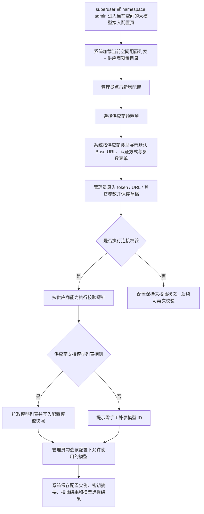

# 空间级大模型接入配置

## 目标声明

### 背景
NeoMua 当前已经具备 `namespace` 级隔离、空间上下文切换和空间管理员权限体系，但尚未提供“每个空间独立维护大模型接入配置”的产品能力。随着系统后续将逐步承载 AI 能力，平台需要先把“配置归谁管理、配置存在哪里、如何安全展示凭证、如何判断配置是否有效、如何拿到可用模型列表”这些基础治理问题定义清楚。

参考项目 Hermes Agent 已经沉淀了一套较完整的多供应商接入元数据体系，覆盖供应商目录、默认接入地址、认证方式、模型列表探测能力等。NeoMua 本期需要在遵循 namespace 隔离的基础上，把这套“供应商接入配置中心”的核心产品能力引入到平台后台中，但暂不涉及后续真实推理调用、路由选择或故障转移。

### 目标
- 让 `superuser` 与 namespace `admin` 能在当前空间下维护多条大模型供应商接入配置。
- 完整预置参考项目当前已支持的供应商目录，并按供应商类型展示对应配置字段。
- 支持配置级连接校验，并在供应商支持时自动拉取模型列表。
- 支持从拉取结果或手工补录中选择该配置下可供使用的模型集合。
- 对凭证信息进行脱敏展示、覆盖更新和权限控制，避免后台明文暴露。

### 不在范围内
- 不实现配置保存后的真实推理调用、会话路由、负载均衡、故障转移与凭证池轮换。
- 不在本期定义空间默认模型、主模型/辅模型策略或按业务场景自动选模。
- 不实现供应商 OAuth 浏览器授权流程、外部进程拉起或长期 token 自动刷新。
- 不实现供应商计费、配额、速率限制、健康评分或多 key 优先级调度。
- 不实现跨空间共享配置、复制配置、导入导出配置或批量操作。

## 模块影响表

| 模块 | 影响类型 | 说明 |
|------|---------|------|
| `llm_configs` | 新增 | 新增空间级大模型接入配置模块，负责供应商目录、配置实例、连接校验、模型同步与密钥安全展示 |
| `namespaces` | 修改 | 所有配置实例强制归属单个 namespace，并复用当前空间上下文进行隔离 |
| `users` | 修改 | 复用 `superuser` 与 namespace `admin` 的管理权限，普通成员仅可查看是否存在可用配置摘要或完全不可见 |
| `auth` | 修改 | 新增配置相关接口的登录态与空间权限校验；对敏感字段读取增加更严格的返回约束 |
| `ui-shell` | 修改 | 左侧导航新增“大模型接入配置”入口，并在全局空间切换后联动当前管理范围 |

## 功能描述

### 功能点 1：空间级供应商配置列表

#### 正常流程
1. `superuser` 或当前 namespace 的 `admin` 进入“大模型接入配置”页。
2. 系统基于当前 `selected_namespace_id` 读取该空间下所有供应商配置实例。
3. 列表展示配置名称、供应商名称、认证方式、接入地址摘要、是否已校验、最近校验时间、可用模型数量、启用状态。
4. 系统同时加载内置供应商预置目录，供新增配置时选择。
5. 管理员可对已有配置执行查看详情、编辑、重新校验、同步模型、启停配置等操作。

#### 边界条件
- 配置实例的所有权属于单个 namespace，不允许一条配置同时绑定多个空间。
- 同一 namespace 下可以存在多条配置，且允许同一供应商存在多条实例，例如“DeepSeek 生产 Key”“DeepSeek 备用 Key”“OpenRouter 国际线路”。
- `superuser` 可通过切换空间查看任意 namespace 的配置；namespace `admin` 仅能查看自己有管理权限的空间。
- 普通 `developer` / `user` 默认不展示该菜单入口，也不可调用配置管理接口。

#### 异常处理
- 当前空间不存在、被禁用或当前用户失去管理员权限时，页面返回 403 / 404，并跳转到安全页或要求切换空间。
- 当前空间没有任何配置时，展示空状态和“新增大模型接入配置”引导。
- 供应商预置目录加载失败时，页面保留已有配置列表，但阻止新增并提示刷新重试。

### 功能点 2：供应商预置目录

#### 正常流程
1. 管理员点击“新增配置”后，系统先展示供应商预置目录。
2. 目录中的每一项预置至少包含：供应商 slug、显示名称、认证方式、默认接入地址、是否允许覆盖 Base URL、是否支持连接校验、是否支持模型列表探测、所需参数 schema。
3. 管理员选择某个供应商后，系统自动填充默认接入地址与参数表单，不再要求管理员从零理解各家 API 差异。
4. 管理员可以在允许覆盖的供应商上修改接入地址；对固定地址型供应商则默认只读展示或受控编辑。

#### 预置范围
本期预置目录完整复刻参考项目当前已支持的 canonical provider 定义，包含以下供应商类型：

| provider_slug | 显示名称 | 认证方式 | 默认接入形态 |
|------|------|------|------|
| `alibaba` | Alibaba Cloud / DashScope | `api_key` | OpenAI-compatible |
| `alibaba-coding-plan` | Alibaba Cloud (Coding Plan) | `api_key` | 专用 coding endpoint |
| `anthropic` | Anthropic | `api_key` | Native Anthropic API |
| `arcee` | Arcee AI | `api_key` | OpenAI-compatible |
| `azure-foundry` | Azure Foundry | `api_key` | 用户自填 Base URL |
| `bedrock` | AWS Bedrock | `aws_sdk` | AWS SDK / region-based |
| `copilot` | GitHub Copilot / GitHub Models | `copilot_token` | GitHub token-based |
| `copilot-acp` | GitHub Copilot ACP | `external_process` | 外部 ACP 进程 |
| `custom` | Custom / Local OpenAI-compatible | `custom` | 用户自填 Base URL |
| `deepseek` | DeepSeek | `api_key` | Native DeepSeek API |
| `gemini` | Gemini | `api_key` | Google AI Studio |
| `google-gemini-cli` | Gemini CLI / Cloud Code | `oauth_external` | 外部 OAuth |
| `gmi` | GMI Cloud | `api_key` | OpenAI-compatible |
| `huggingface` | Hugging Face | `api_key` | Router endpoint |
| `kilocode` | Kilo Code | `api_key` | Gateway endpoint |
| `kimi-coding` | Kimi / Moonshot | `api_key` | 国际 endpoint |
| `kimi-coding-cn` | Kimi / Moonshot (China) | `api_key` | 中国区 endpoint |
| `minimax` | MiniMax | `api_key` | Anthropic-compatible |
| `minimax-cn` | MiniMax (China) | `api_key` | 中国区 Anthropic-compatible |
| `minimax-oauth` | MiniMax (OAuth) | `oauth_external` | 外部 OAuth |
| `nous` | Nous Research | `oauth_device_code` | Device Code / portal |
| `novita` | NovitaAI | `api_key` | OpenAI-compatible |
| `nvidia` | NVIDIA NIM | `api_key` | OpenAI-compatible |
| `ollama-cloud` | Ollama Cloud | `api_key` | OpenAI-compatible |
| `openai-codex` | OpenAI Codex | `oauth_external` | Codex backend |
| `opencode-zen` | OpenCode Zen | `api_key` | OpenAI-compatible |
| `opencode-go` | OpenCode Go | `api_key` | Relay endpoint |
| `openrouter` | OpenRouter | `api_key` | 公共模型目录 + 聚合推理 |
| `qwen-oauth` | Qwen Portal | `oauth_external` | 外部 OAuth |
| `stepfun` | StepFun | `api_key` | Step Plan endpoint |
| `xai` | xAI / Grok | `api_key` | xAI API |
| `xiaomi` | Xiaomi MiMo | `api_key` | MiMo API |
| `zai` | Z.AI (GLM) | `api_key` | Zhipu / Z.AI API |

#### 边界条件
- 预置目录由系统内置维护，管理员不能直接修改系统级 provider 定义。
- 预置目录与“配置实例”是两层概念：预置项定义模板，配置实例定义某个空间的实际接入参数。
- 供应商目录即使包含 OAuth、AWS SDK、外部进程等类型，也不代表本期必须打通完整授权流程；本期仅要求目录、字段 schema、保存能力和可达时的校验能力定义完整。

#### 异常处理
- 某预置供应商不支持在线校验或模型探测时，表单中明确显示“该供应商当前不支持自动校验/自动拉模”。
- 参考项目后续新增供应商时，不自动影响已有空间配置；NeoMua 需通过版本升级同步目录。

### 功能点 3：新增与编辑供应商配置实例

#### 正常流程
1. 管理员从预置目录中选择供应商后，系统生成一条新的配置实例草稿。
2. 管理员填写配置名称、接入地址、认证参数和供应商专属扩展参数。
3. 保存时，系统将敏感字段与非敏感字段分开处理：敏感字段加密存储，非敏感字段明文存储。
4. 编辑已有配置时，系统默认不回显完整密钥，只展示脱敏摘要与“已配置”状态。
5. 若管理员需要更换密钥，必须显式执行“覆盖更新凭证”操作。

#### 供应商字段规则
- 通用字段：
  - `config_name`：空间内用于识别该配置实例的人类可读名称。
  - `provider_slug`：来源于预置目录，不允许编辑。
  - `base_url`：默认带出；仅对允许覆盖的供应商开放编辑。
  - `enabled`：是否在当前空间内作为可用配置。
- 敏感字段按认证方式分组：
  - `api_key` / `copilot_token`：`api_token`
  - `oauth_external` / `oauth_device_code`：`access_token`，可选 `refresh_token`
  - `aws_sdk`：`aws_access_key_id`、`aws_secret_access_key`、可选 `aws_session_token`
  - `custom`：可选 `api_token`，允许为空以支持无鉴权本地端点
- 扩展字段：
  - 以 `extra_config` 承载供应商专属参数，例如 region、organization、header 开关、自定义模型路径等。

#### 边界条件
- 同一 namespace 下，`config_name` 必须唯一，避免管理员无法区分多条相同供应商配置。
- 同一 namespace 下，允许多个实例指向同一 `provider_slug` 和同一 `base_url`，因为可能对应不同账号或环境。
- 编辑非敏感字段时，不要求重新输入密钥。
- 对于 `custom` 与 `azure-foundry` 这类用户自填 Base URL 的供应商，URL 为必填项。

#### 异常处理
- 必填参数缺失、URL 非法、JSON 扩展参数格式错误时，阻止保存并保留表单内容。
- 配置名称重复时，返回 409 并提示更换名称。
- 敏感字段更新失败时，不应覆盖原有已生效密钥。

### 功能点 4：密钥安全展示与覆盖更新

#### 正常流程
1. 列表页和详情页只显示凭证是否已配置、最近更新时间以及脱敏摘要，例如前缀 + 后四位。
2. 管理员打开编辑页时，系统不返回明文密钥，只返回 `has_secret=true`、`masked_secret=sk-***abcd` 之类的摘要信息。
3. 管理员若不修改凭证，可直接保存其它字段。
4. 管理员若点击“更新凭证”，系统打开单独的敏感字段输入区；提交后覆盖旧值并重新加密存储。

#### 边界条件
- 任意读接口都不得返回完整明文密钥。
- 审计日志需要记录“谁在何时更新了密钥”，但不得记录密钥明文。
- 导出接口、本地缓存、浏览器表单默认值都不得保留历史明文。

#### 异常处理
- 凭证覆盖失败时，保持原密钥不变，并向用户提示更新失败。
- 用户缺乏管理权限时，即便能看到配置摘要，也不得触发凭证更新。

### 功能点 5：连接校验

#### 正常流程
1. 管理员保存配置后，可点击“连接校验”。
2. 系统根据供应商预置项定义的 `auth_type`、`base_url`、`supports_health_check` 和 provider-specific probe 规则发起校验。
3. 校验至少返回三类结果：成功、失败、不支持。
4. 校验成功后记录最近成功时间、状态摘要和响应中的非敏感诊断信息。
5. 校验失败后保留失败原因，便于管理员调整配置后再次校验。

#### 校验策略
- `api_key` 类供应商：优先使用供应商定义的健康探针或 `/models` 探测进行可达性验证。
- `custom` 类供应商：对用户填写的 Base URL 执行 OpenAI-compatible `/models` 探测；若无 token，则按无鉴权模式探测。
- `oauth_external` / `oauth_device_code` 类供应商：若已手工录入 token 且参考项目具备可探测 endpoint，则允许尝试；否则标记为“当前仅支持保存，不支持在线校验”。
- `aws_sdk` 类供应商：若本期未实现 AWS SDK 探针，则标记为“不支持在线校验”，但允许保存配置。
- `external_process` 类供应商：本期默认不支持在线校验。

#### 边界条件
- 连接校验是配置治理动作，不等同于真实推理可用性承诺。
- 校验成功不代表某个具体模型一定可调用，只代表当前接入信息在探针层面有效。
- 校验按钮可重复触发，但需串行执行，避免同一配置的并发校验污染结果。

#### 异常处理
- 网络不可达、认证失败、返回格式不兼容、超时等情况需保留结构化失败原因。
- 校验时若第三方返回明文报错，系统在展示前需对可能出现的 secret 做脱敏。
- 对不支持校验的供应商，按钮置灰并给出明确说明，而不是静默失败。

### 功能点 6：模型列表同步与可用模型选择

#### 正常流程
1. 当供应商支持模型自动发现时，管理员可在校验成功后直接执行“同步模型列表”，或将校验与同步合并为一步。
2. 系统按 provider-specific 规则调用模型目录接口，写入该配置实例下的模型快照。
3. 页面展示模型 ID、展示名称、来源类型（自动发现/手工补录）、最近同步时间、是否已选为可用模型。
4. 管理员从模型快照中勾选“当前空间允许使用”的模型集合。
5. 保存后，该配置实例下被勾选的模型将作为后续 AI 业务可消费的候选模型集合。

#### 不支持自动发现时的补充流程
1. 若供应商不支持标准模型列表接口，系统提示“当前供应商不支持自动拉取模型列表”。
2. 管理员可手工补录模型 ID 与展示名称。
3. 手工补录的模型与自动发现模型一并进入该配置实例的模型快照，并可被勾选为可用模型。

#### 边界条件
- 模型是“配置实例”的从属数据，而不是“供应商模板”的全局数据；不同空间、不同配置实例的模型快照互不影响。
- 本期不要求从模型列表中指定默认模型，但允许勾选多个“可用模型”。
- 再次同步时，系统应保留历史选中状态；若模型已不再被供应商返回，则标记为“已失效/待确认”，而不是静默删除。

#### 异常处理
- 模型同步失败时，不得清空上一次成功同步的模型快照。
- 若返回模型列表过大，应支持分页或懒加载展示，避免一次性渲染所有模型导致页面卡顿。
- 手工补录的模型 ID 与当前配置实例下已存在模型重复时，阻止保存。

## 数据变更

新增表：
| 表名 | 用途说明 |
|------|------|
| `llm_provider_config` | 存储某个 namespace 下的一条供应商配置实例，包括接入地址、认证方式、密钥摘要、扩展参数和校验状态 |
| `llm_provider_model` | 存储某条供应商配置实例下的模型快照，以及管理员选定的可用模型集合 |

新增字段：
| 表名 | 字段名 | 类型 | 业务含义 |
|------|------|------|------|
| `llm_provider_config` | `id` | uuid | 主键 |
| `llm_provider_config` | `namespace_id` | uuid | 配置所属空间 |
| `llm_provider_config` | `config_name` | varchar(255) | 当前空间内唯一的配置名称 |
| `llm_provider_config` | `provider_slug` | varchar(128) | 对应预置供应商目录的 canonical slug |
| `llm_provider_config` | `provider_display_name` | varchar(255) | 创建时使用的供应商显示名快照 |
| `llm_provider_config` | `auth_type` | varchar(64) | 认证方式快照，如 `api_key`、`oauth_external`、`aws_sdk` |
| `llm_provider_config` | `base_url` | varchar(1024) | 实际接入地址 |
| `llm_provider_config` | `secret_ciphertext` | text | 加密后的敏感凭证载荷 |
| `llm_provider_config` | `secret_masked` | varchar(255) | 脱敏摘要，如 `sk-***abcd` |
| `llm_provider_config` | `extra_config` | jsonb | 供应商专属非敏感参数 |
| `llm_provider_config` | `supports_health_check` | boolean | 该实例是否支持在线校验 |
| `llm_provider_config` | `supports_model_discovery` | boolean | 该实例是否支持自动拉取模型列表 |
| `llm_provider_config` | `validation_status` | varchar(32) | `unverified` / `success` / `failed` / `unsupported` |
| `llm_provider_config` | `validation_message` | varchar(1024) | 最近一次校验结果摘要 |
| `llm_provider_config` | `last_validated_at` | timestamptz | 最近一次校验时间 |
| `llm_provider_config` | `enabled` | boolean | 当前配置是否启用 |
| `llm_provider_config` | `created_by` | uuid | 创建人 |
| `llm_provider_config` | `updated_by` | uuid | 最近更新人 |
| `llm_provider_config` | `created_at` | timestamptz | 创建时间 |
| `llm_provider_config` | `updated_at` | timestamptz | 更新时间 |
| `llm_provider_model` | `id` | uuid | 主键 |
| `llm_provider_model` | `provider_config_id` | uuid | 所属供应商配置实例 |
| `llm_provider_model` | `model_id` | varchar(255) | 模型唯一标识 |
| `llm_provider_model` | `display_name` | varchar(255) | 模型展示名 |
| `llm_provider_model` | `source_type` | varchar(32) | `discovered` / `manual` |
| `llm_provider_model` | `is_enabled` | boolean | 是否被选为该配置下可用模型 |
| `llm_provider_model` | `sync_status` | varchar(32) | `active` / `stale` / `sync_failed` |
| `llm_provider_model` | `raw_metadata` | jsonb | 模型接口返回的附加元数据快照 |
| `llm_provider_model` | `last_synced_at` | timestamptz | 最近同步时间 |
| `llm_provider_model` | `created_at` | timestamptz | 创建时间 |
| `llm_provider_model` | `updated_at` | timestamptz | 更新时间 |

调整已有字段说明（字段本身不变，但行为/值域在本次需求中有扩展）：
| 表名 | 字段名 | 调整说明 |
|------|------|------|
| `namespace` | `id` | 新增为 `llm_provider_config.namespace_id` 的强依赖外键，表示所有大模型配置必须归属某个空间 |
| `user_namespace_link` | `role` | 其 `admin` 角色新增“可管理当前空间大模型接入配置”的权限语义 |
| `user` | `is_superuser` | 新增“可跨空间管理大模型接入配置”的平台级治理语义 |

废弃字段（保留字段本身，说明中标注 [废弃]）：
| 表名 | 字段名 | 废弃原因 |
|------|------|------|
| 无 | - | - |

## UI 页面

| 变更类型 | 页面名 | 路由 | 说明 |
|------|------|------|------|
| 新增 | 大模型接入配置页 | `/system/llm-providers` | 在当前空间下查看和管理供应商配置实例 |
| 新增 | 大模型配置详情抽屉/页 | `/system/llm-providers/:configId` 或等价抽屉态 | 查看、编辑配置、更新密钥、执行校验与模型同步 |
| 修改 | 顶部空间选择器 | 全局布局 | 切换空间后联动当前配置页的数据作用域 |
| 修改 | 侧边导航 | 全局布局 | 为 `superuser` 与 namespace `admin` 增加“大模型接入配置”入口 |

### 大模型接入配置页
- 布局：标题区展示当前空间名称与状态；主体为配置列表；右上角为“新增配置”按钮。
- 功能：查看配置列表、按供应商筛选、按校验状态筛选、新增配置、编辑配置、启停配置、重新校验、同步模型。
- 交互：切换空间后列表自动刷新；点击某一行进入详情抽屉；敏感字段默认不在列表中展示。
- 字段：配置名称、供应商、认证方式、接入地址摘要、已选模型数、校验状态、最近校验时间、启用状态。

### 新增/编辑配置表单
- 布局：第一步选择供应商预置项；第二步填写配置参数；第三步执行可选校验与模型同步。
- 功能：根据供应商类型动态渲染表单；覆盖更新密钥；保存为启用或停用配置。
- 交互：选择供应商后自动填充默认地址和字段 schema；对不支持校验/拉模的供应商显示说明文案；密钥更新区域默认折叠。
- 字段：`config_name`、`base_url`、敏感凭证字段、扩展参数、启用状态。

### 模型同步面板
- 布局：详情区下半部分展示模型列表，支持分页、搜索和多选。
- 功能：自动同步模型、手工补录模型、标记可用模型、查看模型来源和同步状态。
- 交互：同步成功后增量刷新；失效模型以警示样式显示并允许取消勾选；手工补录与自动同步模型统一管理。
- 字段：模型 ID、展示名称、来源类型、同步状态、最近同步时间、是否可用。

## 验收标准

- [ ] `superuser` 与 namespace `admin` 能在当前空间下进入“大模型接入配置”页，并看到仅属于该空间的配置实例列表。
- [ ] 同一空间下可以创建多条供应商配置实例，且允许同一供应商存在多条不同配置。
- [ ] 新增配置时，系统会先展示完整的供应商预置目录，目录至少覆盖参考项目当前已支持的 canonical provider 清单。
- [ ] 选择供应商后，表单会根据供应商类型自动带出默认接入地址、认证方式和参数 schema。
- [ ] 列表页和详情页不会返回或展示明文密钥，只展示脱敏摘要与“是否已配置”的状态。
- [ ] 管理员可以在不回显旧密钥的前提下覆盖更新凭证；更新失败时旧密钥保持不变。
- [ ] 对支持在线校验的供应商，管理员可以执行连接校验并看到成功、失败或不支持的明确结果。
- [ ] 对支持模型列表探测的供应商，管理员可以同步模型列表，并从中勾选该配置下允许使用的模型集合。
- [ ] 对不支持自动拉取模型列表的供应商，管理员仍可手工补录模型 ID 并选择为可用模型。
- [ ] 再次同步模型时，系统不会因同步失败而清空历史模型快照，也不会静默丢失已选模型状态。
- [ ] 普通空间成员不能访问配置管理接口，也不能查看或编辑敏感凭证信息。
