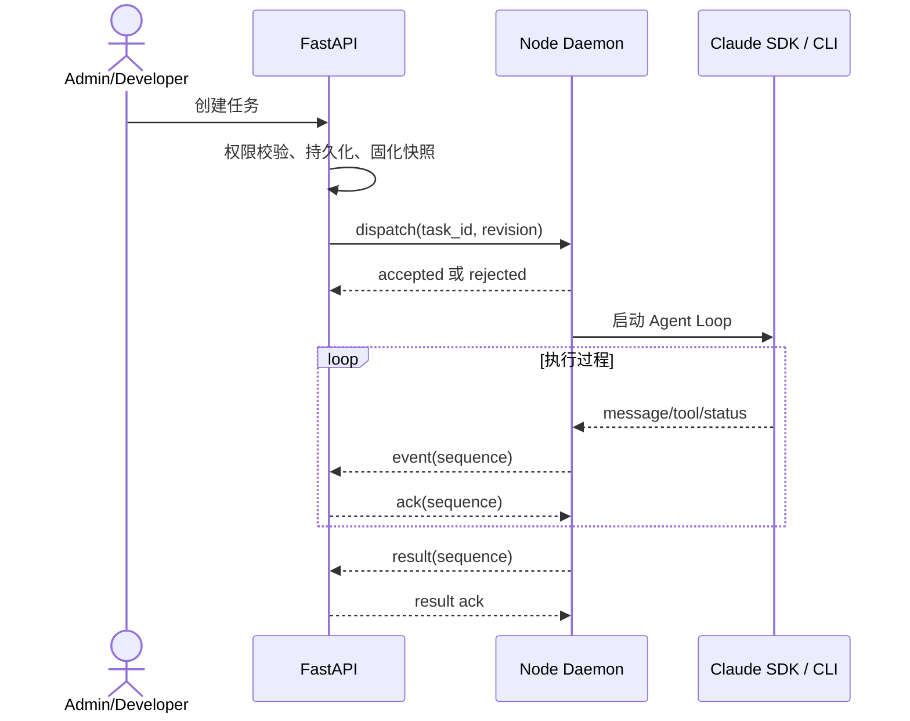

# 空间级 Agent 任务执行

## 1. 目标声明

### 背景
节点在线后需要接收平台指令，通过 Claude Agent SDK/CLI 执行工作，并可靠返回完整过程。执行必须能处理断线、取消、重复消息和节点意外关机。

### 目标
- Admin 与 Developer 可向平台运行时或在线节点下发普通 Agent 任务。
- 任务支持完整事件流、取消、超时、断线补传和显式重试。
- 节点可经平台 Gateway 使用空间模型，也可直连已验证的 Anthropic 兼容 API。
- 任务创建时固化模型、API 路由、工具权限和运行目录快照。

### 不在范围内
- 节点断线后自动迁移或自动重跑任务。
- Developer 下发内容分发、凭证、运行时管理等高风险指令。
- Node Daemon 自行修改平台给定的权限策略。

## 2. 模块影响
| 模块 | 影响类型 | 说明 |
|------|---------|------|
| runtime_management | 新增 | 管理任务状态机、租约、会话、事件和节点命令协议 |
| llm_configs | 只读依赖 | Gateway 路由时读取空间供应商与模型配置 |

## 3. 功能描述

### 3.1 任务创建与下发
1. 用户选择目标运行时、输入指令和允许的工作目录/工具策略。
2. FastAPI 校验空间角色、目标状态、模型路由和能力矩阵，创建任务及不可变配置快照。
3. 节点必须返回 `accepted` 或结构化 `rejected`；接受后获得有期限租约。
4. 重复 `dispatch(task_id, revision)` 必须返回相同接受状态，不重复启动执行。

### 3.2 事件、断线与终态
1. 事件统一为用户消息、Agent 消息、工具调用、工具结果、状态、错误和最终结果。
2. 每个事件携带 `task_id + sequence`；FastAPI 幂等追加并确认。
3. 结果确认前节点持久化本地 spool；重连后从最后确认序号继续补传。
4. 关机时已完成但未确认的结果补传；执行中的任务标记 `interrupted`，不自动重跑；排队任务重新确认租约后可领取。
5. 重试由用户显式发起并创建新任务，关联原任务 ID。

### 3.3 模型/API 路由
- `platform_gateway`：节点只获取绑定 namespace、node、task、model 的短时 Gateway Token；平台供应商密钥不下发。
- `direct_anthropic`：凭证仅保存在节点本地受保护存储中，启用前通过兼容性测试；平台只保存掩码、状态和配置元数据。

## 4. 数据变更
复用 `agent_session`、`agent_task`、`agent_event`，并要求：
- 任务状态至少包含 `queued / dispatched / running / cancelling / succeeded / failed / cancelled / interrupted / rejected`。
- 任务记录 `lease_expires_at`、`revision`、`retry_of_task_id`、运行时快照与最终结果摘要。
- 事件内容为结构化 JSON，但事件类型、序号、时间、脱敏状态使用独立字段便于查询。

## 5. UI 页面
| 变更类型 | 页面名 | 路由 | 说明 |
|------|------|------|------|
| 新增 | 下发任务抽屉 | `/system/runtimes` | 选择目标并提交普通任务 |
| 新增 | 任务详情 | `/system/runtimes/tasks/:taskId` | 实时事件、状态、停止、显式重试 |
| 修改 | 功能测试抽屉 | `/system/runtimes` | 复用统一会话、任务和事件组件 |

## 6. 验收标准
- [x] Admin 与 Developer 可下发普通任务，User 不可见且接口拒绝访问。
- [x] 重复下发不会启动两个 Agent Loop，事件重传不会产生重复记录。
- [x] 断线后可补传未确认事件；执行中任务进入 `interrupted` 且不会自动重跑。
- [x] 平台 Gateway Token 不能跨空间、节点、任务或模型使用。
- [x] 节点直连仅允许已通过 Anthropic 兼容性测试的 API。
- [x] 完整过程按序保存且敏感值已脱敏。
