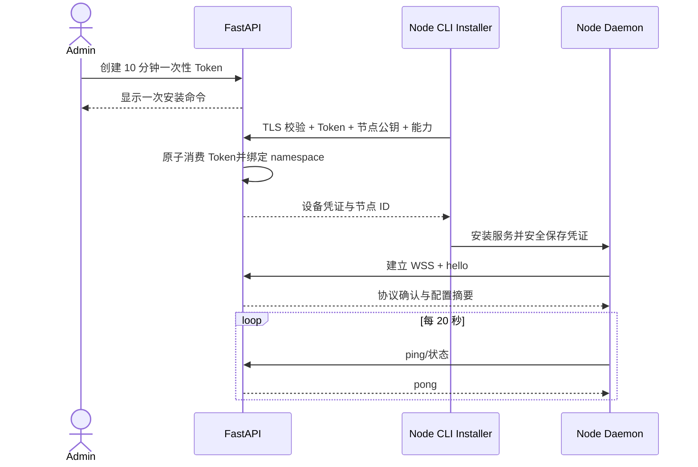

# 空间级节点运行时注册与连接

## 1. 目标声明

### 背景
空间需要将 Agent 执行能力扩展到受控机器，并在节点不开放公网入站端口的前提下保持身份可靠的长连接。

### 目标
- Admin 可生成一次性安装配对命令，将节点绑定到当前 namespace。
- Node Daemon 主动建立 WSS，提供心跳、能力与版本上报。
- 节点关机一天后可使用长期设备凭证恢复为同一节点。
- 设备凭证支持自动轮换、显式吊销和过期后重新配对。

### 不在范围内
- 未授权节点自动加入空间。
- 通过共享永久 Token 连接多个节点。
- 凭证过期后的匿名、弱认证或人工跳过校验。

## 2. 模块影响
| 模块 | 影响类型 | 说明 |
|------|---------|------|
| runtime_management | 新增 | 拥有节点、配对 Token、设备凭证和连接状态 |
| namespaces | 只读依赖 | 配对时绑定并校验目标空间 |

## 3. 功能描述

### 3.1 安装与配对
1. Admin 创建默认 10 分钟有效的一次性 Token。
2. 安装命令包含平台地址与 Token；Token 只显示一次，数据库仅保存哈希。
3. 安装器必须验证平台 TLS，提交节点公钥、主机名、OS/架构和 Daemon/SDK/CLI 版本。
4. 平台原子消费 Token，创建节点并签发独立设备凭证；重复消费必须失败。

### 3.2 长连接、心跳与离线恢复
1. Daemon 使用设备凭证主动建立 WSS，握手包含协议版本与能力摘要。
2. 默认每 20 秒心跳，连续 3 次缺失后平台将节点推导为离线，但不解除配对。
3. 重启后指数退避重连，使用原节点 ID 和设备凭证恢复连接，并上报最后确认事件、未完成任务和内容版本。
4. 凭证默认 90 天有效，在线时在到期前 30 天自动轮换；过期后必须由 Admin 重新配对。

边界与异常：协议或 CLI/SDK 版本不兼容时拒绝进入可执行状态；凭证吊销后连接立即失效；网络错误不得清除本地身份。

## 4. 数据变更
新增表：
| 表名 | 用途说明 |
|------|---------|
| runtime_node | 节点身份、能力、版本、最近心跳与吊销状态 |
| node_enrollment_token | 一次性 Token 哈希、有效期、消费时间与创建人 |
| node_credential | 设备公钥/凭证指纹、有效期、轮换与吊销状态 |

节点在线/离线由连接和最近心跳推导；不以一次网络抖动永久改写节点生命周期。

## 5. UI 页面
| 变更类型 | 页面名 | 路由 | 说明 |
|------|------|------|------|
| 新增 | 安装新节点弹窗 | `/system/runtimes` | 生成并一次性展示安装命令 |
| 新增 | 节点列表 | `/system/runtimes` | 展示状态、模型路由、版本和最后在线时间 |
| 新增 | 节点详情 | `/system/runtimes/nodes/:nodeId` | 能力、心跳、错误、凭证轮换与吊销 |

## 6. 验收标准
- [ ] Token 仅能消费一次且默认 10 分钟失效，数据库不保存其明文。
- [ ] 节点无需公网入站端口即可建立长连接并持续心跳。
- [ ] 节点关机一天后以同一身份恢复在线并完成状态对账。
- [ ] 凭证到期前可自动轮换，吊销立即生效，过期后只能重新配对。
- [ ] 不兼容协议或版本明确拒绝，不进入可执行状态。

