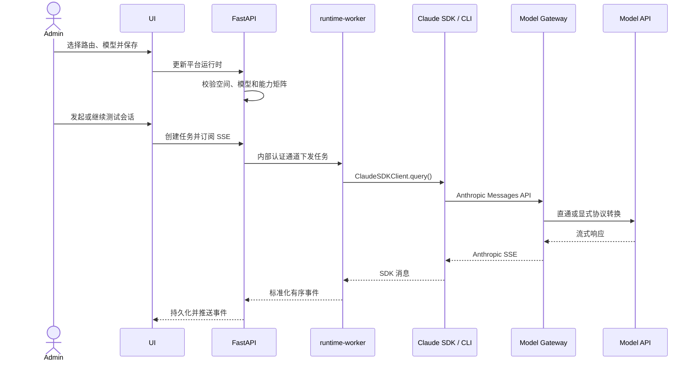

# 空间级平台运行时

## 1. 目标声明

### 背景
v0.3 已能按 namespace 管理供应商、密钥和模型，但没有消费这些配置的 Agent Loop。平台需要以官方 Claude Agent SDK 驱动 Claude Code CLI，同时允许 Claude 与非 Claude 模型通过统一的 Anthropic Messages API 接口工作。

### 目标
- 每个 namespace 恰好拥有一个平台运行时配置。
- Admin 可选择模型、API 路由和 Agent 权限策略，并完成单轮、多轮功能测试。
- Claude 兼容接口可直通；其他协议必须由独立 Model Gateway 显式转换。
- 完整保存消息、工具调用、工具结果、状态事件和最终结果。

### 不在范围内
- 修改 Claude Agent SDK、Claude Code CLI 或其私有 Transport。
- 静默切换模型、删除不兼容参数或放宽权限模式。
- 首版横向扩展 runtime-worker 或引入消息队列。

## 2. 模块影响
| 模块 | 影响类型 | 说明 |
|------|---------|------|
| runtime_management | 新增 | 拥有运行时配置、密钥、会话、任务、事件与 Gateway 运行能力 |
| llm_configs | 只读依赖 | 提供当前空间已启用的供应商配置与模型；不改变其实体生命周期 |
| namespaces | 只读依赖 | 复用空间实体、`X-Namespace-Id` 与空间角色校验 |

## 3. 功能描述

### 3.1 平台运行时配置
1. Admin 进入运行时管理页，选择 `platform_gateway` 或 `direct_anthropic`。
2. `platform_gateway` 必须引用当前空间已启用的 `llm_provider_config` 与模型；非 Anthropic 协议由 Gateway 转换。
3. `direct_anthropic` 保存独立 API 地址、模型 ID 和加密凭证，启用前必须通过 Anthropic Messages API 兼容性测试。
4. 保存时校验模型能力、工具集、权限模式和保留期。禁止 `bypassPermissions`。

边界与异常：模型或配置不属于当前空间、已禁用、协议不兼容、能力不支持时拒绝保存或测试；不自动替换模型或调整参数。

### 3.2 多轮功能测试
1. Admin 或 Developer 新建测试会话，或恢复同一空间内的历史会话。
2. FastAPI 先创建任务并固化运行时配置快照，再由 runtime-worker 调用 `ClaudeSDKClient`。
3. 页面通过 SSE 展示流式消息、工具调用、工具结果、状态和最终结果，并支持停止。
4. SDK/CLI 退出、超时或 Gateway 失败时，任务进入明确终态并保留已产生事件。

边界与异常：Developer 不能修改运行时配置；停止请求必须幂等；会话恢复失败时不得伪装为新会话。

## 4. 数据变更

新增表：
| 表名 | 用途说明 |
|------|---------|
| runtime_profile | 平台或节点运行时的模型路由、Agent 策略与保留设置；平台类型在 namespace 内唯一 |
| runtime_secret | 平台运行时独立 API 的加密凭证，响应只返回掩码；节点直连密钥不进入平台数据库 |
| agent_session | 多轮会话、SDK session ID 与会话状态 |
| agent_task | 单次执行、目标运行时、配置快照、租约和终态结果 |
| agent_event | 按任务和单调序号追加的完整过程事件 |

关键关系与约束：
- 上述表均含 `namespace_id`；运行时模块自己的外键使用 `ON DELETE CASCADE`。
- `runtime_profile(namespace_id, runtime_type)` 对平台类型唯一。
- `agent_event(task_id, sequence)` 唯一，用于断线重传幂等。
- 任务配置快照不可被后续运行时修改覆盖。

## 5. UI 页面
| 变更类型 | 页面名 | 路由 | 说明 |
|------|------|------|------|
| 新增 | 运行时管理页 | `/system/runtimes` | 顶部固定平台运行时，下方节点列表 |
| 新增 | 平台运行时配置弹窗 | `/system/runtimes` | 配置路由、模型、API 和 Agent 权限 |
| 新增 | 功能测试抽屉 | `/system/runtimes` | 单轮/多轮流式测试与历史恢复 |
| 修改 | 侧边栏 | 全局布局 | Admin、Developer 显示“运行时管理”；User 不显示 |

平台区域展示健康状态、Worker/SDK/CLI 版本、路由和默认模型。密钥只在首次录入或轮换时输入，不回显明文。Developer 只看到测试入口。

## 6. 验收标准
- [ ] 每个 namespace 可独立保存一个平台运行时，且不能引用其他空间的模型配置。
- [ ] Anthropic 兼容 API 可正常工作，非兼容 API 必须通过 Gateway 转换。
- [ ] 不支持的模型能力在任务开始前被明确拒绝，不发生静默降级。
- [ ] Admin 可配置并测试；Developer 可测试但不能修改；User 不可见。
- [ ] 多轮测试可恢复会话，页面流式展示完整事件并可停止。
- [ ] SDK/CLI 进程由独立 runtime-worker 管理，FastAPI 重启不产生孤儿进程。
