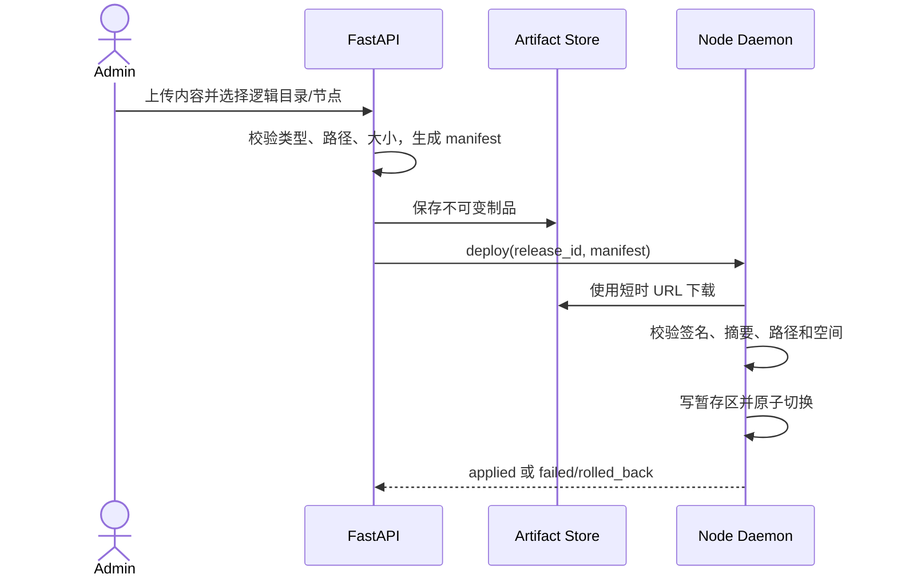

# 节点运行时内容分发

## 1. 目标声明

### 背景
Admin 需要更新节点侧 Agent、Skill、MCP、CLI 配置和获准工作内容。远程写入必须限制目标、校验来源、保留历史并可恢复，不能退化为任意文件或命令执行通道。

### 目标
- Admin 可创建不可变签名制品并发布到当前空间的指定节点。
- 节点只写入预注册逻辑目录，经过暂存、摘要/签名校验和原子切换。
- 每个节点保留发布前后版本、详细状态和失败原因，并支持回滚。

### 不在范围内
- 任意绝对路径、路径穿越、符号链接逃逸。
- 通过内容包执行脚本、Shell 或任意安装命令。
- Developer 或 User 发起内容发布。

## 2. 模块影响
| 模块 | 影响类型 | 说明 |
|------|---------|------|
| runtime_management | 新增 | 拥有制品、发布批次、节点部署与审计记录 |

## 3. 功能描述

### 3.1 制品创建
1. Admin 选择类型：`agent / skill / mcp / cli_config / workspace_content`，并指定逻辑目标目录。
2. 平台拒绝绝对路径、`..`、符号链接逃逸、超限文件和未允许类型。
3. 平台生成包含版本、文件清单、摘要、大小和目标映射的 manifest，并使用平台制品密钥签名。
4. 制品不可原地修改；内容变化必须创建新版本。

### 3.2 发布、应用与回滚
1. Admin 选择同一 namespace 的节点并创建发布批次。
2. 节点以短时下载地址拉取，重新校验签名、摘要、路径、大小与节点适用范围。
3. 内容先写入同文件系统暂存区，全部校验通过后原子切换；旧版本保留到发布确认。
4. 下载、校验或应用失败时丢弃暂存区并保留旧版本；不得执行部分覆盖。
5. 回滚是一个显式、可审计部署动作，目标为已成功安装的历史版本。

边界与异常：节点离线时发布保持等待状态；上线后需重新确认发布仍有效再领取。部署中关机时启动后清理未完成暂存区并保持旧版本，等待 Admin 重试。

## 4. 数据变更
新增表：
| 表名 | 用途说明 |
|------|---------|
| runtime_artifact | 不可变制品版本、类型、摘要、签名、大小和存储定位 |
| artifact_release | 发布批次、目标版本、创建人和整体状态 |
| artifact_deployment | 每节点期望/原版本、下载、校验、应用、回滚状态与错误 |

## 5. UI 页面
| 变更类型 | 页面名 | 路由 | 说明 |
|------|------|------|------|
| 新增 | 内容版本管理 | `/system/runtimes/artifacts` | 上传、查看不可变版本和 manifest |
| 新增 | 发布内容弹窗 | `/system/runtimes` | Admin 选择制品版本和目标节点 |
| 新增 | 发布详情 | `/system/runtimes/releases/:releaseId` | 查看每节点进度、失败与回滚 |

## 6. 验收标准
- [x] 只有 Admin 能创建制品、发布或回滚。
- [x] 任意绝对路径、路径穿越、符号链接逃逸和无效签名均被拒绝。
- [x] 任一步失败都不产生部分覆盖，旧版本继续可用。
- [x] 节点中途关机后保留旧版本，上线后不会自动执行过期发布。
- [x] 制品版本不可变，发布和回滚均有完整审计记录。
- [x] 首版不存在借由内容分发执行任意命令的入口。

