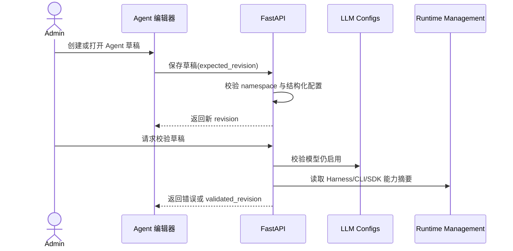

# 空间级 Agent 与 Harness 配置管理

## 1. 目标声明

### 背景
v0.4 已能通过 Claude Agent SDK / Claude Code CLI 执行任务，但运行时只保存模型、权限模式和工具列表等零散配置。平台还没有可独立管理、复用和校验的 Agent 定义，也没有正式的 Harness/CLI 配置模型。

### 目标
- Namespace Admin 可创建、编辑、复制、归档 Agent，并通过显式草稿修订管理并发修改。
- Agent 草稿可选择当前空间模型、Claude Harness 配置、系统提示词、执行时限和工作目录策略。
- Harness 数据模型包含 `harness_type` 和配置 schema 版本；v0.5 仅 `claude_code` 可通过校验并执行。
- CLI 只管理结构化配置、版本约束和兼容性要求，不接受任意参数、任意环境变量或二进制安装指令。
- Agent 草稿只表达配置意图；发布前必须经统一 Resolver 生成 `ResolvedAgentSpec`，不能由 Worker 或节点自行拼装草稿字段。
- Developer 可读取 Agent 和已验证状态，但不能修改配置；User 不可访问管理页。

### 不在范围内
- Codex CLI 或其他 Harness 的真实执行。
- 远程安装、升级或替换 Claude Code CLI / Claude Agent SDK 二进制。
- 把任意命令行参数、Shell 片段或明文密钥作为 CLI 配置保存。
- NeoMua 自身的管理 CLI；该能力见 `neomua-operator-cli.md`。
- 在本子需求中发布或激活 Agent；发布链路见 `namespace-agent-release-activation.md`。

## 2. 模块影响

| 模块 | 影响类型 | 说明 |
|------|---------|------|
| agent_management | 新增 | 拥有 Agent、Agent 草稿和 Harness Profile 的生命周期 |
| llm_configs | 只读依赖 | 提供当前空间已启用的模型引用与状态 |
| runtime_management | 修改 | 拥有平台/节点结构化 `harness_capabilities` 上报，提供实际 CLI、SDK 和 Harness 实现版本用于兼容性预检 |
| namespaces | 只读依赖 | 提供 namespace 隔离和 Admin/Developer 权限判断 |

草稿到执行配置的合并优先级、canonical schema、Prompt Cache 与审批规则统一由 `namespace-agent-runtime-assembly.md` 定义；本文件不另建一套合并逻辑。

## 3. 功能描述

### 3.1 Agent 生命周期

1. Admin 创建 Agent，填写名称、唯一 slug 和说明；系统同时创建 revision 1 的空草稿。
2. Agent 身份记录可修改名称和说明；slug 创建后不可修改，防止部署目录和外部引用漂移。
3. 草稿保存必须携带页面读取时的 `expected_revision`。服务器仅在 revision 相同时更新并递增；冲突返回 409 和最新 revision，不覆盖他人修改。
4. Admin 复制 Agent 时必须显式填写新名称和新 slug；服务端在同一事务中复制非敏感身份信息及当前草稿，生成 `revision=1`、`unvalidated` 的新 Agent，不继承校验结果、Release 或激活状态。
5. Agent 可标记为 `active` 或 `archived`。已归档 Agent 不能继续编辑、验证或创建新发布，但已有发布和历史任务仍可读取。
6. 已被发布引用的 Agent 不物理删除；从未发布的空 Agent 仍需二次确认后才可删除。

### 3.2 Harness Profile 与 CLI 配置

1. Admin 可维护 namespace 内可复用的 Harness Profile。
2. v0.5 允许创建的 `harness_type` 只有 `claude_code`；数据字段保留字符串化类型和 `config_schema_version`，但未知类型校验返回明确的 `unsupported_harness`，不得伪装为 Claude 执行。
3. Profile 使用结构化字段管理：CLI/SDK 版本约束、permission mode、默认超时、工作目录策略、内置工具策略和允许的环境变量名称。
4. `bypassPermissions`、未知 CLI flag、Shell 字符串、内联 secret value 以及未在平台 allowlist 中的环境变量名均拒绝保存。
5. CLI/SDK 版本采用明确约束表达式；没有目标运行时满足约束时允许保存草稿，但验证结果为阻断发布的 error。只要至少一个目标完整上报且满足约束，草稿可通过验证；其他 `unknown` / `incompatible` 目标只阻断向该目标发布或激活，不影响兼容目标。
6. 配置严格区分 Setting 与 Secret：Profile 和 Agent Draft 只能保存非敏感 Setting；模型/MCP 凭证只保存独立 secret handle。
7. 环境变量 catalog 采用 allowlist 并额外设置不可绕过的 denylist，至少覆盖 `LD_PRELOAD`、`LD_LIBRARY_PATH`、`DYLD_*`、`PYTHONPATH`、`PYTHONHOME`、`PYTHONSTARTUP`、`NODE_OPTIONS`、`NODE_PATH`、`PATH`、`SHELL`、`BROWSER`、`GIT_SSH_COMMAND` 和 NeoMua 自身配置路径变量。即使名称被误加入 allowlist，denylist 仍优先拒绝。

### 3.3 Agent 草稿配置与校验

1. Agent 草稿引用一个 Harness Profile，并配置系统提示词、当前空间 provider/model、默认工作目录策略和超时覆盖值。
2. 模型必须属于当前 namespace、配置与模型均已启用；引用失效后草稿显示 `stale`，不能发布。
3. 工作目录只能选择运行时预先登记的逻辑工作区或 allowlisted root，不允许在 Agent 中录入新的任意绝对路径。
4. 校验按 `error / warning` 返回结构化结果。模型失效、Harness 不支持、权限越界、版本不兼容是 error；未选择可选能力可为 warning。
5. 校验只对指定 revision 有效。草稿再次保存后，旧的 `validated_revision` 自动失效。
6. system prompt 是 Agent Release 的稳定组成部分；同一 Session 中不可重新读取草稿或热更新。Skill 正文不在此字段中拼接，其发现与显式调用语义由运行时装配 PRD 统一规定。

### 边界与异常

- slug 在同一 namespace 重复：返回 409；名称是展示字段，允许重复。
- 模型来自其他 namespace、已禁用或不存在：返回 404/422，且不替换为其他模型。
- expected revision 过期：返回 409 和最新 revision，用户选择重新加载后再手工合并。
- runtime 未完整上报 CLI/SDK/Harness 版本：标记该目标兼容性 `unknown`，不得向该目标发布或激活；其他兼容目标不受影响。
- Profile 已被 Agent 草稿或发布引用：只能归档，不能删除。
- Profile 配置损坏或 schema 不兼容：保留当前已激活 Release，拒绝新发布；不得回退为默认 Profile。

## 4. 数据变更

新增表：

| 表名 | 用途说明 |
|------|---------|
| `agent_definition` | Agent 稳定身份、namespace、slug、说明和 active/archived 状态 |
| `agent_draft` | Agent 当前可编辑草稿、单调 revision、模型引用、提示词、Harness 引用及最近校验结果 |
| `harness_profile` | 可复用 Harness/CLI 配置、schema 版本、CLI/SDK 版本约束与归档状态 |

新增字段：

| 表名 | 字段名 | 类型 | 业务含义 |
|------|--------|------|----------|
| `runtime_profile` | `harness_capabilities` | json | 平台 runtime-worker 正式上报的按 `harness_type` 分组的 CLI、SDK 与 Harness 实现版本；不得由管理员配置表单伪造 |
| `runtime_node` | `harness_capabilities` | json | 节点注册并在心跳中持续上报的同结构能力摘要；旧节点或缺字段按 unknown 处理 |

`harness_capabilities.claude_code` 至少包含 `cli_version`、`sdk_version`、`harness_version`。`runtime_node.agent_version` 仅表示 NeoMua Node Agent 自身版本，历史 `runtime_node.sdk_version` 仅为兼容旧协议保留，二者都不得再作为 Claude Harness 兼容性依据。

关键字段与约束：

| 表名 | 字段名 | 类型 | 业务含义 |
|------|--------|------|---------|
| `agent_definition` | `namespace_id` | uuid | 所属空间；删除空间时级联 |
| `agent_definition` | `slug` | varchar(128) | 空间内唯一、创建后不可修改的稳定标识 |
| `agent_definition` | `status` | enum | `active / archived` |
| `agent_draft` | `revision` | integer | CAS 并发控制使用的单调修订号 |
| `agent_draft` | `harness_profile_id` | uuid | 当前 Harness Profile |
| `agent_draft` | `provider_config_id` | uuid | 当前空间模型供应商配置 |
| `agent_draft` | `model_id` | varchar(255) | Agent 期望模型 |
| `agent_draft` | `system_prompt` | text | 系统提示词；不得包含 secret 模板值 |
| `agent_draft` | `config` | json | 通过 schema 校验的非敏感结构化覆盖项 |
| `agent_draft` | `validated_revision` | integer nullable | 最近通过完整校验的 revision |
| `agent_draft` | `validation_result` | json | error/warning 代码及定位，不含密钥或远端原始响应 |
| `harness_profile` | `harness_type` | varchar(64) | v0.5 仅允许 `claude_code` 执行 |
| `harness_profile` | `config_schema_version` | varchar(32) | Harness adapter 配置 schema 版本 |
| `harness_profile` | `cli_version_constraint` | varchar(128) | CLI 兼容版本约束 |
| `harness_profile` | `sdk_version_constraint` | varchar(128) | SDK 兼容版本约束 |
| `harness_profile` | `config` | json | 结构化权限、超时、工作区及 allowlisted env 名称 |

`config` 中不得出现 secret value；实现需在 schema 层拒绝类似 `api_key`、`token`、`password`、任意 Header value 和 denylisted env 名称，不能只依赖前端隐藏字段。

唯一约束：`agent_definition(namespace_id, slug)`、`harness_profile(namespace_id, name)`；每个 Agent 恰好一个 `agent_draft`。

## 5. API 设计

| Method | Path | 权限 | 用途 |
|--------|------|------|------|
| GET/POST | `/agents` | Developer 读 / Admin 写 | 列表和创建 Agent |
| POST | `/agents/{agent_id}/copy` | Admin | 以新名称和新 slug 事务式复制 Agent 当前草稿，重置为 revision 1、未验证 |
| GET/PATCH/DELETE | `/agents/{agent_id}` | Developer 读 / Admin 写 | 详情、身份修改、未发布 Agent 删除 |
| GET/PUT | `/agents/{agent_id}/draft` | Developer 读 / Admin 写 | 读取或按 expected revision 保存草稿 |
| POST | `/agents/{agent_id}/draft/validate` | Admin | 校验指定草稿 revision |
| GET/POST | `/harness-profiles` | Developer 读 / Admin 写 | Harness Profile 列表和创建 |
| GET/PATCH/DELETE | `/harness-profiles/{id}` | Developer 读 / Admin 写 | Profile 详情、更新、归档/删除 |
| GET | `/harnesses/catalog` | Admin/Developer | 返回支持的 harness 类型、schema 和安全字段目录 |
| GET | `/harnesses/environment-catalog` | Admin/Developer | 返回可配置 env 名称、保留名称和不可覆盖 denylist |

所有接口使用 `X-Namespace-Id`。Mutation 使用 Cookie 时继续执行 CSRF；响应不返回 secret value。

## 6. UI 页面

| 变更类型 | 页面名 | 路由 | 说明 |
|------|------|------|------|
| 新增 | Agent 列表 | `/system/agents` | Agent 状态、Harness、模型、草稿修订与发布状态 |
| 新增 | Agent 编辑器 | `/system/agents/:agentId` | 基础信息、模型、提示词、Harness 与能力配置 |
| 新增 | Harness 配置 | `/system/harnesses` | Claude Harness Profile 与兼容性要求管理 |
| 修改 | 侧边栏 | 全局布局 | Admin/Developer 显示“Agent 管理”，User 不显示 |

### Agent 列表

- 布局：标题、创建按钮、状态筛选、表格。
- 功能：创建、复制、归档、进入编辑；Developer 只读。
- 复制：弹窗要求输入新名称和新 slug；成功后进入新 Agent 编辑器，不静默生成可能冲突的 slug。
- 交互：切换 namespace 后清空旧空间查询缓存并重新读取，不保留跨空间表单。

### Agent 编辑器

- 布局：概览、模型与提示词、Harness、能力、校验与发布五个页签；后两个页签由后续子需求补齐。
- 功能：自动保存关闭，使用显式“保存草稿”；顶部固定显示 revision 与校验状态。
- 交互：409 冲突时显示“已被其他人更新”，提供重新加载，不自动覆盖或静默合并。
- 字段：名称必填；slug 创建时校验；system prompt 必填；模型与 Harness Profile 必选；超时必须为平台范围内正整数。

### Harness 配置页

- 布局：Profile 列表 + 创建/编辑抽屉 + 目标兼容性预览。
- 功能：维护结构化配置和版本约束，展示平台及节点已上报版本是否满足要求。
- 交互：归档前展示受影响 Agent；被引用时不提供物理删除。

导航新增“Agent 管理”；“Harness 配置”作为 Agent 管理的二级入口，不新增同级侧边栏项。

## 7. 验收标准

- [x] Admin 可创建 Agent 与 Claude Harness Profile，Developer 只能读取，User 无页面和接口权限。
- [x] 两名 Admin 同时编辑同一 revision 时，后提交者收到 409，既有修改不会被覆盖。
- [x] 非当前 namespace 模型、失效模型和未知 Harness 均阻断校验，不自动替换。
- [x] CLI 配置不能保存 `bypassPermissions`、任意 Shell、未知 flag 或 secret value。
- [x] Loader/链接器、Python、Node、Shell、Git 和 NeoMua 保留环境变量不能通过 Profile 或 Agent Draft 注入。
- [x] 目标未上报版本时显示 unknown 并阻断发布兼容性判断。
- [x] 平台 worker 与节点使用同一 `harness_capabilities` schema 上报 Claude CLI、SDK 和 Harness 实现版本；Node Agent 自身版本不会被误当作 Claude CLI 版本。
- [x] 至少一个目标兼容时草稿可验证通过；unknown/incompatible 目标仅阻断自身，零兼容目标返回 `no_compatible_runtime_target`。
- [x] Agent 名称可重复、slug 空间内唯一；复制操作事务式生成 revision 1、unvalidated 的新 Agent，且不继承 Release、激活或校验结果。
- [x] 草稿修改后旧验证结果失效；归档 Agent 不可继续修改或发布。
- [x] Profile 损坏或 schema 不兼容时拒绝新发布，不回退默认配置，也不影响当前已激活 Release。
- [x] Worker、Node 和 Agent Draft API 均不能绕过统一 Resolver自行生成执行配置。
- [x] v0.5 的执行入口只接受 `harness_type=claude_code`。
