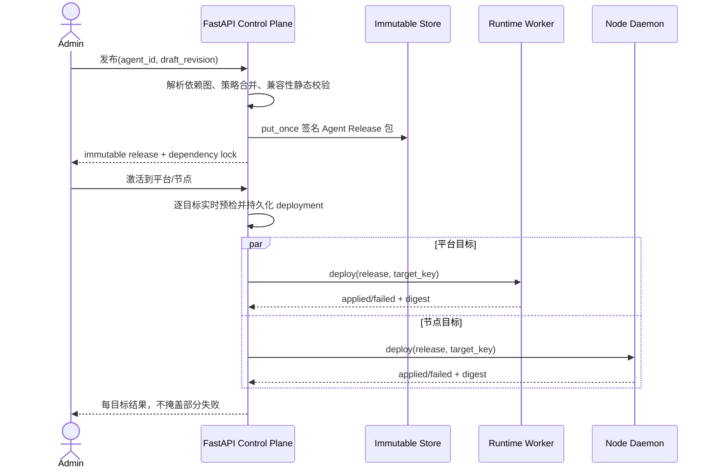
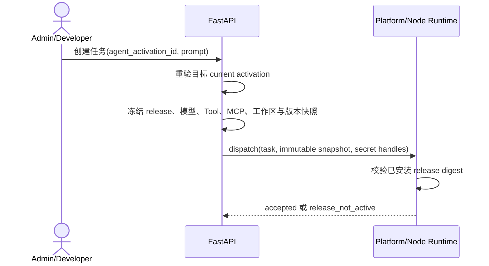

# Agent 发布、激活与运行时绑定

## 1. 目标声明

### 背景
Agent、Skill、Tool、MCP 和 Plugin 具备管理模型后，需要把一个已验证草稿解析成确定、可审计、可回滚的执行单元。v0.4 的制品发布只面向节点固定逻辑目录，不能表达多个 Agent、平台运行时激活、依赖锁或任务使用的 Agent 版本。

### 目标
- Admin 可将指定 Agent draft revision 解析为带完整依赖锁的不可变 Agent Release。
- 每个 Release 固化统一 Resolver 生成的 `ResolvedAgentSpec`、schema version 和 digest；发布、激活和任务不得分别拼装配置。
- Agent Release 同时支持激活到当前 namespace 的平台运行时和一个或多个节点运行时。
- 每个目标在激活前执行 Harness、CLI/SDK、模型、工作区、Skill、Tool、MCP executable/secret 的完整兼容性检查。
- 平台和节点均采用签名包、暂存、校验与原子切换；任一步失败都保留该目标的旧版本。
- 新任务必须选择目标上已激活的 Agent Release，并冻结完整但不含明文密钥的执行快照。
- 回滚是显式、可审计的新激活动作；不影响已开始任务，后续任务使用回滚后的当前版本。

### 不在范围内
- 自动升级依赖、自动激活最新版或失败后静默回退。
- 在目标不兼容时删除能力、替换模型、降低 Tool 权限或切换 Harness。
- 通过 Agent Release 安装/升级 CLI、SDK、MCP executable 或系统包。
- 跨节点自动迁移正在执行的任务。
- 一次发布对所有目标提供分布式原子提交；各目标独立原子，批次允许明确的部分成功。

## 2. 模块影响

| 模块 | 影响类型 | 说明 |
|------|---------|------|
| agent_management | 新增 | 拥有 Agent Release、依赖锁、签名 manifest、激活意图与目标状态 |
| runtime_management | 修改 | 平台/节点接收、校验、原子应用 Agent Release，并以激活版本创建任务快照 |
| llm_configs | 只读依赖 | 发布和激活时重验模型归属、启用状态及路由兼容性 |
| namespaces | 只读依赖 | 校验发布者、目标与所有依赖位于同一 namespace |

本文件依赖 `namespace-agent-runtime-assembly.md` 定义的 Resolver、配置优先级、Capability Catalog、Harness Adapter、Prompt Cache 和审批状态机。

## 3. 功能描述

### 3.1 Agent Release 创建

1. Admin 选择已完整验证且仍为当前 revision 的 Agent 草稿，并提交 SemVer 和 Idempotency-Key。
2. 控制面调用统一 Resolver 展开 Agent 直接绑定及 Plugin 引入的 Skill、MCP 和 Tool 策略，生成无冲突的 dependency lock 与 canonical `ResolvedAgentSpec`。
3. 发布校验至少覆盖：模型仍启用、Harness 为 `claude_code`、CLI/SDK 约束合法、Skill/Plugin 未 deprecated、MCP Revision 已有可用目标、Tool 策略不低于安全基线、所有资源属于同一 namespace。
4. `ClaudeCodeHarnessAdapter.validate_spec()` 通过后，服务端生成 canonical manifest 和一个自包含的 Agent Release 包。包可包含 Resolved Spec、声明式 Agent 配置、Skill 内容、Plugin contribution 和 MCP 非敏感配置，但绝不包含 secret value、CLI/SDK/MCP executable 或安装脚本。
5. Release 包逐文件哈希并使用平台制品密钥签名；manifest、dependency lock、包 digest、签名和 signing key 保存后不可修改。
6. 同版本不同 manifest 返回 409；相同 Idempotency-Key 与相同请求返回既有 Release。

### 3.2 目标预检与激活

1. 激活请求明确列出平台 runtime profile 和/或节点 runtime profile，不使用“所有当前及未来节点”的动态目标。
2. 每个目标调用同一 Adapter 的 `validate_target()` 重新检查当前正式上报的 `harness_capabilities`（CLI/SDK/Harness 版本）、模型路由、工作目录、内置 Tool、MCP executable、节点本地 secret_ref、可用空间和目标当前版本。单个目标 unknown/incompatible 只阻断该目标，不改变其他目标结果。
3. 预检失败的目标创建 `incompatible` deployment 并保存结构化原因，不发送 Release；其他目标可继续。
4. 预检通过后先持久化有有效期的 deployment reservation，再发送下载/应用命令；重复命令按 `(deployment_id, attempt)` 幂等。
5. 平台 worker 与节点 daemon 都必须验证双签名、包摘要、Resolved Spec digest、逐文件摘要、namespace、agent_id、release_id 和目标适用范围，再由 Adapter 写入同文件系统 staging。
6. Release 以 `agent:{agent_id}` 作为独立逻辑 target 原子切换，因此同一 runtime 可同时激活多个 Agent，更新一个 Agent 不覆盖其他 Agent 的 Skill 集合。
7. 目标回报 applied digest 后，控制面在行锁内把该 `(runtime_profile_id, agent_id)` current pointer 切到新 Release，并保留 previous pointer。
8. 下载、校验、应用或确认失败时丢弃 staging、保持旧 current；不做部分文件覆盖，不把 deployment 标记为 active。

### 3.3 平台运行时正式应用

1. 平台 runtime-worker 增加与节点 installer 同安全等级的本地 release store、target lock、staging 和 current/previous 指针。
2. Worker 启动时以受签名 current manifest 和实际 symlink/目录为事实来源对账；无法证明状态时上报 degraded，不接受该 Agent 新任务。
3. FastAPI 多 worker 不直接修改平台工作目录；所有应用动作由独立 runtime-worker 通过内部认证领取和确认。
4. 平台激活失败不能退回“直接读取数据库草稿”执行。
5. Worker 使用 Adapter 的 materialization manifest 对账 SDK options、Skill 目录、MCP config 和 Tool Schema；只校验 ZIP 文件存在不足以证明 Agent 可执行。

### 3.4 任务与会话绑定

1. Admin/Developer 创建普通任务或测试会话时必须选择目标上 `active` 的 Agent Activation；User 仍不可访问运行时任务。
2. 任务创建时冻结 `agent_id/release_id/release_digest/harness_type`、模型路由、resolved Skill/Plugin/MCP Tool、Tool 策略、工作目录、超时和 executor 版本。
3. 任务和 Session 同时保存 `resolved_spec_digest`；Runtime 本地 materialization digest、任务 digest 和 Release digest 任一不一致都返回 `release_not_active`。
4. 快照只包含 platform secret record ID 或 node `secret_ref` 等句柄；执行器在目标本地解析，API 和事件不得返回 secret value。
5. runtime 接收任务时比较本地 current release 和 Resolved Spec digest；不一致时返回 `release_not_active`，任务进入明确 rejected/interrupted 状态，不改用其他版本。
6. 同一 Agent Release 可创建多个 session；session 后续消息固定使用创建时的 release、system prompt、Tool Schema 和 MCP digest。需要升级时新建 session，不在多轮中途切换版本。
7. Release 被替换或回滚不终止已经开始的任务；排队未 dispatch 的任务仍使用已冻结版本，若目标已清理该版本则明确 rejected，不改用 current。

### 3.5 回滚、重试与保留

1. 只有失败/过期/incompatible deployment 可显式 retry；retry 创建新 attempt 并重新执行实时预检。
2. 回滚只能选择该目标上曾成功 applied 且仍保留、签名可验证的 Agent Release，并创建新的 activation/deployment 记录。
3. 回滚不修改历史 Release，不伪装成删除新版本；UI 展示 `rollback_of_activation_id`。
4. active、previous、在途任务、session 或审计记录引用的 Release 不可清理。其余版本按显式保留策略清理包体，元数据仍保留。
5. 批次部分成功时整体状态为 `partial`；Admin 可针对失败目标重试或对已成功目标显式回滚，系统不自动替用户选择。

### 边界与异常

- 草稿 revision 已变化或 validated revision 不匹配：发布返回 409。
- 任一依赖跨 namespace、deprecated、缺失或摘要不一致：发布失败，不生成 Release。
- 节点离线：deployment 保持 pending 直到有效期；过期后不在重连时自动部署。
- 目标在 reservation 后能力指纹变化：目标应用前重验并返回 stale capability。
- current pointer 与磁盘状态不一致：目标 degraded，停止新任务并要求修复/重新部署。
- 激活期间已有旧版本任务执行：允许完成；新任务仅在 current pointer 确认后使用新版本。
- 发布包签名服务或对象存储失败：事务不留下可激活 Release。

## 4. 数据变更

新增表：

| 表名 | 用途说明 |
|------|---------|
| `agent_release` | Agent 不可变 SemVer、draft revision、manifest、dependency lock、摘要和签名 |
| `agent_release_component` | 展开的 Skill/Plugin/MCP/Tool 精确依赖与来源链 |
| `agent_activation` | 一次面向一个或多个明确 runtime target 的激活/回滚意图 |
| `agent_deployment` | 每个目标每次 attempt 的预检、分发、应用状态和错误 |
| `runtime_agent_release` | 每个 runtime/agent 的 current/previous Release 指针与 applied digest |

新增字段：

| 表名 | 字段名 | 类型 | 业务含义 |
|------|--------|------|---------|
| `agent_session` | `agent_release_id` | uuid nullable | v0.5 Agent 会话固定使用的 Release；旧数据允许为空 |
| `agent_session` | `runtime_agent_release_id` | uuid nullable | 会话创建时的目标激活记录 |
| `agent_task` | `agent_release_id` | uuid nullable | 任务冻结的 Agent Release；旧任务允许为空 |
| `agent_task` | `runtime_agent_release_id` | uuid nullable | 任务目标的 current binding 快照来源 |

`agent_release.resolved_spec_schema_version/resolved_spec/resolved_spec_digest` 以及 Session/Task 的 digest 字段由 `namespace-agent-runtime-assembly.md` 定义，属于本 Release 创建和执行链路的必需字段，不得作为可选实现阶段省略。

关键约束：

- `agent_release(agent_id, version)` 唯一；Release 内容不可更新。
- `agent_activation(namespace_id, idempotency_key)` 唯一。
- `agent_deployment(activation_id, runtime_profile_id, attempt)` 唯一。
- 部分唯一索引保证每个 `(runtime_profile_id, agent_id)` 最多一个 `pending / dispatched / applying` deployment。
- `runtime_agent_release(runtime_profile_id, agent_id)` 唯一。
- Release component 和任务/session 外键使用 RESTRICT/SET NULL 的组合保证审计；存在 active/previous/任务/session 引用时不允许删除包体。

状态至少包括：

- activation：`validating / deploying / active / partial / failed / rolled_back / expired`。
- deployment：`prechecking / incompatible / pending / dispatched / applying / applied / failed / expired / rolled_back`。

Agent Release 包复用现有不可变对象存储和签名设施，但使用独立的 release manifest schema 和 `agent:{agent_id}` 逻辑 target；不复用 v0.4 仅有固定 enum target 的 current pointer。

## 5. API 设计

| Method | Path | 权限 | 用途 |
|--------|------|------|------|
| GET/POST | `/agents/{agent_id}/releases` | Developer 读 / Admin 写 | 列表和从指定 draft revision 创建 Release |
| GET | `/agent-releases/{release_id}` | Admin/Developer | manifest、dependency lock、签名和引用状态 |
| GET | `/agent-releases/{release_id}/resolved-spec` | Admin/Developer | canonical Spec、来源链、schema/digest 和 Adapter 计划 |
| POST | `/agent-releases/{release_id}/activations` | Admin | 创建明确目标的激活批次 |
| GET | `/agent-activations/{activation_id}` | Admin/Developer | 批次及逐目标状态 |
| POST | `/agent-deployments/{deployment_id}/retry` | Admin | 实时重验后创建新 attempt |
| POST | `/agent-deployments/{deployment_id}/rollback` | Admin | 创建指向 previous Release 的新激活 |
| GET | `/runtime-agents` | Admin/Developer | 当前 namespace 各 runtime 的 Agent 激活矩阵 |
| POST | `/runtime-tasks` | Admin/Developer | 增加必填 `runtime_agent_release_id` 的 v0.5 Agent 执行路径 |
| POST | `/runtimes/platform/sessions` | Admin/Developer | 增加必填 `runtime_agent_release_id` 并固定会话 Release |

兼容说明：旧的无 Agent `runtime-tasks` 数据保留可读；v0.5 上线后的新建请求缺少 `runtime_agent_release_id` 时返回 422。现有测试和调用方必须迁移到正式 Agent 激活链路，不保留绕过 Agent Release 的新任务入口，也不自动绑定默认 Agent。

内部协议新增 `agent_release_deploy`、`agent_release_applied/failed` 和任务中的 release digest。内部 token 必须绑定 namespace、runtime、release/deployment；节点下载 token继续绑定 node、deployment、storage key 和有效期。

## 6. UI 页面

| 变更类型 | 页面名 | 路由 | 说明 |
|------|------|------|------|
| 修改 | Agent 编辑器发布页签 | `/system/agents/:agentId` | 发布预检、依赖锁预览和创建 Release |
| 新增 | Agent Release 详情 | `/system/agents/:agentId/releases/:releaseId` | manifest、签名、依赖和激活历史 |
| 新增 | Agent 激活对话框 | Agent Release 详情 | 选择平台/节点目标并预览兼容性 |
| 新增 | Agent 激活详情 | `/system/agent-activations/:activationId` | 每目标状态、失败原因、retry/rollback |
| 修改 | 运行时管理页 | `/system/runtimes` | 增加平台/节点的已激活 Agent 矩阵 |
| 修改 | 下发任务/功能测试 | `/system/runtimes` | 必须先选择目标上 active Agent |
| 修改 | 任务详情 | `/system/runtimes/tasks/:taskId` | 展示 Agent/Release/digest 与完整依赖快照 |

### 发布与激活

- 发布前展示 draft revision、模型、Harness、精确 Skills/Plugins/MCP/Tools 和阻断项；用户不能跳过 error。
- 激活目标矩阵分别显示 platform/node 的 CLI、SDK、MCP secret/executable、Tool 与工作区兼容性。
- 批次部分成功时用独立目标状态展示，不以绿色整体成功掩盖失败。
- retry 和 rollback 均二次确认；rollback 明确展示将影响的新任务，不声称终止在途任务。

### 任务入口与详情

- 先选 runtime target，再只列出该目标已 active 的 Agent Release。
- 若没有 active Agent，展示“请先激活 Agent”，不回退到直接 prompt 执行。
- 任务详情显示 snapshot digest 和版本；MCP secret 仅显示引用是否存在，不显示名称以外的敏感内容。

## 7. 验收标准

- [x] Agent Release 从指定 validated draft revision 生成，包含精确 dependency lock、逐文件摘要和可验证签名，创建后不可修改。
- [x] Release、目标物化结果、Session 和 Task 使用同一 Resolved Spec digest，任何不一致均拒绝执行。
- [x] 发布、激活和任务均调用统一 Resolver/Adapter，不存在三套独立配置拼装逻辑。
- [x] 发布或激活发现不兼容时明确失败，不删除能力、不换模型、不降低权限、不换 Harness。
- [x] 同一 runtime 可独立激活多个 Agent；更新一个 Agent 不覆盖其他 Agent 的文件或指针。
- [x] 平台与节点都通过 staging、签名校验和原子切换应用 Release，失败时旧 current 保持可用。
- [x] 节点离线 deployment 过期后不会在重连时自动执行。
- [x] 新任务只能选择目标上 active Release，并冻结完整版本快照；本地 digest 不一致时明确拒绝。
- [x] 任务、manifest、事件和下载包不包含平台或节点 MCP secret value。
- [x] Session 生命周期内不切换 Agent Release；升级后需新建 session。
- [x] 回滚创建新的可审计激活动作，不修改历史 Release，也不影响已开始任务。
- [x] 多目标部分成功显示为 partial，由 Admin 显式选择重试或回滚，不自动替用户决策。
