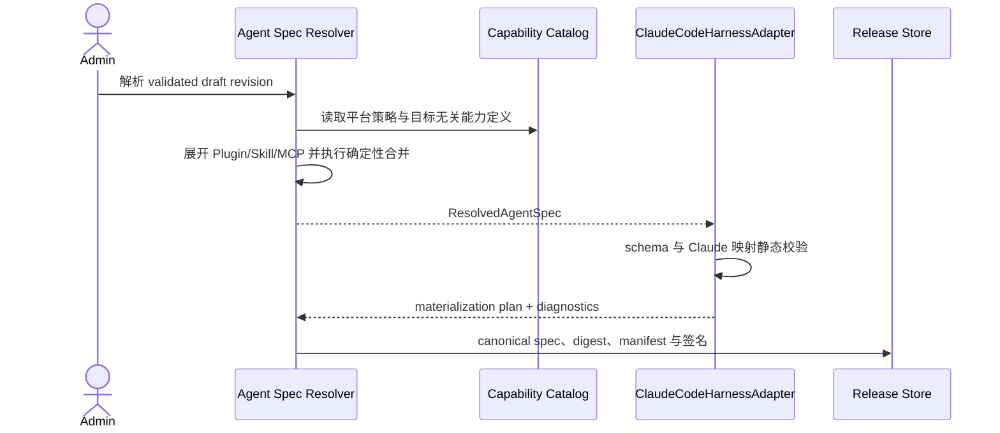
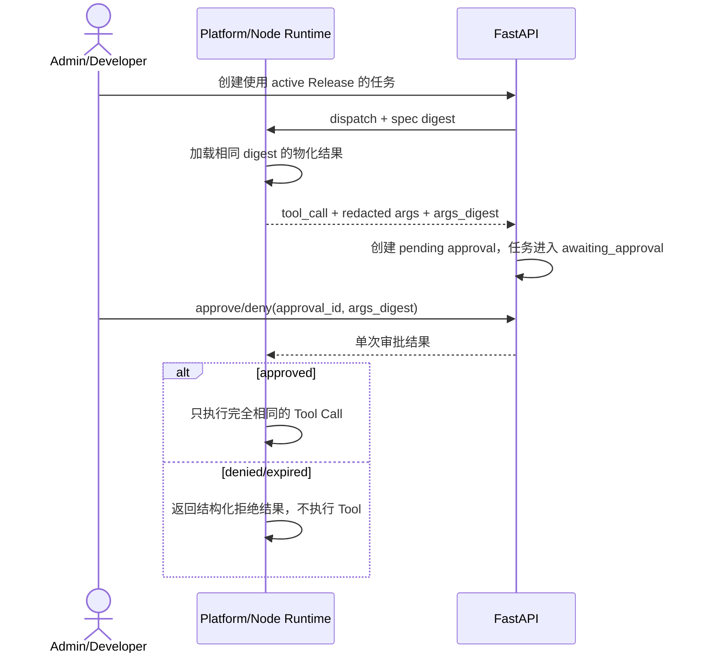

# Agent 运行时装配与执行审批

## 1. 目标声明

### 背景
Agent、Skill、Tool、MCP 和 Plugin 都有独立管理模型后，仍需要一个稳定的“执行窄腰”，把多来源配置确定性解析为 Claude Agent SDK / Claude Code CLI 可消费的参数、目录和运行策略。若缺少这一层，发布摘要、目标兼容性、任务快照和实际执行配置可能各自实现并发生漂移。

### 目标
- 定义与具体 Harness 解耦、可 canonicalize 的 `ResolvedAgentSpec`，作为发布、激活、任务和审计的唯一执行规格。
- 定义固定的配置合并与冲突规则；权限只能取交集，任何 required capability 缺失都明确失败。
- 通过 `HarnessAdapter` 将同一规格校验并物化为 Claude SDK options、Skill 目录、MCP 配置和环境句柄。
- Session 固定 Release、system prompt、Tool Schema 和 MCP Tool digest，不在多轮中途热替换。
- 为 `require_approval` Tool 提供完整的请求、等待、批准/拒绝、超时、断线恢复与审计链路。
- v0.5 仅实现 `ClaudeCodeHarnessAdapter`；其他 Harness 返回 unsupported，不复用 Claude adapter 猜测执行。

### 不在范围内
- Codex CLI 或其他 Harness 的真实 Adapter。
- 根据目标能力自动删除 Tool、MCP 或 Skill，或自动改用其他模型/Harness。
- 在运行中 Session 热更新 system prompt、Tool Schema、MCP Revision 或 Agent Release。
- 允许 Plugin 注册进程内代码、任意 Hook 或自定义 Tool handler。
- 自动批准 Tool Call，或在审批通道不可用时改成直接执行。

## 2. 模块影响

| 模块 | 影响类型 | 说明 |
|------|---------|------|
| agent_management | 修改 | 解析 Agent/Plugin/Skill/MCP/Tool 为 canonical `ResolvedAgentSpec` 并固化到 Release |
| runtime_management | 修改 | 提供 Harness Adapter、能力目录、MCP Runtime Manager、审批状态和真实执行装配 |
| llm_configs | 只读依赖 | 提供并重验模型路由，不允许 resolver 自动 fallback |
| namespaces | 只读依赖 | 校验全部输入、审批人和执行目标属于同一 namespace |

## 3. 功能描述





### 3.1 配置层级与确定性合并

Resolver 按以下层级读取输入，但不同字段使用不同合并算法，不采用普通 JSON 的“后写覆盖前写”：

| 层级 | 内容 | 合并规则 |
|------|------|---------|
| 1. 平台安全基线 | forbidden Tool、环境变量 denylist、最大超时、权限上限 | 不可覆盖，只能进一步收紧 |
| 2. Namespace 策略 | Tool 禁用/审批、网络和工作区策略 | 与平台策略取更严格结果 |
| 3. Harness Profile | CLI/SDK 约束、permission mode、默认超时 | Agent 可在允许范围内收紧或填写缺省值 |
| 4. Agent Draft | 模型、system prompt、直接 Skill/MCP/Tool 绑定 | 作为 Agent 明确意图，不覆盖安全基线 |
| 5. Plugin/Skill requirements | 精确依赖、required Tool/MCP/config | 求传递闭包；版本不一致或 required 缺失即冲突 |
| 6. Runtime Target | 正式上报的 `harness_capabilities`、Tool/executable/secret/workspace 能力 | 仅用于兼容性判断，不能修改 Spec；不得从 Node Agent 版本推断 Claude CLI 版本 |

具体不变式：

1. Tool deny/forbidden 优先，allow 集合取交集；`require_approval` 不得被下层改成直接允许。
2. Skill、Plugin 和 MCP 只接受精确版本/Revision；同一身份出现两个版本即失败。
3. 超时不得超过平台上限；目标无法满足时失败，不缩短后继续执行。
4. 模型、provider、Harness 不存在 fallback 链；引用失效直接阻断。
5. secret value 不参与 Resolver；只解析 platform secret record ID 或 node-local `secret_ref`。
6. 所有集合在 canonicalize 前按稳定 key 排序；相同输入必须产生完全相同的 spec digest。

### 3.2 `ResolvedAgentSpec` 契约

Spec 至少包含：

- `schema_version`、`agent_id`、`agent_release_id`、`harness_type`、`harness_adapter_version`。
- model route、system prompt、permission/approval/workspace/timeout policy。
- 精确 Skill manifests、Plugin contribution、Tool definitions/policy、MCP configs 与 Tool Schema digest。
- executor/CLI/SDK 版本约束、目标无关的 required capabilities。
- secret handles；不得包含明文密钥、Header value 或节点本地 secret 内容。

Spec 使用规范 JSON 编码计算 SHA-256。Agent Release manifest、目标物化结果、Session 和 Task 都保存同一 `resolved_spec_digest`；任何一处 digest 不一致都拒绝执行。

### 3.3 Harness Adapter 与物化

`HarnessAdapter` 固定提供以下契约：

```text
validate_spec(spec) -> diagnostics
validate_target(spec, capability_inventory) -> diagnostics
materialize(spec, target_root) -> materialization_manifest
build_execution_options(spec, target, task) -> harness options
reconcile(materialization_manifest, filesystem_state) -> healthy/degraded
```

`capability_inventory.harness_capabilities` 对平台和节点使用相同结构。v0.5 的 `claude_code` 项至少包含 `cli_version`、`sdk_version`、`harness_version`；缺失任一字段时该目标为 `unknown`。目标级 unknown/incompatible 不影响其他兼容目标，但该目标不得发布、激活或接收新任务。

`ClaudeCodeHarnessAdapter` 负责：

1. 把模型、permission mode、Tool allow/deny 和超时映射为 Claude Agent SDK options。
2. 把选定 Skill 物化到该 Agent Release 独立的 Claude Code Skill 目录，不把全部 Skill 正文追加到 system prompt。
3. 把已验证 MCP Revision 映射为 SDK 支持的 MCP server 配置；secret 在目标本地最后一刻解析为受控进程环境或 Header。
4. 只接受 adapter schema 中列出的 CLI 配置；拒绝未知字段和版本不支持字段。
5. 生成逐文件、Tool Schema、MCP config 和 options digest 的 materialization manifest。

Adapter 不拥有业务依赖解析，不直接读数据库草稿，也不能为了兼容目标修改 Spec。

### 3.4 Capability Catalog

1. Catalog 统一描述 Claude 内置 Tool、MCP Tool 和声明式 Plugin contribution 的稳定 key、schema digest、来源、风险基线和目标可用性。
2. 内置 Tool 的执行仍由 Claude SDK/CLI 负责；MCP Tool 由 MCP Runtime Manager 负责。Catalog 不重复实现第三方 Tool handler。
3. Runtime 上报 capability inventory 和 fingerprint；上报未知不等于不可用，也不等于可用，状态保持 `unknown` 并阻断激活。
4. Session 创建时固定展开后的 Tool definitions。运行期间 capability inventory 变化只使目标或后续激活 stale，不热替换当前 Session。

### 3.5 Prompt Cache 与 Skill 调用不变式

1. Session 创建时固定 Agent Release、system prompt、Tool definitions、MCP Tool digest 和 adapter version。
2. 选定 Skill 以 Release 文件形式被 Claude Code 发现；不得在每轮重建 system prompt 或无条件把全部 Skill 内容注入上下文。
3. 用户显式触发 Skill 时，通过结构化 Skill invocation API 选择 Session Release 内的 skill slug 和参数；Adapter 将其构造成新的 user message 并作为 Agent Event 持久化。服务端不依赖解析任意 prompt 文本来猜测 Skill，也不允许引用 Release 外路径。
4. Skill、Plugin 或 MCP 更新只影响新 Release/New Session；`reload` 不能改变进行中 Session 的 resolved spec。
5. Context compression 可独立发生，但不得改变 system prompt、Tool Schema 或依赖版本；压缩事件必须持久化并可审计。

### 3.6 Tool 执行审批

1. Tool Call 命中 `require_approval` 时，Runtime 在执行前回传 tool qualified name、脱敏参数预览和 canonical `args_digest`。
2. FastAPI 原子创建 `tool_approval_request`，任务状态进入 `awaiting_approval`；Runtime 保留调用上下文但不得执行 Tool。
3. 默认只有 Namespace Admin 可批准。若 namespace 明确启用 `initiator_may_approve`，Admin/Developer 可批准自己创建的普通任务；不能批准他人任务或 Admin Task。
4. 审批必须同时匹配 approval ID、task revision、tool call ID 和 args digest；任何参数变化必须创建新请求。
5. approve/deny 幂等。重复相同决定返回既有结果；相反决定返回 409。
6. 超时产生 `expired`，Tool 不执行，Runtime 收到结构化拒绝结果；不得因没有在线审批人自动执行。
7. 节点断线时 pending approval 保留；重连后仅在任务租约、revision 和审批有效期仍成立时继续，否则中断任务。
8. 平台 forbidden Tool 不产生审批请求，直接拒绝。

### 边界与异常

- Resolver 同一输入产生不同 digest：视为实现缺陷，阻断发布并记录 `non_deterministic_resolution`。
- Adapter 不认识 Spec schema 或字段：返回 unsupported，不忽略字段。
- 目标物化文件与 manifest 不一致：目标 degraded，拒绝新任务。
- Skill 显式调用不属于 Session Release：返回 409，不读取目标上的其他版本。
- 审批页面关闭、CLI 断开或无人处理：保持 pending 至超时，不自动批准。
- 审批通过后 Runtime 发现 args digest 改变：不执行，创建新的 Tool Call/approval。

## 4. 数据变更

新增表：

| 表名 | 用途说明 |
|------|---------|
| `tool_approval_request` | Tool Call 审批请求、参数摘要、决策、有效期和处理人 |

新增字段：

| 表名 | 字段名 | 类型 | 业务含义 |
|------|--------|------|---------|
| `agent_release` | `resolved_spec_schema_version` | varchar(32) | canonical Spec schema 版本 |
| `agent_release` | `resolved_spec` | json | 不含 secret value 的完整执行规格 |
| `agent_release` | `resolved_spec_digest` | char(64) | 规范编码摘要 |
| `agent_session` | `resolved_spec_digest` | char(64) nullable | Session 固定的 Spec；旧数据允许为空 |
| `agent_task` | `resolved_spec_digest` | char(64) nullable | Task 执行前必须匹配的 Spec |

`tool_approval_request` 关键字段：`namespace_id`、`task_id`、`task_revision`、`tool_call_id`、`tool_qualified_name`、`redacted_args`、`args_digest`、`status`、`requested_at`、`expires_at`、`resolved_at`、`resolved_by`、`decision_reason`。

约束：`(task_id, task_revision, tool_call_id, args_digest)` 唯一；状态为 `pending / approved / denied / expired / cancelled`。参数只保存脱敏预览与摘要，不另存未脱敏副本。

调整已有字段说明：

| 表名 | 字段名 | 调整说明 |
|------|--------|---------|
| `agent_task` | `status` | 值域增加 `awaiting_approval`；只允许从 running 进入，审批后回 running 或明确终态 |
| `agent_event` | `event_type/payload` | 增加 approval requested/resolved/expired 结构化事件，仍遵守脱敏规则 |

## 5. API 与内部协议

| Method | Path | 权限 | 用途 |
|--------|------|------|------|
| GET | `/runtime-tasks/{task_id}/approvals` | Admin/Developer | 读取自己有权查看任务的脱敏审批记录 |
| POST | `/tool-approvals/{approval_id}/approve` | Admin 或受策略允许的任务发起者 | 批准完全匹配的 Tool Call |
| POST | `/tool-approvals/{approval_id}/deny` | 同上 | 拒绝 Tool Call并填写可选原因 |
| GET | `/agent-releases/{release_id}/resolved-spec` | Admin/Developer | 读取脱敏 Spec、digest 和来源链 |
| POST | `/runtimes/sessions/{session_id}/skills/{skill_slug}/invoke` | Admin/Developer | 仅调用该 Session Release 内的 explicit_user_message Skill |

内部 Worker/Node 协议增加 `tool_approval_requested`、`tool_approval_decided` 和 `tool_approval_expired`。消息绑定 namespace、task、revision、tool call、args digest 和 connection generation，并按现有事件/ack 机制幂等重放。

## 6. UI 页面

| 变更类型 | 页面名 | 路由 | 说明 |
|------|------|------|------|
| 修改 | Agent Release 详情 | `/system/agents/:agentId/releases/:releaseId` | 展示 Resolved Spec、来源链、digest 和 Adapter 物化计划 |
| 修改 | 任务详情 | `/system/runtimes/tasks/:taskId` | 展示 pending Tool 审批及历史决定 |
| 新增 | Tool 审批对话框 | 任务详情/全局通知入口 | 展示 Tool、风险、脱敏参数、有效期并批准或拒绝 |
| 修改 | 功能测试/Session 输入区 | `/system/runtimes` | 提供当前 Release Skill 选择与参数输入，不解析未知 slash command |

审批对话框必须明确目标 Runtime、Agent Release、Tool 名称、参数摘要和剩余有效期。批准按钮不得出现在无权限用户页面；后端始终重复权限与 digest 校验。页面刷新后从数据库恢复 pending 请求，不依赖组件内存。

## 7. 验收标准

- [x] 相同输入在不同 FastAPI worker 上产生相同 canonical Spec 和 digest。
- [x] 权限合并只会收紧；模型、Harness、版本或 required capability 缺失时不会 fallback。
- [x] Claude Adapter 能从同一 Spec 生成可复核的 SDK options、Skill/MCP 物化 manifest，且不读取草稿。
- [x] Session 中途修改 Agent/Skill/MCP/Plugin 后，当前 system prompt、Tool Schema 和 Release 不发生变化。
- [x] Skill 正文不被每轮追加到 system prompt，显式 Skill 调用以持久化 user message 表达。
- [x] 显式 Skill invocation 只能选择 Session Release 内的 Skill；未知、其他版本或 Release 外路径被拒绝。
- [x] 目标 capability 变化只使后续激活 stale，不热替换运行中 Session。
- [x] require_approval Tool 在批准前绝不执行；无人审批或断线不会导致自动放行。
- [x] 审批只对完全相同的 task revision、tool call 和 args digest 生效，重复决定幂等。
- [x] forbidden Tool 不能通过审批启用，审批和事件中不泄露未脱敏参数或 secret。
