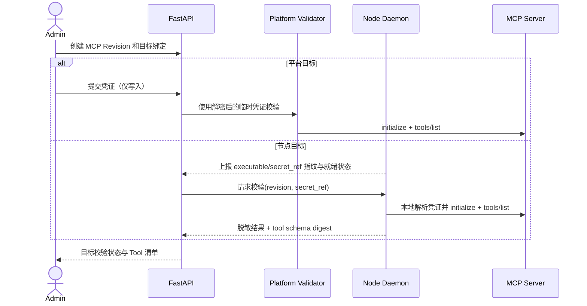

# 空间级 MCP Server 管理

## 1. 目标声明

### 背景
v0.4 的 `mcp` 内容包只是一组待分发文件，平台不知道 MCP Server 的传输方式、配置修订、凭证、可用目标和 Tool 清单，也无法在 Agent 发布前验证 MCP 能力是否真实可用。

### 目标
- Admin 可按 namespace 管理 MCP Server 身份及不可变配置修订。
- v0.5 支持 Claude Harness 可消费的 `stdio`、`streamable_http` 和兼容期 `sse` transport，并显式记录 transport schema。
- 平台目标的 MCP 凭证由控制面加密保存；节点目标只引用节点本地 secret，不经浏览器、制品或任务快照下发明文。
- 每个目标可独立执行连接、initialize 与 tools/list 校验，保存脱敏结果和 Tool Schema 快照。
- 每个目标由正式 MCP Runtime Manager 管理连接/进程、并发、超时、重连、日志和 Tool Schema 变化，不由任务临时拼装进程命令。
- Agent 或 Plugin 只能引用已验证的精确 MCP Revision；激活时还要针对具体运行目标重新检查就绪状态。

### 不在范围内
- 从 npm、pip、GitHub 或互联网自动安装 MCP Server。
- 上传或远程执行任意 MCP 二进制、Shell、安装脚本和生命周期钩子。
- 通过普通 ZIP、WSS 命令或任务 prompt 向节点下发 secret value。
- OAuth 浏览器授权流程、动态客户端注册及云端 MCP 市场。
- MCP Sampling、Roots、Prompts 等非 Tool 能力；v0.5 只接入经过验证的 Tool 能力。
- 未经网络策略允许访问内网、metadata endpoint 或任意本机地址。

## 2. 模块影响

| 模块 | 影响类型 | 说明 |
|------|---------|------|
| agent_management | 新增 | 拥有 MCP Server、Revision、Target Binding、Secret 引用和 Tool 快照 |
| runtime_management | 修改 | 上报 MCP 可执行清单、节点本地 secret 就绪摘要，并拥有 MCP Runtime Manager 与执行事件 |
| namespaces | 只读依赖 | 提供 namespace、Admin 权限和跨空间隔离 |

## 3. 功能描述

### 3.1 MCP 身份与配置 Revision

1. Admin 创建 MCP Server 身份，slug 在 namespace 内唯一且创建后不可修改。
2. 每次配置变化创建新 revision；已创建 revision 不可修改。Revision 包含 transport、endpoint 或 executable key、结构化 args、非敏感 env、超时和协议版本要求。
3. `stdio` 不接受自由命令字符串。`executable_key` 必须来自平台或节点预先上报且经管理员部署配置允许的可执行清单；args 按该 executable 的 adapter schema 校验，禁止 Shell 解释。
4. HTTP/SSE endpoint 必须为规范 HTTPS URL；仅开发环境可由显式配置允许 HTTP。保存和校验时都执行目标地址策略、DNS/IP 检查和重定向限制。
5. Revision 可标记 deprecated，但被 Plugin Version 或 Agent Release 引用时不能删除。

### 3.2 目标绑定与凭证

1. MCP Revision 必须绑定到一个或多个具体 runtime target：平台运行时或节点运行时。
2. 平台目标的 secret 通过只写字段提交，使用独立 purpose/version AAD 的 AES-GCM 密文保存；接口只返回 `****` 和更新时间。
3. 节点目标只保存 `secret_ref` 名称。Admin 必须在节点本机通过受控 NeoMua CLI 写入系统 credential store；节点只上报引用是否存在、版本指纹和最近检查时间，不上传 secret。
4. secret_ref 不存在、指纹变化或凭证轮换后，目标状态变为 `stale`，必须重新校验。
5. 删除或轮换 secret 不改变历史 Release；但未开始的新任务不能使用 stale target，已冻结并开始的任务按其运行时句柄完成或明确失败。

### 3.3 连接校验与 Tool 发现

1. 校验必须依次完成 transport 建连、MCP initialize、协议版本协商和 tools/list；任一步失败均记录稳定错误码。
2. Tool 快照保存限定名、说明、input schema、原始名称和 schema digest；远端返回内容先限制大小并脱敏。
3. 同一 revision/target 重复校验生成新的 attempt 记录；只有最近一次成功且配置/secret/目标能力指纹未变化时状态为 `verified`。
4. Tool Schema digest 变化时目标自动 stale。依赖旧 schema 的 Agent Release 不自动升级，新激活必须重新解析并明确接受新 revision。
5. 校验进程使用受限网络、CPU、内存、超时和输出大小；不能读取控制面进程的无关环境变量。
6. MCP `notifications/tools/list_changed` 不热替换运行中 Session 的 Tool Schema；Runtime 保存新 digest、把 target 标记 stale，并要求新 Revision/重新校验后才能用于后续激活。

### 3.4 Agent 与 Plugin 引用

1. Agent 草稿或 Plugin Draft 只能引用精确 MCP Revision，不接受 latest。
2. 引用同时声明 Tool allowlist；空 allowlist 表示不向 Agent 暴露任何 MCP Tool，不表示全部允许。
3. 发布时冻结 MCP config、Tool Schema digest 和 secret handle；manifest 和任务快照不包含 secret value。
4. 激活到多个目标时逐目标校验。某节点未准备 secret 或 executable 时仅该目标失败，系统不得把平台凭证改发给节点。

### 3.5 MCP Runtime Manager

1. 运行实例以 `(runtime_profile_id, mcp_revision_id, secret_fingerprint, capability_fingerprint)` 为稳定键。平台和节点各自在目标本地管理实例，控制面不直接持有 stdio 子进程。
2. `stdio` MCP 默认按 Runtime + Revision 复用受限子进程；HTTP/SSE 按相同键复用连接/session。不同 namespace、Revision 或 secret fingerprint 不复用。
3. Manager 在激活时预热实例，在最后一个引用它的 active Agent/session 结束且超过 idle grace 后关闭；不得为每个 Tool Call 重新执行安装或启动命令字符串。
4. 每个 Server 配置 connect timeout、call timeout、最大并发、最大结果字节和 idle grace，均受平台上限约束。超限返回结构化 Tool error，不截断成貌似成功的结果。
5. 连接或进程异常允许对相同 Revision、相同 executable/endpoint 和相同 secret 做有界指数退避重连；重连不是配置 fallback，不能切换 server、Revision、transport 或凭证。
6. 超过重启预算后实例进入 `failed`，影响中的任务收到明确错误，target 标记 degraded；后续新任务不使用该实例，Admin 可在修复后显式 restart/revalidate。
7. stdio stderr、transport 错误、restart、Tool 调用耗时和结果大小形成脱敏运行事件。日志设置总量和单条上限，不进入 Agent prompt。
8. Runtime/Node 重启后根据 active Agent Release 重建所需实例并校验 Tool digest；无法重建时保持 Agent degraded，不删除 MCP 能力后继续。
9. Session 创建时固定 MCP Tool digest。连接重建可继续相同 digest 的服务；收到不同 digest 时当前 Session 不热更新，新 Tool 不可见。

### 边界与异常

- endpoint 解析为 loopback、link-local、私网或云 metadata 地址且不在显式 allowlist：返回 422。
- HTTP 重定向到不同安全域或不允许的地址：停止校验，不跟随。
- stdio executable 未在目标 inventory：目标状态 `unsupported`，不尝试按名称执行。
- 节点离线：校验请求为 `pending` 并有有效期；过期标记 `expired`，上线后不自动执行旧请求。
- MCP 响应超限或包含疑似 secret：截断并脱敏，原始内容不落库。
- MCP Tool 调用超过结果上限：返回明确 `mcp_result_too_large` 错误，不能把截断内容标记为成功结果。
- MCP Runtime 重连后 Tool digest 不同：实例转 stale/degraded，当前 Session 不加载新 Tool Schema。
- 配置属于其他 namespace：统一返回 404，避免跨空间探测。

## 4. 数据变更

新增表：

| 表名 | 用途说明 |
|------|---------|
| `mcp_server` | MCP 稳定身份、namespace、slug、说明和归档状态 |
| `mcp_server_revision` | 不可变 transport 配置、协议约束和内容摘要 |
| `mcp_target_binding` | Revision 到平台/节点 runtime 的绑定、secret_ref 和当前就绪状态 |
| `mcp_platform_secret` | 仅平台目标使用的加密 MCP 凭证和掩码 |
| `mcp_validation_attempt` | 每次目标校验的状态、指纹、错误码和耗时 |
| `mcp_tool_snapshot` | 成功校验产生的 Tool 名称、schema、digest 和限定名 |
| `agent_draft_mcp` | Agent 草稿对精确 MCP Revision 及 Tool allowlist 的直接绑定 |
| `mcp_runtime_instance` | 目标上 MCP Revision 的实例 generation、状态、引用数、心跳与重启预算摘要 |
| `mcp_runtime_event` | 实例启动、停止、重连、失败、schema 变化和脱敏调用统计 |

关键字段与约束：

| 表名 | 字段名 | 类型 | 业务含义 |
|------|--------|------|---------|
| `mcp_server_revision` | `revision` | integer | MCP 身份内单调修订号 |
| `mcp_server_revision` | `transport` | enum | `stdio / streamable_http / sse` |
| `mcp_server_revision` | `config` | json | schema 校验后的非敏感结构化配置 |
| `mcp_server_revision` | `config_sha256` | char(64) | canonical config 摘要 |
| `mcp_target_binding` | `runtime_profile_id` | uuid | 平台或节点 runtime；必须同 namespace |
| `mcp_target_binding` | `secret_ref` | varchar(255) nullable | 节点本地 secret 名称，不是 secret value |
| `mcp_target_binding` | `capability_fingerprint` | varchar(255) nullable | executable/CLI/SDK 能力指纹 |
| `mcp_target_binding` | `status` | enum | `unverified / pending / verified / stale / failed / unsupported / expired` |
| `mcp_platform_secret` | `secret_ciphertext` | text | 独立 AAD 加密载荷 |
| `mcp_tool_snapshot` | `qualified_name` | varchar(512) | `mcp:{server_slug}:{tool_name}` |
| `mcp_tool_snapshot` | `input_schema` | json | 限制大小后的 Tool 输入 schema |
| `mcp_runtime_instance` | `instance_key` | char(64) | runtime/revision/secret/capability 指纹的规范摘要 |
| `mcp_runtime_instance` | `generation` | integer | 每次本地实例重建递增，防止旧事件覆盖新状态 |
| `mcp_runtime_instance` | `status` | enum | `starting / ready / reconnecting / stale / failed / stopping / stopped` |

唯一约束：`mcp_server(namespace_id, slug)`、`mcp_server_revision(server_id, revision)`、`mcp_target_binding(revision_id, runtime_profile_id)`、`mcp_platform_secret(target_binding_id)`。校验 attempt 与 Tool snapshot 保留完整历史，不覆盖旧记录。

## 5. API 设计

| Method | Path | 权限 | 用途 |
|--------|------|------|------|
| GET/POST | `/mcp-servers` | Developer 读 / Admin 写 | MCP 列表和创建 |
| GET/PATCH/DELETE | `/mcp-servers/{id}` | Developer 读 / Admin 写 | 身份详情、归档和未引用删除 |
| GET/POST | `/mcp-servers/{id}/revisions` | Developer 读 / Admin 写 | Revision 列表和创建 |
| GET | `/mcp-servers/{id}/revisions/{revision}` | Admin/Developer | Revision、目标状态和 Tool 摘要 |
| POST | `/mcp-revisions/{id}/targets` | Admin | 创建平台或节点目标绑定 |
| PUT | `/mcp-targets/{id}/secret` | Admin | 仅平台目标写入/轮换凭证 |
| POST | `/mcp-targets/{id}/validate` | Admin | 创建有时效的目标校验 attempt |
| GET | `/mcp-targets/{id}/validations` | Admin/Developer | 校验历史和 Tool Schema |
| GET | `/mcp-targets/{id}/runtime` | Admin/Developer | 读取目标实例状态、generation 和脱敏事件 |
| POST | `/mcp-targets/{id}/runtime/restart` | Admin | 修复后显式重启并重新校验相同 Revision |
| PUT | `/agents/{agent_id}/draft/mcp` | Admin | 按 expected revision 替换 MCP 绑定 |
| POST | `/node/mcp-validations/{attempt_id}/result` | 节点凭证 | 回传脱敏校验结果与 Tool digest |

节点本地 secret 通过节点上的 NeoMua CLI 管理，不提供浏览器远程写入接口。节点状态上报只包含 `secret_ref`、存在性和不可逆指纹。

## 6. UI 页面

| 变更类型 | 页面名 | 路由 | 说明 |
|------|------|------|------|
| 新增 | MCP 管理 | `/system/mcp-servers` | Server、Revision 和状态列表 |
| 新增 | MCP 详情 | `/system/mcp-servers/:mcpServerId` | 配置修订、目标绑定、校验和 Tool 快照 |
| 修改 | Agent 编辑器能力页签 | `/system/agents/:agentId` | 选择 MCP Revision 和允许的 Tool |
| 修改 | 节点详情 | `/system/runtimes/nodes/:nodeId` | 展示 MCP executable 与本地 secret readiness，不显示 secret |

### MCP 管理/详情

- 布局：Server 概览、Revision 时间线、目标矩阵、Tool 清单、校验历史。
- 目标详情增加 Runtime 状态、generation、引用 Agent/Session 数、重连预算和脱敏事件。
- 交互：创建新 revision 时从旧 revision 复制非敏感配置；凭证字段始终空白，留空代表不更新。
- 字段：transport 必选；HTTP endpoint 必须 URL；stdio 只能从 inventory 选择 executable key；args 根据 schema 动态渲染。
- 校验：平台目标立即返回 attempt；节点离线显示等待和过期时间，不显示“已成功发送”。

### Agent MCP 绑定

- 只显示已验证 revision；可展开选择 Tool allowlist。
- secret stale、Tool digest 变化或目标不兼容时展示阻断原因，不提供忽略按钮。

“MCP Servers”作为 Agent 管理二级导航项，Admin/Developer 可见，Developer 所有 mutation 控件隐藏且接口仍拒绝。

## 7. 验收标准

- [x] MCP 配置变化只能创建新 revision，已被引用 revision 不可修改或删除。
- [x] stdio 只能选择目标 inventory 中的 executable key，不能提交 Shell 字符串或安装命令。
- [x] HTTP/SSE 校验执行地址与重定向安全策略，未获准的私网、loopback、link-local 和 metadata 地址被拒绝。
- [x] 平台 MCP secret 加密落库且 API 只返回掩码；节点 secret 不上传、不入制品、不入任务快照。
- [x] 节点缺少 secret_ref 或 executable 时只标记目标不兼容，不转发平台凭证、不静默跳过 MCP。
- [x] Tool Schema 变化会使目标 stale，并阻断基于旧校验的新激活。
- [x] tools/list_changed 不会热替换运行中 Session；新 digest 被记录并使 target stale。
- [x] stdio/HTTP MCP 按 Runtime + Revision + 指纹复用，跨 namespace、Revision 或 secret 不共享实例。
- [x] 相同配置的有界重连不会切换 Server/Revision/transport/secret；超出预算后目标明确 degraded。
- [x] Tool 调用超时、并发和结果大小受平台上限控制，结果超限不会伪装成成功。
- [x] 离线节点的校验请求过期后不会在重连时自动执行。
- [x] Developer 可读取脱敏配置与校验结果，但不能创建 Revision、写入凭证或发起校验。
