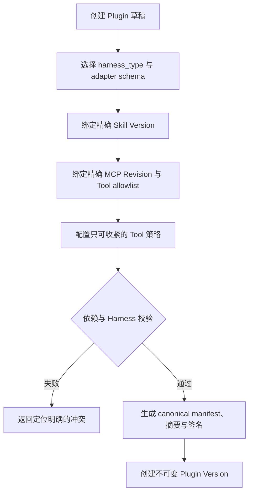

# 空间级 NeoMua Plugin 管理

## 1. 目标声明

### 背景
Skill、MCP 和 Tool 策略可以分别管理后，仍需要一种可复用的组合单位，让多个 Agent 以一致版本引入一组能力。具体 Harness 的插件格式并不统一，因此不能把 Claude 或未来 Codex 的目录结构直接当作 NeoMua 的业务模型。

### 目标
- 定义 NeoMua 通用 Plugin：以稳定身份、可编辑草稿和不可变版本组合 Skill、MCP Revision、Tool 策略及 Harness adapter 配置。
- Plugin manifest 使用明确的 `provides` contribution 列表；v0.5 仅支持声明式能力组合，不宣称具备进程内扩展能力。
- 每个 Plugin 显式声明 `harness_type` 和 adapter schema；v0.5 仅 `claude_code` 版本可发布并激活。
- Plugin Version 使用精确依赖和服务器生成的 canonical manifest，内容摘要与签名可复核。
- Agent 草稿可绑定精确 Plugin Version；直接能力与 Plugin 能力发生冲突时必须明确解决。
- Plugin 不具备执行安装脚本、Shell 或任意生命周期钩子的能力。

### 不在范围内
- Plugin 市场、跨 namespace 共享、互联网搜索、自动下载和自动更新。
- Plugin 嵌套依赖其他 Plugin；v0.5 只允许组合原子 Skill/MCP/Tool 能力。
- 上传或运行二进制、安装钩子、post-install 和任意命令。
- 把 Codex Plugin、Claude Plugin 目录未经适配直接标记为兼容。
- Codex Harness 的真实发布和执行。
- 进程内 Tool handler、pre/post Tool 或 LLM Hook、消息任意注入、Model/Memory Provider、CLI/slash command 扩展。

## 2. 模块影响

| 模块 | 影响类型 | 说明 |
|------|---------|------|
| agent_management | 新增 | 拥有 NeoMua Plugin、Draft、Version、组件和 Agent 绑定 |
| runtime_management | 只读依赖 | 提供 Harness adapter 与目标版本能力，用于兼容性预检 |
| namespaces | 只读依赖 | 提供 namespace 隔离和角色权限 |

## 3. 功能描述

### 3.1 Plugin 身份与草稿

1. Admin 创建 Plugin 身份，填写 namespace 内唯一 slug、名称和说明；slug 创建后不可修改。
2. Plugin Draft 使用 expected revision 并发控制，修改组件或 adapter 配置都会推进 revision。
3. 草稿必须选择 `harness_type`。v0.5 catalog 仅提供 `claude_code` adapter；未知类型可作为未来迁移数据保留，但不能通过验证或创建版本。
4. Harness adapter 配置只能使用 adapter schema 声明的非敏感、声明式字段；不接受任意文件路径、Shell、secret value 或 executable。
5. UI 对外使用“Plugin（能力包）”说明，避免把 v0.5 Plugin 表述成可执行代码插件。

### 3.2 组件组合与冲突解析

1. Plugin Draft 可绑定多个精确 Skill Version、多个精确 MCP Revision及各自 Tool allowlist，并添加只可收紧的内置 Tool 策略。
2. 同一 Skill 出现多个版本、同一 MCP Server 出现多个 Revision、同一 Tool 同时 allow/deny 时，服务端返回带来源链的冲突。
3. deny 和平台安全基线优先于 allow，但系统仍将冲突展示给用户；不能仅靠优先级静默吞掉矛盾配置。
4. Plugin 不嵌套 Plugin，避免 v0.5 引入递归解析、循环依赖和间接更新歧义。
5. deprecated 依赖可供历史版本继续读取，但新 Plugin Version 默认阻断；如未来需要例外必须另行设计，v0.5 不提供跳过。

v0.5 `provides` 只允许以下 contribution：

| contribution | 内容 | 约束 |
|------|------|------|
| `skill` | 精确 Skill Version | 必须同 namespace 且通过声明式内容扫描 |
| `mcp_server` | 精确 MCP Revision + Tool allowlist | secret 不属于 Plugin manifest |
| `tool_policy` | 内置/MCP Tool 的 allow/deny/approval 意图 | 只能在平台/namespace 基线上进一步收紧 |
| `harness_config_fragment` | Claude adapter schema 允许的声明式片段 | 不能含 env value、命令、路径或 executable |

未列出的 contribution 返回 unsupported，不能以自由 JSON 保存后交给 Runtime 猜测。

### 3.3 Plugin Version

1. Admin 对通过校验的指定 draft revision 创建 SemVer 版本。
2. 服务端生成 canonical manifest，其中包含 Plugin 身份、版本、harness type/schema、显式 `provides`、精确依赖、Tool 策略、组件摘要和创建时间。
3. manifest 使用平台制品签名密钥签名；签名、public key、manifest digest 和 dependency lock 一并保存。
4. Plugin Version 创建后不可修改。相同版本不同 manifest 返回 409；相同 manifest 重复请求通过 Idempotency-Key 返回同一版本。
5. Version 可 deprecated，但被 Agent Release 引用时不能删除。

### 3.4 Agent 绑定

1. Agent 草稿绑定精确 Plugin Version，不接受 latest 或版本范围。
2. Agent 的 harness_type 必须与 Plugin Version 一致。
3. Agent 直接绑定能力与 Plugin 间做统一依赖图解析；任何版本或策略冲突阻断 Agent 验证。
4. Plugin 后续发布新版本不改变 Agent 草稿或已发布 Agent；升级必须由 Admin 显式选择新版本并重新验证。
5. Plugin contribution 由统一 Resolver 展开到 `ResolvedAgentSpec`；Plugin 本身不在 Runtime 中加载代码或注册回调。

### 边界与异常

- 组件来自其他 namespace：返回 404。
- draft revision 冲突：返回 409，不自动合并组件集合。
- adapter schema 不支持字段或 harness type 不匹配：返回 422 和 JSON path。
- contribution type 不在 v0.5 allowlist：返回 422，不把未知内容透传到 Release。
- 依赖在校验到创建版本之间被 deprecated/archived：事务内重验并拒绝创建。
- 签名服务不可用：创建失败且不保存无签名 Plugin Version。

## 4. 数据变更

新增表：

| 表名 | 用途说明 |
|------|---------|
| `neomua_plugin` | Plugin 稳定身份、namespace、slug 和归档状态 |
| `plugin_draft` | 当前可编辑草稿、harness type、adapter schema/config 和 revision |
| `plugin_draft_component` | 草稿中的声明式 contribution 类型、Skill/MCP/Tool 精确引用及 adapter 片段 |
| `plugin_version` | 不可变 SemVer、canonical manifest、dependency lock、摘要和签名 |
| `plugin_version_component` | Version 展开的精确组件，便于引用完整性与查询 |
| `agent_draft_plugin` | Agent 草稿绑定的精确 Plugin Version |

关键约束：

- `neomua_plugin(namespace_id, slug)` 唯一。
- 每个 Plugin 恰好一个 `plugin_draft`；`plugin_draft.revision` 单调递增。
- `plugin_version(plugin_id, version)` 唯一。
- `plugin_draft_component` 使用 component type + component identity 唯一约束，防止同源重复绑定。
- `agent_draft_plugin(agent_draft_id, plugin_id)` 唯一，确保单个 Agent 不同时直接绑定同一 Plugin 的两个版本。
- 所有 version component 外键使用 RESTRICT；历史版本不因组件归档而丢失。

`plugin_version.manifest` 和 `dependency_lock` 为可查询 JSON，但版本、harness type、`provides`、digest、signature、signing_public_key 使用独立字段。`provides` 同时以受限枚举字段保存，不能只依赖 JSON 自由值。

## 5. API 设计

| Method | Path | 权限 | 用途 |
|--------|------|------|------|
| GET/POST | `/plugins` | Developer 读 / Admin 写 | Plugin 列表和创建 |
| GET/PATCH/DELETE | `/plugins/{plugin_id}` | Developer 读 / Admin 写 | 身份详情、归档和未引用删除 |
| GET/PUT | `/plugins/{plugin_id}/draft` | Developer 读 / Admin 写 | 按 expected revision 读取/保存草稿 |
| POST | `/plugins/{plugin_id}/draft/validate` | Admin | 返回依赖图与冲突定位 |
| GET/POST | `/plugins/{plugin_id}/versions` | Developer 读 / Admin 写 | 版本列表和创建不可变版本 |
| GET | `/plugins/{plugin_id}/versions/{version}` | Admin/Developer | manifest、签名和展开组件 |
| POST | `/plugins/{plugin_id}/versions/{version}/deprecate` | Admin | 废弃版本 |
| PUT | `/agents/{agent_id}/draft/plugins` | Admin | 按 expected revision 替换 Agent Plugin 绑定 |

创建 Plugin Version 必须携带 `Idempotency-Key` 和 `draft_revision`；服务端在同一事务内重验依赖状态。

## 6. UI 页面

| 变更类型 | 页面名 | 路由 | 说明 |
|------|------|------|------|
| 新增 | Plugin 管理 | `/system/plugins` | Plugin 列表、草稿状态和版本 |
| 新增 | Plugin 编辑器 | `/system/plugins/:pluginId` | 组件编排、冲突检查和版本发布 |
| 修改 | Agent 编辑器能力页签 | `/system/agents/:agentId` | 选择精确 Plugin Version 并查看展开依赖 |
| 修改 | Agent 管理二级导航 | `/system/*` | 增加 Plugins 入口 |

### Plugin 管理/编辑器

- 布局：基本信息、Harness、Provides、Skills、MCP、Tools、依赖预览、Versions 八个区域。
- 功能：维护草稿、验证、查看依赖来源链、创建不可变版本和 deprecated。
- 交互：冲突同时显示两个来源和精确版本；创建版本前二次展示 lock，不提供“自动选最新”按钮。
- 字段：版本必须 SemVer；Harness v0.5 只能选择 Claude Code；adapter 字段由 catalog schema 渲染。

### Agent Plugin 绑定

- 版本选择器展示 harness type、dependency digest、deprecated 状态和组件数量。
- 展开视图区分 Agent 直接能力与各 Plugin 引入能力；冲突不自动解决。

## 7. 验收标准

- [x] NeoMua Plugin 使用通用 manifest 和显式 harness_type，不把特定 Harness 目录格式当成平台模型。
- [x] v0.5 只有 Claude Code adapter 可创建可发布版本，其他类型返回明确 unsupported。
- [x] Plugin 不能包含 Shell、安装钩子、二进制或任意 executable 配置。
- [x] v0.5 Plugin 只接受 skill、mcp_server、tool_policy、harness_config_fragment 四类声明式 contribution；未知类型被拒绝。
- [x] Plugin 不加载进程内代码，不注册 Tool handler、生命周期 Hook、消息注入、Model/Memory Provider 或 CLI 命令。
- [x] Plugin Version 只引用精确 Skill/MCP 版本，创建后不可修改且可验证签名。
- [x] 同一能力的版本或 Tool 策略冲突返回完整来源链，不使用最后写入覆盖。
- [x] Plugin 新版本不会自动更新 Agent 草稿或历史 Agent Release。
- [x] 跨 namespace 组件不可引用，已发布引用的 Plugin Version 不可删除。
- [x] 并发保存和重复发布分别受 expected revision 与 Idempotency-Key 保护。
