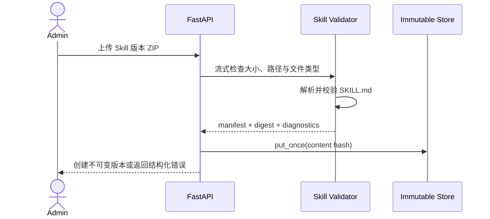

# 空间级 Skill 与 Tool 管理

## 1. 目标声明

### 背景
v0.4 只能上传标记为 Skill 的 ZIP，无法识别单个 Skill、检查 `SKILL.md`、管理版本或确认某个 Agent 实际使用了哪些能力。工具权限目前只是运行时 JSON 数组，没有目录、风险基线和来源信息。

### 目标
- Admin 可在 namespace 内维护 Skill 身份和不可变版本，上传后完成格式、路径、大小和内容校验。
- Skill manifest 明确描述平台、配置、所需 Tool/MCP、调用方式和支持资源；v0.5 只允许声明式文档/资源。
- Agent 草稿可绑定精确 Skill 版本，发布后不受后续新版本影响。
- 平台提供 Claude Harness 内置 Tool 目录，并区分内置 Tool 与 MCP 发现 Tool。
- Admin 可禁用 Tool 或提高审批要求，但不能降低平台安全基线。
- Tool 授权最终解析为 SDK 可识别的 `tools / allowed_tools / disallowed_tools`，不存在“最后写入覆盖前值”。

### 不在范围内
- 上传任意可执行 Tool、脚本、二进制或安装钩子。
- 在 Skill 支持文件中携带或通过说明引用 Shell、Python、Node 等可执行脚本；未来开放需独立代码供应链与沙箱设计。
- 在线 Skill 市场、跨 namespace 共享或自动从互联网安装。
- 自动把最新 Skill 版本注入已发布 Agent。
- 在本子需求中管理 MCP Server；MCP Tool 只显示来源，生命周期见 MCP PRD。

## 2. 模块影响

| 模块 | 影响类型 | 说明 |
|------|---------|------|
| agent_management | 新增 | 拥有 Skill、Skill Version、Tool 目录/策略和 Agent 草稿绑定 |
| runtime_management | 只读依赖 | 提供 Claude SDK/CLI 实际支持的内置 Tool 能力摘要 |
| namespaces | 只读依赖 | 提供空间隔离和角色权限 |

## 3. 功能描述

### 3.1 Skill 身份与版本

1. Admin 先创建 Skill 身份，slug 在 namespace 内唯一且创建后不可修改。
2. 新版本通过 ZIP 上传；归档必须包含且仅能以约定位置提供一个入口 `SKILL.md`。
3. `SKILL.md` frontmatter 至少包含 `name`、`description`、`version`、`platforms`、`invocation_mode`、`required_tools`、`required_mcp_tools`、`config_schema`、`content_types` 和来源信息；其中 name/version 必须与 API 请求和 Skill 身份一致。
4. v0.5 的 `invocation_mode` 只允许 `discoverable` 和 `explicit_user_message`。Skill 不直接修改 Agent system prompt；显式调用必须形成持久化 user message。
5. 沿用 v0.4 的流式大小限制、路径穿越、绝对路径、反斜杠和符号链接拒绝规则，并增加 Skill frontmatter/schema 校验。
6. 归档文件只允许 UTF-8 Markdown、纯文本、JSON/YAML schema 和批准的静态资源类型；拒绝脚本扩展名、可执行位、二进制、宏文档、动态链接库，以及指示 Adapter 运行支持文件的 manifest 字段。
7. 版本号必须是规范 SemVer。`(skill_id, version)` 唯一；同一版本内容不同返回 409，同一内容重复上传返回已有版本而不复制存储。
8. 版本一旦创建不可修改；修正内容必须发布新版本。被 Agent Release 引用的版本只能标记 deprecated，不能删除。
9. Skill 校验结果保存结构化诊断及内容摘要，不保存扫描器临时文件或未经处理的异常堆栈。

### 3.2 Tool 目录与安全策略

1. 内置 Tool 定义来自受版本控制的 Claude Harness adapter 目录，并与目标 runtime 上报的实际 Tool 能力比对。
2. Tool 定义包含稳定 key、展示名、说明、来源、平台风险等级和是否支持审批。
3. Namespace Admin 可设置 `disabled / inherit / require_approval`。Admin 只能禁用或收紧，不能把平台 `forbidden` 改为允许，也不能降低风险等级。
4. Agent 草稿对每个 Tool 保存显式意图：`allow / deny / inherit`；解析时 deny 优先，平台禁用和风险基线优先于 Agent allow。
5. MCP 发现 Tool 使用 `mcp:{server_slug}:{tool_name}` 稳定限定名展示，不与内置 Tool 同名合并。
6. Tool Catalog 统一输出 stable key、来源、schema digest、风险基线和 target availability；实际合并由 `ResolvedAgentSpec` Resolver 完成，Catalog 不实现 Claude SDK Tool handler。
7. v0.5 不在 Session 中动态修改 Tool definitions。Runtime capability 或 MCP Tool Schema 变化只将目标标记 stale，影响后续激活。

### 3.3 Agent 能力绑定

1. Admin 在 Agent 草稿中选择精确 Skill Version；v0.5 不接受 `latest`、范围版本或浮动分支。
2. 相同 Skill 不能直接和通过 Plugin 以不同版本重复引入；校验返回依赖冲突，并要求用户显式选择。
3. Skill 声明的所需 Tool 与 Agent Tool 策略共同校验。所需 Tool 被平台禁止时阻断发布，不自动移除相关 Skill。
4. 草稿绑定变化必须递增 Agent draft revision，并使既有验证失效。
5. required Tool/MCP/config 使用 Skill manifest 声明；Resolver 必须展示从 Skill 到缺失能力的完整来源链。

### 边界与异常

- ZIP 缺少或包含多个入口、frontmatter 无效、编码异常：返回 422 和文件定位。
- ZIP 包含脚本、二进制、可执行位、宏文档或不允许的 content type：返回 422，不提供忽略扫描继续上传。
- Skill 声明未知 Tool：标记 error；不把未知名称传给 SDK。
- 目标 CLI/SDK 未上报某个内置 Tool：该目标不兼容，其他目标不受影响。
- Skill 已被发布引用：删除返回 409，可 deprecated。
- 存储容量不足：返回 507，数据库不创建半成品版本。

## 4. 数据变更

新增表：

| 表名 | 用途说明 |
|------|---------|
| `skill_definition` | Skill 稳定身份、namespace、slug、说明和归档状态 |
| `skill_version` | 不可变 Skill 版本、内容摘要、存储键、manifest 和校验结果 |
| `tool_definition` | Harness adapter 提供的内置 Tool 目录和平台安全基线 |
| `namespace_tool_policy` | namespace 对 Tool 的禁用或加严策略 |
| `agent_draft_skill` | Agent 草稿绑定的精确 Skill Version |
| `agent_draft_tool_policy` | Agent 草稿的 Tool allow/deny/inherit 意图 |

关键约束：

- `skill_definition(namespace_id, slug)` 唯一。
- `skill_version(skill_id, version)` 唯一，内容和 manifest 创建后不可修改。
- `tool_definition(harness_type, tool_key, adapter_schema_version)` 唯一。
- `namespace_tool_policy(namespace_id, tool_definition_id)` 唯一。
- `agent_draft_skill(agent_draft_id, skill_id)` 唯一，确保同一草稿不直接绑定两个版本。
- Agent 草稿绑定表写入或删除时，必须在同一事务内推进 `agent_draft.revision`。

`skill_version` 至少保存 `version`、`content_sha256`、`storage_key`、`size`、`manifest`、`invocation_mode`、`platforms`、`required_capabilities`、`content_types`、`validation_result`、`created_by/created_at`。明文文件继续保存在不可变对象存储，不复制进 PostgreSQL。

## 5. API 设计

| Method | Path | 权限 | 用途 |
|--------|------|------|------|
| GET/POST | `/skills` | Developer 读 / Admin 写 | Skill 列表和创建 |
| GET/PATCH/DELETE | `/skills/{skill_id}` | Developer 读 / Admin 写 | 身份详情、归档和未引用删除 |
| POST/GET | `/skills/{skill_id}/versions` | Developer 读 / Admin 写 | 上传和读取版本列表 |
| GET | `/skills/{skill_id}/versions/{version}` | Admin/Developer | manifest、摘要和诊断 |
| POST | `/skills/{skill_id}/versions/{version}/deprecate` | Admin | 废弃但保留版本 |
| GET | `/tools/catalog` | Admin/Developer | 合并内置与 MCP 来源 Tool 视图 |
| PUT | `/tools/{tool_key}/namespace-policy` | Admin | 保存仅可加严的 namespace 策略 |
| PUT | `/agents/{agent_id}/draft/skills` | Admin | 按 expected revision 替换精确 Skill 绑定 |
| PUT | `/agents/{agent_id}/draft/tools` | Admin | 按 expected revision 替换 Tool 策略 |

Skill 上传继续使用 multipart；服务端流式处理，不在内存中读取完整 ZIP。

## 6. UI 页面

| 变更类型 | 页面名 | 路由 | 说明 |
|------|------|------|------|
| 新增 | Skill 管理 | `/system/skills` | Skill 列表、版本上传、校验和废弃 |
| 新增 | Tool 策略 | `/system/tools` | Tool 来源、风险、目标可用性和空间策略 |
| 修改 | Agent 编辑器能力页签 | `/system/agents/:agentId` | 绑定 Skill 版本与配置 Tool 策略 |
| 修改 | Agent 管理二级导航 | `/system/*` | 增加 Skills 与 Tools 入口 |

### Skill 管理页

- 布局：Skill 列表；详情抽屉展示版本时间线、manifest、引用数和诊断。
- 交互：上传前显示格式要求；上传失败保留本地选择但不创建版本；废弃需二次确认。
- 字段：slug 创建后只读；版本必须 SemVer；ZIP 必填。

### Tool 策略页

- 布局：按 Built-in/MCP 来源筛选的表格，展示平台风险、namespace 策略和目标兼容性。
- 交互：只能选择 inherit、disabled、require approval；平台 forbidden 行不可放宽。

### Agent 能力页签

- Skill 选择器显示精确版本、deprecated 状态和引用来源。
- Skill 详情显示平台/架构、调用方式、required capability、config schema、content type 与安全扫描结论。
- Tool 冲突实时展示，但以后端完整校验为准；不提供“忽略冲突并发布”。

## 7. 验收标准

- [x] Skill ZIP 的路径逃逸、符号链接、无效入口和超限内容均被拒绝且不留下数据库半成品。
- [x] Skill ZIP 中的脚本、二进制、宏文档、可执行位和未批准 content type 被拒绝，不能通过 Admin 忽略继续上传。
- [x] Skill Version 不可原地修改，已发布引用的版本不可删除。
- [x] Skill manifest 可还原平台约束、调用方式、required Tool/MCP/config 和内容类型，且与 API 身份/版本一致。
- [x] Agent 只能绑定精确 Skill Version，不能使用 latest 或版本范围。
- [x] Admin 不能降低 Tool 平台风险基线，也不能启用平台 forbidden Tool。
- [x] 内置 Tool 和 MCP Tool 使用不同稳定限定名，不会因同名互相覆盖。
- [x] Skill 所需 Tool 被禁止或目标不支持时，发布校验明确失败且不静默删除 Skill。
- [x] 任意能力绑定变更都会推进 Agent draft revision 并使旧验证失效。
- [x] 运行中 Session 不因 Tool Catalog、Skill 或 MCP 变化而热替换 Tool definitions。
