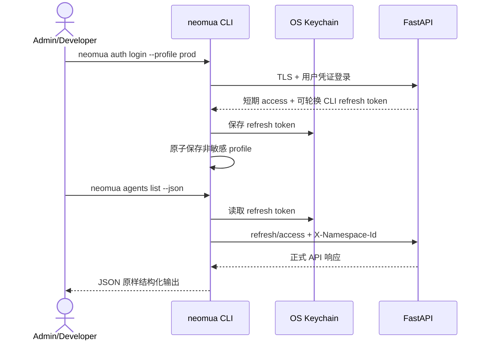

# NeoMua Operator CLI

## 1. 目标声明

### 背景
当前 v0.5 所称 CLI 主要是 Claude Code CLI 的 Harness 配置，但节点本地 secret 管理、自动化发布和开发者日常操作还需要 NeoMua 自身的正式命令行入口。若没有独立设计，CLI 容易直接操作数据库、复制前端业务逻辑或把长期凭证写入明文配置。

### 目标
- 提供 `neomua` Operator CLI，通过正式 `/api/v1` 接口管理 namespace 内 Agent、Skill、MCP、Plugin、Release、Runtime 和 Task。
- 使用本地 profile 管理平台 URL、当前 namespace、输出偏好和系统 Keychain 凭证引用；配置文件不保存 token/secret 明文。
- 提供稳定命令注册表，由同一来源生成 help、shell completion 和参数校验。
- 所有 mutation 支持 Idempotency-Key、明确确认和结构化退出码；`--json` 适用于自动化。
- 提供仅在节点本机可用的 `neomua node secret` 命令，写入受保护 credential store且绝不上传 secret value。

### 不在范围内
- 交互式 Agent Chat、TUI、Web Dashboard 终端嵌入或消息平台 Gateway。
- CLI 中重新实现服务端依赖解析、权限判断、发布或签名逻辑。
- 通过 CLI 远程安装/升级 Claude Code、SDK、MCP executable 或 NeoMua 二进制。
- 将 refresh token、MCP secret、模型密钥写入 YAML、JSON、shell history 或命令参数。
- 无人确认时自动执行删除、吊销、发布、回滚等高影响操作。

## 2. 模块影响

| 模块 | 影响类型 | 说明 |
|------|---------|------|
| operator_cli | 新增 | 拥有本地 profile、命令注册、输出/退出码和节点本地 secret 操作 |
| auth | 修改 | 提供可轮换、可吊销的非浏览器 CLI session，不复用浏览器 Cookie/CSRF |
| namespaces | 只读依赖 | 提供 CLI profile 的当前 namespace 选择与权限校验 |
| agent_management | 接口依赖 | CLI 调用正式 Agent/Skill/MCP/Plugin/Release API，不直接写其表 |
| runtime_management | 接口依赖 | CLI 调用节点、激活、任务和审批 API；节点本地命令写本机 credential store |

## 3. 功能描述



### 3.1 Profile 与认证

1. Profile 只保存名称、规范 HTTPS API URL、当前 namespace ID、默认输出格式和 Keychain item ID。
2. `auth login` 通过 TLS 提交凭证；密码只能从隐藏 TTY 提示读取，不提供 password 命令参数，也不从普通 stdin 管道读取。
3. 服务端签发 15 分钟 access token 和最长 30 天、绝对到期不顺延的轮换型 CLI refresh session；refresh token 只写 OS Keychain/credential manager。
4. refresh 每次使用后轮换；旧 token 重放时吊销整个 family。logout 同时吊销服务端 session 并删除本地 Keychain 项。
5. 无系统 Keychain 或 credential manager 时，登录明确失败并给出支持环境，不回退到明文文件。
6. Profile 文件使用 owner-only 目录与原子替换；损坏时停止并报告，不自动回退默认平台或 namespace。
7. API URL、namespace 或当前用户变化不复用旧 access token；CLI 在每次 mutation 前读取 `/users/me` 和 namespace 权限的最新结果或有效缓存。

### 3.2 命令注册表

每个命令以不可变定义登记：canonical name、aliases、category、arguments、required role、confirmation policy、supports_json、handler/API mapping 和 exit codes。同一注册表生成：

- `neomua --help` 与分类帮助。
- Bash/Zsh/Fish completion。
- 参数解析和动态资源 ID/slug 补全；动态补全失败不阻断普通命令输入。
- 文档中的命令参考。

命令冲突或 alias 重复在构建/测试阶段失败，不允许后注册覆盖前命令。

### 3.3 命令范围

v0.5 至少提供：

```text
neomua auth login|logout|status
neomua profile list|use|set-namespace|delete
neomua agents list|get|validate|release
neomua skills list|get|upload|deprecate
neomua tools list
neomua mcp list|get|validate
neomua plugins list|get|validate|publish
neomua releases get|activate|retry|rollback
neomua runtimes list|get
neomua tasks create|get|events|cancel|retry|approvals
neomua approvals approve|deny
neomua node secret set|list|remove|status
```

管理命令按服务端角色决定；CLI 隐藏按钮式体验不是权限边界，403 原样映射为明确退出码。

### 3.4 API 复用与幂等

1. CLI 只负责输入、文件流式上传、API 调用和输出；依赖解析、签名、权限、冲突和状态机只在服务端实现。
2. 所有创建、发布、激活、retry、rollback 和任务创建命令自动生成 Idempotency-Key；网络失败重试复用同一 key。
3. CLI 只对安全的 GET、token refresh 和使用相同 Idempotency-Key 的请求做有界重试；不对非幂等请求猜测重试。
4. 删除、吊销、发布、激活和回滚默认要求交互确认。非交互环境必须显式 `--yes`；缺少时退出，不自动继续。
5. `--dry-run` 仅调用服务端正式 validate/precheck 接口，不在本地模拟成功。

### 3.5 输出、错误与兼容性

1. 人类模式使用稳定摘要和资源 URL/ID；`--json` 输出单个 JSON 文档到 stdout，日志和提示只写 stderr。
2. secret、token、Authorization Header 和未脱敏 Tool 参数永不输出；debug 模式也只记录脱敏请求元数据。
3. 退出码至少区分：成功、参数错误、认证失败、权限不足、冲突、校验失败、网络/服务不可用、部分成功。
4. CLI 启动时读取服务端版本/capability endpoint。协议不兼容时明确停止，不忽略未知响应字段后继续 mutation。
5. 批量激活部分成功时退出码为 partial，JSON 返回逐目标结果，不用整体 0 掩盖失败。

### 3.6 节点本地 Secret

1. `neomua node secret set <ref>` 只能在已安装 Node Runtime 的本机执行，通过 stdin/TTY 隐藏输入或受控文件描述符读取，禁止 `--value`。
2. secret 写入 OS credential store或平台正式支持的加密本地 store，权限 owner-only；写入成功后只向控制面上报存在性和不可逆指纹。
3. `list/status` 只显示 ref、存在性、更新时间和指纹，不显示 value。
4. `remove` 二次确认；移除后节点立即把相关 MCP target 标记 stale。
5. 命令验证当前节点身份和本地 store 归属，不允许从其他机器通过 API 远程调用。

### 边界与异常

- Keychain 不可用：认证停止，不写入 profile 明文。
- Profile 损坏或 API URL 非 HTTPS：停止并提示修复，不自动选择其他 profile。
- access 过期且 refresh 失败：清除 access 缓存并要求重新登录，不继续 mutation。
- stdout 管道关闭：停止输出并返回对应错误，不把 JSON 写入 stderr。
- 上传中断：服务端不得创建半成品 Skill/Release；CLI 使用同一幂等上下文重试。
- 节点 secret 写入成功但状态上报失败：保留本地值并明确报告“本地已写入、平台未确认”，不重复生成或删除 secret。

## 4. 数据变更

新增表：

| 表名 | 用途说明 |
|------|---------|
| `cli_session` | CLI refresh token HMAC、轮换 family、过期、吊销和客户端摘要 |

关键字段：`id`、`family_id`、`user_id`、`token_hash`、`expires_at`、`replaced_by_id`、`revoked_at`、`created_at`、`last_used_at`、`client_name`。数据库不保存 refresh token 明文；用户停用、删除、密码变更或重放检测时吊销相关 session。

本地 profile 与节点 credential store 不属于 PostgreSQL 数据模型。实现需定义可版本化本地 schema 和原子迁移，但不得把本地 secret 回写 context 数据表。

## 5. API 设计

| Method | Path | 权限 | 用途 |
|--------|------|------|------|
| POST | `/cli/login` | 公开 + 用户凭证 | 签发短期 access 与一次性返回 CLI refresh token |
| POST | `/cli/refresh` | CLI refresh token | 轮换并返回新 access/refresh token |
| POST | `/cli/logout` | Bearer + CLI refresh token | 吊销当前 CLI session |
| GET | `/capabilities` | Bearer | 返回 API/CLI protocol 和可用命令能力摘要 |

其余命令复用各模块正式 API。CLI Bearer 请求不套用 Cookie CSRF，但所有 mutation 继续执行认证、namespace 和角色依赖。

## 6. 操作界面

本子需求不新增 Web 页面。用户界面为终端命令：

- help 按认证、Profile、Agent、能力、运行时和任务分类。
- 交互确认必须显示 profile、API host、namespace、资源和动作。
- completion 从本地 command registry 生成；动态候选读取失败只返回空候选和 stderr 提示。
- 人类输出可本地化，JSON 字段和错误 code 保持稳定英文标识。

## 7. 验收标准

- [x] CLI profile 不保存 access/refresh token、模型密钥或 MCP secret 明文；无 Keychain 时登录明确失败。
- [x] 用户密码只能通过隐藏 TTY 输入，不进入命令参数、普通 stdin、配置文件或 shell history。
- [x] CLI refresh token 每次使用后轮换，重放会吊销 family，logout 和用户停用立即生效。
- [x] 命令注册表可生成 help、三种 shell completion 和参数解析，冲突在测试阶段失败。
- [x] CLI 的 Agent/Skill/MCP/Plugin/Release mutation 全部调用正式 API，不直接访问数据库或对象存储。
- [x] 网络重试不会为同一发布、激活或任务创建重复实体。
- [x] 高影响操作在交互模式二次确认，非交互模式缺少 `--yes` 时不执行。
- [x] `--json` stdout 只包含单个合法 JSON，错误与日志进入 stderr，secret 永不输出。
- [x] 节点本地 secret 不能通过远程 API 写入，list/status 不显示 value，移除后相关 MCP target stale。
- [x] 服务端协议不兼容、profile 损坏或 refresh 失败时 CLI 停止，不切换平台、namespace 或降级执行。
