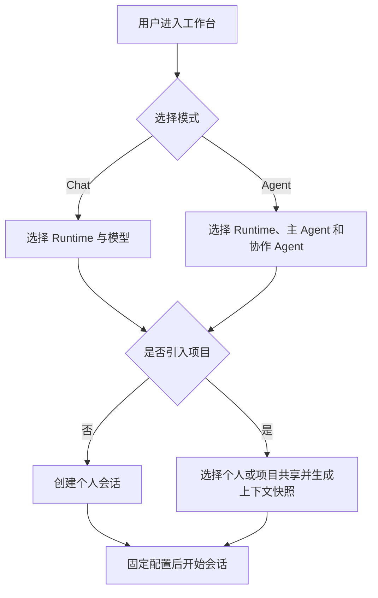
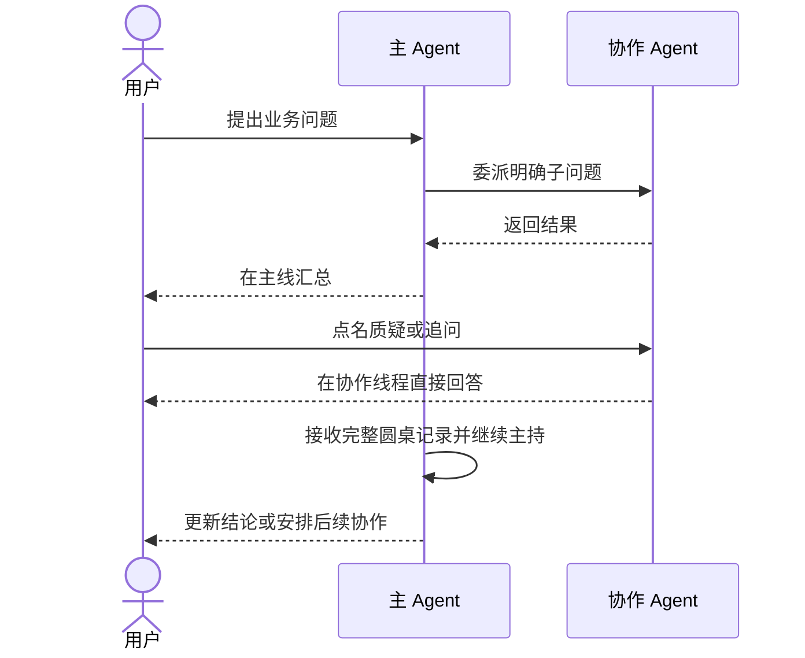

# Chat 与多 Agent 工作台

## 1. 目标声明

### 背景
现有运行时页面面向 Agent 配置测试和任务诊断，不是普通使用者完成日常工作的入口。v0.6 需要一个独立工作台，让 namespace 成员直接与模型对话、使用单个 Agent，或进入由主 Agent 主持的多 Agent 圆桌会话，并可选引入项目背景。

### 目标
- 提供统一工作台的 `Chat / Agent / Workflow` 三个入口；本文件负责 Chat 与 Agent，会话可不属于项目。
- Chat 只调用固定模型，不使用 Agent、Tool、Skill 或 MCP，但支持附件与项目上下文。
- Agent 会话固定目标 Runtime、主 Agent Release 和用户选定的协作 Agent Release 集合。
- 多 Agent 采用圆桌模型：主 Agent 主持和汇总，用户可直接点名、质疑或追问任一协作 Agent。
- 主线默认展示用户与主 Agent 的交流；协作委派和协作 Agent 对话可展开查看与排障。
- 引入项目时生成 commit 与 Spec 版本快照；刷新上下文只追加新快照，不改写历史消息。
- 未关联项目的会话默认个人可见；关联项目时可选择个人或项目共享。

### 不在范围内
- Chat 模式调用 Tool、Skill、MCP 或任意 Agent。
- 主 Agent 动态访问用户未选择的 namespace Agent。
- 在同一会话中切换模型、Runtime 或 Agent Release。
- 自动把会话摘要写入项目 Git 记忆。
- Workflow 项目任务执行；见 `collaborative-workflow-task-execution.md`。

## 2. 模块影响

| 模块 | 影响类型 | 说明 |
|------|---------|------|
| conversation_management | 新增 | 拥有会话、消息、参与 Agent、项目上下文快照和协作调用生命周期 |
| agent_management | 修改 | 提供目标 Runtime 已激活的 Agent Release 和主从协作绑定 |
| runtime_management | 修改 | 执行固定模型对话、Agent 消息和协作调用并回传事件 |
| llm_configs | 修改 | 向普通成员提供脱敏且已授权的可用模型目录 |
| project_management | 只读依赖 | 提供可选项目、仓库、Spec 位置和项目成员可见性 |

## 3. 功能描述

### 3.1 Chat 会话

1. 用户选择目标 Runtime、当前 namespace 已授权的 provider/model、可选项目和附件后创建会话。
2. 创建时冻结 provider config、model、Runtime 和项目上下文快照；后续消息不得切换模型。
3. Chat 请求通过 Model Gateway 或同等正式模型路由执行，但不给模型 Agent system prompt、Tool Schema、Skill 或 MCP 能力。
4. 更换模型需从当前会话派生新会话；派生记录来源会话，但新会话重新冻结配置。
5. 附件先完成类型、大小和恶意内容检查，再作为消息内容引用；不把本地任意路径暴露给模型。

### 3.2 单 Agent 与多 Agent 圆桌

1. 用户只能选择目标 Runtime 上 active 的 Agent Release；主 Agent 和每个协作 Agent均冻结精确 Release 与 Resolved Spec digest。
2. 主 Agent只能委派给本次会话显式选定的协作 Agent，不能扩大集合、替换 Release 或切换 Runtime。
3. 普通消息默认发给主 Agent；用户可通过点名选择器直接向某个协作 Agent 发言，也可向全体发言。
4. 主 Agent可以自动发起协作调用，并接收完整协作结果；协作失败不得伪装成主 Agent 自己的结论。
5. 主线展示用户、主 Agent 总结和关键状态。协作时间线展示委派人、目标 Agent、输入、完整消息、结果、错误、耗时及底层 Agent Task。
6. 用户直接追问协作 Agent后，消息与回答进入同一圆桌记录，主 Agent可见并负责后续协调，而不是要求用户经主 Agent 转述。
7. 任一 Agent 的 Tool 审批继续沿用 v0.5 规则；审批界面明确标识发起 Agent 和协作线程。

### 3.3 项目上下文与可见性

1. 会话可不选项目；此时不读取项目仓库和 Spec，仅使用会话消息与附件。
2. 选择项目时，用户必须是项目成员。系统记录各被引用仓库 commit、Spec 路径、标准版本和内容摘要，形成上下文快照。
3. 大型仓库不默认全部注入模型；由项目配置、用户选择和 Agent 能力确定实际文件集合，快照记录最终使用集合。
4. 用户显式刷新项目上下文时创建下一快照；刷新后的消息引用新快照，历史消息仍引用旧快照。
5. 项目个人会话仅创建者可见；项目共享会话对全部项目成员可见，成员可继续发言。
6. 未关联项目的会话默认仅创建者可见，不提供临时邀请或跨 namespace 分享。

### 边界与异常

- 模型、Agent Release 或 Runtime 在创建前失效：阻止创建，不自动选择其他目标。
- 会话创建后目标被停用：允许读取历史，新消息明确失败并提示创建新会话，不热替换。
- 协作 Agent 失败或超时：主线显示部分失败，主 Agent可重新委派同一 Agent；不能换成未选择 Agent。
- 项目仓库无法解析 commit 或 Spec 路径缺失：上下文快照创建失败；用户可移除项目背景或修复项目配置后重试。
- 项目共享会话的成员后来被移出项目：立即失去访问权，既有审计记录保留。
- 并发消息按服务器接收序列持久化；同一主 Agent session 同时只处理一个在途用户轮次。

## 4. 数据变更

新增表：

| 表名 | 用途说明 |
|------|---------|
| `conversation` | Chat/Agent 会话身份、固定配置、项目和可见性 |
| `conversation_agent` | 主 Agent 与协作 Agent 的精确 Release/Runtime 绑定 |
| `conversation_message` | 用户、模型、主 Agent、协作 Agent 与系统消息 |
| `conversation_context_snapshot` | 项目仓库 commit、Spec 版本和实际内容引用 |
| `conversation_attachment` | 附件元数据、摘要、扫描状态和对象存储引用 |
| `agent_delegation` | 主 Agent 委派、协作执行、结果和底层 task 关联 |

关键约束：

| 表名 | 字段 | 业务含义 |
|------|------|---------|
| `conversation` | `mode` | `chat/agent`；Workflow 使用独立项目任务实体 |
| `conversation` | `namespace_id, creator_id, project_id` | project 可空且必须同 namespace |
| `conversation` | `visibility` | `private/project`；无项目时只能 private |
| `conversation` | `runtime_id, provider_config_id, model_id` | Chat 固定路由；Agent 模式模型由 Release 固定 |
| `conversation_agent` | `role, agent_release_id, resolved_spec_digest` | 一个 main，零到多个 collaborator |
| `conversation_message` | `author_type, author_id, target_type, sequence` | 支持点名 Agent、全体和主线顺序 |
| `conversation_message` | `context_snapshot_id, payload, status` | 消息对应的上下文快照和完整内容 |
| `conversation_context_snapshot` | `repository_refs, spec_refs, content_digest` | 不可变快照；刷新创建新行 |
| `agent_delegation` | `source_message_id, target_agent_id, task_id, status` | 可展开协作调用与审计链 |

会话保存完整消息，不只保存最终摘要。大附件和上下文文件进入对象存储或仍引用 Git blob；数据库保存安全元数据、哈希与引用。删除采用归档/隐藏语义，不破坏任务、审批和共享会话审计。

## 5. API 设计

| Method | Path | 权限 | 用途 |
|--------|------|------|------|
| GET/POST | `/conversations` | namespace 成员 | 列表和创建 Chat/Agent 会话 |
| GET/PATCH | `/conversations/{id}` | 有可见权成员 | 详情、重命名和归档 |
| POST | `/conversations/{id}/messages` | 可参与成员 | 向主 Agent、指定协作 Agent 或全体发言 |
| GET | `/conversations/{id}/messages` | 有可见权成员 | 分页读取主线和圆桌消息 |
| GET | `/conversations/{id}/delegations` | 有可见权成员 | 协作时间线与底层任务状态 |
| POST | `/conversations/{id}/context-snapshots` | 可参与成员 | 显式刷新项目上下文 |
| POST | `/conversations/{id}/derive` | 创建者 | 以新模型/配置派生会话 |
| GET | `/conversation-catalog/models` | namespace 成员 | 脱敏可用 Chat 模型 |
| GET | `/conversation-catalog/agents` | namespace 成员 | 指定 Runtime 的 active Agent Release |

消息 mutation 使用 `Idempotency-Key`。SSE 使用 Last-Event-ID 恢复主线与协作事件；API 不返回模型密钥、MCP secret 或 Agent 私有运行目录。

## 6. UI 页面

| 变更类型 | 页面名 | 路由 | 说明 |
|------|------|------|------|
| 新增 | AI 工作台 | `/workspace` | Chat、Agent、Workflow 三模式入口和会话列表 |
| 新增 | 会话页面 | `/workspace/conversations/:conversationId` | 主线消息、圆桌参与者与协作详情 |
| 修改 | 侧边栏 | 全局布局 | 所有 namespace 成员显示“AI 工作台” |

工作台左侧为历史会话，中间为主线，右侧为可收起的配置/参与者区域。创建 Chat 时只显示模型、项目、可见性和附件；创建 Agent 时显示 Runtime、主 Agent、协作 Agent、项目和可见性。会话开始后固定项只读。

协作详情以抽屉或分栏展示，不用主线摘要替代完整协作记录。消息输入区可选择“主 Agent”“全体”或具体协作 Agent。项目上下文区域展示快照时间、commit 和 Spec 版本，并提供显式刷新按钮。

## 7. 验收标准

- [ ] Chat 只能调用固定模型，不获得 Agent、Tool、Skill 或 MCP 能力。
- [ ] 会话开始后不能切换模型、Runtime 或 Agent Release；派生会话保留来源关系。
- [ ] 主 Agent只能调度用户本次选择且目标 Runtime 已激活的协作 Agent。
- [ ] 用户可以直接点名协作 Agent，回答进入圆桌记录并对主 Agent可见。
- [ ] 主线可展开查看完整委派输入、输出、错误和底层任务，不掩盖协作失败。
- [ ] 项目上下文按 commit、Spec 版本和内容摘要形成不可变快照；刷新不改写历史。
- [ ] 未关联项目的会话仅创建者可见；项目会话支持个人或全项目共享。
- [ ] 所有 namespace 成员可使用已授权模型和 active Agent，但不能因此获得管理权限。
- [ ] 模型、Agent 或 Runtime 失效时停止新消息，不静默降级或替换。
