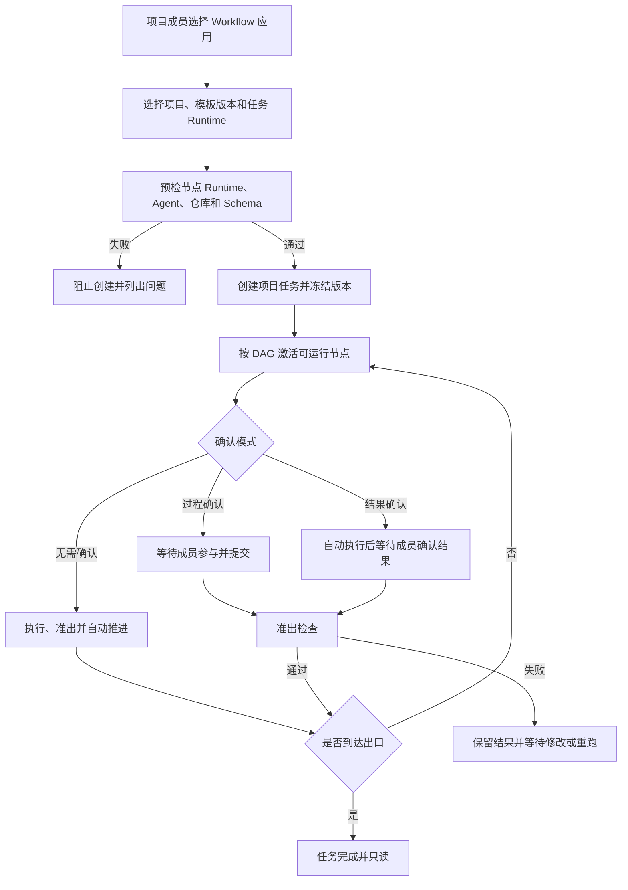
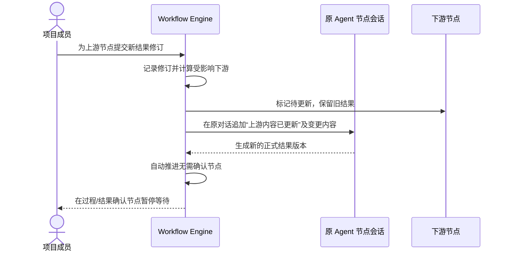

# 协作式项目任务执行

## 1. 目标声明

### 背景
Workflow Package 定义了固定业务流程，但用户还需要在项目下反复创建生命周期较短的工作任务，由多人在人、Agent 和代码节点间协作推进。当上游结果变化时，系统必须保留历史并逐节点更新，而不是覆盖记录、复制整个流程分支或继续使用过期结果。

### 目标
- 项目成员基于精确 Workflow Template Version 创建项目任务；内部实体使用 `workflow_instance`，界面统一称“项目任务”或“任务”。
- 任务固定模板版本、项目、默认 Runtime 和创建时配置，不与现有底层 `agent_task` 混用。
- 项目成员均可参与；节点可设置负责人用于协作提示，但不形成独占权限。
- 按有限 DAG 执行 `human/agent/code` 节点，支持过程确认、结果确认、无需确认、条件分支和受控跳过。
- 节点保留全部结果修订、执行轮次、Gate 结果和人工操作；上游更新后按拓扑顺序自动执行可自动节点，并在需要人工的节点暂停。
- Agent 节点保留同一多轮对话；输入变化时追加更新消息并形成新的正式结果版本。
- Git 等有外部副作用的节点必须具备幂等检查；无法确认外部状态时停止并交由人工处理。

### 不在范围内
- 细粒度项目角色、单节点强制权限和长期独占锁。
- 修改运行中任务所固定的模板版本、节点图或 Agent Release。
- 任意循环、临时插入节点或跨过未满足准入的节点。
- 自动解决 Git 冲突、未知外部副作用或 Runtime 状态不明。
- 已完成任务继续追加新业务范围；新工作创建新的项目任务。

## 2. 模块影响

| 模块 | 影响类型 | 说明 |
|------|---------|------|
| workflow_management | 修改 | 拥有任务、节点状态、结果修订、执行轮次、Gate、确认、跳过和产物 |
| runtime_management | 修改 | 将节点执行映射到 Runtime 与底层 Agent Task，提供可靠事件和失败恢复 |
| conversation_management | 修改 | 为 Agent 节点保存多轮对话及更新消息 |
| project_management | 修改 | 提供项目成员、仓库、Spec 配置和项目默认 Runtime |
| agent_management | 只读依赖 | 提供模板固定的 Agent Release 与 Resolved Spec |

## 3. 功能描述

### 3.1 任务创建与固定快照

1. 项目成员从模板独立应用选择项目和启用的精确版本，填写业务输入并可覆盖任务级 Runtime。
2. 系统按“节点指定 > 任务指定 > 项目默认”解析每个节点 Runtime，并预检 Agent 激活、代码能力、仓库工作区、凭证引用和 Schema。
3. 全部必需预检通过后创建 `workflow_instance`，冻结模板版本、Package digest、项目输入、Runtime 解析结果和项目上下文快照。
4. 任一必需目标未知或不兼容则阻止创建；不换 Runtime、不删除节点、不降低能力。
5. 项目所有成员可读取并参与任务。节点负责人可空且只用于通知、筛选和责任展示。

### 3.2 节点执行、确认和跳过

1. 节点进入 active 前在该节点 Runtime 执行 `validate_in`；失败保持 blocked 并展示结构化原因。
2. `process_confirmation` 节点等待成员参与、填写或讨论后提交结果；提交后执行准出检查。
3. `result_confirmation` 节点先调用 `run(context)` 产生候选结果并执行准出检查，通过后等待成员接受；拒绝时保留候选结果并允许补充输入后重跑。
4. `no_confirmation` 节点在准入通过后自动 `run`，准出通过即完成并沿 DAG 继续自动调度。
5. 只有模板允许的节点可跳过。成员必须填写原因；系统生成正式 skip 修订，下游准入读取明确的 skipped 状态。
6. 条件分支只由模板的确定性判断器选择已定义边。汇合节点按 Manifest 声明等待全部必需前置或指定分支集合。
7. 节点的每次执行、确认、拒绝、跳过和 Gate 结果都追加记录，不覆盖旧值。

### 3.3 上游更新与逐节点推进

1. 对已完成节点提交修改时，系统创建新的节点结果修订，不创建整个任务的新分支。
2. 引擎以输入修订摘要计算依赖，将使用旧输入的已执行下游节点标记为 `update_required`，但继续展示旧结果和当时依据。
3. 引擎按拓扑顺序处理受影响节点：无需确认节点在前置最新且准入通过后自动重跑；过程确认节点等待成员重新参与；结果确认节点自动产出候选结果后等待确认。
4. 任何节点 blocked、failed、等待确认或 Runtime 不可用时暂停相应路径；不允许直接把末端节点标记为最新。
5. 未受变更影响且输入摘要不变的节点保持有效，不做无意义重跑。
6. 所有受影响的出口节点恢复 current 且准出通过后，任务重新成为 completed。

### 3.4 Agent 与代码节点更新

1. 每个 Agent 节点拥有固定 Release 的持续会话。首次运行发送节点目标和输入；上游更新时仍使用原会话。
2. 更新消息由引擎追加，明确指出更新的上游节点、旧/新输入摘要和可读取的新内容，例如“上游节点 X 内容已更新，请结合更新重新完成当前节点”。
3. Agent 回复可以继续多轮讨论；只有被提交为正式结果并通过准出检查的内容才创建当前结果修订。
4. 每次 Agent 运行仍创建独立底层 `agent_task`/execution attempt，节点会话不因此被替换。
5. Code 节点每次统一调用 `run(context)`。Handler 可读取旧结果和变更摘要自行增量处理，但平台不要求 `execute/update` 两套接口。
6. Git 分支、写文件、提交、测试、合并等操作仅在具体 Workflow 节点中声明并实现；全部在解析后的同一 Runtime 和仓库工作区执行。
7. 有外部副作用的节点必须使用幂等键、前置状态检查和完成证明。无法证明上次结果时标记 `needs_manual_resolution`，禁止自动重复。

### 3.5 并发、失败与生命周期

1. 节点 mutation 携带 `expected_revision`；版本不符返回 409 和最新修订，不覆盖他人提交。
2. 同一节点同一修订只允许一个在途执行；不同 DAG 分支可在 Runtime 容量允许时并行。
3. 失败节点保留完整输入、事件和错误。成员修复外部问题后显式重试，从失败处恢复，不重跑仍有效节点。
4. 任务可以主动取消；取消后不再自动调度，全部历史可读。
5. 已完成任务只读。新的业务工作、采用新模板版本或继续扩展范围时创建新任务。
6. 任务不物理删除；项目归档后任务只读。

### 边界与异常

- 准入/准出 Validator 异常：节点标记 failed，不能把异常当作通过。
- Agent Release digest、Package digest 或本地物化不一致：拒绝执行。
- 自动链路执行到人工确认节点：正常暂停并通知，不视为失败。
- 上游更新发生在下游执行中：当前 attempt 完成后不得成为 current；引擎以新输入修订重新调度。
- Git 操作返回状态不明、凭证缺失或冲突：停止并要求人工处理，不自动 force、回滚或换仓库。
- 多人并发编辑：后提交者获得冲突信息并手工比较，不静默合并。

## 4. 数据变更

新增表：

| 表名 | 用途说明 |
|------|---------|
| `workflow_instance` | 项目任务身份、固定模板版本、状态和 Runtime 快照 |
| `workflow_node_instance` | 模板节点在任务中的当前状态、负责人和 current 修订 |
| `workflow_node_revision` | 节点输入、正式结果、skip 及人工修改的追加式版本 |
| `workflow_node_execution` | 每次 Agent/代码运行轮次、Runtime、底层 task 和状态 |
| `workflow_gate_result` | 每次准入/准出代码的输入摘要、结果和错误 |
| `workflow_confirmation` | 过程提交、结果接受/拒绝、操作者和说明 |
| `workflow_artifact` | 节点产物元数据、Git/object 引用、摘要和内容类型 |

关键约束：

| 表名 | 字段 | 业务含义 |
|------|------|---------|
| `workflow_instance` | `project_id, template_version_id, package_digest` | 创建后固定且同 namespace |
| `workflow_instance` | `status` | `pending/running/waiting/blocked/completed/failed/cancelled` |
| `workflow_instance` | `runtime_resolution` | 每节点最终 Runtime 与能力预检快照 |
| `workflow_node_instance` | `status` | 含 `inactive/ready/running/waiting_confirmation/completed/update_required/blocked/failed/skipped` |
| `workflow_node_instance` | `expected_revision, assignee_id` | 乐观并发与非权限型负责人 |
| `workflow_node_revision` | `revision, input_digest, output, output_digest, change_reason` | 任务节点内单调、不可修改 |
| `workflow_node_execution` | `attempt, runtime_id, agent_task_id, conversation_id` | 执行轮次和底层关联 |
| `workflow_gate_result` | `gate_type, validator_version, passed, details` | `entry/exit`；details 不含 secret |
| `workflow_confirmation` | `mode, decision, user_id, revision` | 只对精确结果修订生效 |
| `workflow_artifact` | `storage_type, storage_ref, content_digest` | `git/object/inline` 及不可变引用 |

数据库永久保留完整节点修订、执行轮次、Gate、确认、跳过原因和 Agent 会话索引，而不是只保存最终摘要。大文件进入对象存储或 Git；数据库保存引用、大小、类型和摘要。历史记录不因节点更新、任务取消或项目归档删除。

## 5. API 设计

| Method | Path | 权限 | 用途 |
|--------|------|------|------|
| GET/POST | `/projects/{project_id}/workflow-instances` | 项目成员 | 任务列表和预检后创建 |
| GET | `/workflow-instances/{id}` | 项目成员 | 任务、固定版本和 DAG 当前状态 |
| POST | `/workflow-instances/{id}/cancel` | 项目成员 | 显式取消任务 |
| GET | `/workflow-instances/{id}/events` | 项目成员 | 追加式任务事件与 SSE 恢复 |
| GET | `/workflow-instances/{id}/nodes/{node_key}` | 项目成员 | 节点历史、对话、Gate 和产物 |
| POST | `/workflow-instances/{id}/nodes/{node_key}/submit` | 项目成员 | 过程提交或人工修改，要求 expected revision |
| POST | `/workflow-instances/{id}/nodes/{node_key}/confirm` | 项目成员 | 接受或拒绝精确候选结果 |
| POST | `/workflow-instances/{id}/nodes/{node_key}/skip` | 项目成员 | 按模板许可跳过并填写原因 |
| POST | `/workflow-instances/{id}/nodes/{node_key}/retry` | 项目成员 | 显式重试失败/待人工处理节点 |
| POST | `/workflow-instances/{id}/nodes/{node_key}/messages` | 项目成员 | 参与 Agent 节点多轮对话 |

所有 mutation 使用 `Idempotency-Key` 和 expected revision。自动调度通过持久队列/数据库状态机推进，不依赖单个 FastAPI worker 内存。节点 API 不接受调用方临时指定其他 Runtime、Agent 或代码入口。

## 6. UI 页面

| 变更类型 | 页面名 | 路由 | 说明 |
|------|------|------|------|
| 新增 | Workflow 应用任务列表 | `/apps/:workflowSlug` | 模板专属任务创建、筛选和业务概览 |
| 新增 | Workflow 应用任务详情 | `/apps/:workflowSlug/tasks/:instanceId` | 专属业务页面与公共节点执行区域 |
| 修改 | 项目详情 | `/projects/:projectId` | 增加任务列表和按 Workflow 创建入口 |
| 修改 | AI 工作台 | `/workspace` | Workflow 标签展示应用目录及最近任务 |

公共任务区域展示 DAG/步骤导航、当前/待更新/等待确认状态、负责人、活动成员和完整历史。节点详情按模板专属方式呈现业务产物，同时提供旧结果、变更摘要、执行轮次、Gate 和错误抽屉。Agent 节点显示持续多轮对话；更新消息清晰标注由系统依据哪个上游修订生成。

过程确认节点提供参与和提交入口；结果确认节点展示候选结果及接受/拒绝；无需确认节点展示自动推进状态。409 冲突必须提示刷新比较，不能覆盖。任务完成后页面只读并提供“创建新任务”，不提供继续修改。

## 7. 验收标准

- [x] 界面称项目任务，数据实体为 `workflow_instance`，底层 Agent 执行仍为 `agent_task`，三者不混用。
- [x] 任务固定模板版本、Package digest、项目上下文和 Runtime 解析，不被新模板版本改变。
- [x] 项目成员均可参与，负责人不形成排他权限；并发写使用 expected revision 防覆盖。
- [x] 三种确认模式分别实现人工过程、结果接受和全自动推进，不保留重复的 manual 模式。
- [x] 上游新修订保留旧结果，并使依赖旧输入的下游逐节点更新；可自动节点自动重跑，人工节点等待确认。
- [x] Agent 节点在原对话追加明确更新消息并产生新结果版本，不另开替代会话。
- [x] 节点每次统一调用 `run(context)`，没有强制的首次/更新双接口。
- [x] 跳过只适用于模板许可节点并记录原因；条件分支不能跳到未定义边。
- [x] Git 等副作用无法证明状态时停止并请求人工处理，不自动重复、force 或降级。
- [x] Gate 异常、Runtime 不兼容、Agent/Package digest 不一致均阻断执行。
- [x] 已完成任务只读；取消、失败、重试和项目归档均保留完整历史。

验收证据：`backend/tests/workflow_management/test_package_and_engine.py` 覆盖固定快照、过程/结果确认、持久 Runtime Job、上游修订传播、自动重跑、乐观并发、禁止未许可跳过、完成只读、附件与 SSE；Runtime/Node 测试覆盖租约和副作用人工处理；`frontend/tests/v06-workflow.spec.ts` 覆盖完整任务操作面。
