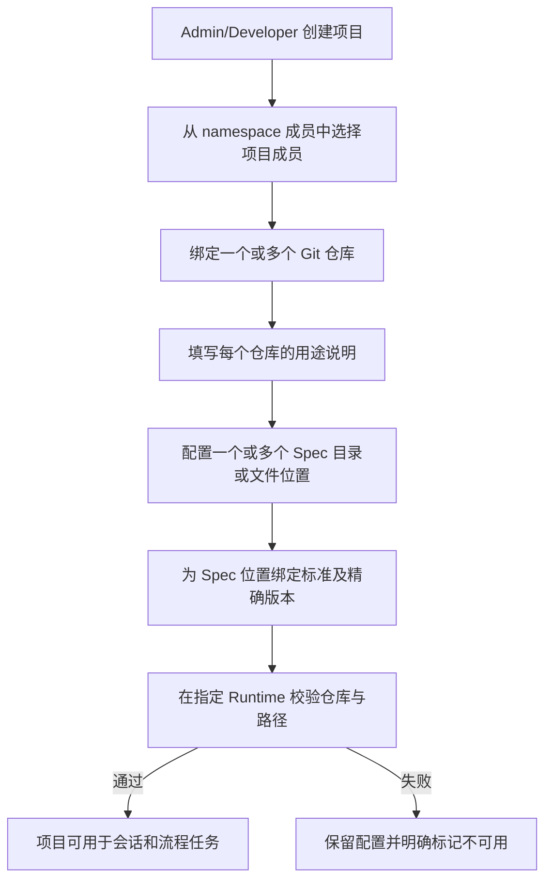

# 项目上下文与 Spec 标准管理

## 1. 目标声明

### 背景
v0.5 已建立 namespace 内的 Agent 与 Runtime 能力，但业务工作仍缺少稳定的项目上下文。项目需要关联多个职责不同的 Git 仓库，并在一个或多个目录中维护背景、规范、需求、迭代记录、Wiki 和 changelog。不同项目还需要复用同一套版本化 Spec 标准。

### 目标
- 在 namespace 下管理项目、项目成员、Git 仓库及仓库用途说明。
- 项目成员是 namespace 成员的子集，不再细分项目角色；所有项目成员都可参与项目任务。
- 一个项目可关联多个仓库，每个仓库可配置零到多个 Spec 位置；不存在主仓库或唯一 `project_context` 仓库。
- 提供平台级或 namespace 级、不可变版本的 Spec 标准，项目可在不同 Spec 位置引用不同标准版本。
- 项目配置明确记录仓库与 Spec 位置，不推断仓库职责，也不替管理人处理跨项目共享仓库的内容冲突。
- 项目只允许归档，不物理删除；归档后配置和历史只读。

### 不在范围内
- 从 Chat、Agent 会话或流程任务自动提炼、写入项目记忆。
- 自动解决多个项目共用仓库时的目录、分支或规范冲突。
- 为仓库用途建立固定枚举或根据仓库内容自动分类。
- 绕过 Workflow 直接执行分支、提交、合并等 Git 业务操作。
- Git 托管平台的组织、仓库和成员权限管理。

## 2. 模块影响

| 模块 | 影响类型 | 说明 |
|------|---------|------|
| project_management | 新增 | 拥有项目、项目成员、仓库绑定、Spec 位置与标准绑定生命周期 |
| namespaces | 修改 | 提供项目可选成员，并允许 Admin/Developer 创建和维护项目 |
| runtime_management | 修改 | 校验仓库在目标 Runtime 的可访问状态，使用本地凭证引用而非上传明文 |
| conversation_management | 只读依赖 | 会话选择项目时读取项目上下文配置并生成快照 |
| workflow_management | 只读依赖 | 项目任务读取仓库、Spec 位置和成员信息 |

## 3. 功能描述

### 3.1 项目与成员

1. Namespace Admin/Developer 创建项目，填写名称、唯一 slug 和说明。
2. 创建者只能从当前 namespace 成员中选择项目成员；被移出 namespace 的用户同时失去项目访问权。
3. 项目成员不设置 admin/developer/user 等项目内角色，均可查看项目、参与共享会话和操作项目任务。
4. 项目创建、归档、成员维护、仓库绑定和 Spec 配置仍由 namespace Admin/Developer负责。
5. 项目归档后不得创建新会话或项目任务，既有记录、仓库绑定和 Spec 配置只读。

### 3.2 仓库与 Spec 位置

1. 一个项目可绑定 1 到 N 个 Git 仓库，仓库记录远端地址、用途文字说明和可选默认分支。
2. 系统不定义主仓库，也不使用 `source/docs/deployment` 等受控用途枚举。
3. 同一仓库允许绑定多个项目；系统按管理人配置执行，不主动阻止潜在冲突。
4. 每个项目仓库可配置多个 Spec 位置；位置可以是目录或具体文件，并记录其业务说明。
5. Spec 位置必须位于仓库内，拒绝绝对路径、`..` 路径逃逸和符号链接逃逸。
6. 仓库凭证只保存在目标 Runtime 的安全凭证存储中，项目保存 `credential_ref`/workspace 引用，不保存明文私钥或 Token。

### 3.3 跨项目 Spec 标准

1. 平台维护者可发布全平台可见标准，namespace Admin 可发布仅当前 namespace 可见标准。
2. Spec 标准以稳定身份和不可变版本组成；版本包含目录约定、文档模板、必需文件、校验规则和说明。
3. 项目为每个 Spec 位置显式绑定一个精确标准版本；不同位置可以绑定不同标准，同一标准也可被多个项目复用。
4. 绑定标准不自动覆盖仓库文件。初始化或升级先生成差异预览，再由明确操作或 Workflow 节点写入 Git。
5. 标准发布新版本不会改变既有项目绑定；管理人显式发起升级，确认目标版本和差异后才更新绑定。
6. 已被项目引用的标准版本不可修改或删除，只能标记 deprecated；历史项目仍可读取。

### 边界与异常

- 项目成员不属于当前 namespace：拒绝保存并返回具体用户。
- Git 仓库不可达、凭证缺失或默认分支不存在：标记绑定 `unavailable`，不尝试匿名访问或替换凭证。
- Spec 路径不存在：允许在“待初始化”状态保存，但不能作为有效项目上下文读取。
- 标准升级与仓库现有内容冲突：输出差异并停止，不自动覆盖。
- 共用仓库发生项目间冲突：保留 Git 原始错误并交由管理人处理，平台不做隐式目录重写。
- 项目归档：拒绝全部配置 mutation 和新工作入口，历史读取不受影响。

## 4. 数据变更

新增表：

| 表名 | 用途说明 |
|------|---------|
| `project` | namespace 内项目身份、说明和归档状态 |
| `project_member` | 项目与 namespace 成员的无角色关联 |
| `project_repository` | 项目绑定的 Git 仓库、用途说明和 Runtime 访问引用 |
| `project_spec_location` | 仓库内一个目录或文件形式的 Spec 位置 |
| `spec_standard` | 可跨项目复用的 Spec 标准稳定身份与可见范围 |
| `spec_standard_version` | 不可变模板文件、规则和内容摘要 |
| `project_spec_binding` | 项目 Spec 位置与精确标准版本的绑定及迁移状态 |

关键约束：

| 表名 | 字段 | 业务含义 |
|------|------|---------|
| `project` | `namespace_id, slug, status` | slug 空间内唯一；状态为 `active/archived` |
| `project_member` | `project_id, user_id` | 组合唯一；用户必须仍是 namespace 成员 |
| `project_repository` | `remote_url, default_branch, purpose, credential_ref` | purpose 为必填文本；credential_ref 不含密钥值 |
| `project_repository` | `runtime_workspace_refs` | 各 Runtime 上经校验的逻辑工作区引用 |
| `project_spec_location` | `path, location_type, description` | 仓库内相对路径；类型为 `directory/file` |
| `spec_standard` | `scope_type, namespace_id, slug` | `platform/namespace` 可见范围 |
| `spec_standard_version` | `version, manifest, content_digest, status` | 创建后不可变，可标记 deprecated |
| `project_spec_binding` | `standard_version_id, status, validated_commit` | 精确版本绑定及最近验证的 commit |

项目归档不删除仓库和 Spec 记录。标准模板正文可进入不可变对象存储，数据库保存 manifest、摘要和存储键；项目中的实际 Spec 文档始终以 Git 内容为准。

## 5. API 设计

| Method | Path | 权限 | 用途 |
|--------|------|------|------|
| GET/POST | `/projects` | 成员读 / Admin、Developer 创建 | 项目列表和创建 |
| GET/PATCH | `/projects/{project_id}` | 项目成员读 / Admin、Developer 写 | 详情、修改和归档 |
| GET/PUT | `/projects/{project_id}/members` | 项目成员读 / Admin、Developer 写 | 成员维护 |
| GET/POST/PATCH/DELETE | `/projects/{project_id}/repositories` | 项目成员读 / Admin、Developer 写 | 仓库绑定管理 |
| POST | `/projects/{project_id}/repositories/{id}/validate` | Admin、Developer | 在指定 Runtime 校验访问与路径 |
| GET/POST/PATCH/DELETE | `/projects/{project_id}/spec-locations` | 项目成员读 / Admin、Developer 写 | Spec 位置管理 |
| GET/POST | `/spec-standards` | 成员读 / 对应 scope Admin 写 | 标准列表和创建 |
| GET/POST | `/spec-standards/{id}/versions` | 成员读 / 对应 scope Admin 写 | 版本读取和发布 |
| PUT | `/projects/{project_id}/spec-locations/{id}/binding` | Admin、Developer | 绑定或显式升级标准版本 |
| POST | `/projects/{project_id}/spec-locations/{id}/diff` | Admin、Developer | 生成初始化/升级差异，不直接写 Git |

所有项目接口使用 `X-Namespace-Id` 并校验项目所属空间。写 Git 的动作不由以上配置接口隐式完成。

## 6. UI 页面

| 变更类型 | 页面名 | 路由 | 说明 |
|------|------|------|------|
| 新增 | 项目列表 | `/projects` | 当前用户参与的项目及归档状态 |
| 新增 | 项目详情 | `/projects/:projectId` | 概览、成员、仓库、Spec 位置与任务入口 |
| 新增 | Spec 标准管理 | `/system/spec-standards` | 标准、不可变版本和引用项目 |
| 修改 | 侧边栏 | 全局布局 | 所有登录用户显示“项目”；Admin/Developer 显示 Spec 管理入口 |

项目详情使用页签展示概览、成员、仓库、Spec、会话和任务。仓库表单的“用途”是必填多行文本；Spec 页允许为同一仓库添加多个路径并分别绑定标准版本。校验失败展示 Runtime、仓库、路径和错误，不提供匿名重试或自动修复。归档操作二次确认，并明确归档后只读。

## 7. 验收标准

- [ ] Admin/Developer 可从 namespace 成员中建立项目成员集，普通成员不能修改项目配置。
- [ ] 项目可绑定多个仓库和多个 Spec 位置，不要求也不推断主仓库。
- [ ] 仓库用途使用文字说明；同一仓库可绑定多个项目且系统不擅自改写目录。
- [ ] Spec 路径逃逸和仓库外符号链接被拒绝。
- [ ] 平台/namespace Spec 标准均使用不可变版本，项目绑定精确版本。
- [ ] 标准升级只生成差异和显式迁移动作，不自动覆盖 Git 文件。
- [ ] Git 凭证不进入数据库明文字段、API 响应、任务快照或日志。
- [ ] 项目只允许归档；归档后不能创建新会话、任务或修改配置。
- [ ] v0.6 不从会话或任务自动生成项目记忆。
