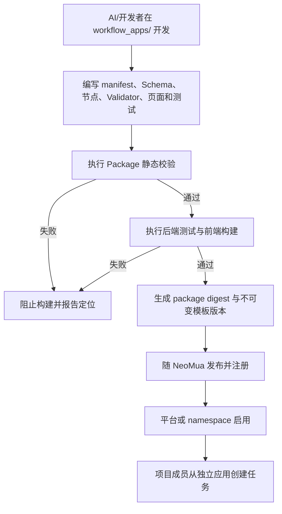

# Workflow Package 与独立应用管理

## 1. 目标声明

### 背景
NeoMua 已具备模型、Runtime、Agent Release 与能力装配，但业务流程不能继续以散落在核心服务中的条件判断扩展。v0.6 需要公共流程规范，并允许 AI/开发者在统一目录内为每个流程开发固定、有限、可测试的节点逻辑和专属前端应用。

### 目标
- 提供公共 Workflow SDK、Package 目录规范、模板注册与不可变版本生命周期。
- v0.6 流程由 AI/开发者在代码中实现，不提供可视化拖拽设计器。
- 每个模板定义有限无环 DAG，节点类型固定为 `human/agent/code`。
- 每个节点声明输入输出 Schema、确认模式、可跳过规则、Runtime 要求以及可选准入准出校验。
- 每个流程模板拥有一套独立应用页面，同时复用任务状态、节点导航、协作者、历史、附件和错误展示等公共组件。
- Package 与 NeoMua 一同构建、测试和部署；不加载远程 JavaScript，不允许通过网页上传可执行代码。
- 平台内置和 namespace 自定义模板都必须经过同一构建、校验、注册和发布链路。

### 不在范围内
- 拖拽式流程设计、在线修改节点或在页面中编写 Validator/Executor。
- 运行时由 AI 临时生成代码并直接执行。
- 加载远程前端 Bundle、Python 包、Shell Hook 或未随 NeoMua 发布的插件代码。
- 任意循环、运行时新增节点或跳转到模板未定义的边。
- 本文件定义具体业务流程内容；每个 Workflow Package 自行实现其业务逻辑。

## 2. 模块影响

| 模块 | 影响类型 | 说明 |
|------|---------|------|
| workflow_management | 新增 | 拥有 Workflow 模板、版本、节点定义、应用注册和 namespace 启用状态 |
| runtime_management | 修改 | 提供节点执行环境能力目录与 Runtime 兼容性校验 |
| agent_management | 修改 | 提供 Agent 节点可引用的精确 Release 和能力约束 |
| project_management | 只读依赖 | 提供模板可要求的仓库与 Spec 配置能力 |
| namespaces | 只读依赖 | 提供模板可见范围及启用权限 |

## 3. 功能描述



### 3.1 Workflow Package 目录与契约

每个流程使用统一目录：

```text
workflow_apps/<workflow_slug>/
├── manifest
├── backend/
│   ├── nodes/
│   └── validators/
├── frontend/
├── schemas/
└── tests/
```

1. `manifest` 声明模板身份、版本、可见 scope、DAG、节点类型、确认模式、Runtime 策略、Schema、入口、出口和应用组件。
2. `backend/nodes` 实现 code 节点及 Agent 节点编排；节点每次执行统一调用 `run(context)`，不区分首次执行和更新接口。
3. `backend/validators` 提供可选 `validate_in` 和 `validate_out`。具备准入或准出声明的节点必须存在对应代码实现。
4. `frontend` 实现该模板的专属页面，可组合公共 Workflow UI 组件，不得覆盖认证、权限和审计行为。
5. `schemas` 定义节点输入、结果和产物结构；未知字段处理策略必须明确。
6. `tests` 至少覆盖正常路径、条件分支、校验失败、跳过、重跑和 Runtime 不兼容。

### 3.2 模板与不可变版本

1. Workflow Template 是稳定身份，slug 创建后不可改变；Template Version 是一次构建产物，创建后不可修改。
2. 节点、边、Schema、Validator、节点代码或前端应用任一变化均产生新版本和新 package digest。
3. 平台内置模板对全部 namespace 可见；namespace 自定义模板只对指定 namespace 可见，但仍必须通过代码评审和 NeoMua 正式部署。
4. Namespace Admin 可启用、停用已部署模板版本和设置默认版本，不能在 UI 中上传或编辑可执行逻辑。
5. 新建项目任务默认使用当前最新启用版本，也允许用户选择其他仍受支持的启用版本；任务创建后永久固定精确版本。
6. 停用或废弃版本不影响既有任务读取与继续执行；存在严重安全问题时通过明确阻断状态处理，不自动迁移。

### 3.3 DAG、节点与确认模式

1. DAG 必须有限且无环，至少一个入口和一个出口；允许确定性条件分支与汇合。
2. v0.6 节点类型仅为：`human`、`agent`、`code`。未知类型使 Package 校验失败。
3. 节点确认模式只有：
   - `process_confirmation`：人工参与本身是节点工作的一部分，系统等待成员提交过程结果。
   - `result_confirmation`：Agent/代码先产生结果，成员确认接受后才完成。
   - `no_confirmation`：执行和准出成功后自动完成并继续推进。
4. 只有显式 `skippable=true` 的节点允许跳过；Manifest 必须声明跳过后提供给下游的状态与空输出 Schema。
5. 条件分支由 Package 中的确定性代码根据已验证结果选择模板预定义边，不允许模型自由决定未知跳转。
6. 每个节点声明资源、Agent Release、仓库访问、网络、超时等 Runtime requirements。

### 3.4 Runtime 策略与应用页面

Runtime 解析优先级固定为：

```text
节点指定 Runtime > 创建任务时指定的流程 Runtime > 项目默认 Runtime
```

1. 节点一旦解析到 Runtime，其 Agent、代码、Validator、Git 工作区和相关工作必须全部在该 Runtime 完成。
2. 未解析到 Runtime 或目标能力不满足时阻止任务/节点开始，不切换到其他 Runtime。
3. 每个模板提供独立应用页面和业务布局；公共外壳提供任务身份、节点状态、参与成员、历史、附件、错误及审计入口。
4. 应用路由由注册表映射到随前端一起构建的组件，不通过数据库存储任意模块 URL。

### 3.5 发布校验

发布前必须校验：DAG 无环、节点/边引用完整、节点 ID 唯一、入口出口可达、Schema 可解析、确认与跳过配置合法、Validator 声明与实现一致、Runtime requirements 可表达、测试通过、前端应用可构建、Package 内容摘要稳定。任一失败均阻止版本注册，不允许管理员忽略错误继续发布。

### 边界与异常

- Manifest 使用未知节点类型、未知确认模式或动态代码表达式：构建失败。
- Package digest 与注册内容不一致：服务启动/部署失败，不沿用错误版本注册。
- Namespace 模板引用其他 namespace Agent 或资源：校验失败。
- 已部署模板缺少目标 Runtime 能力：允许模板存在，但创建任务或节点预检明确阻断。
- 前端应用加载失败：任务数据仍可通过 API 读取，但不能用通用页面冒充专属应用完成业务操作。
- 已固定版本的任务不得因部署新版本而改变节点、Schema 或页面行为。

## 4. 数据变更

新增表：

| 表名 | 用途说明 |
|------|---------|
| `workflow_template` | 稳定模板身份、可见 scope、slug 和状态 |
| `workflow_template_version` | 不可变 Manifest、DAG、Schema、构建与内容摘要 |
| `workflow_node_definition` | 版本内固定节点、确认、跳过、Runtime 与校验定义 |
| `workflow_edge_definition` | 固定边、条件判断器引用和汇合规则 |
| `workflow_application` | 模板到前端内置组件、路由和公共外壳版本的注册 |
| `namespace_workflow_enablement` | namespace 启用版本、默认版本和停用状态 |

关键约束：

| 表名 | 字段 | 业务含义 |
|------|------|---------|
| `workflow_template` | `scope_type, namespace_id, slug` | 平台/namespace scope 内唯一 |
| `workflow_template_version` | `version, manifest, package_digest, sdk_version` | 创建后不可变 |
| `workflow_node_definition` | `node_key, node_type, confirmation_mode` | 版本内 node_key 唯一 |
| `workflow_node_definition` | `input_schema, output_schema, runtime_policy` | 节点数据契约和 Runtime 要求 |
| `workflow_node_definition` | `has_entry_gate, has_exit_gate, skippable` | 与 Package 实现严格一致 |
| `workflow_application` | `component_key, route_slug, build_digest` | 只能引用编译时注册组件 |
| `namespace_workflow_enablement` | `template_version_id, is_default, enabled` | 默认版本必须同时启用 |

Package 源码仍在 NeoMua Git 仓库；数据库只保存发布后 canonical Manifest、摘要和组件注册，不保存可执行源码文本。被任务引用的版本不可删除。

## 5. API 设计

| Method | Path | 权限 | 用途 |
|--------|------|------|------|
| GET | `/workflow-templates` | namespace 成员 | 读取当前空间可用模板及版本 |
| GET | `/workflow-templates/{id}/versions/{version_id}` | namespace 成员 | Manifest、DAG、Schema 和应用元数据 |
| GET/PUT | `/workflow-templates/{id}/enablement` | 成员读 / Admin 写 | 启停版本和设置默认版本 |
| POST | `/internal/workflow-registry/sync` | 部署服务凭证 | 注册随构建发布且摘要匹配的 Package |
| POST | `/workflow-templates/{id}/preflight` | 项目成员 | 对项目、Runtime、Agent 和仓库做创建前预检 |

正式 UI 不提供 Package 上传、源码编辑或“忽略校验发布”接口。内部注册接口只接受构建产物中的已知组件 key 和 digest。

## 6. UI 页面

| 变更类型 | 页面名 | 路由 | 说明 |
|------|------|------|------|
| 新增 | Workflow 模板管理 | `/system/workflows` | 模板版本、scope、启停、兼容性和引用任务 |
| 新增 | Workflow 独立应用 | `/apps/:workflowSlug` | 模板专属首页、项目选择和任务创建 |
| 修改 | AI 工作台 | `/workspace` | Workflow 标签进入已启用应用目录 |

模板管理页只管理已部署版本，不出现代码上传或在线设计入口。应用目录展示模板说明、版本、适用项目要求和 Runtime 预检状态。每个独立应用可自定义业务布局，但必须展示精确模板版本并使用公共任务/节点/审计组件。

## 7. 验收标准

- [ ] v0.6 没有拖拽设计器、在线代码编辑或可执行 Package 上传入口。
- [ ] 每个 Package 位于统一目录，包含 Manifest、节点、Validator、前端、Schema 和测试。
- [ ] 节点统一使用 `run(context)`；不存在首次执行与更新两套必需接口。
- [ ] DAG 有限无环，未知节点类型、确认模式或未定义跳转均阻断发布。
- [ ] 声明准入/准出的节点必须有对应代码 Validator，不能用提示词代替。
- [ ] 模板版本不可变，新任务使用启用版本，既有任务不被升级影响。
- [ ] 每个模板拥有独立应用页面并复用公共能力，不加载远程 JavaScript。
- [ ] Runtime 按节点、任务、项目优先级解析；不兼容时阻断而非自动替换。
- [ ] 构建、测试、Schema、DAG 或摘要校验失败时不能注册模板版本。
