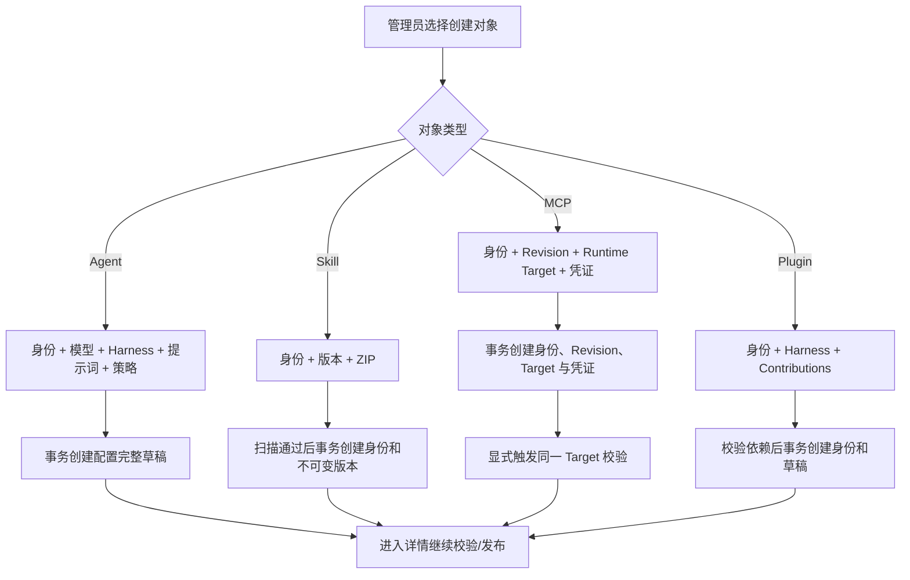

# Agent 与能力完整创建流程

## 1. 目标声明

### 背景

Agent、Skill、MCP Server 与 Plugin 当前先创建名称和标识，再要求用户进入详情补充模型、版本、Revision、Runtime Target 或 Contributions。身份与版本分层是必要架构，但不应迫使用户跨页面完成一次逻辑上的创建操作。

### 目标

- Agent 创建时完成模型、Harness、系统提示词和执行策略配置，生成配置完整但未发布的 revision 1 草稿。
- Skill 创建时同时上传、扫描并创建首个不可变版本；失败不留下 Skill 身份。
- MCP 创建时完成身份、首个不可变 Revision、明确 Runtime Target 和所需凭证配置，并在成功后触发目标校验。
- Plugin 创建时完成身份、Harness 与声明式 Contributions，生成已通过结构校验但尚未发布的草稿。
- 所有流程在成功前不显示“创建完成”；不可变 Version、Agent Release 和 Plugin Version 仍需显式确认。

### 不在范围内

- 自动创建 Agent Release、Plugin Version 或 Activation。
- 修改 Skill Version、MCP Revision、Plugin Version、Agent Release 的不可变性。
- 在 MCP 校验失败时更换 Runtime、Transport、地址或凭证进行降级。
- 自动生成唯一标识。

## 2. 模块影响

| 模块 | 影响类型 | 说明 |
|------|---------|------|
| `agent_management` | 修改 | 新增四类完整创建请求与创建窗口，保持草稿和不可变版本边界 |
| `llm_configs` | 只读依赖 | Agent 创建读取当前 namespace 已启用模型 |
| `runtime_management` | 只读依赖 | Agent 读取兼容 Harness，MCP 选择明确 Runtime Target |

## 3. 功能描述

### 3.1 Agent

创建窗口要求名称、Agent 标识、Harness 和已启用模型；系统提示词可为空，超时和工作目录策略使用可见默认值。服务端校验引用归属后原子创建身份和已配置草稿。能力绑定为可选配置，不阻止没有 Tool 的纯模型 Agent。

### 3.2 Skill

创建窗口要求名称、Skill 标识、说明、SemVer 和 ZIP。服务端先按标识与版本扫描 ZIP，再创建身份和版本。扫描、存储或唯一性失败时不创建数据库身份。

### 3.3 MCP Server

创建窗口要求名称、MCP 标识、Transport、endpoint/executable、Runtime Target；节点 Target 必须填写 `secret_ref`，平台 Target 可填写凭证 JSON。服务端原子创建身份、Revision、Target 和平台密文。成功后前端对该 Target 发起正式校验；校验失败时保留完整配置并明确显示“未验证/失败”，不替换目标或配置。

### 3.4 Plugin

创建窗口要求名称、Plugin 标识、说明、Harness 类型和至少一个声明式 Contribution。服务端使用既有依赖解析校验后原子创建身份和草稿。创建不自动签名或发布 Plugin Version。

## 4. 数据变更

无新增表或字段。组合请求只协调既有实体的同事务创建。

## 5. API 设计

| Method | Path | 说明 |
|------|------|------|
| POST | `/agents/complete` | 创建 Agent 身份和配置完整草稿 |
| POST | `/skills/complete` | Multipart 创建 Skill 身份和首个不可变版本 |
| POST | `/mcp-servers/complete` | 创建 MCP 身份、首 Revision、Target 与凭证 |
| POST | `/plugins/complete` | 创建 Plugin 身份和已完成结构校验的草稿 |

## 6. UI 页面

| 变更类型 | 页面 | 路由 | 说明 |
|------|------|------|------|
| 修改 | Agent 列表 | `/system/agents` | 完整 Agent 创建窗口 |
| 修改 | Skill 列表 | `/system/skills` | 身份与首版本上传窗口 |
| 修改 | MCP 列表 | `/system/mcp-servers` | 身份、Revision、Target 与凭证窗口 |
| 修改 | Plugin 列表 | `/system/plugins` | 身份与 Contributions 创建窗口 |

复杂窗口可滚动，失败保留输入；成功后跳转详情。导航不变。

## 7. 验收标准

- [ ] Agent 创建完成时已选择模型和 Harness，并生成配置完整草稿。
- [ ] Skill 扫描或版本创建失败时不存在无版本 Skill 身份。
- [ ] MCP 创建完成时已有首个 Revision 和明确 Runtime Target；平台凭证不回显。
- [ ] MCP 校验失败不会自动更换任何配置，并能在详情继续诊断。
- [ ] Plugin 创建完成时已有经过结构与依赖校验的 Contributions 草稿。
- [ ] Agent/Plugin 创建不会自动发布 Release/Version。
- [ ] 所有用户可见字段使用“唯一标识”业务术语，不显示未解释的 Slug。
