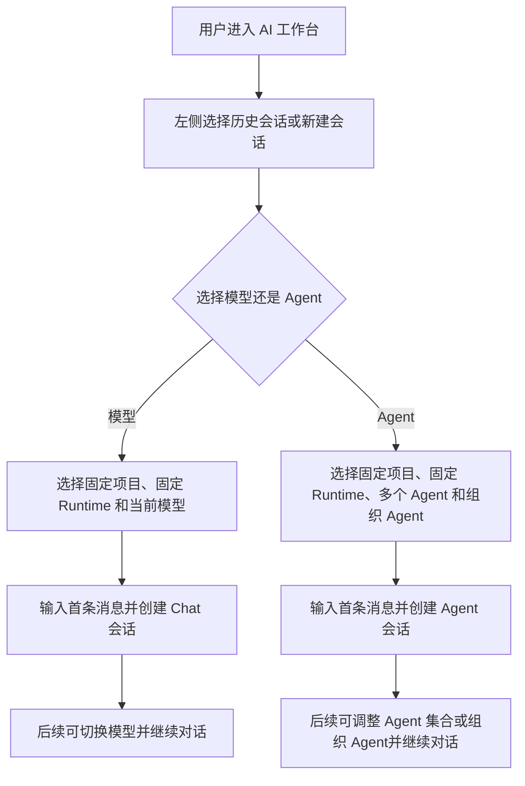
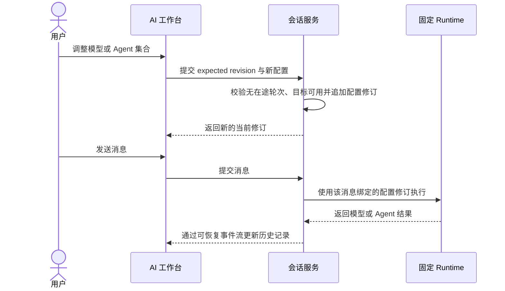

# AI Chat 工作台

## 1. 目标声明

### 背景

v0.6 的 AI 工作台同时承载 Chat、Agent 与 Workflow，并把会话创建表单、主线、委派时间线和配置拆成多个卡片。该布局更接近管理后台，不符合用户对常见 AI Chat 工具“左侧会话、右侧对话、底部输入”的使用预期。与此同时，v0.6 将模型和 Agent Release 在会话创建后全部固定，不能满足用户在同一上下文内切换模型或调整协作 Agent 的需要。

### 目标

- AI 工作台只保留 Chat 与 Agent 两类会话，不再加载或展示 Workflow。
- 左侧持续展示当前空间的会话列表，右侧展示选中会话或新会话。
- 工作台占满全局顶栏以下的可用视口，不使用普通管理页面的外层留白、最大宽度和 Footer。
- 右侧历史消息区占据主要空间，输入框固定在下方，项目、Runtime、Agent/模型选择位于输入框下方。
- 每个会话只能选择模型或 Agent 其中一种执行方式，不能在同一会话内混用。
- 项目和 Runtime 在会话首次创建后固定。
- Chat 会话允许在后续轮次切换可用模型；切换只影响未来消息。
- Agent 会话允许增加、移除参与 Agent，并允许指定或更换唯一组织 Agent；调整只影响未来轮次。
- 每条消息绑定发送时的配置修订，历史模型、Agent 集合、组织关系、任务和委派保持可追溯。

### 不在范围内

- 在同一会话内从 Chat 切换为 Agent，或从 Agent 切换为 Chat。
- 在会话创建后切换项目或 Runtime。
- 自动选择替代模型、替代 Agent 或替代 Runtime。
- 删除历史参与 Agent、历史配置修订、历史消息或委派记录。
- 本期重新设计附件扫描、项目上下文快照或 Tool 审批规则。

## 2. 模块影响

| 模块 | 影响类型 | 说明 |
|------|---------|------|
| `conversation_management` | 修改 | 拥有双栏工作台、当前会话配置修订、消息绑定和动态 Chat/Agent 会话行为 |
| `agent_management` | 修改 | 向会话提供目标 Runtime 当前已激活的 Agent Release，并在新增参与者时重新校验精确绑定 |
| `runtime_management` | 修改 | 继续固定会话 Runtime，并按每条 Chat 消息的模型配置修订提供受限模型路由 |
| `llm_configs` | 只读依赖 | 提供当前空间已启用、目标 Runtime 可用的模型目录 |
| `project_management` | 只读依赖 | 提供创建会话时可选且创建后固定的项目上下文 |

## 3. 功能描述

### 3.1 双栏工作台

正常流程：

1. 用户进入 `/workspace`，左侧加载当前空间中有权访问的活跃会话，按最近更新时间倒序排列。
2. 用户选择历史会话时，右侧加载其消息、当前配置和事件流；选择“新会话”时，右侧展示空历史区和可编辑的底部输入区。
3. 消息历史区独立滚动；底部输入区保持可见，包含多行文本输入、附件入口、发送按钮和配置栏。
4. 全局布局识别 `/workspace` 及其会话子路由，移除普通页面的外层 padding、最大宽度和 Footer，并限制内容区溢出；工作台自身负责内部高度与滚动。
5. 配置栏从左到右提供项目、Runtime、执行方式及其具体选择；窄屏允许换行，但不能把配置移回独立管理卡片。
6. 首次发送时以首条消息摘要生成默认标题，先创建会话，再提交消息并进入该会话路由。

边界条件：

- 空间内没有会话时显示新会话空状态，不展示虚假的示例会话。
- 历史会话的项目和 Runtime 只读显示；新会话必须选择兼容 Runtime，项目可不选。
- 会话列表不混入 Workflow 任务。
- 页面只允许消息区和会话列表按各自容器滚动，不能产生工作台内部滚动与浏览器页面滚动叠加。

异常处理：

- 会话列表或消息加载失败时，在对应区域显示重试，不清空用户尚未发送的输入。
- 首次创建成功但消息发送失败时保留已创建会话，并在输入区展示可重试错误。
- SSE 断开时显示重连状态并从最后事件序号恢复，不轮询伪装为实时连接。

### 3.2 Chat 模型切换

正常流程：

1. 用户创建 Chat 会话时选择一个已启用模型，项目和 Runtime 随会话固定。
2. 用户在没有在途消息时可从底部配置栏选择同一空间、同一 Runtime 可用的其他模型。
3. 后端校验 provider、模型启用状态和 Runtime 兼容性，追加下一条会话配置修订并更新当前指针。
4. 后续消息绑定新修订；旧消息继续引用旧修订，历史区显示当轮实际模型。

边界条件：

- Chat 会话不能选择 Agent。
- 模型选择至少包含 provider config 与 model ID，避免同名模型跨供应商混淆。
- 有消息正在执行时禁止切换模型。

异常处理：

- 模型已停用、配置失效或 Runtime 不兼容时拒绝切换，继续保留原当前配置。
- 并发修改使用 `expected_revision`；冲突返回最新修订，前端提示刷新后重选，不覆盖他人修改。
- 当前模型在发送前失效时停止发送，不自动选择其他模型。

### 3.3 Agent 增减与组织 Agent

正常流程：

1. 用户创建 Agent 会话时选择一个或多个目标 Runtime 已激活的 Agent，并从中指定唯一组织 Agent。
2. 没有在途消息时，用户可以增加新 Agent、移除协作 Agent或更换组织 Agent。
3. 新增 Agent 时后端重新校验 Runtime 上的 active Release，并为该精确 Release 建立会话参与者和独立 Agent Session。
4. 配置调整以完整参与者集合和组织 Agent 指针追加新修订；历史修订和已移除参与者不删除。
5. 普通消息默认发送给当前组织 Agent；用户仍可选择全体或当前某个参与 Agent。
6. 组织 Agent只能委派给当前修订中列出的协作 Agent，任务快照保存当轮组织关系和可委派集合。

边界条件：

- Agent 会话至少保留一个 Agent，且组织 Agent 必须属于当前参与者集合。
- 移除当前组织 Agent前必须在同一次配置更新中指定另一名参与 Agent接替。
- 已存在于历史中的 Agent再次加入时，只能复用仍在目标 Runtime 激活的同一精确 Release；Release 已变化时明确要求创建新会话，不覆盖历史参与者绑定。
- Agent 会话不能选择 Chat 模型作为执行目标；Agent 自身模型继续由其精确 Release 决定。

异常处理：

- 任一新增 Agent未激活、digest 不一致或不属于固定 Runtime 时，整次配置更新失败。
- 有主轮次或协作任务在途时禁止调整参与者或组织 Agent。
- 并发调整冲突时返回最新修订，不静默合并两个参与者集合。

## 4. 数据变更

新增表：

| 表名 | 用途说明 |
|------|---------|
| `conversation_configuration_revision` | 追加保存会话每次模型选择或 Agent 参与集合变更，作为消息和任务的执行配置证据 |

新增字段：

| 表名 | 字段名 | 类型 | 业务含义 |
|------|--------|------|----------|
| `conversation` | `current_configuration_revision_id` | uuid, nullable FK | 当前配置修订指针；旧数据允许为空并由现有字段兼容读取 |
| `conversation_message` | `configuration_revision_id` | uuid, nullable FK | 消息发送时采用的配置修订，历史数据允许为空 |

`conversation_configuration_revision` 关键字段：

| 字段 | 类型 | 业务含义 |
|------|------|----------|
| `id` | uuid | 主键 |
| `conversation_id` | uuid FK | 所属会话 |
| `revision` | integer | 会话内单调版本，与 conversation 唯一 |
| `mode` | enum | 固定为会话的 `chat` 或 `agent` |
| `provider_config_id` | uuid, nullable FK | Chat 修订的供应商配置 |
| `model_id` | varchar, nullable | Chat 修订的模型 ID |
| `organizer_agent_id` | uuid, nullable FK | Agent 修订的唯一组织参与者 |
| `participant_ids` | json | Agent 修订的完整有序参与者 ID 集合 |
| `created_by` | uuid, nullable FK | 发起配置变更的用户 |
| `created_at` | timestamptz | 修订创建时间 |

调整已有字段说明：

| 表名 | 字段名 | 调整说明 |
|------|--------|----------|
| `conversation` | `provider_config_id/model_id` | 从“永远固定”扩展为 Chat 当前模型的兼容读取字段；真实历史以配置修订为准 |
| `conversation_agent` | `role` | 表示当前组织/协作角色；历史角色以配置修订和 Agent Task snapshot 为准 |

不删除或改写任何已有会话、消息、Agent Session、委派或任务记录。

## 5. API 设计

| Method | Path | 权限 | 用途 |
|--------|------|------|------|
| GET | `/conversations/{id}/configuration-revisions` | 有可见权成员 | 读取配置修订历史和当前指针 |
| POST | `/conversations/{id}/configuration-revisions` | 可参与成员 | 以 `expected_revision` 追加模型或 Agent 配置修订 |

Chat 更新体包含 `expected_revision`、`provider_config_id` 和 `model_id`。Agent 更新体包含 `expected_revision`、完整 `participant_runtime_agent_release_ids` 与 `organizer_runtime_agent_release_id`。接口不接受项目、Runtime 或 mode 更新。

现有消息接口保持路径不变，但服务端在持久化消息时自动绑定当前配置修订。会话详情返回当前修订以及参与者的当前 active 状态，前端不自行推断组织关系。

## 6. UI 页面

| 变更类型 | 页面名 | 路由 | 说明 |
|------|------|------|------|
| 修改 | AI 工作台 | `/workspace` | 左侧会话列表，右侧新会话输入区 |
| 修改 | 会话页面 | `/workspace/conversations/:conversationId` | 复用相同双栏外壳，右侧显示历史记录和底部输入区 |

### AI 工作台与会话页面

- 布局：占满顶栏以下可用视口的全高双栏；左栏为新会话按钮和独立滚动的历史会话，右栏上部为独立滚动的消息历史，下部为固定输入与配置栏；不展示页面 Footer。
- 功能：创建 Chat/Agent 会话、发送消息、上传附件、切换 Chat 模型、调整 Agent 集合、指定组织 Agent、选择消息目标。
- 交互：点击左侧会话无整页结构跳变；首次发送后进入正式会话；切换配置成功后立即展示新修订标识；配置冲突提示刷新。
- 字段：新会话项目可空，Runtime 必填；Chat 模型必填；Agent 至少一个且组织 Agent 必填；消息内容必填。
- 导航：保留全局“AI 工作台”菜单，但页面内部不再出现 Workflow 标签或入口。

历史消息展示作者、状态、时间和当轮模型或 Agent；失败消息保留错误。完整委派详情可在消息内展开，不再占用独立主卡片挤压聊天区域。

## 7. 验收标准

- [ ] 用户进入 AI 工作台时，左侧看到会话列表，右侧看到聊天历史与底部输入区，页面内没有 Workflow 标签。
- [ ] AI 工作台占满全局顶栏以下的可用视口，不继承普通页面最大宽度、外层留白或 Footer，且不会出现双重滚动条。
- [ ] 新会话必须在模型与 Agent 中选择一种，不能同时配置或在会话中互相切换。
- [ ] 项目和 Runtime 在首次创建后只读，API 不提供修改入口。
- [ ] Chat 会话可在无在途消息时切换模型，旧消息仍显示并使用原模型修订。
- [ ] Agent 会话可在无在途任务时增加、移除 Agent，并始终保留唯一组织 Agent。
- [ ] 移除组织 Agent 时必须同时指定接替者，否则更新被拒绝且原配置不变。
- [ ] 每条消息绑定发送时配置修订；历史参与者、委派、任务和模型路由不会被后续调整改写。
- [ ] 配置失效、并发冲突或 Runtime 不兼容时明确阻断，不自动降级或替换。
- [ ] 会话事件流断开后使用最后事件序号恢复，未发送输入不因加载失败丢失。
