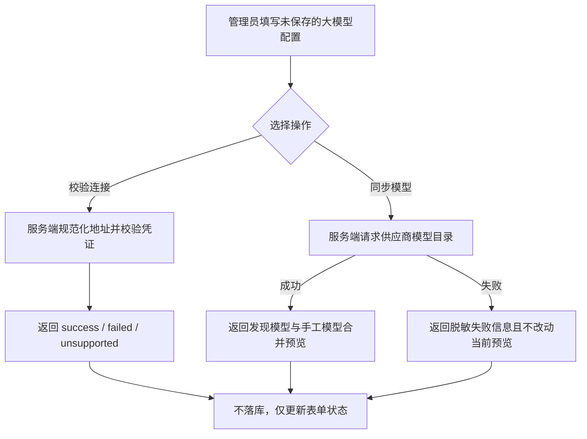
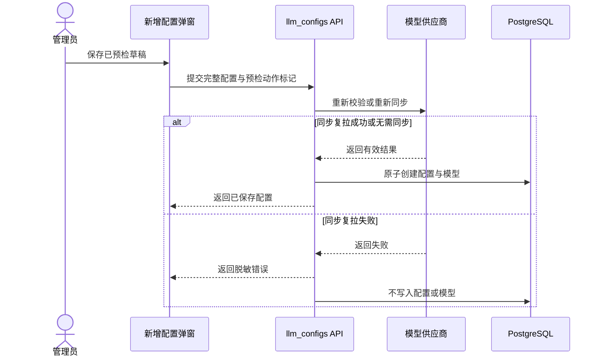

# 大模型接入配置草稿预检

## 1. 目标声明

### 背景

现有大模型接入配置要求管理员先保存配置实例，才能执行连接校验或同步模型。错误的地址、凭证或供应商参数因此会先形成一条无效配置；管理员也无法在保存前看到供应商真实返回的模型并完成可用模型选择。v0.7 需要把校验和模型同步前移到新增表单，同时保持密钥安全、namespace 权限和正式保存的原子性。

### 目标

- 管理员填写供应商、Base URL、凭证和扩展参数后，无需保存即可执行连接校验。
- 对支持模型发现的供应商，无需保存即可同步模型预览，并与手工模型合并后选择可用模型。
- 草稿校验和同步不创建 `llm_provider_config`、`llm_provider_model` 或任何临时数据库记录。
- 草稿凭证只用于当前请求，不进入响应、日志或持久化存储。
- 草稿关键参数变化后，立即废弃旧预检结果，避免把旧供应商或旧凭证的结果用于保存。
- 正式保存时由服务端重新校验输入；曾成功同步模型的草稿必须重新拉取模型并原子创建配置与模型。
- 正式同步复拉失败时不创建任何配置；仅连接校验失败时允许按既有治理规则保存，并明确记录 `failed` 状态。

### 不在范围内

- 保存可恢复的服务端草稿、草稿 ID 或草稿历史。
- 复用浏览器草稿预检返回的数据绕过正式保存时的服务端请求。
- 自动忽略连接失败、切换供应商、替换 Base URL 或改用其他凭证。
- 改变已保存配置的校验、同步和密钥更新规则。
- 为不支持在线校验或模型发现的供应商伪造成功结果。

## 2. 模块影响

| 模块 | 影响类型 | 说明 |
|------|---------|------|
| `llm_configs` | 修改 | 新增未持久化草稿校验、模型同步预览，以及创建时重新校验/同步的原子保存流程 |
| `namespaces` | 只读依赖 | 草稿接口继续绑定当前 namespace，并复用空间管理员权限 |
| `auth` | 只读依赖 | 草稿请求继续使用现有登录态、CSRF 和敏感接口保护，不新增认证方式 |

## 3. 功能描述

### 3.1 未保存草稿连接校验

正常流程：

1. 管理员打开新增配置弹窗，选择供应商并填写 Base URL、必需凭证和扩展参数。
2. 表单在供应商和非空 Base URL 已具备时允许点击“校验连接”。
3. 前端提交当前草稿内容，不提交配置名称，也不先创建配置实例。
4. 后端复用正式供应商目录、地址规范化、凭证字段校验和探测逻辑。
5. 接口返回 `success`、`failed` 或 `unsupported` 及脱敏说明，前端在表单内展示结果。

边界条件：

- 草稿接口权限与正式配置接口一致，仅 `superuser` 或当前 namespace `admin` 可调用。
- 缺少供应商、Base URL 或必填凭证时拒绝请求，不发起外部探测。
- 不支持在线校验的供应商返回 `unsupported`，仍允许按既有规则保存配置。
- 草稿校验不返回或持久化密钥、配置 ID、模型配置 ID。

异常处理：

- 地址非法返回 422；凭证字段不完整返回 400。
- 网络、认证、超时或响应异常返回脱敏失败信息，不创建数据库记录。
- 用户修改供应商、Base URL、凭证或扩展参数后，前端清除旧草稿状态和旧发现模型；手工补录模型可以保留。

### 3.2 未保存草稿模型同步

正常流程：

1. 管理员在未保存表单中点击“同步模型”。
2. 后端按当前供应商、地址与凭证请求模型目录。
3. 后端把发现模型与草稿中手工模型合并，应用当前 `enabled_model_ids`，返回无数据库 ID 的模型预览。
4. 前端仅在同步成功时替换发现模型列表，并允许管理员勾选可用模型或继续补录手工模型。
5. 此过程不创建配置、模型或临时草稿记录。

边界条件：

- 不支持自动发现时返回 `unsupported`，手工模型仍可继续维护。
- 预览模型只有业务字段，不包含持久化实体 ID。
- 自动发现模型和手工模型使用与正式保存相同的合并、去重和启用规则。

异常处理：

- 同步失败时保留前端当前模型选择，不用空结果覆盖已有预览。
- 供应商错误信息在返回前脱敏，不能包含草稿凭证。
- 校验或同步期间禁用校验、同步和保存按钮，避免并发请求产生交叉状态。

### 3.3 正式保存时重新确认

正常流程：

1. 前端保存时提交完整配置、手工模型、启用模型以及是否执行过草稿校验/成功同步的动作标记。
2. 若草稿只执行过连接校验，服务端使用正式创建请求中的地址和凭证再次校验，并把最终状态写入配置。
3. 若草稿成功同步过模型，服务端重新请求供应商模型目录，不信任浏览器预览作为发现模型事实来源。
4. 重新同步成功后，服务端把最新发现模型、手工模型和启用集合合并，在同一事务中创建配置与模型。

边界条件：

- `sync_models_on_create` 优先于单纯 `validate_on_create`；成功同步同时证明当前连接可用。
- 单纯连接校验失败沿用既有配置治理规则：允许保存配置，但写入 `failed` 与脱敏失败说明，供管理员修正后再次校验。
- 供应商不支持校验或同步时记录 `unsupported`，不伪装为成功。

异常处理：

- 正式模型同步复拉失败时返回 502，事务不创建 `llm_provider_config` 或 `llm_provider_model`。
- 创建过程中出现其他校验或数据库错误时整体回滚，不保留半条配置或部分模型。
- 正式保存结果以服务端重新执行结果为准，不能沿用已经因字段变化而失效的浏览器草稿状态。

## 4. 数据变更

无新增表或持久化字段。

调整已有请求模型说明：

| 请求模型 | 字段名 | 调整说明 |
|------|------|------|
| `LlmProviderConfigCreate` | `validate_on_create` | 表示正式创建时重新执行连接校验并保存最终状态，不持久化该布尔值 |
| `LlmProviderConfigCreate` | `sync_models_on_create` | 表示正式创建时重新拉取模型并原子保存，不持久化该布尔值 |

草稿请求和模型预览均为瞬时 API 数据，不写入 `llm_provider_config`、`llm_provider_model` 或其他临时表。正式创建后的生命周期仍由既有两张表承担。

## 5. API 设计

| Method | Path | 权限 | 用途 |
|--------|------|------|------|
| POST | `/llm/provider-configs/draft/validate` | `superuser` / namespace `admin` | 使用未保存的地址和凭证执行连接校验，不落库 |
| POST | `/llm/provider-configs/draft/sync-models` | `superuser` / namespace `admin` | 同步未保存配置的模型预览，不落库 |
| POST | `/llm/provider-configs` | `superuser` / namespace `admin` | 扩展 `validate_on_create`、`sync_models_on_create`，正式保存时重新执行 |

草稿请求包含 `provider_slug`、`base_url`、`secret_inputs`、`extra_config`、`manual_models` 与 `enabled_model_ids`。草稿响应只包含校验状态、脱敏说明和无数据库 ID 的模型预览，不返回 secret。

## 6. UI 页面

| 变更类型 | 页面名 | 路由 | 说明 |
|------|------|------|------|
| 修改 | 大模型接入配置弹窗 | `/system/llm-providers` | 新增配置未保存时即可校验连接、同步模型并选择模型 |

### 新增配置弹窗

- 布局：沿用基础配置、凭证、扩展参数、连接操作、模型管理和页脚区域；校验/同步按钮在新增态直接可用。
- 功能：草稿校验、草稿同步、模型预览、手工模型维护、可用模型选择、正式保存。
- 交互：供应商、Base URL、凭证或扩展参数变化时废弃旧预检结果；同步成功才替换发现模型；操作执行期间禁用并发按钮；保存成功后切换为已保存配置状态。
- 字段：新增态至少需要供应商和 Base URL 才允许预检；凭证必填规则由供应商目录决定；配置名称仍只在正式保存时必填。

## 7. 验收标准

- [ ] 管理员新增大模型配置时，无需先保存即可执行连接校验并看到成功、失败或不支持状态。
- [ ] 管理员无需先保存即可同步模型预览，并从发现模型与手工模型中选择可用模型。
- [ ] 草稿校验和同步完成后，数据库中不存在新增的配置、模型或临时草稿记录。
- [ ] 草稿接口不会返回、记录或持久化明文凭证，第三方错误在展示前完成脱敏。
- [ ] 修改供应商、Base URL、凭证或扩展参数后，旧预检状态和旧发现模型立即失效。
- [ ] 正式保存不会信任浏览器模型预览，而是由服务端重新校验或重新同步。
- [ ] 正式模型同步复拉失败时，配置和模型均不落库，不产生半完成数据。
- [ ] 单纯连接校验失败时允许按既有规则保存配置，并明确记录 `failed` 状态而非伪装成功。
- [ ] 不支持在线校验或模型发现的供应商返回 `unsupported`，仍可使用手工模型和既有保存流程。
