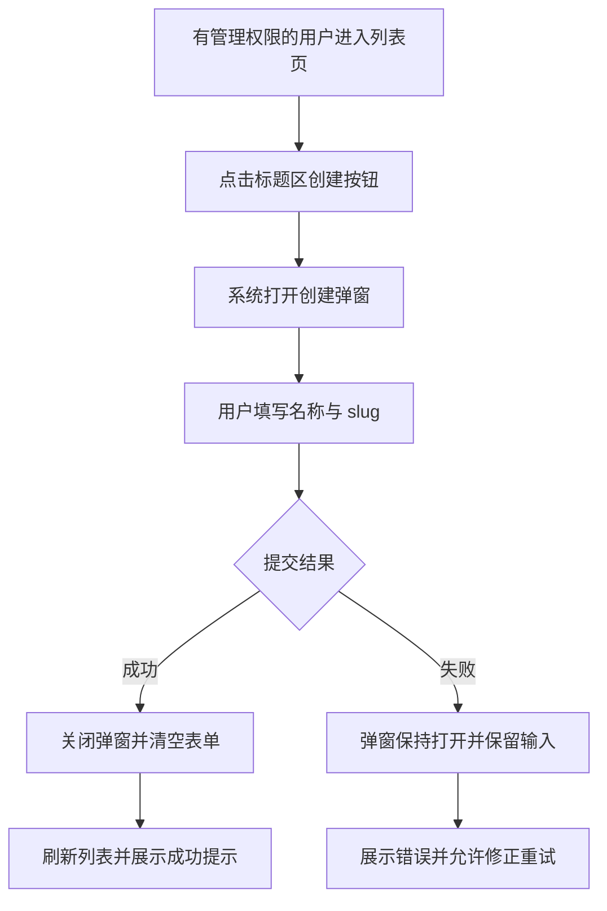

# 管理实体创建入口统一

## 1. 目标声明

### 背景

Items、用户、空间、Agent 和大模型接入配置等列表页已采用“页面标题区新增按钮 → 弹窗表单”的常见管理交互，但项目、Skill、MCP、Plugin 与 Spec 标准仍把创建表单常驻在列表上方。常驻表单挤占列表空间，也使同类管理页面的视觉层级和操作习惯不一致。

### 目标

- 项目、Skill、MCP、Plugin 与 Spec 标准列表页统一在标题区右侧展示创建按钮。
- 点击创建按钮后打开模态弹窗，在弹窗内完成现有字段填写与提交。
- 创建成功后关闭弹窗、清空表单、刷新对应列表并展示成功反馈。
- 创建失败时保留弹窗及用户输入，展示既有错误反馈，便于修正后重试。
- 继续按既有角色权限决定是否展示创建入口，不扩大任何管理权限。

### 不在范围内

- 修改创建接口、实体字段、数据表、唯一性规则或权限规则。
- 自动生成或隐藏 slug；本期只调整创建入口和表单承载方式。
- 把 Skill Version、MCP Revision、Plugin Version、Spec 标准版本等依赖当前实体的发布操作移到页面全局标题区。
- 调整编辑、归档、删除、详情导航和列表展示方式。
- 扩展到已经使用标题区按钮与弹窗创建的 Agent、大模型、Items、用户或空间页面。

## 2. 模块影响

| 模块 | 影响类型 | 说明 |
|------|---------|------|
| `project_management` | 修改 | 项目和 Spec 标准的顶层实体创建改为标题区按钮与弹窗 |
| `agent_management` | 修改 | Skill、MCP Server 与 Plugin 的身份创建改为标题区按钮与弹窗 |
| `items` | 只读参考 | 复用既有列表页新增交互规范，不修改 Items 页面或数据 |

## 3. 功能描述

### 3.1 项目创建

正常流程：

1. namespace Admin、Developer 或平台超级管理员进入项目列表。
2. 页面标题区右侧展示“新建项目”按钮，列表上方不再常驻创建表单。
3. 用户点击按钮后，在弹窗内填写项目名称和 slug。
4. 提交成功后弹窗关闭、字段清空，项目列表刷新并展示成功提示。

边界条件：

- 普通项目成员只能查看项目列表，不显示创建按钮。
- 名称和 slug 均为必填；提交期间按钮禁用，避免重复创建。

异常处理：

- 创建失败时弹窗不关闭、不清空输入，并展示现有错误提示。
- 用户主动关闭弹窗时不发起创建请求。

### 3.2 Skill、MCP Server 与 Plugin 身份创建

正常流程：

1. namespace Admin 或平台超级管理员进入对应能力列表。
2. 公共列表组件在标题区右侧展示与当前实体匹配的创建按钮。
3. 用户在弹窗中填写名称和 slug 后提交。
4. 创建成功后关闭弹窗、清空表单、刷新当前能力列表并展示成功提示。

边界条件：

- Developer 保持只读，不显示创建按钮。
- 三类页面继续复用同一身份管理组件，交互和错误处理保持一致。

异常处理：

- 接口校验、重复 slug 或权限错误继续使用既有错误处理；失败时保留表单状态。

### 3.3 Spec 标准创建与版本发布边界

正常流程：

1. 用户进入 Spec 标准列表，点击标题区右侧“新建标准”。
2. 弹窗收集标准名称和 slug，并按既有 namespace scope 创建标准。
3. 创建成功后关闭弹窗并刷新标准列表。
4. 某一标准的不可变版本发布继续保留在该标准卡片内，明确表达版本归属关系。

边界条件：

- 本期不改变 Spec 标准版本号、Manifest 或发布状态规则。
- 创建标准和发布标准版本是两个不同层级的操作，不合并为同一个全局弹窗。

异常处理：

- 标准创建失败时保留弹窗输入并展示错误；版本发布沿用原有卡片内错误处理。

## 4. 数据变更

无新增表、字段或字段行为调整。所有实体继续使用既有创建接口和生命周期。

## 5. API 设计

无接口变更。前端继续调用既有接口：

| 实体 | 既有接口 |
|------|---------|
| 项目 | `POST /projects` |
| Skill | `POST /skills` |
| MCP Server | `POST /mcp-servers` |
| Plugin | `POST /plugins` |
| Spec 标准 | `POST /spec-standards` |

## 6. UI 页面

| 变更类型 | 页面名 | 路由 | 说明 |
|------|------|------|------|
| 修改 | 项目列表 | `/projects` | 移除常驻创建卡片，标题区新增“新建项目”按钮与弹窗 |
| 修改 | Skill 管理 | `/system/skills` | 公共标题区新增创建按钮与身份创建弹窗 |
| 修改 | MCP Servers | `/system/mcp-servers` | 公共标题区新增创建按钮与身份创建弹窗 |
| 修改 | Plugin 管理 | `/system/plugins` | 公共标题区新增创建按钮与身份创建弹窗 |
| 修改 | Spec 标准 | `/system/spec-standards` | 移除常驻标准创建卡片，标题区新增“新建标准”按钮与弹窗 |

页面统一约定：

- 布局：标题与说明位于左侧；具备管理权限时，创建按钮位于同一标题区右侧；列表或卡片网格紧随标题区。
- 功能：创建弹窗承载现有名称、slug 字段和提交动作。
- 交互：弹窗可取消；成功时关闭和重置，失败时保持打开和保留输入；提交期间禁用取消之外的重复提交动作。
- 字段：名称和 slug 必填，继续沿用后端既有校验与唯一性约束。
- 导航：不新增、不删除、不移动任何左侧导航项。

## 7. 验收标准

- [ ] 有管理权限的用户在项目、Skill、MCP、Plugin 与 Spec 标准页面标题区右侧看到对应创建按钮。
- [ ] 五类页面的列表上方不再常驻顶层实体创建表单。
- [ ] 点击创建按钮会打开弹窗，名称与 slug 未填写完整时不能提交。
- [ ] 创建成功后弹窗关闭、输入清空、对应列表刷新并展示成功反馈。
- [ ] 创建失败后弹窗保持打开、输入不丢失，并展示可见错误提示。
- [ ] 无创建权限的角色看不到创建按钮，既有后端权限不变。
- [ ] Spec 标准的不可变版本发布仍保留在具体标准卡片内。
- [ ] Skill、MCP 与 Plugin 的版本或 Revision 发布仍保留在对应详情上下文中。
- [ ] 本需求不产生数据库迁移或 API 变更。
