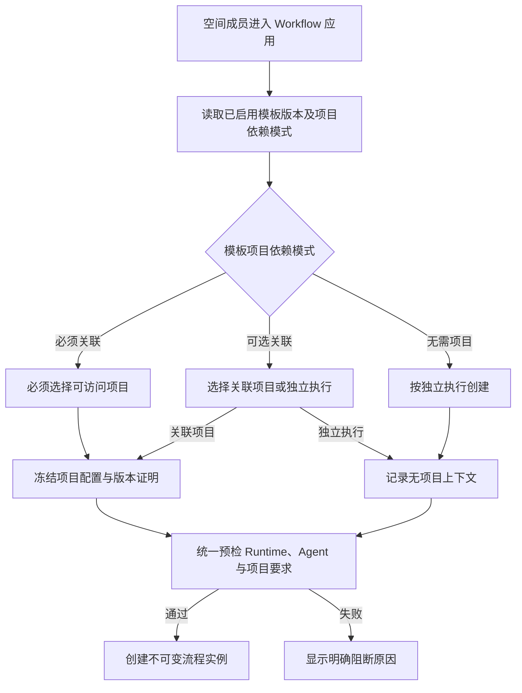

# 项目可选的流程执行

## 1. 目标声明

### 背景

v0.6 将 Workflow 实例定义为“项目任务”，创建、预检、权限和执行上下文都要求存在项目。这一约束把项目误当成了流程的宿主：即使一个流程只依赖自身输入和 Runtime，也必须先创建项目才能执行。

项目在流程中的实际职责应是提供一组可冻结、可追溯的配置与业务上下文，例如项目配置文件、`project.md`、Spec、代码仓库及其版本证明。流程是否依赖这些内容，应由不可变模板版本明确声明，而不是由平台根据现有数据猜测。

### 目标

- Workflow 模板版本明确声明项目依赖模式：必须关联、可选关联或无需项目。
- 空间成员可以直接创建并查看不依赖项目的流程任务。
- 可选关联项目的流程在创建时由用户明确选择“关联项目”或“独立执行”。
- 关联项目的任务继续冻结项目配置快照；独立任务明确记录为无项目上下文，不伪造空项目。
- 预检统一校验模板项目依赖、Runtime 解析、项目配置与 Agent Release，不满足条件时明确阻断。
- 保留既有项目任务接口和历史数据，已有项目流程的行为不发生隐式变化。

### 不在范围内

- 不让所有既有流程自动支持独立执行；每个模板必须按其真实依赖声明模式。
- 不为缺少项目配置、Runtime、仓库证明、Spec 或 Agent Release 的任务提供降级执行。
- 不在本需求中新增项目配置文件编辑器或 `project.md` 编辑器；本期冻结项目管理模块已经提供或已验证的配置来源。
- 不允许流程创建后切换关联项目或在独立/项目模式之间转换。
- 不修改 DAG、节点确认、外部副作用证明和人工恢复规则。

## 2. 模块影响

| 模块 | 影响类型 | 说明 |
|------|---------|------|
| `workflow_management` | 修改 | 拥有模板项目依赖契约和流程实例，支持独立执行、统一预检、空间级列表与权限分流 |
| `project_management` | 修改 | 作为可选上下文提供方，为关联项目的流程提供可冻结的项目配置、仓库与 Spec 快照 |
| `runtime_management` | 修改 | 独立流程不得继承项目默认 Runtime，继续按明确优先级解析节点目标 |
| `conversation_management` | 修改 | Workflow Agent 节点创建会话时允许项目为空，并保持无项目会话不生成项目快照 |
| `agent_management` | 只读依赖 | 继续校验目标 Runtime 上精确 Agent Release 是否已激活，不改变 Agent 数据模型 |
| `namespaces` | 只读依赖 | 独立流程使用空间成员权限，项目流程继续叠加项目成员权限 |

## 3. 功能描述

### 3.1 模板声明项目依赖

正常流程：

1. Workflow Package 在不可变 Manifest 中声明 `project_mode`。
2. 注册服务只接受 `required`、`optional`、`none` 三种值。
3. 模板目录与版本详情向前端返回该声明，应用据此展示创建选项。
4. 同一模板的新版本可以改变项目依赖模式，但已创建实例继续固定原版本和创建时上下文。

边界条件：

- `required`：创建和预检必须携带项目。
- `optional`：用户可以明确选择关联项目或独立执行。
- `none`：不得携带项目，避免用户误以为项目配置会参与执行。
- 为兼容已注册的 v0.6 Package，缺少该字段的历史 Manifest 按 `required` 解释；新注册 Package 必须显式声明。
- `requirements.repositories=true` 的模板只能声明 `required`，否则 Package 校验失败。

异常处理：

- Manifest 声明冲突时阻止注册，返回具体字段和冲突原因。
- 前端遇到未知模式时将该版本标记为不可用，不猜测或回退。

### 3.2 创建关联项目或独立流程

正常流程：

1. 用户进入 Workflow 独立应用，页面显示当前空间可见的该模板任务。
2. 页面根据启用版本的 `project_mode` 展示固定模式或执行方式选择。
3. 关联项目时，用户选择自己有权访问的项目；独立执行时不选择项目。
4. 用户填写模板输入和任务级 Runtime（若节点不能全部自行解析 Runtime）。
5. 服务端完成预检后创建实例，固定模板版本、模式、项目、Runtime 解析和上下文快照。
6. 创建成功后进入现有任务详情页。

边界条件：

- 项目与执行模式只在创建前选择，实例创建后不可修改。
- 关联项目时仅能选择当前空间且当前用户是项目成员的项目。
- 独立执行时的 Runtime 解析顺序为“节点 Runtime > 任务 Runtime”；不存在项目默认 Runtime。
- 关联项目时保持“节点 Runtime > 任务 Runtime > 项目默认 Runtime”。
- 若所有节点都声明了有效节点 Runtime，独立流程可以不再额外选择任务 Runtime。

异常处理：

- `required` 模板缺少项目、`none` 模板携带项目，返回 422 并说明模式冲突。
- 独立流程存在无法解析 Runtime 的节点时，预检返回节点级 `runtime_unresolved`，不选择任意平台 Runtime。
- 项目已归档、项目配置无效或运行目标没有仓库证明时，保持现有阻断行为。
- 幂等键重复但执行模式、项目、输入、模板版本或 Runtime 不一致时返回 409。

### 3.3 任务可见性与操作权限

正常流程：

1. Workflow 应用通过空间级实例列表读取当前用户可见的该模板任务。
2. 独立任务对当前空间成员可见和可操作。
3. 项目任务仅对项目成员可见和可操作。
4. 项目详情继续通过项目任务接口只展示本项目关联的流程。

边界条件：

- 空间级列表不得泄露当前用户无权访问项目的任务。
- 超级管理员继续按既有空间权限规则访问。
- 需要管理角色的外部状态证明等高风险操作继续要求 Admin/Developer，不因独立执行而放宽。

异常处理：

- 用户直接访问无权限项目任务时返回 404/403，与现有资源权限策略保持一致。
- 实例上下文模式与项目字段不一致时视为数据完整性错误并阻断执行，不自动修复。

## 4. 数据变更

### 新增字段

| 表名 | 字段名 | 类型 | 业务含义 |
|------|--------|------|---------|
| `workflow_instance` | `context_mode` | enum/string | 创建时固定为 `project` 或 `standalone`，用于显式区分项目上下文与独立执行 |

### 调整已有字段说明

| 表名 | 字段名 | 调整说明 |
|------|--------|---------|
| `workflow_instance` | `project_id` | 项目模式保持必填；独立模式允许为空。已有数据迁移为项目模式，不改变原关联 |
| `workflow_instance` | `project_context_snapshot` | 项目模式保存项目配置快照；独立模式保存明确的 `{ context_mode: "standalone" }` 上下文信封，不伪造项目、仓库或 Spec |
| `workflow_template_version` | `manifest` | 新注册版本增加 `project_mode`；历史缺失值只在读取兼容层按 `required` 解释 |

不新增执行过程表。节点修订、执行轮次、消息、附件、事件和最终产物继续复用现有追加式记录，能够完整保留独立与项目流程的生命周期。

## 5. API 设计

| Method | Path | 说明 |
|------|------|------|
| `POST` | `/workflow-templates/{template_id}/preflight` | `project_id` 改为可选，并按模板模式校验 |
| `GET` | `/workflow-instances` | 返回当前空间内当前用户可见的独立任务和有权访问的项目任务；支持模板版本/模板标识筛选 |
| `POST` | `/workflow-instances` | 统一创建独立或项目流程，Body 中携带可选 `project_id` |
| `GET` | `/projects/{project_id}/workflow-instances` | 保留现有项目详情兼容入口，只返回指定项目任务 |
| `POST` | `/projects/{project_id}/workflow-instances` | 保留兼容入口，按项目模式创建并复用统一创建逻辑 |

实例公开响应增加 `context_mode`，`project_id` 改为可空。所有实例详情、节点、附件、事件和 mutation 接口按实例模式执行统一权限守卫。

## 6. UI 页面

| 变更类型 | 页面名 | 路由 | 说明 |
|------|------|------|------|
| 修改 | Workflow 独立应用 | `/apps/:workflowSlug` | 按模板模式创建独立或项目流程，并展示当前用户可见任务 |
| 修改 | Workflow 任务详情 | `/apps/:workflowSlug/tasks/:instanceId` | 展示“项目流程/独立流程”及关联项目信息 |
| 保留 | 项目详情 | `/projects/:projectId` | 继续只展示本项目关联的流程任务 |
| 修改 | Workflow 管理 | `/system/workflows` | 在模板版本信息中展示项目依赖模式 |

### Workflow 独立应用

- 布局：模板说明、创建任务卡片、当前用户可见任务列表。
- 功能：根据模板模式选择执行方式、项目、任务 Runtime 并填写模板业务输入。
- 交互：`required` 固定显示项目选择；`optional` 显示“关联项目/独立执行”；`none` 固定显示独立执行。切换方式时清理不再适用的项目选择。
- 字段：项目只能从当前用户可访问项目中选择；Runtime 只能从当前空间兼容目录中选择；标题与模板输入保持必填。
- 任务列表：显示模式、项目名称（如有）、模板版本、状态和更新时间。

### Workflow 任务详情

- 布局：在现有任务摘要区增加上下文模式和关联项目信息。
- 功能：独立任务不显示项目快照刷新或项目入口；项目任务继续展示冻结的项目上下文。
- 异常：上下文数据不一致时显示阻断诊断，不隐藏或猜测项目。

本需求不新增导航项；继续使用 v0.7 已确认的独立 Workflow 左侧菜单。

## 7. 验收标准

- [ ] 新 Workflow Package 必须显式声明 `required`、`optional` 或 `none` 项目依赖模式，冲突声明无法注册。
- [ ] 历史未声明模式的模板仍按必须关联项目运行，已有项目任务保持可读可操作。
- [ ] 空间成员能从 Workflow 应用直接创建并进入允许独立执行的任务，无需先创建项目。
- [ ] 必须关联项目的模板不能独立执行；无需项目的模板不能携带项目。
- [ ] 独立任务不会获得项目默认 Runtime，Runtime 无法解析时明确阻断。
- [ ] 关联项目的任务继续冻结仓库、Spec 与可用项目配置证明；缺失证明时不降级执行。
- [ ] 空间级任务列表包含独立任务和用户有权访问的项目任务，但不泄露其他项目任务。
- [ ] 项目详情仍只显示本项目任务，既有项目创建接口保持兼容。
- [ ] 流程实例创建后不能更换项目或上下文模式。
- [ ] Workflow Agent 节点可为独立任务创建无项目会话，且不会生成虚假项目快照。
