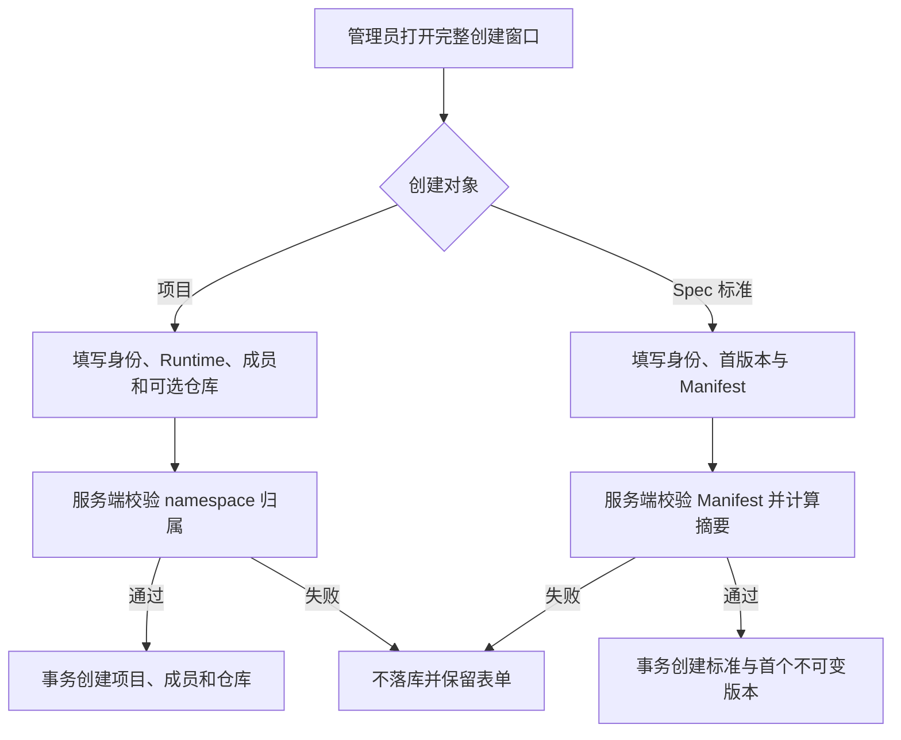

# 项目与 Spec 完整创建流程

## 1. 目标声明

### 背景

项目当前只提交名称和标识，忽略接口已支持的说明、默认 Runtime 和初始成员；仓库只能创建后再绑定。Spec 标准也只创建稳定身份，必须回到卡片中另行发布首个版本。两者都会产生无法承担预期业务用途的空壳记录。

### 目标

- 项目创建流程一次收集名称、项目标识、说明、默认 Runtime、初始成员和可选初始仓库。
- 默认 Runtime 必填；创建者自动成为成员，管理员可额外选择 namespace 成员。
- 初始仓库填写时，地址和用途必须同时完整，并与项目、成员在同一数据库事务创建。
- Spec 标准创建流程一次收集名称、标准标识、说明、版本号和 Manifest。
- Spec 标准身份与首个不可变版本在同一事务创建；Manifest 校验或版本创建失败时不留下标准空壳。

### 不在范围内

- 自动探测或匿名克隆 Git 仓库。
- 创建项目时自动创建 Spec 位置、绑定标准或创建 Workflow 任务。
- 修改既有项目、仓库和标准版本的不可变规则。
- 自动生成项目标识或标准标识。

## 2. 模块影响

| 模块 | 影响类型 | 说明 |
|------|---------|------|
| `project_management` | 修改 | 扩展项目原子创建输入，并新增标准身份与首版本原子创建能力 |
| `runtime_management` | 只读依赖 | 项目创建读取当前 namespace 可用 Runtime 作为默认 Runtime 候选 |
| `namespaces` | 只读依赖 | 项目创建读取 namespace 成员作为初始成员候选 |

## 3. 功能描述

### 3.1 项目完整创建

正常流程：用户填写基础信息，选择一个明确默认 Runtime 和初始成员；如填写仓库，则同时填写用途；服务端校验所有引用属于当前 namespace 后一次提交。

边界条件：创建者自动加入；超级管理员必须显式选择至少一位成员；仓库为空时允许明确暂不绑定；填写仓库任一字段时另一字段必填。

异常处理：Runtime、成员或仓库校验失败时事务回滚，创建窗口保持打开并保留输入。

### 3.2 Spec 标准与首版本创建

正常流程：用户填写标准身份、说明、首个 SemVer 和 Manifest JSON；服务端校验 Manifest、生成 canonical digest，并在同一事务创建标准和版本。

边界条件：当前页面创建 namespace 标准；平台标准仍要求超级管理员；首版本和 Manifest 必填。

异常处理：JSON 无效由前端阻止提交；业务 Manifest、摘要或唯一性校验失败时服务端不创建任何记录。

## 4. 数据变更

无新增表或字段。

调整请求模型：

| 请求模型 | 调整说明 |
|------|------|
| `ProjectCreate` | 新增可选 `initial_repositories`，与项目和成员同事务创建 |
| `SpecStandardCompleteCreate` | 新增组合请求，包含标准身份、首版本和 Manifest |

## 5. API 设计

| Method | Path | 说明 |
|------|------|------|
| POST | `/projects` | 扩展支持 `initial_repositories`，保持旧调用兼容 |
| POST | `/spec-standards/complete` | 原子创建标准身份和首个不可变版本 |

## 6. UI 页面

| 变更类型 | 页面 | 路由 | 说明 |
|------|------|------|------|
| 修改 | 项目列表 | `/projects` | 新建窗口包含基础配置、Runtime、成员和初始仓库 |
| 修改 | Spec 标准 | `/system/spec-standards` | 新建窗口包含首版本与 Manifest |

不调整导航。

## 7. 验收标准

- [ ] 新建项目必须选择默认 Runtime，并可同时选择成员和绑定首个仓库。
- [ ] 项目、成员和初始仓库任一创建失败时不留下半完成项目。
- [ ] 新建 Spec 标准必须同时提交首个版本和有效 Manifest。
- [ ] Spec Manifest 或版本创建失败时不留下无版本标准。
- [ ] 创建成功后列表刷新并进入可继续管理的完整状态。
