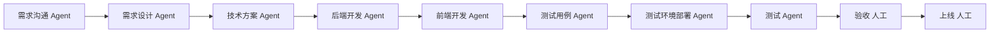

# Web 平台开发流

## 1. 目标声明

### 背景

现有“项目交付协作”仅覆盖人工澄清与交付摘要，无法表达从需求、设计、开发、测试到上线的完整 Web 平台研发过程。需要新增一个必须关联项目、多 Agent 协作、人工验收与上线确认的独立 Workflow 应用。

### 目标

- 新增“Web 平台开发流”应用，必须关联项目。
- 按确认顺序执行 8 个 Agent 节点、人工验收和人工上线节点。
- 模板执行配置页完成项目及各节点 Runtime/Agent 绑定。
- 新建页只填写任务名称和要做什么。
- 详情页顶部展示可点击流程图及当前步骤。
- 选中节点后，下方以 Agent 信息、产出物清单与预览、Agent 聊天三个页签展示节点内容。

### 不在范围内

- 不自动操作生产环境；上线节点记录人工上线结论。
- 不并行执行前后端节点，本期按用户给出的顺序形成线性流程。
- 不自动生成或激活缺失的 Agent。
- 不为部署、测试失败提供静默重试或跳过。

## 2. 模块影响

| 模块 | 影响类型 | 说明 |
|------|---------|------|
| `workflow_management` | 修改 | 新增 Package、模板执行配置、专属新建与详情组件 |
| `project_management` | 只读依赖 | 模板执行配置必须固定有效项目并由实例冻结项目上下文 |
| `agent_management` | 只读依赖 | 模板为八类节点绑定目标 Runtime 上的已激活 Release |
| `conversation_management` | 只读依赖 | 展示 Agent 节点会话并允许在当前节点继续沟通 |
| `runtime_management` | 只读依赖 | 执行 Agent 任务并约束测试环境部署副作用 |

前置条件：`workflow-application-instance-list.md` 与 `workflow-template-execution-configuration.md` 已实现。

## 3. 功能描述

### 3.1 新建 Web 平台开发流

正常流程：

1. 用户从应用实例列表点击“新建流程实例”。
2. 填写任务名称和要做什么。
3. 服务端读取当前模板执行配置修订，冻结项目、各节点 Runtime 与 Agent Release。
4. 预检通过后创建实例并进入详情页。

边界条件：

- 项目由模板执行配置固定，实例页面不重新选择。
- 全部 Agent 节点必须已在模板中配置；同一个 Agent 可以承担多个节点。
- 测试环境部署节点标记为有副作用，要求幂等完成证明和必要 Tool 审批。

异常处理：

- 模板配置、项目、Runtime、仓库证明或 Agent 任一不满足时阻止创建并逐项显示原因。
- 不自动替换不兼容 Agent 或 Runtime。

### 3.2 专属流程详情

正常流程：

1. 页面顶部按节点顺序展示流程图，并突出当前运行、等待或阻断步骤。
2. 用户点击任一节点，切换下方详情，不改变实际流程状态。
3. Agent 信息页签展示该节点冻结的 Agent、Runtime、Release 和执行状态。
4. 产出物页签汇总节点修订输出和正式 Workflow Artifact，并支持安全文本/JSON预览。
5. Agent 聊天页签展示节点会话消息；Agent 节点允许发送后续消息。
6. 人工验收节点提交接受或拒绝结论；拒绝按现有修订传播规则要求上游更新。
7. 人工上线节点记录上线结果、环境和说明后完成流程。

边界条件：

- 点击流程图只切换查看节点，不允许越过前置节点执行。
- 人工节点的 Agent 信息和聊天页签显示“不适用”，不伪造 Agent 会话。
- 二进制或不安全产物不在浏览器内预览，只展示安全元数据。

异常处理：

- 节点执行失败或外部状态不确定时在流程图和详情中明确标记。
- 测试环境部署缺少完成证明时进入人工处理，不自动重试。
- SSE 中断时按既有游标恢复，页面保留最近已确认状态。

## 4. 数据变更

无独立业务表。流程定义、实例、节点、修订、执行、确认、Artifact、会话和 Agent 角色绑定均复用 Workflow 平台实体。

## 5. API 设计

复用 Workflow 模板执行配置、实例、节点详情、消息、确认、事件和附件接口。应用新建页只提交任务名称与业务输入；详情页按节点读取修订、Artifact、消息及冻结 Agent 信息。

## 6. UI 页面

| 变更类型 | 页面名 | 路由 | 说明 |
|------|------|------|------|
| 新增 | Web 平台开发流新建页 | `/apps/web-platform-development/new` | 仅填写任务名称和要做什么 |
| 新增 | Web 平台开发流详情页 | `/apps/web-platform-development/tasks/:instanceId` | 流程图、节点选择与三个内容页签 |

详情页顶部流程图在桌面端横向展示，空间不足时横向滚动。节点使用状态颜色和图标区分未开始、进行中、等待、完成、失败及阻断；下方 Tabs 每次只展示当前节点内容。

## 7. 验收标准

- [ ] Workflow 卡片页出现“Web 平台开发流”，进入后使用通用实例列表。
- [ ] 模板执行配置必须固定项目、各节点 Runtime 并完整绑定八个 Agent 节点。
- [ ] 新建实例页面只填写任务名称和要做什么。
- [ ] 十个节点按确认顺序推进，不能通过点击流程图越级执行。
- [ ] 顶部流程图准确突出当前节点，并允许切换查看任一节点。
- [ ] Agent 信息页签显示实例冻结的 Release 与 Runtime。
- [ ] 产出物页签列出节点修订输出和正式 Artifact，并安全预览支持的内容。
- [ ] Agent 聊天页签显示节点会话，人工节点明确显示不适用。
- [ ] 测试环境部署缺少副作用证明时阻断并进入人工处理。
- [ ] 验收和上线均由人工提交，不自动操作生产环境。
