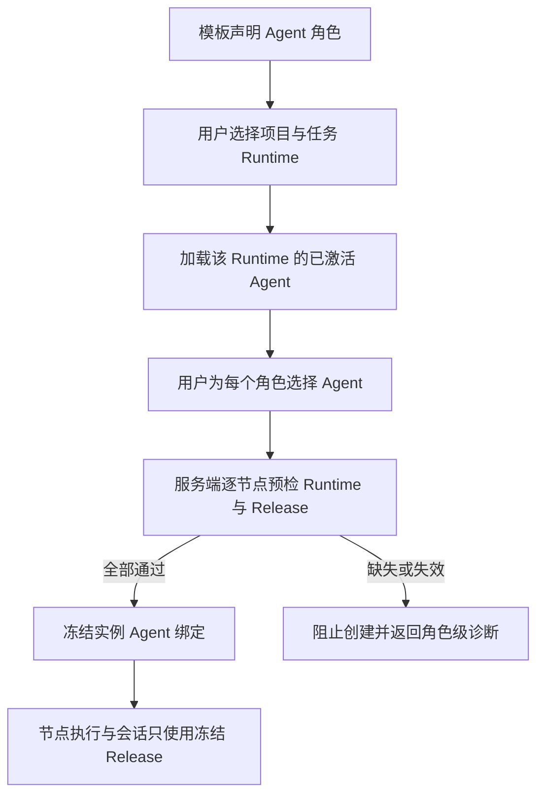

# Workflow Agent 角色绑定（已由模板执行配置替代）

> 本 PRD 原先设计为在新建流程实例时由业务用户选择 Runtime 和 Agent。该方案已被本期后续确认的 [`workflow-template-execution-configuration.md`](./workflow-template-execution-configuration.md) 替代。
>
> 保留本文件用于记录需求演进；实现和验收均以模板执行配置 PRD 为准。实例级 `agent_bindings` 不再作为用户输入，Agent/Runtime 在模板配置页发布并由新实例冻结。

## 1. 目标声明

### 背景

当前 Agent 节点必须在不可变 Workflow Package 中写死一个 `agent_release_id`。平台级 Package 无法预先知道每个空间中实际存在的 Agent Release，因此不能正常发布可复用的多 Agent 流程。按名称或唯一标识自动寻找 Agent 会破坏精确版本和无降级原则。

### 目标

- 模板 Agent 节点可以声明稳定的 Agent 角色，而不是写死空间内 UUID。
- 应用专属新建页为每个角色选择目标 Runtime 上已激活的 Agent Release。
- 创建实例时校验完整性并冻结角色、Runtime、Release 与 Resolved Spec digest。
- 执行、详情和审计只使用实例冻结的 Agent，不随后续激活变化。

### 不在范围内

- 不按 Agent 名称、唯一标识或能力相似度自动匹配。
- 不在执行过程中热替换 Agent。
- 不允许缺少角色绑定时回退到默认 Agent 或普通模型。
- 不修改 Agent Release 和 Activation 自身生命周期。

## 2. 模块影响

| 模块 | 影响类型 | 说明 |
|------|---------|------|
| `workflow_management` | 修改 | 增加模板角色声明、实例绑定记录、预检、执行解析和节点详情 |
| `agent_management` | 只读依赖 | 提供目标 Runtime 当前已激活的精确 Agent Release 目录 |
| `runtime_management` | 只读依赖 | 每个角色绑定必须在节点解析到的 Runtime 上处于已激活状态 |
| `conversation_management` | 只读依赖 | Agent 节点会话使用实例冻结的 Agent Release 创建参与者 |

## 3. 功能描述

### 3.1 模板角色声明

正常流程：

1. Agent 节点声明 `agent_role_key`，节点名称作为用户可见角色名称。
2. 固定内部 Agent 的模板仍可声明精确 `agent_release_id`。
3. 同一节点只能使用角色或固定 Release 中的一种方式。

边界条件：

- 角色键在模板版本内稳定，可由多个节点复用。
- 非 Agent 节点不得声明 Agent 角色或 Release。
- 新模板注册时缺失两种声明之一或同时声明两者均失败。

### 3.2 实例角色绑定

正常流程：

1. 新建页读取模板所需角色和目标 Runtime 的已激活 Agent。
2. 用户逐角色选择 Agent；允许同一个 Agent 承担多个角色。
3. 预检确认 Release 属于当前空间，并在该节点 Runtime 上处于 current active 状态。
4. 创建实例时写入不可变绑定记录，同时把解析结果保存到节点运行时快照。

边界条件：

- 绑定按角色提交，额外未知角色和缺少必要角色均拒绝。
- 幂等创建会比较完整角色绑定，不能用相同幂等键更换 Agent。
- Agent 后续激活新版本只影响新实例。

异常处理：

- Release 未激活、Runtime 不匹配或 digest 不一致时返回角色和节点级错误。
- 执行时冻结 Release 已不可用则节点进入 blocked，不自动更换。

## 4. 数据变更

### 新增表

| 表名 | 用途说明 |
|------|---------|
| `workflow_instance_agent_binding` | 保存实例中每个 Agent 角色冻结的 Runtime、Release 与 Resolved Spec digest |

### 新增字段

| 表名 | 字段名 | 类型 | 业务含义 |
|------|--------|------|---------|
| `workflow_node_definition` | `agent_role_key` | varchar(128), nullable | Agent 节点需要在创建实例时解析的角色键 |

绑定表包含 `workflow_instance_id`、`role_key`、`runtime_profile_id`、`agent_release_id`、`resolved_spec_digest`、`created_at`，并保证一个实例中每个角色唯一。

## 5. API 设计

- `POST /workflow-templates/{template_id}/preflight`：请求增加 `agent_bindings`。
- `POST /workflow-instances` 及项目兼容创建接口：请求增加 `agent_bindings`。
- `GET /workflow-instances/{id}`：返回实例 Agent 绑定摘要。
- `GET /workflow-instances/{id}/nodes/{key}`：返回该节点实际冻结的 Agent 信息。

## 6. UI 页面

Agent 角色选择属于各应用专属新建页。平台提供统一类型和 API，不提供一个无法表达业务含义的通用角色表单。

每个角色选择器展示 Agent 名称、Release 版本/摘要和目标 Runtime；失效选项不可提交。节点详情的 Agent 信息页签展示冻结信息，而不是当前最新激活版本。

## 7. 验收标准

- [ ] 平台级 Workflow Package 可以通过角色声明定义 Agent 节点，不写死空间 UUID。
- [ ] 新建实例必须完整绑定全部角色，未知或缺失角色被拒绝。
- [ ] 同一 Agent 可以承担多个角色，但每个绑定都保存精确 Release 与 Runtime。
- [ ] Agent 后续升级不会改变已有实例。
- [ ] 执行时绑定失效会明确阻断，不自动匹配其他 Agent。
- [ ] 节点详情显示实际冻结的 Agent 信息。
