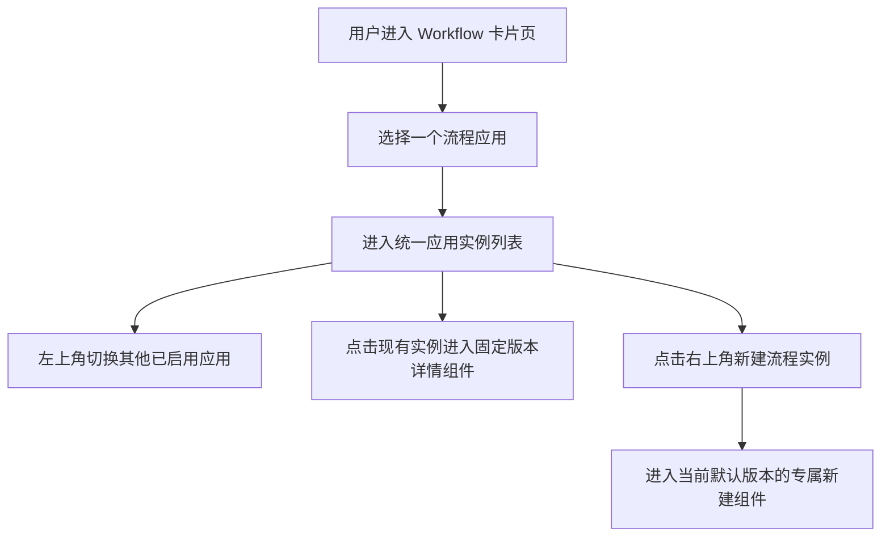

# Workflow 应用与实例列表

## 1. 目标声明

### 背景

当前 `/apps/:workflowSlug` 由每个 Workflow 前端组件同时实现应用标题、创建表单和实例列表，导致应用之间的导航、列表字段和新建入口不一致。应用级差异应集中在“如何创建”和“如何查看详情”，而应用选择与实例管理应由平台提供统一外壳。

### 目标

- `/workflows` 保持应用卡片目录。
- `/apps/:workflowSlug` 统一展示应用切换器、实例列表和“新建流程实例”按钮。
- 新建页面与实例详情页面继续由固定版本应用组件独立实现。
- 历史任务仍按创建时固定的 `component_key` 加载详情组件。

### 不在范围内

- 不允许远程加载应用代码或为未知组件提供通用降级详情页。
- 不统一不同应用的新建字段和详情布局。
- 不改变模板启用、项目依赖、实例权限和不可变版本规则。

## 2. 模块影响

| 模块 | 影响类型 | 说明 |
|------|---------|------|
| `workflow_management` | 修改 | 统一应用实例列表和前端注册契约，新增应用专属新建路由 |
| `namespaces` | 只读依赖 | 只展示当前空间已启用应用和当前用户可见实例 |

## 3. 功能描述

### 3.1 应用实例列表

正常流程：

1. 用户从 `/workflows` 的应用卡片进入 `/apps/:workflowSlug`。
2. 页面左上角显示当前应用选择器，可切换当前空间其他已启用应用。
3. 页面主体展示当前应用下用户有权限访问的流程实例。
4. 列表右上角显示“新建流程实例”，进入 `/apps/:workflowSlug/new`。
5. 点击实例进入 `/apps/:workflowSlug/tasks/:instanceId`。

边界条件：

- 应用选择器只包含已启用且组件随当前构建发布的应用。
- 实例列表覆盖该模板的所有历史版本，而非只显示当前默认版本。
- 项目实例继续只对项目成员可见；独立实例按空间权限可见。
- 新建页使用进入页面时解析到的当前默认启用版本。

异常处理：

- 应用被停用或组件缺失时显示明确不可用状态，不跳转到其他应用。
- 实例固定组件缺失时阻止打开详情并显示固定版本信息。
- 切换应用失败时保留当前页面，不显示其他应用的数据。

## 4. 数据变更

无数据表或字段变更。复用模板、版本、应用注册、启用关系与流程实例。

## 5. API 设计

复用 `GET /workflow-templates` 和 `GET /workflow-instances`。空间级实例列表按模板身份筛选时必须覆盖该模板全部版本，并继续执行实例权限过滤。

## 6. UI 页面

| 变更类型 | 页面名 | 路由 | 说明 |
|------|------|------|------|
| 保留 | Workflow 应用目录 | `/workflows` | 以卡片展示可用流程应用 |
| 修改 | Workflow 应用实例列表 | `/apps/:workflowSlug` | 通用应用切换器、实例列表和新建按钮 |
| 新增 | Workflow 应用新建页 | `/apps/:workflowSlug/new` | 加载当前默认版本的应用专属创建组件 |
| 保留并调整职责 | Workflow 实例详情 | `/apps/:workflowSlug/tasks/:instanceId` | 加载实例固定版本的应用专属详情组件 |

前端注册契约由 `Application + Task` 调整为 `Create + Task`。历史组件注册继续保留，历史详情不被新版本替换。

## 7. 验收标准

- [ ] Workflow 菜单进入应用卡片页，卡片进入统一实例列表。
- [ ] 应用页左上角能够切换当前空间其他可用应用。
- [ ] 页面主体只展示当前应用且当前用户有权访问的全部历史版本实例。
- [ ] 列表右上角“新建流程实例”进入应用专属新建页。
- [ ] 实例详情继续按实例固定组件加载，未知组件不会被通用页面替代。
