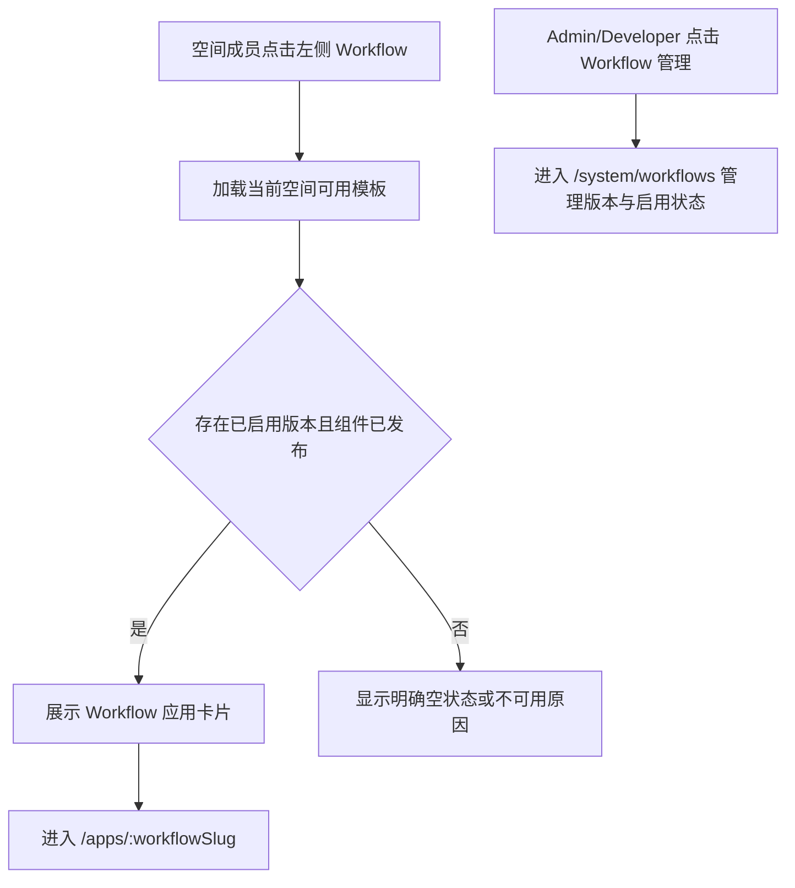

# Workflow 独立入口

## 1. 目标声明

### 背景

AI 工作台在 v0.7 收敛为 Chat 与 Agent 会话，但既有 Workflow Package、独立应用和项目任务仍需保留。当前普通成员主要从 AI 工作台的 Workflow 标签进入应用，而 `/system/workflows` 是 Admin/Developer 使用的模板管理页，二者不能混为一个入口。

### 目标

- 从 AI 工作台完全移除 Workflow 查询、标签和应用卡片。
- 在全局左侧菜单新增独立“Workflow”入口，路由为 `/workflows`。
- 独立页面面向当前空间成员，列出当前空间已启用且前端组件已随构建发布的 Workflow 应用。
- 用户从目录进入现有 `/apps/:workflowSlug` 独立应用。
- 保留 `/system/workflows` 作为 Admin/Developer 的模板版本与启用管理页面。

### 不在范围内

- 删除 Workflow 后端、数据库、Package、项目任务或独立应用路由。
- 合并用户侧 Workflow 目录与系统管理页。
- 修改 Workflow 执行引擎、DAG、节点、确认或 Runtime 解析规则。
- 为未知或缺失的前端组件提供通用降级任务页。

## 2. 模块影响

| 模块 | 影响类型 | 说明 |
|------|---------|------|
| `workflow_management` | 修改 | 新增普通成员可见的独立应用目录，并维持既有模板与任务能力 |
| `conversation_management` | 修改 | AI 工作台解除 Workflow 目录依赖，不再请求模板列表 |
| `namespaces` | 只读依赖 | 以当前空间成员身份过滤可见 Workflow |

## 3. 功能描述

### 3.1 用户侧 Workflow 目录

正常流程：

1. 已登录空间成员从全局左侧菜单点击“Workflow”。
2. 页面请求当前空间可用模板，只展示至少一个已启用版本的模板。
3. 每张卡片展示名称、说明、当前默认或可用版本数量。
4. 用户点击卡片后进入模板已注册的 `/apps/:workflowSlug` 独立应用。

边界条件：

- 菜单对所有已登录空间成员可见，不赋予模板启停管理权限。
- `/system/workflows` 继续仅对具备管理权限的角色展示。
- 未知 `component_key` 或组件未随当前前端构建发布时不能显示为可正常使用的应用。

异常处理：

- 模板目录加载失败时展示重试和错误，不显示空白页。
- 没有已启用 Workflow 时展示空状态，不回退到 AI 工作台或系统管理页。
- 应用组件缺失时明确标记不可用，不加载远程 JavaScript 或通用降级页面。

## 4. 数据变更

无数据表或字段变更。页面复用现有 Workflow Template、Version、Application 与 namespace enablement 数据。

## 5. API 设计

复用现有 `GET /workflow-templates`。该接口继续按当前 namespace 和成员权限返回模板、版本、启用状态与应用注册信息；本期不新增 Workflow mutation API。

## 6. UI 页面

| 变更类型 | 页面名 | 路由 | 说明 |
|------|------|------|------|
| 新增 | Workflow 应用目录 | `/workflows` | 普通空间成员浏览已启用流程应用 |
| 修改 | 全局侧边栏 | 全局布局 | 新增独立“Workflow”用户入口 |
| 修改 | AI 工作台 | `/workspace` | 删除 Workflow 标签、查询与应用卡片 |
| 保留 | Workflow 模板管理 | `/system/workflows` | Admin/Developer 管理模板版本与启用状态 |

### Workflow 应用目录

- 布局：页面标题、用途说明、响应式应用卡片网格和空/错误状态。
- 功能：查看已启用应用及版本摘要，进入独立应用。
- 交互：卡片整块可点击；不可用组件只展示原因，不允许进入伪装页面。
- 导航：全局左侧菜单新增“Workflow”，与“AI 工作台”并列；系统管理分组中的“Workflow 管理”保持不变。

## 7. 验收标准

- [ ] AI 工作台不再请求或展示 Workflow 模板、标签或卡片。
- [ ] 所有已登录空间成员能在左侧看到独立“Workflow”菜单并进入 `/workflows`。
- [ ] `/workflows` 只展示当前空间至少有一个已启用版本的 Workflow 应用。
- [ ] 点击应用后进入现有独立应用路由，模板版本与组件注册规则不变。
- [ ] `/system/workflows` 仍是独立管理页面，普通成员不会因用户侧目录获得启停权限。
- [ ] 无可用应用、接口失败或组件缺失时显示明确状态，不做远程加载或通用降级。
