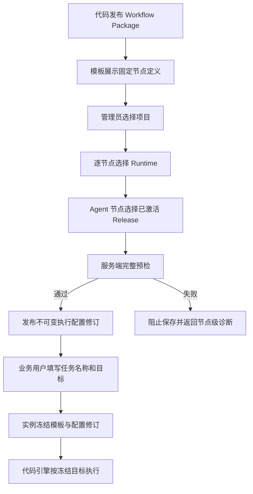

# Workflow 模板执行配置

## 1. 目标声明

### 背景

当前 Workflow Package 已能在代码中定义节点、顺序、输入输出和执行规则，但 Runtime 与 Agent 被放在新建实例页面选择。业务用户每创建一个任务都要理解 Runtime、Agent Release 和角色绑定，既割裂业务操作，也使同一种流程的执行环境不一致。

Workflow 应拆成三个职责清晰的层次：代码负责流程节点定义和实际执行；模板配置负责把节点部署到明确的项目、Runtime 与 Agent；流程实例只表达一个具体业务任务。

### 目标

- Workflow Package 继续以代码定义节点、边、节点类型、Schema、Handler、确认和副作用规则。
- Namespace Admin/Developer 在 Workflow 模板页面配置项目及每个可执行节点的 Runtime/Agent。
- 每次完整保存生成不可变执行配置修订，修改只影响后续新实例。
- 新建流程实例只填写任务名称和“要做什么”，不选择项目、Runtime 或 Agent。
- 实例创建时冻结当前模板版本和当前执行配置修订，执行中不随模板配置变化。

### 不在范围内

- 不在浏览器中编辑节点定义、节点顺序、代码 Handler 或 Schema。
- 不按名称、能力相似度或默认值自动匹配 Agent。
- 不在多个 Runtime 中自动调度或故障转移；每个可执行节点绑定一个明确 Runtime。
- 不允许缺少完整模板执行配置时创建实例。
- 不改变已有实例已经冻结的项目、Runtime、Agent Release 或 Resolved Spec digest。

## 2. 模块影响

| 模块 | 影响类型 | 说明 |
|------|---------|------|
| `workflow_management` | 修改 | 增加模板执行配置及不可变修订；实例从当前配置解析并冻结执行目标 |
| `agent_management` | 只读依赖 | Agent 节点只能绑定目标 Runtime 上当前已激活的精确 Agent Release |
| `runtime_management` | 只读依赖 | Agent/代码节点绑定明确 Runtime，并在配置保存和实例创建时校验可用性 |
| `project_management` | 只读依赖 | `required` 流程在模板执行配置中固定一个有效项目并冻结项目上下文 |

## 3. 功能描述

### 3.1 模板执行配置

正常流程：

1. Admin/Developer 进入 `/system/workflows`，打开某个已注册模板版本的执行配置。
2. 页面只读展示代码定义的节点顺序、节点类型和副作用标记。
3. `project_mode=required` 时选择一个未归档且有权限的项目；`optional` 时可选择项目；`none` 时不显示项目配置。
4. 为每个 Agent/代码节点选择一个明确 Runtime；人工节点不配置 Runtime。
5. 为每个 Agent 节点选择该 Runtime 上当前已激活的精确 Agent Release；同一个 Agent 可以承担多个节点。
6. 提交时服务端一次性校验项目上下文、Runtime 能力、仓库证明、Agent 激活状态和 digest。
7. 全部通过后创建新的不可变配置修订并将其设为当前修订；旧修订继续供历史实例读取。

边界条件：

- 配置以 `namespace + template_version` 为作用域，不修改平台级不可变 Package。
- 一个节点只能绑定一个 Runtime；Agent 节点同时必须绑定一个 Agent Release。
- 代码节点只绑定 Runtime；人工节点不能声明 Runtime 或 Agent。
- 同一 Agent Release 只有在每个目标 Runtime 上分别处于 current active 状态时才可保存。
- 切换 Runtime 后必须重新选择该节点 Agent，不能保留未经验证的旧 Release。

异常处理：

- 任一节点缺少配置时阻止整次保存，不产生部分修订。
- 项目归档、Runtime 不可用、仓库证明缺失、Agent 未激活或 digest 不一致时返回对应节点和角色诊断。
- 不使用项目默认 Runtime、默认 Agent、名称匹配或其他降级路径补齐配置。

### 3.2 业务任务创建

正常流程：

1. 用户从 Workflow 应用实例列表点击“新建流程实例”。
2. 页面只显示“任务名称”和“要做什么”；应用可把“要做什么”映射为自身输入 Schema。
3. 服务端读取当前默认启用模板版本及其当前执行配置修订。
4. 服务端再次校验当前配置仍可用于新任务，并冻结项目、节点 Runtime、Agent Release、Resolved Spec digest 和项目上下文。
5. 实例创建成功后进入应用专属详情页。

边界条件：

- 模板没有当前完整配置时，新建按钮可见但提交被明确阻止，并提示管理员先完成配置。
- 配置发布后创建的新实例使用新修订；创建前已存在的实例不变化。
- 幂等创建比较任务名称、业务输入、模板版本和执行配置修订，不能用同一幂等键切换配置。
- 项目型流程的项目来自模板执行配置，不在实例表单重新选择。

异常处理：

- 创建瞬间配置已被替换时，服务端以读取并冻结到的明确修订完成或返回冲突，不混合两个修订。
- 配置引用失效时阻止创建并给出配置级诊断，不在实例层要求用户临时修复 Runtime/Agent。

## 4. 数据变更

### 新增表

| 表名 | 用途说明 |
|------|---------|
| `namespace_workflow_configuration` | 保存 namespace 内某模板版本当前生效的执行配置修订指针 |
| `workflow_execution_configuration_revision` | 保存不可变的项目绑定、修订号、内容摘要和创建审计 |
| `workflow_execution_node_binding` | 保存配置修订中每个节点的明确 Runtime 与可选 Agent Release |

### 新增字段

| 表名 | 字段名 | 类型 | 业务含义 |
|------|---------|------|---------|
| `workflow_instance` | `execution_configuration_revision_id` | uuid, nullable FK | 新实例冻结的模板执行配置修订；历史实例允许为空 |

执行配置修订按 `(namespace_id, template_version_id, revision)` 唯一；节点绑定按 `(configuration_revision_id, node_key)` 唯一。当前指针与修订分离，避免通过覆盖配置改写历史。

已有 `workflow_instance_agent_binding` 保留，实例创建时从配置修订复制精确 Agent/Runtime/digest 快照；不再接收用户提交的实例级绑定。

## 5. API 设计

- `GET /workflow-templates/{template_id}/versions/{version_id}/execution-configuration`：读取节点定义、当前配置修订及可选项目/Runtime/Agent 目录。
- `PUT /workflow-templates/{template_id}/versions/{version_id}/execution-configuration`：完整校验并发布新的配置修订，仅 Admin/Developer 可用。
- `POST /workflow-templates/{template_id}/preflight`：调整为校验当前执行配置是否仍可创建任务，不接收临时项目、Runtime 或 Agent 覆盖。
- `POST /workflow-instances`：请求只包含任务名称、模板版本和业务输入；项目、Runtime、Agent 从当前配置解析。
- `GET /workflow-instances/{id}`：返回冻结的执行配置修订标识和实例级执行快照。

项目兼容创建接口只允许目标项目与配置修订中的项目一致，不接受实例级覆盖。

## 6. UI 页面

| 变更类型 | 页面名 | 路由 | 说明 |
|------|------|------|------|
| 修改 | Workflow 模板管理 | `/system/workflows` | 增加版本执行配置入口及配置完整性状态 |
| 新增 | Workflow 模板执行配置 | `/system/workflows/:templateId/versions/:versionId/configuration` | 项目选择、节点 Runtime 与 Agent 完整配置 |
| 修改 | Workflow 应用新建任务 | `/apps/:workflowSlug/new` | 仅填写任务名称和要做什么 |

模板执行配置页只读展示代码节点定义；Agent/代码节点选择 Runtime，Agent 节点再选择已激活 Release，人工节点显示“不需要执行环境”。切换 Runtime 必须清空对应 Agent。保存必须一次通过全部预检并生成新修订。

应用新建页不展示项目、Runtime、Agent、Release 或角色等平台配置字段。创建失败时显示“模板执行配置不可用”及管理员处理入口，不让业务用户临时选择替代目标。

## 7. 验收标准

- [ ] Workflow 节点定义、顺序、Schema 和执行代码仍只能随 Package 发布。
- [ ] Admin/Developer 可在模板页面完整配置项目及每个可执行节点的 Runtime/Agent。
- [ ] Agent 只能选择目标 Runtime 上已激活的精确 Release，同一 Agent 可承担多个节点。
- [ ] 人工节点不配置 Runtime 或 Agent。
- [ ] 配置保存生成不可变修订，旧实例不会因后续配置变化而改变。
- [ ] 业务用户新建实例时只看到任务名称和“要做什么”。
- [ ] 实例冻结当前配置修订、项目上下文、节点 Runtime 和 Agent Release。
- [ ] 配置缺失或失效时阻止创建，不使用默认值、名称匹配或自动降级。
