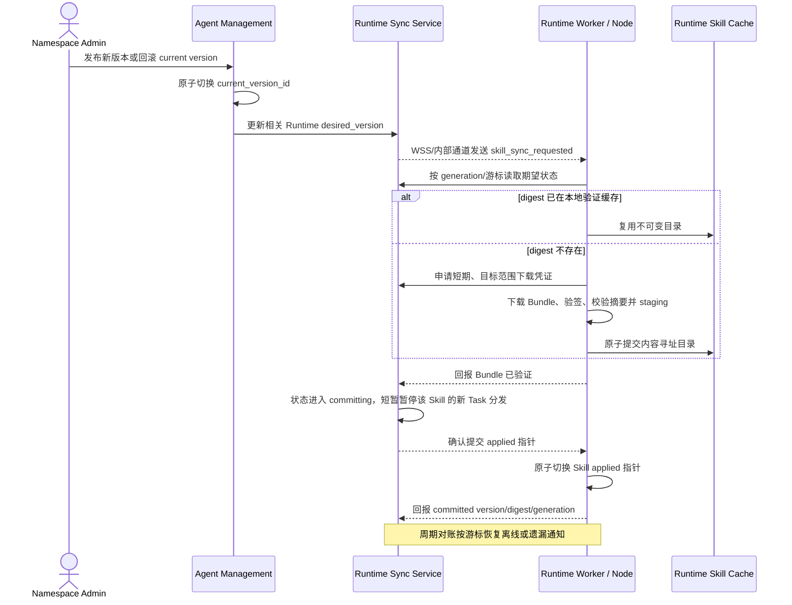
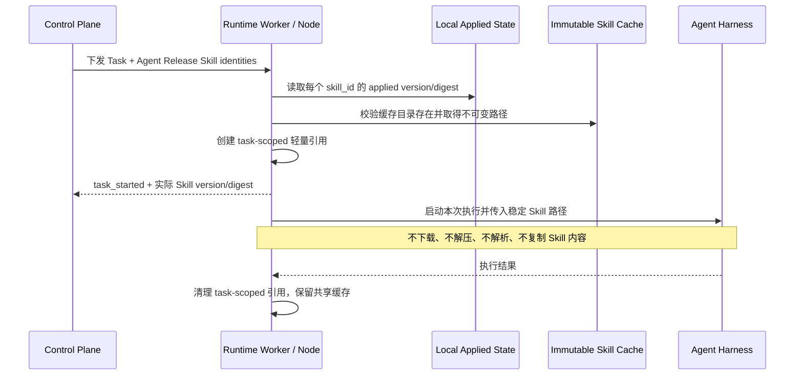

# Skill 身份绑定、Runtime 同步与任务使用

## 1. 目标声明

### 背景

当前 Agent 草稿绑定精确 Skill Version，Resolver 把该版本的完整文件以 Base64 放入 `ResolvedAgentSpec`；Agent Release 部署时再把完整内容发送到 Runtime，每个 Task snapshot 还会复制同一份 Skill 内容。这使用户必须理解并维护版本选择，也让 Release、任务记录、网络传输和 Runtime 物化反复承载相同文件。

Skill 内容版本对于历史、审计和回滚是必要的，但不应成为 Agent、Plugin、Session 或 Workflow 的业务配置。使用者只需要声明“使用哪个 Skill”。Skill 更新应在任务链路之外由 Runtime 同步；任务开始时只把已经同步到本地的不可变缓存目录绑定到本次执行，不下载、不解压、不解析、不复制 Skill 内容。

### 目标

- Agent 草稿和 Plugin contribution 只引用 Skill 身份，不选择或保存 Skill Version。
- Agent Release 固化允许使用的 Skill 身份集合、来源链和 enabled 状态，不固化 Skill Version、Bundle 或文件正文。
- Skill 发布或回滚后，通过通知触发相关 Runtime 同步；周期对账恢复离线或丢失通知，不依赖任务触发更新。
- 同一 Runtime 上相同 Skill Version/摘要只下载、验签、解压和校验一次，并使用内容寻址缓存复用。
- Runtime 以原子指针区分 desired version 与 applied version；同步失败不破坏上一 applied version。
- 新 Agent Release 首次激活前，目标 Runtime 必须具备其全部启用 Skill 的 applied version。
- Task 使用阶段只从 Runtime 本地 applied 指针选择不可变缓存目录，并为本次任务创建轻量引用；不访问控制面或对象存储。
- 单次任务使用固定的本地版本，即使同步指针在任务执行期间切换也不受影响；同一 Session 的下一次任务可以使用新 applied version。
- Runtime 回报每个 Task 实际使用的 Skill Version 与摘要，形成结构化审计。

### 不在范围内

- 在任务开始、消息发送或显式 Skill 调用时在线查询、下载、解压或解析 Skill。
- 在 Agent、Plugin、Conversation、Workflow 或 Agent Release 配置中提供固定 Skill Version、`latest` 范围或更新策略选项。
- 为同步失败静默移除 Skill、临时使用未校验内容或从其他 Runtime 拷贝未知状态文件。
- Runtime 扫描用户 `~/.claude/skills`、`~/.codex/skills` 等本地主目录。
- 跨 namespace 共享 Skill 缓存身份；物理内容可按摘要去重，但访问授权、指针和审计必须保持 namespace 隔离。
- 允许正在执行的同一 Task 在中途切换 Skill Version。

## 2. 模块影响

| 模块 | 影响类型 | 说明 |
|------|---------|------|
| `agent_management` | 修改 | Agent/Plugin 改为绑定 Skill 身份；Resolver 和新 Agent Release Schema 只保存 Skill 身份集合；发布/回滚通知 Runtime 同步服务 |
| `runtime_management` | 修改 | 拥有 Runtime Skill 期望/应用状态、同步尝试、通知与对账、Bundle 缓存、原子指针、任务本地绑定和实际使用审计 |
| `conversation_management` | 无业务变更 | 继续创建消息和 Agent Task，不解析、不选择、不同步 Skill；同一 Session 的每个 Task 自然使用当时 Runtime applied 版本 |
| `workflow_management` | 无业务变更 | 继续冻结并调用精确 Agent Release；Release 只决定允许的 Skill 身份，不间接锁定 Skill Version |

## 3. 功能描述

### 3.1 Skill 身份绑定与 Agent Release

1. Admin 在 Agent 能力页按 Skill 名称、唯一标识、说明和当前版本搜索并勾选 Skill；不展示可供选择的历史版本。
2. Agent 草稿绑定保存 `skill_id` 和 enabled 状态。启用、禁用、增加或移除绑定均推进 Agent draft revision 并使既有校验失效。
3. Plugin contribution 若引入 Skill，同样只保存 `skill_id`；Resolver 合并直接绑定与 Plugin 来源，按 Skill 身份去重并保留完整来源链。
4. Skill 已归档、没有 current version 或 current version 已废弃时，不能新增绑定或发布新的 Agent Release。
5. Resolver 校验 Skill 身份和 Manifest 声明的 Tool/MCP 要求，但新 Agent Release 只保存 Skill 身份、slug、enabled 和来源链，不加载 Bundle 或文件正文。
6. 同一 Skill 通过直接绑定和多个 Plugin 重复引入时合并为一个身份；enabled 的显式直接禁用优先于 Plugin 引入，冲突必须展示来源，不使用最后写入覆盖。
7. 既有旧 Schema Agent Release 保持只读和可审计；v0.8 新 Release 使用新的 schema version。迁移不原地重写历史签名 Release。

边界条件：

- Agent Release 仍然不可变并按目标 Runtime 激活；变更 Skill 身份集合仍需发布新 Agent Release。
- Skill 内容发布或 current version 回滚不要求重新发布或重新激活 Agent Release。
- Skill Manifest 所需 Tool/MCP 的兼容性在 Agent Release 校验时基于当前发布 Manifest 检查，在 Runtime 同步新版本前还需再次检查新版本是否仍满足该 Release 与目标能力约束。
- 如果新 Skill Version 引入了现有 Agent Release 不具备的 required Tool/MCP，不能把该版本应用到受影响 Runtime；旧 applied version 保持不变并展示阻断诊断。

异常处理：

- 非本 namespace、归档或无当前版本的 Skill 返回 404/422，不能加入草稿。
- Resolver 发现 required capability 扩大、Plugin 来源冲突或目标不兼容时明确阻断 Release 或同步，不自动删除 Skill/Tool/MCP。
- 旧客户端提交 `skill_version_id` 时返回明确的 schema/字段错误；迁移窗口内可提供只读兼容响应，但不能继续创建精确版本绑定。

### 3.2 Runtime 异步同步流程

1. Skill 首次被某目标 Runtime 的 active Agent Release 引用时，Runtime Sync Service 创建或恢复该 `(runtime, skill)` 同步状态，并把 desired 指向 Skill current version。
2. 新 Agent Release 激活先完成目标能力 precheck，再等待全部启用 Skill 达到 `applied_version_id == desired_version_id`；完成后才把 deployment 标记 applied。
3. Skill 发布或回滚事务成功后，Agent Management 调用 Runtime Sync Service 更新所有相关 Runtime 的 desired version/generation；通知在事务提交后发送。
4. Runtime 收到通知后按 generation 获取期望清单。通知只负责唤醒，不携带可直接信任的文件正文，也不是事实来源。
5. Runtime 先查内容寻址缓存。摘要已存在且本地验证元数据完整时直接复用；否则使用短期下载凭证获取不可变 Bundle，执行签名、Bundle 摘要、逐文件摘要、路径和大小校验。
6. 校验成功后通过 staging + 原子 rename 创建缓存目录，Runtime 先回报 `verified`；控制面把状态推进到 `committing` 并短暂暂停依赖该 Skill 的新 Task 分发，随后 Runtime 原子切换 `(runtime, skill)` 的 applied 指针并回报 `committed`，控制面再推进 applied 版本、摘要和 generation。该两阶段提交避免网络中断造成 Runtime 本地指针与控制面 applied 审计长期不一致。
7. Runtime 定期携带游标或已见 generation 对账 desired 状态；离线恢复、通知丢失、服务重启都通过相同协议收敛，不创建第二套降级同步逻辑。
8. 相同 Skill 被同 Runtime 的多个 Agent Release 使用时只维护一份 applied 指针和一份内容缓存；引用关系用于确定是否继续订阅和何时允许垃圾回收。

边界条件：

- `desired_version` 是控制面当前希望应用的版本；`applied_version` 是该 Runtime 已完成校验并原子应用的版本，两者允许在同步期间短暂不同。
- 同步新版本失败时不得切换 applied 指针；既有 applied 版本继续为新任务提供服务，并在 UI 明确显示落后和失败原因。
- 从未成功同步、缓存缺失或本地验证损坏时，相关 Agent Release 不得激活或执行任务；返回 `skill_not_ready`，不静默缺少 Skill 执行。
- 若 Runtime 已无任何 active Agent Release 引用某 Skill，可取消订阅；不可变摘要缓存进入保留期，只有无引用且超过保留期后才允许安全清理。
- 同步应用前重新检查新版本 Manifest 与目标 Agent Release 的 required Tool/MCP/Harness 兼容性；不兼容状态为 blocked，而不是 failed/retry 循环。

异常处理：

- 网络中断、短期令牌过期、临时存储失败等可重试错误采用有上限的指数退避，并保留结构化 attempt；Admin 可显式重试 failed 状态。
- 摘要、签名、路径或文件校验失败属于不可自动忽略的完整性错误，状态进入 failed，保留旧 applied 指针并告警。
- 能力不兼容、版本废弃或授权撤销进入 blocked，只有配置或版本变化后才能重新同步。
- Runtime 回报的版本、摘要或 generation 与 desired 不一致时不推进 applied 状态，记录协议冲突并要求重新对账。

### 3.3 Task 使用流程

1. Task payload 携带 Agent Release 身份与允许使用的 Skill 身份集合，不携带版本选择、Base64 文件或 Bundle。
2. Runtime 在本地读取每个 Skill 的 applied 元数据，并直接取得内容寻址缓存中的不可变目录。
3. Runtime 为该 Task 创建指向具体摘要目录的轻量引用，或把具体不可变目录作为 Harness `add_dirs`/Skill 路径；不把任务路径指向会在执行期间变化的 `current` 符号链接。
4. 在启动 Harness 前，Runtime 回报本次实际使用的 `skill_id`、`version_id`、version、digest 和本地 generation；控制面写入任务 Skill 使用记录。
5. Skill 同步即使在 Task 执行期间切换 applied 指针，该 Task 的具体摘要路径保持不变。下一 Task 再从本地 applied 状态取得新路径。
6. Task 结束后只清理 task-scoped 引用，不删除共享内容缓存或 Runtime applied 指针。
7. 显式 Skill 调用与 discoverable Skill 使用同一机制；显式调用只选择 Agent Release 允许的 skill slug，不提供版本参数。

边界条件：

- 本地 applied 状态读取、摘要目录存在性检查和轻量引用创建属于任务准备，不得触发控制面请求、对象存储请求或归档解析。
- 同一 Session 的每个消息/委派对应独立 Task，因此可以在两次执行之间自然使用新 applied 版本；Session 本身不保存 Skill Version。
- 如果 Harness 会缓存 Skill 目录索引，Adapter 必须以任务级不可变路径启动本次执行或安全刷新索引；无法证明新路径生效时阻断任务，不能假装已更新。
- Task 重试是新 Task：使用重试开始时 Runtime 的 applied 版本，并通过 `retry_of_task_id` 和各自 Skill 使用记录区分；不默认复用原任务版本。

异常处理：

- applied 元数据存在但缓存目录缺失/损坏时，Task 返回 `skill_cache_corrupt` 并停止；同步服务负责修复，Task 不自行下载。
- 必需 Skill 没有 applied 版本时返回 `skill_not_ready`；不得去掉该 Skill 后继续执行。
- task_started 使用证据未成功持久化前不得进入实际模型调用，避免产生无法审计的执行。
- Harness 实际加载路径与回报摘要不一致时停止执行并记录完整性错误。

### 3.4 同步状态与运维

1. Skill 工作台展示所有相关 Runtime 的 desired version、applied version、状态、最近成功时间和脱敏错误。
2. 状态值至少包括 `pending`、`syncing`、`committing`、`applied`、`failed`、`blocked` 和 `orphaned`；`committing` 只存在于已验签缓存提交本地指针的短窗口。
3. Admin 可对 failed 状态执行显式重试；blocked 状态展示缺失能力或被撤销版本，不提供无效重试按钮。
4. Runtime 详情按 Skill 展示同步矩阵；同一状态在 Skill 页面和 Runtime 页面使用同一后端数据，不分别推断。
5. applied 落后于 desired 时，Agent 仍可使用上一 applied 版本；页面必须明确显示“当前 Runtime 仍使用 vX，期望 vY”，不能只显示绿色可用状态。
6. 首次同步未完成时，Activation deployment 显示等待的 Skill 和同步状态；同步失败/阻断后 deployment 进入对应失败诊断，不无限等待。

## 4. 数据变更

遵循“只增不改不删”。旧字段和旧 Release Schema 保留用于历史读取，新写入切换到 v0.8 语义。

### 新增表

| 表名 | 用途说明 |
|------|---------|
| `runtime_skill_state` | 每个 `(runtime_profile_id, skill_id)` 的订阅、desired/applied 版本与摘要、generation、状态、错误和对账时间 |
| `runtime_skill_sync_attempt` | 追加记录每次同步尝试的触发来源、版本、摘要、状态、错误、字节数、开始/完成时间和 Runtime 回执 |
| `agent_task_skill_usage` | 单次 Task 实际使用的 Skill 身份、版本、摘要、本地 generation 与 Runtime 回报时间；用于执行审计 |

### 新增字段

| 表名 | 字段名 | 类型 | 业务含义 |
|------|--------|------|---------|
| `agent_draft_skill` | `enabled` | boolean | 草稿保留绑定但暂不加入新 Release；默认 true |
| `runtime_skill_state` | `subscription_count` | integer | 当前 Runtime 上 active Agent Release 对该 Skill 的引用计数，用于取消订阅和缓存保留判断 |

### 调整已有字段说明

| 表名/载荷 | 字段 | 调整说明 |
|-----------|------|---------|
| `agent_release` | `resolved_spec_schema_version` | 新 Release 使用 v0.8 Schema；skills 只保存身份、slug、enabled 和来源链 |
| `agent_release` | `resolved_spec` | 不再为新 Release 写入 Skill Version、Manifest 文件列表或 Base64 正文；旧 Release 原样保留 |
| `agent_release` | `dependency_lock` | 新 Schema 不锁定 Skill Version；仅记录 Skill 身份来源，Plugin/Tool/MCP 的既有精确锁不受影响 |
| `agent_task` | `snapshot` | 新任务不复制 Skill 文件；只保存 Agent Release 引用和 Skill 身份集合，实际版本进入 `agent_task_skill_usage` |
| `agent_draft_skill` | `skill_version_id` | **[废弃]** 仅保留历史兼容与迁移读取，新 API 和新 Release 不再消费或写入版本选择 |
| Plugin contribution Manifest | Skill contribution | 从 `skill_version_id` 调整为 `skill_id`；旧 Plugin Version 保持历史不可变，新 Plugin Schema 不再创建精确 Skill Version 依赖 |

### 关键约束

- `runtime_skill_state(runtime_profile_id, skill_id)` 唯一。
- `runtime_skill_sync_attempt(runtime_skill_state_id, attempt_no)` 唯一并追加写入。
- `agent_task_skill_usage(task_id, skill_id)` 唯一；一个 Task 对同一 Skill 只形成一个实际版本证据。
- `desired_version_id` 与 `applied_version_id` 必须属于同一 `skill_id`；摘要必须匹配不可变 Skill Version。
- 只有 Runtime 的匹配 generation 回执通过后才能推进 applied 字段。
- Task 进入实际执行前，所有启用 Skill 的 usage 记录必须在同一事务内完成持久化。
- 旧 `agent_draft_skill.skill_version_id` 数据迁移为身份绑定时保留 `skill_id`；新 `enabled` 回填为 true。迁移不修改历史 Release 和 Task snapshot。

## 5. API 与协议设计

### 管理接口

| Method | Path | 用途 |
|--------|------|------|
| GET | `/skill-catalog` | Agent/Plugin 选择器使用的分页 Skill 身份目录，包含 current version 与可用性但不提供版本选择 |
| PUT | `/agents/{agent_id}/draft/skills` | 按 expected revision 替换 Skill 身份与 enabled 状态 |
| GET | `/skills/{skill_id}/runtime-sync` | 读取相关 Runtime desired/applied 状态与最近尝试 |
| POST | `/skills/{skill_id}/runtime-sync/{runtime_id}/retry` | Admin 对 failed 同步执行幂等重试 |
| GET | `/runtimes/{runtime_id}/skills` | Runtime 详情使用的 Skill 同步矩阵 |
| GET | `/runtime-tasks/{task_id}` | 详情响应增加实际 Skill 使用记录 |

### Runtime 内部协议

| 通道 | 操作 | 用途 |
|------|------|------|
| WSS / internal worker channel | `skill_sync_requested` | 只携带 runtime、skill、generation 等唤醒信息，不携带文件正文 |
| Internal API / WSS | `skill_sync_desired` | Runtime 按 generation/游标读取期望版本、摘要、Bundle 元数据和兼容性要求 |
| Internal API | Skill Bundle download token | 签发绑定 runtime、skill、version、digest、storage key 和过期时间的短期凭证 |
| Internal API / WSS | `skill_sync_result` | Runtime 回报 attempt、generation、applied 版本/摘要或结构化失败 |
| Internal API / WSS heartbeat | `skill_sync_reconcile` | 周期提交游标/已见 generation 并取得遗漏变更 |
| Task start result | `skill_usage_evidence` | 在模型调用前回报本次任务实际绑定的本地 Skill Version 与摘要 |

协议要求：

- 所有 Runtime 消息沿用平台 Worker 独立服务凭证或节点设备鉴权 WSS，浏览器不可调用。
- 下载令牌短期有效并绑定完整 scope，不能换 Runtime、Skill、Version 或 storage key。
- 通知可重复、乱序或丢失；generation 与幂等 attempt 保证最终收敛，周期对账使用同一事实状态。
- 同步结果和错误不得包含 Bundle 正文、本地绝对路径、凭证或未经脱敏的异常堆栈。

## 6. UI 页面

| 变更类型 | 页面名 | 路由 | 说明 |
|------|------|------|------|
| 修改 | Agent 能力配置 | `/system/agents/:agentId` | Skill 选择器改为身份绑定与 enabled 状态，不展示版本复选框 |
| 修改 | Plugin 配置 | `/system/plugins/:pluginId` | Skill contribution 改为身份选择，不配置版本 |
| 修改 | Agent Release 详情 | `/system/agents/:agentId/releases/:releaseId` | 展示允许的 Skill 身份和来源链，说明内容版本由 Runtime 独立同步 |
| 修改 | Skill 内容工作台 | `/system/skills/:skillId` | 增加 Runtime 同步状态矩阵和 failed 重试入口 |
| 修改 | Runtime 详情 | `/system/runtimes`、节点详情 | 按 Skill 展示 desired/applied 版本、状态和最近同步时间 |
| 修改 | Task 详情 | `/system/runtimes/tasks/:taskId` | 展示本次实际使用的 Skill Version 与 digest，不展示完整正文 |

### Agent Skill 选择器

- 布局：支持搜索的 Skill 列表，按身份一行展示名称、唯一标识、说明、当前发布版本和 enabled 开关。
- 功能：增加、移除、启用、禁用 Skill；查看来源和当前兼容性摘要。
- 交互：不显示历史版本选择；保存后推进 Agent draft revision；发布 Release 前展示身份合并与来源冲突。
- 字段：请求只提交 `skill_id` 与 enabled，不提交 `skill_version_id`。

### Skill/Runtime 同步状态

- 布局：Skill 工作台使用 Runtime 表格；Runtime 详情使用 Skill 表格，两处共享状态组件。
- 功能：desired/applied 对比、pending/syncing/applied/failed/blocked/orphaned 状态、最近成功时间、最近脱敏错误和 attempt 详情。
- 交互：failed 提供显式重试；blocked 提供跳转到缺失 Tool/MCP、Agent Release 或 Skill Version 的诊断链接；不提供“忽略并继续”。
- 展示：落后但仍可用时同时显示“当前使用版本”和“等待同步版本”，不能合并为模糊的“可用”。

### Task Skill 审计

- 布局：Task 不可变快照区域新增 Skill 使用表。
- 字段：Skill 名称/slug、实际 Version、digest 前缀、Runtime generation、使用证据时间。
- 交互：可跳转到对应 Skill 历史版本只读文件树；不允许从 Task 页面修改 current version。

## 7. 验收标准

- [ ] Agent 和 Plugin 新配置只提交 Skill 身份，不存在历史版本选择、`latest` 范围或固定版本选项。
- [ ] 新 Agent Release 的 Resolved Spec 不包含 Skill 文件、Base64 内容、Skill Version 或 Bundle，仍能还原 Skill 身份与来源链。
- [ ] 修改 Skill 内容并发布新版本不要求重新发布 Agent Release、修改 Conversation 或重建 Workflow 配置。
- [ ] Skill 发布/回滚后相关 Runtime 由通知及时唤醒，离线或漏通知后能通过同一 generation/游标对账协议恢复。
- [ ] 相同 Runtime 上相同 digest 只下载、验签、解压和校验一次，多 Agent 使用同一 Skill 不复制内容缓存。
- [ ] Runtime 只有在完整校验和 staging 成功后才原子切换 applied 指针；失败时上一 applied 版本保持可用。
- [ ] 新 Agent Release 首次激活必须等待全部启用 Skill 首次同步完成；缺失 Skill 不允许以降级方式激活。
- [ ] 新版本扩大 Tool/MCP/Harness 要求且目标不兼容时，同步进入 blocked 并保留旧 applied 版本，不自动移除依赖或循环重试。
- [ ] Task 准备阶段不访问控制面或对象存储，不下载、不解压、不解析、不复制 Skill 内容，只绑定本地不可变摘要目录。
- [ ] Skill 在 Task 执行期间完成同步切换时，运行中的 Task 仍使用启动时绑定的旧摘要目录；下一 Task 使用新的 applied 目录。
- [ ] 同一 Session 的后续消息无需重建 Session 或 Agent Release即可使用同步完成的新 Skill Version。
- [ ] Task 在模型调用前持久化实际 Skill Version 与 digest；证据写入失败时不产生无法审计的模型调用。
- [ ] 本地 applied 状态损坏或缓存缺失时任务明确失败为 `skill_cache_corrupt`/`skill_not_ready`，不临时联网修复或无 Skill 执行。
- [ ] Skill 页面和 Runtime 页面能一致展示 desired/applied 差异、状态、错误和最近成功时间，failed 可重试、blocked 不提供无效重试。
- [ ] 既有旧 Schema Agent Release、Plugin Version 和 Task 历史保持只读可审计，不因 v0.8 迁移被重写或失去签名一致性。
