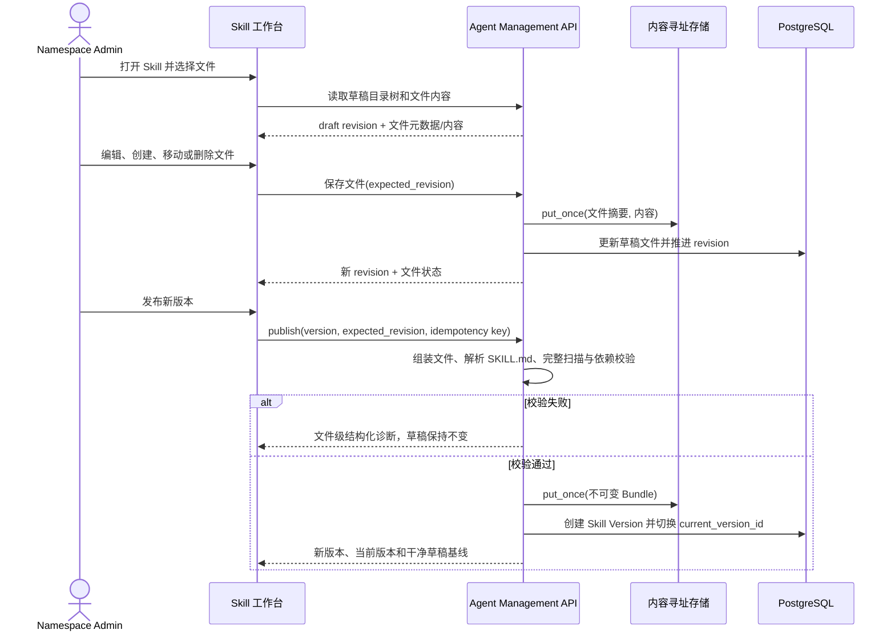

# Skill 内容工作台与版本管理

## 1. 目标声明

### 背景

当前 Skill 管理以 ZIP 上传和不可变版本详情为中心。管理员无法在平台内浏览 Skill 文件结构、阅读支持文档、直接修改 `SKILL.md`，也无法在发布前持续保存一组尚未完成的修改。详情页主要展示原始 Manifest JSON，无法承担日常内容维护。

v0.8 保留不可变 Skill Version 作为审计和回滚边界，同时增加一个可编辑工作草稿。管理员在平台内完成文件管理、Markdown 编辑/预览、校验、变更检查和版本发布，不直接修改已经发布的版本。

### 目标

- `/system/skills` 提供可搜索的 Skill 资产列表，直接呈现当前版本、草稿状态、引用与同步摘要。
- `/system/skills/:skillId` 形成左侧文件目录树、右侧内容编辑/预览区的 Skill 工作台。
- 每个 Skill 最多有一个当前工作草稿，所有写操作使用 `expected_revision` 防止并发覆盖。
- `SKILL.md` 和支持文件可以在平台内新增、编辑、移动、重命名和删除；保留文件与路径约束继续强制执行。
- 草稿保存与发布解耦；草稿变化不会影响任何 Agent 或 Runtime。
- 发布时执行一次完整解析、安全扫描和依赖校验，生成不可变 Skill Version 与 Bundle，并原子更新当前版本指针。
- 管理员可以将当前版本切换到任一未废弃历史版本，形成有审计记录的回滚。
- Developer 可读取列表、文件、预览、版本和诊断，但不能修改草稿、发布、回滚或废弃版本。

### 不在范围内

- 从 GitHub、skills.sh、ClawHub 或其他在线市场导入 Skill。
- Runtime 本地主目录扫描或自动上传本地 Skill。
- 在 Skill 中允许 Shell、Python、Node、安装钩子、二进制或其他可执行内容。
- 多分支草稿、多人实时协同编辑、评论和审批流。
- 在线编辑图片、音视频、Office 或其他二进制资源。
- 自动根据 SemVer 最大值选择当前版本；当前版本只由发布或显式回滚操作改变。

## 2. 模块影响

| 模块 | 影响类型 | 说明 |
|------|---------|------|
| `agent_management` | 修改 | 拥有 Skill 工作草稿、草稿文件、不可变版本、当前版本指针、发布/回滚审计和对应管理 UI |
| `runtime_management` | 只读依赖 | 后续同步功能读取 Skill 当前版本及不可变 Bundle；本子需求不实现同步与使用 |

## 3. 功能描述

### 3.1 草稿编辑与版本发布流程

### 3.2 Skill 列表

1. Admin 或 Developer 进入 `/system/skills`，系统读取当前 namespace 的 Skill 摘要，不在列表响应中返回文件正文或完整 Bundle。
2. 列表支持按名称、唯一标识和描述搜索，并按状态、草稿是否有修改、当前版本状态筛选。
3. 每行展示名称、唯一标识、当前版本、草稿状态、文件数、总大小、引用数、Runtime 同步摘要、维护者和更新时间。
4. 点击一行进入该 Skill 工作台；Admin 可通过标题区按钮进入完整创建流程。
5. Skill 较多时使用服务端分页、排序和过滤，不通过逐 Skill 请求版本列表拼装页面。

边界条件：

- 未发布 Skill 不进入可供 Agent 绑定的目录；正常创建流程必须在一次流程中形成首个有效版本，不能遗留只有身份、没有可用版本的空壳。
- 已归档 Skill 保留历史版本和只读文件浏览，不允许继续编辑或发布。
- 当前版本被废弃前必须先切换到另一个未废弃版本；没有替代版本时拒绝废弃。

异常处理：

- namespace 不存在或用户无读取权限时沿用现有 403/404 规则。
- 列表摘要中的引用或同步统计暂时不可用时返回明确的状态字段，不通过前端 N+1 请求补查。

### 3.3 Skill 创建

1. Admin 从列表标题区点击“新建 Skill”。
2. 创建流程录入名称、唯一标识、说明和首个版本号，并进入内嵌文件编辑步骤。
3. 系统生成包含标准 frontmatter 的 `SKILL.md` 初始模板；管理员可在提交前新增支持文件并预览 Markdown。
4. “创建并发布”使用一次请求完成身份、草稿文件扫描、首个不可变版本、当前版本指针与发布审计；任一步失败整体回滚并保留页面输入。
5. 既有 ZIP 上传保留为创建/追加版本的输入方式，但 ZIP 必须先进入草稿预览与校验结果，不允许绕过发布流程直接替换当前内容。

边界条件：

- 唯一标识在 namespace 内唯一，创建后不可修改；UI 始终展示为“唯一标识”。
- 首版版本号必须为规范 SemVer，且 `SKILL.md` 中的身份和版本字段必须与提交一致。
- `SKILL.md` 是根目录保留文件，必须存在且不得重命名、移动或删除。

异常处理：

- 身份、版本或摘要冲突返回 409，并指出冲突对象。
- 文件或 Manifest 校验失败返回 422 和文件级诊断，不创建 Skill 身份或版本。
- 对象存储不足返回 507，数据库事务回滚。

### 3.4 文件目录树与编辑器

1. 工作台左侧按目录层级展示草稿文件，目录在展开时不额外请求每个文件正文；点击文件后按需加载内容。
2. 文本文件支持编辑；Markdown 提供“编辑”“预览”“并排”三种模式；JSON/YAML 提供等宽文本编辑和基础语法提示。
3. 图片等已批准静态资源仅提供预览和替换，不进入文本编辑器。
4. Admin 可新建文件/目录、上传资源、移动、重命名和删除支持文件。所有操作使用文件 ID 和 `expected_revision`，路径变更由服务端重新校验。
5. 保存成功后推进草稿 revision；前端更新基线并显示“已保存”。存在未提交编辑时离开页面、切换文件或关闭对话框必须提示。
6. Developer 看到同样的文件树和预览，但编辑控件只读。

边界条件：

- 拒绝绝对路径、反斜杠、空路径、`.`、`..`、路径穿越、符号链接、控制字符和重复规范化路径。
- 继续执行现有文件数量、单文件、展开总大小、UTF-8、扩展名、可执行位和禁止内容规则。
- 文件名大小写冲突按跨平台安全规则拒绝，避免不同 Runtime 文件系统产生覆盖。
- 支持文件不能占用 `SKILL.md` 保留路径。

异常处理：

- `expected_revision` 过期返回 409，同时返回服务端当前 revision；前端保留本地未保存内容并要求用户重新加载或复制后处理，不自动覆盖。
- 文件内容写入对象存储成功但数据库事务失败时，不更新草稿引用；无引用内容由后续安全清理任务处理。
- Markdown 预览必须禁用不安全 HTML，过滤危险 URL 协议，不执行脚本或远程嵌入代码。

### 3.5 草稿校验、发布与版本浏览

1. Admin 可随时运行草稿校验；服务端从草稿文件引用组装一个只读输入，复用正式发布扫描器。
2. 校验结果包含整体状态、文件、行列、错误码、说明和关联 Tool/MCP 依赖，不把异常堆栈返回前端。
3. 发布必须指定新 SemVer、`expected_revision` 和 `Idempotency-Key`；只有最近一次校验成功且校验摘要与当前草稿摘要一致时才允许提交，服务端仍在事务内重新确认摘要和关键约束。
4. 发布成功后创建不可变 Skill Version、Bundle 与发布审计，原子更新 `skill_definition.current_version_id`，并把草稿基线指向该版本；发布内容不可原地修改。
5. 历史版本页提供只读目录树、文件预览、Manifest、摘要、校验结果、创建人和发布时间。
6. 回滚操作选择一个未废弃历史版本，二次确认后只切换 `current_version_id` 并记录审计，不复制内容、不创建伪版本。

边界条件：

- 同一 Skill 的版本号唯一；相同版本相同内容幂等返回既有版本，相同版本不同内容返回 409。
- 已被任何历史任务使用的版本永久保留；废弃只阻止其成为新的发布目标，不删除历史文件和审计。
- 回滚目标必须属于同一 Skill、未废弃且 Bundle 可读取并通过既有摘要校验。
- 草稿基线版本和当前版本可以不同；回滚当前版本不能静默覆盖管理员尚未发布的草稿。

异常处理：

- 发布与回滚并发时以行锁/CAS 保证 current 指针只有一个确定结果，失败方返回 409。
- Bundle 不可读取或摘要异常时停止发布/回滚，不修改 current 指针。
- 发布成功后的 Runtime 同步由下一份 PRD 的同步链路负责；发布接口不等待所有 Runtime 下载完成。

## 4. 数据变更

遵循现有“只增不改不删”迁移规则；已发布 `skill_version` 和历史 Release 不做破坏性重写。

### 新增表

| 表名 | 用途说明 |
|------|---------|
| `skill_draft` | 每个 Skill 唯一的可编辑工作草稿；保存 revision、基线版本、整体摘要、最近校验摘要/结果和修改人 |
| `skill_draft_file` | 草稿文件身份、规范化相对路径、类型、大小、内容摘要和内容寻址存储引用；同一草稿路径唯一 |
| `skill_current_version_change` | 追加记录发布或回滚造成的当前版本切换，包括 from/to 版本、动作、操作者、时间和幂等键 |

### 新增字段

| 表名 | 字段名 | 类型 | 业务含义 |
|------|--------|------|---------|
| `skill_definition` | `current_version_id` | uuid，可空 FK | 当前发布并希望 Runtime 同步的 Skill Version；迁移时指向既有最新未废弃版本，完成回填后业务上必需 |
| `skill_definition` | `draft_id` | uuid，可空 FK | 当前唯一工作草稿指针；使用具名延迟外键避免创建顺序循环 |
| `skill_version` | `published_at` | timestamptz，可空 | 正式成为当前版本的首次发布时间；历史数据按 created_at 回填 |

### 关键约束

- `skill_draft(skill_id)` 唯一，一个 Skill 同时只有一个工作草稿。
- `skill_draft_file(draft_id, normalized_path)` 唯一；文件内容使用不可变摘要与受控存储引用。
- `skill_current_version_change(skill_id, idempotency_key)` 唯一。
- `current_version_id` 必须指向相同 `skill_definition` 下的版本，使用应用层校验和事务行锁保证。
- 草稿文件写入、revision 推进和校验失效必须在同一事务完成。
- 已有 Skill 在迁移时从其当前最高未废弃 SemVer 选择初始 `current_version_id`；无法唯一确定或 Bundle 损坏时迁移必须阻断并输出诊断，不能猜测或跳过。

## 5. API 设计

所有接口继续使用 `/api/v1`、`X-Namespace-Id`、Cookie/CSRF 或 Bearer 认证。Admin 可写，Developer 只读，User 无权访问。

| Method | Path | 用途 |
|--------|------|------|
| GET | `/skills` | 分页搜索 Skill 摘要，包含当前版本、草稿、引用和同步聚合状态，不返回正文 |
| POST | `/skills/complete` | 原子创建 Skill 身份、初始草稿和首个不可变版本 |
| GET | `/skills/{skill_id}` | Skill 身份、当前版本、草稿摘要、版本时间线和权限 |
| GET | `/skills/{skill_id}/draft` | 草稿 revision、基线、目录树、整体摘要和最近校验 |
| POST | `/skills/{skill_id}/draft/files` | 新建文本文件或上传批准的静态资源 |
| GET/PUT/DELETE | `/skills/{skill_id}/draft/files/{file_id}` | 按需读取、保存或删除草稿文件 |
| POST | `/skills/{skill_id}/draft/files/{file_id}/move` | 重命名或移动草稿文件 |
| POST | `/skills/{skill_id}/draft/validate` | 对当前 revision 执行完整校验并保存结构化结果 |
| POST | `/skills/{skill_id}/draft/publish` | 按 expected revision 和幂等键发布不可变版本并切换 current 指针 |
| GET | `/skills/{skill_id}/versions/{version}/files` | 读取历史版本目录树 |
| GET | `/skills/{skill_id}/versions/{version}/files/{file_path}` | 按需读取历史版本文件，路径使用安全 catch-all 解码与校验 |
| POST | `/skills/{skill_id}/current-version` | 显式切换到未废弃历史版本并记录回滚审计 |

版本发布、创建和回滚使用 `Idempotency-Key`。文件 mutation 使用请求体中的 `expected_revision`。正文响应设置明确 MIME、大小限制和 `Content-Disposition: inline` 安全策略，不返回对象存储路径。

## 6. UI 页面

| 变更类型 | 页面名 | 路由 | 说明 |
|------|------|------|------|
| 修改 | Skill 列表 | `/system/skills` | 搜索、筛选和展示当前版本、草稿、引用及同步摘要 |
| 修改 | Skill 内容工作台 | `/system/skills/:skillId` | 文件树、内容编辑/预览、校验、版本发布和历史浏览 |
| 修改 | Skill 完整创建流程 | `/system/skills` | 从标题区进入，编辑首个 SKILL.md 与支持文件并原子发布首版 |

### Skill 列表

- 布局：页面标题与说明、搜索/筛选工具栏、新建按钮、服务端分页表格。
- 功能：名称/唯一标识搜索，当前版本、草稿状态、引用数量、Runtime 同步汇总和更新时间展示。
- 交互：点击行进入内容工作台；归档/删除继续执行二次确认和引用约束。
- 字段：不展示正文和完整 Manifest；同步列只展示聚合状态，详细目标状态进入工作台查看。

### Skill 内容工作台

- 布局：顶部身份/版本/草稿状态栏；主体左侧可调整宽度的文件目录树，右侧文件标题、编辑/预览模式和内容区；底部或抽屉展示校验诊断。
- 功能：文件增删改移、上传静态资源、Markdown 安全预览、显式保存、草稿校验、发布版本、版本历史和回滚。
- 交互：切换存在未保存内容的文件或离开页面时提示；保存冲突保留本地内容；发布和回滚二次确认；发布成功后仍停留在工作台并刷新当前版本与草稿基线。
- 字段：版本使用规范 SemVer；文件路径显示为正斜杠相对路径；用户界面显示“唯一标识”，不显示 Slug 术语。
- 响应式：桌面端使用左右分栏；窄屏改为文件抽屉 + 单内容区，不压缩成不可操作的双栏。

### Markdown 编辑与预览

- 编辑模式使用等宽字体、行号和未保存状态，不执行文档内代码。
- 预览模式使用与主题一致的排版，过滤原始 HTML、脚本、事件属性、危险协议和不受控 iframe。
- 相对链接与图片只解析到同一 Skill 草稿或历史版本内的文件；缺失引用显示诊断，不偷偷改写为外部 URL。

## 7. 验收标准

- [ ] Admin 能从 Skill 列表进入详情，在左侧看到完整目录树，在右侧编辑并安全预览 `SKILL.md`。
- [ ] Developer 能浏览相同目录树、历史版本和 Markdown 预览，但看不到或无法调用写操作。
- [ ] 新建 Skill 在一次完整流程中形成身份、有效首版和当前版本指针；任一步失败不遗留空壳。
- [ ] 草稿文件的新建、保存、移动、重命名和删除均推进 revision，过期 revision 返回冲突且不覆盖他人修改。
- [ ] `SKILL.md` 不能删除、移动或被支持文件占用；路径逃逸、符号链接、可执行文件和超限内容明确拒绝。
- [ ] 草稿保存不会改变任何已发布版本、Agent Release 或 Runtime 已应用内容。
- [ ] 发布只对当前草稿执行一次完整解析和扫描，成功后生成不可变 Bundle 与版本并原子切换 current 指针。
- [ ] 发布失败保留草稿和页面输入，返回到具体文件/行的结构化诊断，不暴露异常堆栈。
- [ ] 历史版本可以使用只读文件树和 Markdown 预览复核，已发布内容无法原地编辑。
- [ ] 管理员能将当前版本回滚到未废弃历史版本；回滚不复制 Bundle、不覆盖草稿，并留下 from/to 审计记录。
- [ ] 列表和 Agent 选择器不通过“先列身份、再逐个请求版本”的 N+1 方式组装 Skill 目录。
- [ ] Markdown 预览中的脚本、危险 HTML、危险 URL 和不受控嵌入不会执行。
