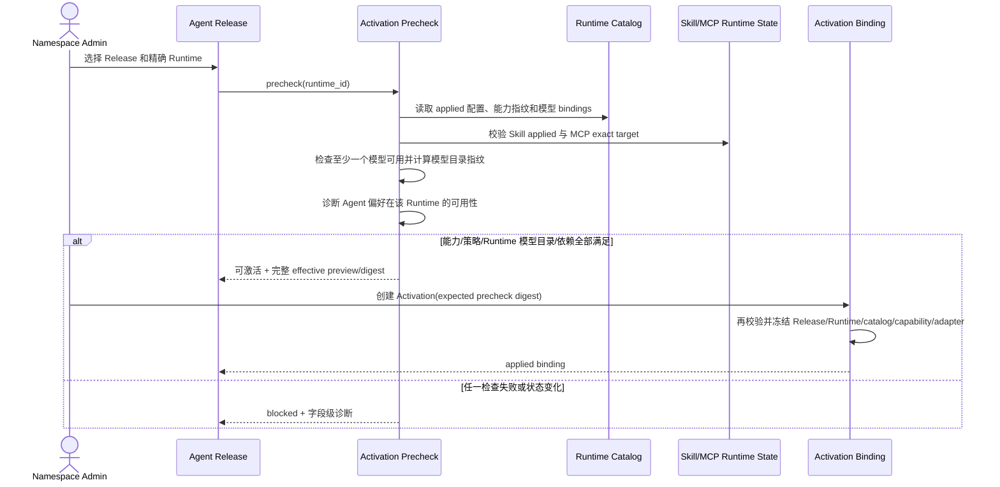

# Agent 模型偏好与 Runtime 激活

## 1. 目标声明

### 背景

当前 Agent Draft 必须选择 `HarnessProfile`，Harness Profile 又保存 Claude 类型、CLI/SDK 约束、权限模式、超时、工作目录、环境变量和 Tool 等配置。同时 Agent Draft 直接选择 Provider Config 与模型。这让 Agent 身份既绑定具体执行引擎，又绑定具体调用路由，难以复用于同时提供 Claude Code、Codex 或不同模型路由的 Runtime。

Agent 确实应声明模型偏好：不同模型擅长不同任务，模型选择是 Agent 设计的一部分。但 Agent 不应持有 API 路由、机器环境或 Harness 启动方式。v0.9 将 Agent 收敛为可移植的能力与行为声明；Runtime 负责执行能力和支持模型；Activation 将精确 Agent Release 部署到精确 Runtime，并冻结经过验证的引擎与能力边界。具体任务使用的模型仍由 Conversation、Agent 组或 Workflow 的执行配置决定。

### 目标

- Agent Draft 不再选择 Harness Profile，不再直接绑定 Provider Config 或执行路由。
- Agent Draft 必须声明一个稳定模型身份作为 `preferred_model`，同时保留 System Prompt、Skill、Tool、MCP、Plugin 和执行策略。
- Agent 的权限、Tool 和审批意图与 Runtime 的安全上限做确定性交集；任何无法满足的必需能力明确阻断。
- 新 Agent Release 使用引擎中立的 Resolved Agent Spec，记录模型偏好、必需能力、策略、依赖和来源链。
- Harness 类型、CLI/SDK 版本和命令生成由 Runtime 引擎适配器负责，不进入新 Release。
- Activation 选择精确 Runtime，执行能力、策略、MCP、Skill 和 Runtime 模型目录预检，但不替执行流程选择实际模型。
- 激活成功后保存 Agent Release、Runtime、Runtime 配置/能力指纹、Adapter 版本、模型目录指纹和 effective spec digest。
- Harness Profile 退出新建与编辑流程；历史 Profile、旧 Release 和旧 Activation 保持只读审计。

### 不在范围内

- 在 Agent 内保存 API Key、Base URL、Provider Config、native 登录凭证或 Runtime 本地路径。
- Agent 声明备选模型列表、优先级链、自动降级顺序或成本路由策略。
- 为了激活成功而自动移除 Skill、Tool、MCP、Plugin，降低审批要求或更换 Runtime。
- Agent Release 绑定唯一 Runtime；同一 Release 可分别激活到多个满足要求的 Runtime。
- 在 v0.9 删除 Harness Profile 表、旧 API、旧 Resolved Spec 或重算历史签名。
- 让 namespace 用户上传自定义 Harness/Adapter 代码。

## 2. 模块影响

| 模块 | 影响类型 | 说明 |
|------|---------|------|
| `agent_management` | 核心修改 | Agent 模型偏好、引擎中立 Release、Harness 字段迁移、兼容性 Resolver、Activation 与管理 UI |
| `runtime_management` | 核心依赖 | 提供精确 Runtime、能力报告、配置修订、Adapter 版本、模型绑定和 Skill/MCP 实际状态 |
| `llm_configs` | 只读依赖 | 提供稳定模型身份，不向 Agent 暴露路由 secret |
| `conversation_management` | 后续依赖 | 使用 Agent Release 偏好和 Runtime Activation 目录选择参与者模型 |
| `workflow_management` | 后续依赖 | 使用精确 Release、Runtime 和模型选择配置节点 |

## 3. 功能描述

### 3.1 Agent 配置职责与 Harness 字段归属

Agent Draft 的新配置分为四类：

1. 身份与行为：名称、唯一标识、说明、System Prompt、可委派/可组织等行为声明。
2. 模型偏好：一个稳定 `model_definition_id`，表达该 Agent 设计时优先使用的模型身份，不包含路由。
3. 能力依赖：Skill 身份、Plugin Version、MCP Revision、Tool 意图及 enabled 状态。
4. 执行策略：必需能力、Tool 审批要求、最大任务时长请求、会话/委派需求等引擎中立约束。

现有 Harness 字段按以下方式迁移：

| 原 Harness 字段/职责 | v0.9 归属 | 迁移规则 |
|----------------------|-----------|----------|
| `harness_type` | Runtime `engine_type` | 新 Agent 不保存；Activation 在精确 Runtime 上校验适配器能力 |
| CLI/SDK 最低/最高版本 | Runtime Adapter 兼容策略 | 由平台维护，不允许 Agent 用户自行放宽 |
| Harness config schema、固定启动参数 | Runtime Adapter / Runtime configuration revision | 使用结构化、受控配置，不进入 Agent Release |
| `permission_mode` | Agent 执行策略请求 + Runtime 安全上限 | effective 必须可确定且不超过 Runtime 上限；无法满足时阻断 |
| `timeout` | Agent 最大时长请求 + Runtime/Task 上限 | 取明确的更严格值，并把来源写入 effective spec；必需最小时长无法满足则阻断 |
| `cwd_strategy` | Runtime 工作目录策略 | Agent 只声明是否需要项目/仓库上下文，不指定本地路径 |
| 环境变量名称/值 | Runtime 配置或 Provider/native route | Agent 不保存环境变量；secret value 始终不进入 Release |
| allowed/disallowed Tools | Agent Tool policy + namespace 基线 | Runtime 仍可进一步禁止；必需 Tool 不可用时阻断 |

Harness Profile 页面进入只读历史入口；新建 Agent、完整创建、草稿编辑和 Release 发布接口均不再接受 `harness_profile_id`。前端隐藏字段不是唯一约束，后端对新 Schema 提交旧字段返回 422。

边界条件：

- 模型偏好是 Agent Release 的一部分；修改偏好需要发布新 Release，不重写旧 Release。
- Agent 偏好只引用稳定模型身份。即使当前没有任何 Runtime 支持，也可保存草稿和发布 Release，但必须明确展示“偏好模型当前不可用”；Activation 只要求目标 Runtime 至少具备一条可用模型绑定，实际执行若选择 `agent_preference` 才因偏好不可用而阻断。
- Agent 执行策略不能携带引擎专属参数；确有必要的能力使用平台定义的规范 capability key，不使用自由 JSON 键绕过 Adapter 合同。

异常处理：

- 请求提交已废弃 Harness、Provider route 或 secret 字段返回 `legacy_agent_execution_field` 及字段级诊断。
- 旧 Harness Profile 的值无法映射到规范策略时迁移预检标记该 Agent，停止批量切换，不把未知值丢弃。

### 3.2 Agent Release 解析与发布

1. Release Resolver 从 Agent Draft、Plugin contribution、namespace Tool policy、Skill/MCP 状态和稳定模型身份生成 canonical Resolved Agent Spec。
2. 新 Schema 至少保存：Agent 身份、System Prompt 摘要、`preferred_model_definition_id`、required capabilities、执行策略、Skill 身份、Tool effective policy、MCP/Plugin 精确依赖和来源链。
3. Resolved Spec 不保存 Runtime ID、engine type、Adapter 版本、Provider Config、Runtime Model Binding、命令参数、本地目录或 secret。
4. 发布校验确认模型身份有效、必需能力键受平台支持、依赖完整、策略没有自相矛盾。是否能在某个 Runtime 实际执行由 Activation precheck 判断。
5. Release 继续保持不可变，使用 schema version、canonical digest、manifest、签名和 dependency lock；旧 Release 不重算、不补写新字段。
6. Release 详情提供兼容 Runtime 摘要，该摘要是基于当前目录的动态视图，不是 Release 内容，也不保证未来一直兼容。

边界条件：

- Plugin 如贡献引擎专属 Harness 配置，新 Plugin Schema 校验失败；应改为规范能力或 Agent policy contribution。
- 多来源对同一策略产生冲突时沿用“只可收紧”规则，并在 Release 详情展示来源；不能通过来源顺序随机覆盖。
- 模型身份被停用后旧 Release 仍可审计，但不能用于新的 Activation 或执行配置修订。

### 3.3 Activation 预检与冻结

1. Admin 从 Release 详情选择一个精确 Runtime。界面可以按当前兼容性过滤，但提交必须包含 Runtime ID，后端不按排序自动选择。
2. Activation 不接受模型选择参数，也不固定单一模型。Precheck 要求目标 Runtime 至少有一条 `available` 模型 binding，并单独计算当前模型目录指纹。
3. Precheck 同时校验 namespace、Runtime 在线与 applied 配置、Adapter 合同、required capabilities、Tool/权限安全上限、Skill applied、MCP target/revision、模型目录和资源请求。
4. Precheck 额外返回 Agent 偏好在该 Runtime 的 `available`、`unavailable` 或 `ambiguous` 诊断。偏好不可直接解析不阻止部署，但意味着后续执行配置不能使用 `agent_preference`，只能显式选择该 Runtime 的其他可用 binding。
5. Precheck 返回每项检查的 expected/actual、结构化错误码、当前能力指纹、配置摘要、模型目录指纹与 `precheck_digest`。成功结果短时有效。
6. 创建 Activation 时在事务内重新读取状态并核对 digest。任一依赖变化返回 409/422，要求重新预检，不沿用过期成功结果。
7. Deployment 应用成功后，`runtime_agent_release` 的 v0.9 字段冻结 exact Release、Runtime、Runtime 配置 revision、能力 report、Adapter version、模型目录指纹和 effective spec digest，不保存任务实际 model binding。
8. 同一 Release 可激活到多个 Runtime；每个 `(runtime, agent)` 继续维护 current/previous 指针，回滚必须回到该 Runtime 上确曾成功应用的完整绑定。

边界条件：

- Agent 偏好在目标 Runtime 有零条 binding 时返回 unavailable；有多条时返回 ambiguous。Activation 可以部署，但两种情况都不能被后续 `agent_preference` 模式解析为任务模型。
- Runtime 至少需要一条 available binding 才能激活 Agent，否则该部署不具备产生可执行任务的基本条件。
- Runtime 能力指纹或 applied 配置在部署期间变化时 deployment 进入 blocked/failed，不能把预检时的兼容结论套到新状态。
- Skill 已有旧 applied 版本但 desired 新版本 blocked 时，沿用 v0.8 Skill 规则判断当前 Release 是否可执行；详情必须展示实际 applied 版本，不把 desired 当作已使用版本。

异常处理：

- Runtime 离线、binding 验证过期、MCP 未在精确目标验证、必需 Tool 被 Runtime 禁止或权限超限时返回具体错误，不提供“忽略并继续”。
- Deployment 回报的 Adapter、配置摘要、能力指纹或模型目录指纹与冻结值不一致时拒绝推进 current 指针并记录协议冲突。
- 回滚目标要重新执行 Runtime/能力/依赖与模型目录预检；失败则明确阻断。

### 3.4 兼容性与可观测性

1. Agent 列表显示首选模型、已发布 Release、可部署 Runtime 数量和其中偏好模型可直接使用的数量，不再显示 Harness Profile。
2. Agent Release 详情按 Runtime 展示能力、模型、Skill、MCP、策略与 Adapter 兼容矩阵；聚合状态不能掩盖单项失败。
3. Activation/Deployment 详情展示 desired/applied、当前/前一 Release 绑定、Agent 偏好可用性、模型目录指纹、能力指纹、Adapter 版本、effective spec digest 和脱敏失败；实际模型只在执行配置和 Task 详情展示。
4. Runtime 详情反向展示已激活 Agent、Release、偏好模型可用性和兼容状态，使用同一后端事实数据。
5. 任何 Runtime 或模型状态变化只影响新 Activation、新配置修订和新 Task 的准备；历史记录不被改写。

## 4. 数据变更

遵循“只增不改不删”。旧 `harness_profile`、Agent Draft 字段、旧 Release Schema 和历史 Activation 保留；完成迁移后，新 API 停止写入废弃字段。

### 新增表

| 表名 | 用途说明 |
|------|---------|
| `agent_release_runtime_compatibility` | 可重建的兼容性缓存与最近诊断，绑定 Release、Runtime、能力指纹和检查时间；事实仍来自 Release/Runtime 当前状态 |
| `agent_activation_precheck` | 短时、不可变的预检证据，保存输入摘要、逐项结果、目标 Runtime、模型目录/偏好诊断和过期时间 |

### 新增字段

| 表名 | 字段名 | 类型 | 业务含义 |
|------|--------|------|---------|
| `agent_draft` | `preferred_model_definition_id` | uuid，可空 FK | Agent 草稿的稳定模型偏好；迁移完成后新草稿业务上必需 |
| `agent_draft` | `execution_policy` | json | 经过 Schema 校验的引擎中立执行策略，不接受自由 Adapter 参数 |
| `agent_release` | `preferred_model_definition_id` | uuid，可空 FK | 新 Release 冻结的模型偏好，便于索引与兼容查询；canonical spec 同时包含 |
| `agent_release` | `required_capabilities` | json | 新 Release 冻结的平台规范能力要求 |
| `agent_activation` | `runtime_instance_id` | uuid，可空 FK | v0.9 Activation 的精确目标 Runtime |
| `agent_activation` | `precheck_id` | uuid，可空 FK | 创建时使用且重新核验的预检证据 |
| `runtime_agent_release` | `runtime_instance_id` | uuid，可空 FK | v0.9 的精确 Runtime 绑定 |
| `runtime_agent_release` | `runtime_configuration_revision_id` | uuid，可空 FK | 激活时实际 applied 配置 |
| `runtime_agent_release` | `runtime_capability_report_id` | uuid，可空 FK | 激活时能力报告与指纹 |
| `runtime_agent_release` | `adapter_version` | varchar，可空 | 实际 Adapter 版本快照 |
| `runtime_agent_release` | `runtime_model_catalog_fingerprint` | varchar，可空 | 激活时可用模型 binding 集合的规范指纹，不代表任务模型 |
| `runtime_agent_release` | `effective_spec_digest` | varchar，可空 | Release 与 Runtime 策略合成后的规范摘要 |

### 调整已有字段说明

| 表名/载荷 | 字段 | 调整说明 |
|-----------|------|---------|
| `harness_profile` | 全部 | **[废弃]** 仅保留历史查看、旧 Release 解析和迁移证据；不再新建、编辑或用于新 Schema Agent |
| `agent_draft` | `harness_profile_id` | **[废弃]** 新 API 不接受也不写入 |
| `agent_draft` | Provider Config / model fields | **[废弃]** 旧值迁移为稳定模型身份偏好；路由由 Runtime model binding 持有 |
| `agent_release` | `resolved_spec_schema_version` | v0.9 新 Release 使用引擎中立 Schema；旧 Schema 原样保留 |
| `agent_release.resolved_spec` | Harness / provider route | 新 Schema 不再写 Harness 类型、CLI/SDK、命令、Provider Config、base URL、secret 或 Runtime 路径 |
| `runtime_agent_release` | `runtime_profile_id` | **[废弃]** 旧绑定保留；新绑定使用 `runtime_instance_id` |

### 关键约束与迁移

- 新 Agent Draft/Release 的 `preferred_model_definition_id` 必须属于同 namespace 且有效。
- `agent_activation` 的 Runtime、Release 与 precheck 必须属于同 namespace；预检模型目录必须来自目标 Runtime。
- `runtime_agent_release(runtime_instance_id, agent_definition_id)` 对 v0.9 数据唯一。
- effective spec 由 canonical Release、Runtime applied 配置、安全上限、能力报告和模型目录指纹确定；相同输入必须生成相同 digest。任务精确模型不进入 Activation effective spec。
- 旧 Agent 模型按 Provider Config 的精确 `provider_slug + model_id` 映射为稳定身份；无法唯一映射时迁移阻断。
- 每个旧 Runtime Profile 先按上一份 PRD转换为一个 Claude Code Runtime；旧 Harness 字段按 3.1 归属转换。未知 permission mode、无法表达的 CLI 参数或冲突 Tool policy 必须列入迁移诊断。
- 旧 Release、Activation、Task 与签名不做原地重写。需要继续新执行的 Agent 必须发布 v0.9 Release 并创建新 Activation；历史详情仍使用对应旧 Schema 渲染。
- 切换后不双写 Harness Profile 与新 Runtime 配置，也不在读取失败时回退解析旧字段执行新任务。

## 5. API 设计

| Method | Path | 用途 |
|--------|------|------|
| POST | `/agents/complete` | 新完整创建请求使用稳定模型偏好和能力/策略，不接受 Harness/路由字段 |
| GET/PUT | `/agents/{agent_id}/draft` | 读取或按 expected revision 更新偏好、行为、依赖和执行策略 |
| POST | `/agents/{agent_id}/draft/validate` | 校验模型身份、规范策略和能力依赖，并返回兼容 Runtime 摘要 |
| POST | `/agents/{agent_id}/releases` | 发布 v0.9 引擎中立不可变 Release |
| GET | `/agent-releases/{release_id}/compatibility` | 按 Runtime 返回动态兼容矩阵和精确诊断 |
| POST | `/agent-releases/{release_id}/activations/precheck` | 对精确 Runtime 创建短时预检证据，并返回偏好模型可用性 |
| POST | `/agent-releases/{release_id}/activations` | 使用 precheck ID、digest 和幂等键创建 Activation |
| GET | `/agent-activations/{activation_id}` | 查看冻结绑定、deployment 状态和诊断 |
| GET | `/runtime-agents` | 按 Runtime 返回当前/前一 Agent Release、偏好模型可用性、能力与 effective digest |
| GET | `/harness-profiles` | 迁移后仅 Admin/Developer 读取历史资源；响应标记 deprecated/read-only |

API 规则：

- Release、Activation、retry 和 rollback 使用 `Idempotency-Key`；草稿 mutation 使用 `expected_revision`。
- 新写接口出现 `harness_profile_id`、Provider Config、base URL、secret、CLI args 或 Runtime path 时返回 422，不静默忽略。
- precheck 响应包含稳定错误码和 expected/actual，不返回 secret、节点绝对路径或未经脱敏的 Adapter 输出。
- 旧 Release/Activation 读取响应携带 schema version，由前端走只读历史组件；执行入口只接受 v0.9 可执行绑定。

## 6. UI 页面

| 变更类型 | 页面名 | 路由 | 说明 |
|------|------|------|------|
| 修改 | Agent 列表 | `/system/agents` | 展示模型偏好、可部署/偏好可用 Runtime 摘要，移除 Harness 列 |
| 修改 | Agent 完整创建/草稿 | `/system/agents/:agentId` | 模型偏好、行为、能力依赖和执行策略取代 Harness 配置 |
| 修改 | Agent Release 详情 | `/system/agents/:agentId/releases/:releaseId` | 展示引擎中立 Spec 与 Runtime 兼容矩阵 |
| 修改 | Activation 流程 | `/system/agents/:agentId/releases/:releaseId` | 选择精确 Runtime，查看能力、依赖、模型目录与偏好诊断后激活 |
| 只读保留 | Harness Profile 历史 | `/system/harness-profiles` | 仅查看旧记录、引用和迁移状态，不允许新建/修改 |

### Agent 编辑

- 基础/行为区展示名称、唯一标识、说明、System Prompt 和委派能力。
- 模型区只选择稳定模型身份，展示模型家族、精确 key 和当前兼容 Runtime 数；不选择 Provider Config 或 API 路由。
- 能力区继续管理 Skill、Tool、MCP、Plugin；执行策略使用平台规范字段并解释其与 Runtime 上限的关系。
- Harness 页签、Harness Profile 选择器、CLI/SDK、工作目录和环境变量表单从新编辑流程移除。

### Release 与 Activation

- Release 详情把“设计偏好”和“当前可部署环境”分区展示，避免把动态兼容状态误认为 Release 固有内容。
- Activation 对话框只选择 Runtime，不选择任务模型；同时展示该 Runtime 的可用模型数和 Agent 偏好可用性。
- 预检逐项展示引擎/Adapter、模型、权限、Tool、Skill、MCP、资源与配置指纹；任一失败禁用激活按钮。
- 成功详情显示 Agent 偏好诊断、模型目录指纹、能力指纹和 effective digest，并说明实际模型将在 Conversation/Workflow 配置中选择。

## 7. 验收标准

- [ ] 新建和编辑 Agent 不再出现 Harness Profile、CLI/SDK、Runtime 路径、Provider Config 或凭证字段。
- [ ] 后端拒绝新 Schema 中的旧 Harness/路由字段，不因前端隐藏而静默接收。
- [ ] Agent Draft 必须使用稳定模型身份表达偏好；修改偏好需要发布新 Release，旧 Release 不变化。
- [ ] 新 Release 是引擎中立的，Resolved Spec 不包含 Runtime、Harness、命令、Provider 路由或 secret，仍完整保留行为、依赖、策略和来源链。
- [ ] Harness 原字段均有明确归属和迁移规则；无法表达的数据会阻断迁移，不被丢弃或塞入自由 JSON。
- [ ] 同一 Release 可以分别激活到 Claude Code 和 Codex Runtime，前提是两者通过同一规范能力预检。
- [ ] Activation 必须提交精确 Runtime；系统不根据负载、名称或排序自动选择另一个 Runtime。
- [ ] Activation 不接受或冻结任务 model binding；实际模型仅由 Conversation/Agent 组/Workflow 的配置修订选择。
- [ ] Activation Precheck 区分部署兼容性与 Agent 偏好可用性；偏好不可用不被伪装为可用，也不会触发隐式替换。
- [ ] Precheck 覆盖 Runtime applied 配置、Adapter、能力、策略、Tool、Skill、MCP、模型目录与资源，并返回逐项诊断。
- [ ] 创建 Activation 时重新核验 precheck digest；状态变化不会沿用过期通过结果。
- [ ] applied 绑定冻结 Release、Runtime、配置修订、能力报告、Adapter 版本、模型目录指纹和 effective digest。
- [ ] Runtime 回报与冻结绑定不一致时不会推进 current 指针，也不会改用回报中的模型继续。
- [ ] 回滚只使用目标 Runtime 上曾成功应用且重新预检通过的完整绑定，停用模型不会被暗中恢复。
- [ ] Harness Profile 和旧 Schema 数据保持只读可审计；新执行不回退读取旧字段，也不长期双写。
