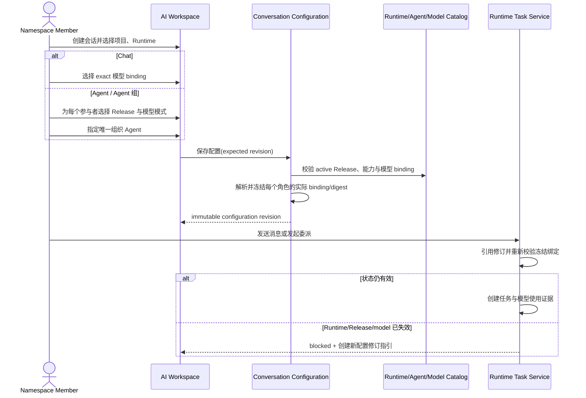
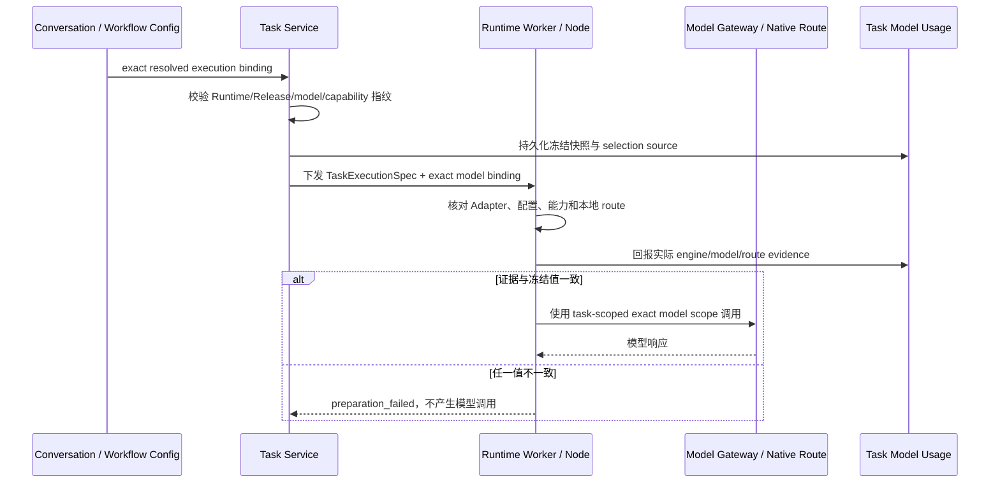

# 执行模型选择与任务冻结

## 1. 目标声明

### 背景

Agent 声明模型偏好，Runtime 声明经过验证的模型绑定，但两者都不应单独决定一次任务实际使用什么模型。Chat 用户需要直接选择模型；多 Agent 会话可能为不同参与者选择不同模型；Workflow 的不同节点也可能根据职责选择不同模型。若实际模型在任务领取时依赖某个动态默认值，历史消息、重试和审批将无法解释，也可能在状态变化后静默使用另一个模型。

v0.9 把实际模型选择放到执行配置层。Conversation 与 Workflow 继续使用不可变配置修订：每个可执行角色/节点选择 `exact` 或 `agent_preference`，保存时解析为目标 Runtime 上的一条精确 model binding 并冻结。Task 启动前只重新校验已冻结绑定仍可用，不重新选择；模型网关令牌和 Adapter 启动参数都绑定该精确模型。

### 目标

- Chat 会话在固定 Runtime 下显式选择一条具体模型 binding，不使用 Agent 偏好。
- Agent 会话与 Agent 组可以为每个参与者分别选择 `exact` 或 `agent_preference`；组织 Agent 使用同样规则。
- Workflow 的每个 Agent 节点在模板执行配置中选择精确 Runtime、已激活 Release 和模型选择模式；非 Agent 模型节点选择精确 Runtime 与模型 binding。
- `agent_preference` 只按 Agent Release 的稳定模型身份解析目标 Runtime 上唯一 available binding。
- 保存不可变配置修订时完成解析并冻结实际 binding、选择来源、Agent 偏好快照、Runtime 能力/模型目录指纹和 effective digest。
- 创建 Workflow Instance、发送会话消息或触发委派时只引用已冻结配置，不接受临时覆盖。
- Task 在模型调用前记录实际 Runtime、引擎、Adapter、模型身份、路由 binding、Provider/native route、配置与能力指纹。
- 配置冻结后 binding 失效会明确阻断新 Task；不重新运行选择算法，也不退回 Agent 偏好、Runtime 第一条模型或其他 Provider 路由。
- 项目默认 Runtime 改为精确 Runtime 实例，只提供上下文默认目标，不暗含默认模型。

### 不在范围内

- 根据价格、延迟、额度、负载、上下文长度或模型排行榜动态路由。
- 备选模型数组、fallback chain、自动重试到其他模型或同模型其他路由。
- 业务用户在创建 Workflow Instance 时覆盖模板的 Runtime、Agent Release 或模型配置。
- 在同一个 Task 执行中途切换模型；模型切换必须形成新配置修订和新 Task。
- 将 Chat 的裸 Provider Config/model 字符串继续作为 v0.9 执行事实。
- 因 Runtime 或模型暂时不可用而自动改用项目默认 Runtime。

## 2. 模块影响

| 模块 | 影响类型 | 说明 |
|------|---------|------|
| `conversation_management` | 核心修改 | Chat/Agent/Agent 组的逐角色模型选择、配置修订解析、目录、消息与委派冻结 |
| `workflow_management` | 核心修改 | 模板执行配置的逐节点 Runtime/Release/模型选择、修订冻结与 Instance 继承 |
| `runtime_management` | 核心修改 | 统一执行预检、Task 模型快照、Model Gateway scope、Adapter 下发和使用证据 |
| `agent_management` | 核心依赖 | 提供 Agent Release 偏好、required capabilities 和目标 Runtime 上的 active binding |
| `llm_configs` | 核心依赖 | 提供稳定模型身份和 Provider 路由状态 |
| `project_management` | 修改 | 默认 Runtime 从旧 Runtime Profile 迁移为精确 Runtime 实例且不携带模型默认值 |

## 3. 功能描述

### 3.1 统一模型选择语义

所有执行配置使用以下两种互斥模式：

| 模式 | 输入 | 解析规则 | 适用范围 |
|------|------|----------|----------|
| `exact` | `runtime_model_binding_id` | 必须属于所选 Runtime、状态 available、路由与模型身份一致 | Chat、Agent 参与者、Workflow 节点、直接 Runtime Task |
| `agent_preference` | Agent Release 的 `preferred_model_definition_id` | 在所选 Runtime 中查找同一稳定模型身份；必须恰好一条 available binding | Agent 参与者、Workflow Agent 节点 |

统一规则：

1. 请求必须显式提交 mode；后端不存在“空值表示默认模型”的语义。
2. `exact` 保存 binding ID，而不是裸 `provider_slug/model_id`。如果选择与 Agent 偏好不同，配置修订保存 `selection_source=explicit_override` 并在 UI 明示。
3. `agent_preference` 保存偏好模型身份快照和解析出的 binding ID，`selection_source=agent_preference`。解析只比较稳定模型身份，不比较 display name、别名或系列。
4. 同一 Runtime 对偏好身份存在多条 available route 时返回 `model_binding_ambiguous`，要求用户选择 `exact`；不自动按创建时间、价格或 native/provider 优先。
5. 保存成功后，后续执行只使用修订内的 resolved binding。Agent 发布新 Release、改变偏好或 Runtime 出现新 route 都不会改写既有修订。
6. 配置编辑界面可以“基于当前修订创建下一修订”，并重新解析选择；不能原地修改历史修订。

边界条件：

- Chat 没有 Agent Release，必须使用 `exact`。
- Agent 参与者选用 `exact` 时，模型身份不必等于 Agent 偏好，但必须在所选 Runtime 可用；UI 明确告知为覆盖。
- 同一 Agent 组的不同参与者可以使用不同模型 binding，但 v0.9 Conversation 创建后 Runtime 仍固定，因此所有 binding 必须属于同一 Runtime。
- Workflow 每个节点可以使用不同 Runtime 和不同模型；同一 Agent Release 必须已激活到该节点所选 Runtime。

异常处理：

- 缺少 mode、`exact` 缺 binding、`agent_preference` 缺 Release 偏好均返回 422 和字段级错误。
- binding 属于其他 Runtime/namespace、状态非 available 或路由校验过期时拒绝保存，不复制一条新的绑定绕过。
- 模型偏好停用或 mapping 不确定时 `agent_preference` 明确失败；用户可显式选择 exact，但系统不代替用户做该决定。

### 3.2 Conversation 与 Agent 组配置

1. 创建 Conversation 时继续固定 namespace、可选 Project 和一个 Runtime 实例。旧的 Provider/model 输入替换为 Runtime model binding。
2. Chat 配置修订保存一条 `exact` binding；Chat 不激活 Agent、Skill、Tool 或 MCP，沿用现有纯模型对话边界。
3. Agent 模式每个参与者引用目标 Runtime 上 current active 的精确 Agent Release binding，并提交各自模型 mode。系统冻结 Release ID、Resolved Spec digest 和解析出的实际 model binding。
4. Agent 组必须且只能有一个 active 组织 Agent。组织者和普通参与者都拥有独立模型选择，不能用组织者模型覆盖全组。
5. 新增/移除参与者、变更组织者、切换模型 mode 或 exact binding 都创建新的 Conversation Configuration Revision；只影响后续消息/委派。
6. Message、delegation 和衍生 Task 保存 configuration revision ID 及角色 binding snapshot。历史消息始终显示当时 Agent Release、模型和选择来源。
7. 存在进行中的轮次时沿用现有规则阻止配置变更，避免一轮内部分参与者使用不同修订。

边界条件：

- Conversation Runtime 创建后仍不可修改。若要换 Runtime，用户使用“派生会话”，并为新 Runtime 重新选择/解析所有模型与 Agent binding。
- Agent 组内同一 Release 可以出现多个参与角色，但每个角色 binding 与模型证据独立，审计不可合并。
- Runtime 当前 active Agent Release 变化不改写既有配置；新消息预检发现旧 binding 不再允许新执行时阻断，并提示创建新修订。
- 会话配置可以保留失效历史修订供阅读，但失效项不出现在新选择器的可用列表。

异常处理：

- 保存期间 Runtime 状态、active Release 或模型目录指纹变化返回 409，保留用户选择并要求刷新预检。
- 消息开始前 binding 失效返回 `conversation_execution_binding_stale`；不得用当前 Release、Agent 新偏好或其他模型继续。
- 多 Agent 中任一必需参与者预检失败时整轮不启动；不能跳过该参与者形成不完整圆桌。

### 3.3 Workflow 模板执行配置

1. `workflow_execution_configuration_revision` 继续是 namespace + template version 的不可变执行配置；每次保存使用 expected revision 创建下一修订。
2. 每个非人工节点必须选择精确 Runtime。Agent 节点还必须选择该 Runtime 上 current active 的精确 Agent Release binding，并选择 `exact` 或 `agent_preference`。
3. 非 Agent 的模型执行节点没有 Agent 偏好，只能选择 `exact` Runtime model binding。纯人工/确认节点不配置 Runtime 或模型。
4. 保存时服务端对每个节点执行与 Conversation 相同的统一解析，并冻结 Runtime、Release、实际 model binding、选择来源、偏好快照、Runtime configuration/capability/model-catalog fingerprint 和 effective digest。
5. 模板预检汇总所有节点结果；任一节点失败则配置修订不创建。前端保留草稿输入并定位到节点错误。
6. 用户创建 Workflow Instance 时仍只提交 template version、名称、目标和业务输入；服务端冻结当前 execution configuration revision，不接受实例级 Runtime、Release 或模型覆盖。
7. 节点执行、消息、重试和外部状态恢复引用 Instance 冻结的配置。重试是新 Task，但仍使用同一 resolved model binding，除非管理员创建新配置修订并按产品允许的显式迁移流程创建新 Instance；v0.9 不热替换运行中 Instance 配置。

边界条件：

- 同一 Workflow 可以让代码节点使用 Codex Runtime/模型、评审节点使用 Claude Code Runtime/模型，节点间通过既有 Artifact/事件传递结果，不共享隐含 Session。
- Workflow 模板版本升级不会自动复制旧配置为可执行；可基于旧配置初始化编辑草稿，但必须重新校验所有节点并创建新修订。
- Agent 节点的 Release 已激活但偏好模型在 Runtime 不可唯一解析时，用户可以改为 exact 并显式覆盖；系统不会替用户选择。
- 项目模式 required/optional/disabled 的既有规则不变；项目只影响上下文和工作目录需求，不决定模型。

异常处理：

- 节点 Runtime 不满足 Release required capabilities、没有 active binding 或模型失效时返回节点级诊断并阻止保存。
- 创建 Instance 时当前配置不存在或已被管理员显式禁用时拒绝创建，不寻找旧的“最近可用配置”。
- 运行中某节点绑定失效时该节点进入 blocked/failed 可诊断状态；不改用其他节点的 Runtime 或模型。

### 3.4 Task 准备、调用与审计

1. 任务来源必须提供不可变配置修订或明确的直接任务执行 binding。Runtime Task API 不再接受空模型、裸模型字符串或旧 Runtime Profile 默认模型。
2. Task Service 在入队前验证：Runtime/Node 可用、Release 仍允许执行、binding available、Provider/native route 有效、Runtime applied configuration、capability report 与配置冻结要求匹配。
3. 通过后创建 Task snapshot 与 `agent_task_model_usage` 准备记录，保存实际 Runtime/Node、engine/Adapter、Agent Release、model definition、runtime model binding、Provider Config/model 或 native route、选择模式/来源和全部摘要。
4. Runtime 领取后再次核对本地引擎、Adapter、配置 revision、能力指纹、model ID 与 route reference，并在第一次模型调用前回报证据。
5. Provider route 使用现有 Model Gateway，短期 token 绑定 namespace、Runtime、Task、Provider Config 和 exact model binding；native route 由 Adapter 使用冻结的本地 route reference，不能接受 Task payload 注入凭证。
6. 只有回报证据持久化且与冻结快照一致后才允许模型调用。每次调用事件记录 model binding ID 与使用量；不得仅依赖任务结束时汇总。
7. 任务重试创建新 Task 和新使用记录，但复用来源配置修订中的 exact binding。若 binding 已失效，重试明确失败并要求先建立新的上层配置，不重新解析偏好。

边界条件：

- 配置冻结的 capability/model-catalog fingerprint 与 Runtime 当前值不同不必一律失败；服务端可执行确定性再预检。只有证明 required capabilities 和 exact binding 语义未变时才允许继续，并记录新检查证据；不能重新选 binding。
- Runtime 模型 binding 对应同模型身份但 route reference 变化，仍视为不同 binding；旧配置不能自动迁移到新 route。
- 一个 Agent 在同一会话的下一条消息可以在用户保存新配置修订后使用新模型；当前运行 Task 不切换。
- 模型调用前失败不产生 token 消耗；模型开始调用后的网络异常按同一 exact binding 进行有界重试，不切换模型或路由。

异常处理：

- Model Gateway token scope 不匹配、native route 不存在、Adapter 实际 model ID 不一致或 usage 证据写入失败时停止执行并记录结构化错误。
- Provider 返回模型不存在/无权限/额度不足时当前 Task 失败；错误不会触发 fallback，Admin/User 根据权限修复路由或创建新配置修订。
- Runtime 回报未声明模型时拒绝调用，即使该字符串在 Provider Config 中存在。

### 3.5 项目默认 Runtime

1. `POST /projects/complete` 继续允许选择或创建默认执行目标，但目标改为一个精确 `runtime_instance_id`。
2. 默认 Runtime 用于仓库验证、创建 Conversation/Workflow 配置时的初始建议和项目上下文定位，不作为强制路由。
3. 项目不保存默认模型。选中默认 Runtime 后，Chat、Agent 组和 Workflow 仍必须按各自规则显式选择模型 mode。
4. 默认 Runtime 失效时项目保持有效，页面显示诊断并要求 Admin/Developer 显式更换；任何任务不自动选择其他 Runtime。

## 4. 数据变更

遵循“只增不改不删”。现有 Conversation/Workflow 不可变修订和历史 Runtime Profile/Provider model 字段保留；v0.9 新增精确执行绑定字段和 Task 使用证据。

### 新增表

| 表名 | 用途说明 |
|------|---------|
| `conversation_execution_binding` | 一个 Conversation 配置修订中 Chat 或每个 Agent 角色的精确 Runtime/Release/模型解析结果 |
| `agent_task_model_usage` | 单次 Task 在模型调用前冻结并由 Runtime 证实的实际模型、路由、引擎与选择来源 |

### 新增字段

| 表名 | 字段名 | 类型 | 业务含义 |
|------|--------|------|---------|
| `conversation` | `runtime_instance_id` | uuid，可空 FK | v0.9 会话创建后固定的 Runtime |
| `conversation_configuration_revision` | `runtime_model_catalog_fingerprint` | varchar，可空 | 保存修订时目标 Runtime 模型目录指纹 |
| `workflow_execution_node_binding` | `runtime_instance_id` | uuid，可空 FK | v0.9 节点精确 Runtime |
| `workflow_execution_node_binding` | `runtime_agent_release_id` | uuid，可空 FK | Agent 节点在该 Runtime 的 exact active Release binding |
| `workflow_execution_node_binding` | `model_selection_mode` | enum，可空 | Agent 节点为 `exact` / `agent_preference`；模型节点为 `exact` |
| `workflow_execution_node_binding` | `preferred_model_definition_id` | uuid，可空 FK | 保存时 Agent Release 偏好快照，用于解释选择 |
| `workflow_execution_node_binding` | `runtime_model_binding_id` | uuid，可空 FK | 保存时解析出的实际模型与路由 |
| `workflow_execution_node_binding` | `selection_source` | enum，可空 | `exact` / `explicit_override` / `agent_preference` |
| `workflow_execution_node_binding` | `runtime_configuration_revision_id` | uuid，可空 FK | 保存时目标 Runtime 的 applied 配置修订 |
| `workflow_execution_node_binding` | `runtime_capability_report_id` | uuid，可空 FK | 保存时兼容性证据 |
| `workflow_execution_node_binding` | `runtime_model_catalog_fingerprint` | varchar，可空 | 保存时可用模型 binding 集合指纹 |
| `workflow_execution_node_binding` | `adapter_version` | varchar，可空 | 保存时目标 Runtime Adapter 版本 |
| `workflow_execution_node_binding` | `effective_spec_digest` | varchar，可空 | 节点实际 Agent/Runtime/模型执行规格摘要 |
| `project` | `default_runtime_instance_id` | uuid，可空 FK | 项目默认 Runtime 实例，不蕴含模型 |

`conversation_execution_binding` 至少保存：configuration revision、角色键/Chat 标识、可选 Agent Release 与 runtime-agent binding、model selection mode、偏好身份快照、resolved runtime model binding、selection source、Runtime configuration/capability/model catalog 指纹和 effective digest。

`agent_task_model_usage` 至少保存：Task、Runtime/Node、engine type/version、Adapter version、Agent Release、model definition、runtime model binding、Provider Config/model 或 native route 类型/脱敏引用、selection mode/source、配置/能力/目录/effective digest、Runtime evidence 和 evidence time。

### 调整已有字段说明

| 表名/载荷 | 字段 | 调整说明 |
|-----------|------|---------|
| `conversation` | `runtime_profile_id` | **[废弃]** 旧会话只读保留；v0.9 会话使用 `runtime_instance_id` |
| `conversation_configuration_revision` | Provider Config / model fields | **[废弃]** 旧 Chat 历史保留；新修订使用 `conversation_execution_binding.runtime_model_binding_id` |
| `conversation_agent` | Agent/model 配置字段 | 新修订的执行事实进入 `conversation_execution_binding`；旧参与关系和历史生命周期保留 |
| `workflow_execution_node_binding` | `runtime_profile_id` | **[废弃]** 旧修订保留；新修订使用 `runtime_instance_id` |
| `agent_task` | `snapshot` | 新任务增加 v0.9 exact execution binding 摘要；实际模型证据结构化保存到 `agent_task_model_usage` |
| `project` | 旧默认 Runtime Profile 引用 | **[废弃]** 历史迁移读取保留；新业务使用 `default_runtime_instance_id` |

### 关键约束与迁移

- `conversation_execution_binding(configuration_revision_id, role_key)` 唯一；Chat 使用保留 role key。
- 同一 Conversation revision 的所有 binding 必须引用 Conversation 固定的 Runtime；Agent binding 必须是该 Runtime 当前激活过的精确 Release。
- `agent_task_model_usage(task_id)` 唯一；证据成功持久化前 Task 不得进入首次模型调用。
- Workflow 人工节点不得拥有 Runtime/model 字段；模型节点必须 exact；Agent 节点必须有精确 runtime-agent Release binding 和 resolved model binding。
- 所有外键对象必须同 namespace；历史对象被停用只阻止新执行，不级联删除修订或使用记录。
- 旧 Conversation 当前修订按其冻结的 Provider Config/model 和旧 Runtime 精确映射到新 Runtime model binding；旧 Workflow 节点同理。无法唯一匹配 route、模型或 Runtime 时迁移预检阻断，不选择“最接近”记录。
- 旧项目默认 Runtime Profile 映射到上一份 PRD生成的唯一 Runtime instance；一对多或缺失映射时阻断该项目迁移。
- 已完成/历史会话、Workflow Instance 和 Task 不重写。仍需继续执行的 active 聚合必须先生成 v0.9 配置修订；切换后不回退执行旧默认模型语义。

## 5. API 设计

### 目录与配置接口

| Method | Path | 用途 |
|--------|------|------|
| GET | `/conversation-catalog/runtimes` | 返回可创建会话的 Runtime 实例及状态 |
| GET | `/conversation-catalog/runtimes/{runtime_id}/models` | 返回 available exact bindings，不返回 secret |
| GET | `/conversation-catalog/runtimes/{runtime_id}/agents` | 返回 active Release、偏好模型及 preference 解析状态 |
| POST | `/conversations` | 创建固定 Project/Runtime 的会话及首个已解析配置修订 |
| POST | `/conversations/{id}/configuration-revisions/precheck` | 对 Chat 或所有 Agent 角色模型选择执行统一预检 |
| POST | `/conversations/{id}/configuration-revisions` | 按 expected revision 创建不可变修订并冻结 bindings |
| POST | `/conversations/{id}/messages` | 使用 current configuration revision 创建消息与 Task，不接受模型覆盖 |
| GET/PUT | `/workflow-templates/{id}/versions/{version_id}/execution-configuration` | 读取或按 CAS 创建含逐节点模型选择的新修订 |
| POST | `/workflow-templates/{id}/versions/{version_id}/execution-configuration/precheck` | 校验全部节点并返回 resolved preview |
| POST | `/workflow-instances` | 冻结模板当前执行配置；请求不接受 Runtime/Release/model override |
| GET | `/runtime-tasks/{task_id}` | 返回 Task snapshot、model usage evidence 和选择来源 |
| POST | `/runtime-tasks` | 直接任务必须提交 explicit execution binding；不接受裸默认模型 |
| POST | `/projects/complete` | 使用 `default_runtime_instance_id` 创建项目，不提交默认模型 |

### Runtime 内部协议

| 通道 | 操作 | 用途 |
|------|------|------|
| Internal API / 设备鉴权 WSS | `task_execution_spec_v0_9` | 下发 exact Runtime/Release/model binding、配置和能力摘要 |
| Internal API / 设备鉴权 WSS | `task_model_prepared` | 首次模型调用前回报实际引擎、Adapter、model ID、route 与摘要证据 |
| Internal API | `model_gateway_token` | 签发绑定 namespace/Runtime/Task/Provider Config/exact model binding 的短期 token |
| Internal API / 设备鉴权 WSS | `task_model_usage` | 按调用序列上报 binding、token/用量、状态和脱敏错误 |
| Internal API / 设备鉴权 WSS | `task_preparation_failed` | 上报冻结值与本地实际状态不一致并阻断调用 |

API 与协议规则：

- 配置创建、消息、Instance 和 Task 使用现有 `Idempotency-Key` / `expected_revision` 约束。
- 请求中 model mode 与字段组合使用 discriminated union 严格校验；未知字段和旧默认模型字段不静默忽略。
- 目录 API 直接返回可用性和 preference 解析诊断，前端不逐 Agent/Runtime 发请求自行推断。
- 所有错误使用稳定 code、对象 ID 和 expected/actual 摘要；不返回 secret、本地绝对路径或 Provider 原始错误正文。

## 6. UI 页面

| 变更类型 | 页面名 | 路由 | 说明 |
|------|------|------|------|
| 修改 | AI 工作台会话创建 | `/` | 固定 Runtime 后按 Chat/Agent 模式选择逐角色模型 |
| 修改 | 会话配置修订 | `/` | 在无进行中轮次时调整参与 Agent、组织者和各自模型选择 |
| 修改 | Workflow 模板执行配置 | `/system/workflow-templates/:id` | 每个节点配置 Runtime、Agent Release 和模型模式/绑定 |
| 修改 | Workflow Instance 详情 | `/workflows/:instanceId` | 只读展示冻结的逐节点模型，不提供实例级覆盖 |
| 修改 | Task 详情 | `/system/runtimes/tasks/:taskId` | 展示实际 Runtime、引擎、模型、路由、选择来源与证据 |
| 修改 | 项目完整创建/详情 | `/system/projects` | 默认目标选择 Runtime 实例，并明确“不包含默认模型” |

### AI 工作台

- Chat：先选择 Runtime，再从该 Runtime 的 available bindings 选择一个模型；模型行展示稳定名称、实际 engine model ID 和 route 标签。
- 单 Agent/Agent 组：每个参与者行展示 Release、Agent 偏好和模型模式。`agent_preference` 展示将解析的唯一 binding；不可用/歧义时给出原因并禁止保存。
- `exact` 与 Agent 偏好不同时显示“显式覆盖”标签；用户必须主动保存配置修订，切换下拉框不影响已发送消息。
- Agent 组的组织者标记独立于模型字段；更换组织者不会把其模型传播给其他参与者。
- 历史消息详情展示配置修订、Agent Release、实际模型/route 和选择来源。

### Workflow 执行配置

- 画布节点或侧边配置面板按节点类型显示字段：人工节点无执行字段；模型节点为 Runtime + exact model；Agent 节点为 Runtime + active Release + mode/model。
- 顶部预检摘要显示通过/阻断节点数；点击错误直接定位节点并展示 expected/actual。
- 保存成功后显示不可变 revision 与每节点 resolved summary；Instance 创建页只显示将使用的 revision，不提供覆盖控件。

### Task 审计

- 不可变执行信息分为“配置选择”和“Runtime 实际证据”，两者并列显示并校验一致性。
- 字段至少包括 Runtime/Node、engine/Adapter、Agent Release、Agent 偏好、selection mode/source、model definition、实际 binding/route、配置/能力指纹和 evidence time。
- secret、完整 token 和本地凭证路径永不展示；Provider/native route 只显示可审计脱敏标识。

## 7. 验收标准

- [ ] 所有新执行配置必须显式提交 `exact` 或 `agent_preference`，空值不会解析为 Runtime/Agent 默认模型。
- [ ] Chat 只能选择目标 Runtime 的 exact available binding，不使用 Agent 偏好或裸 Provider/model 字符串。
- [ ] Agent 与 Agent 组可逐参与者选择模式和模型；组织 Agent 不会向全组传播自己的模型。
- [ ] `agent_preference` 只按 Release 的稳定模型身份解析唯一 binding；零条或多条均阻断并提供明确诊断。
- [ ] `exact` 与 Agent 偏好不同被记录为 explicit override，UI 和历史审计同时展示偏好与实际选择。
- [ ] Conversation 配置保存时解析并冻结实际 binding；后续 Agent 偏好、Release 或 Runtime 目录变化不改写历史修订。
- [ ] Conversation Runtime 创建后固定；切换 Runtime 需要派生会话并重新配置全部角色，不自动迁移 binding。
- [ ] 多 Agent 任一必需参与者失效时整轮不启动，不跳过该 Agent 或改用其他模型。
- [ ] Workflow 每个非人工节点明确 Runtime；模型节点必须 exact，Agent 节点必须精确 active Release 并选择 exact/preference。
- [ ] Workflow Instance 冻结模板当前执行配置，业务用户请求中的 Runtime、Release 或 model override 被拒绝。
- [ ] Workflow 不同节点可以明确使用不同 Runtime/引擎/模型，任一节点失败不会借用其他节点配置。
- [ ] Task 入队和 Runtime 准备都校验 exact binding；binding 失效时不重新解析 Agent 偏好、不换路由、不换模型。
- [ ] 首次模型调用前已持久化实际 Runtime/engine/Adapter/model/route 证据；证据缺失或不一致时不产生模型调用。
- [ ] Model Gateway token 被精确绑定到 Runtime、Task、Provider Config 和 model binding，不能换模型或 route 使用。
- [ ] native route 凭证不进入 Task payload，Provider 错误、额度或鉴权失败不会触发 fallback。
- [ ] Task 重试沿用来源配置修订的 exact binding；失效时明确失败并要求建立新配置，而非重新选模。
- [ ] 项目默认 Runtime 只作为显式初始建议和上下文目标，不保存或暗示默认模型，失效时不自动替换。
- [ ] 旧 Conversation、Workflow、Project 和 Task 历史保持只读可审计；迁移无法唯一映射时阻断，不猜测、不跳过、不双写。
