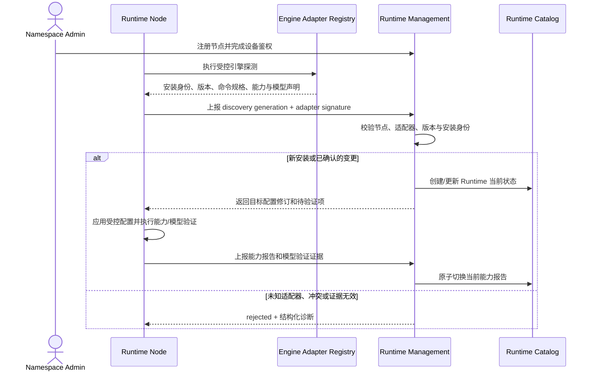

# Runtime 引擎与模型能力管理

## 1. 目标声明

### 背景

当前 `RuntimeProfile` 同时表达平台/节点执行位置、单一模型路由、目录与 Tool 策略；`RuntimeNode` 又通过唯一 `runtime_profile_id` 只能关联一个配置。另一方面，Claude Harness 的类型、CLI/SDK 约束和启动参数被放在 Agent 下的 `HarnessProfile`。这使机器、执行引擎、Agent 行为和模型路由相互缠绕，也无法自然表达“一台机器同时安装 Claude Code 与 Codex，且每个引擎支持不同模型”的真实状态。

v0.9 将机器与执行引擎分开：Runtime Node 继续代表受管机器；Runtime 代表平台或节点上一个可独立执行任务的 Agent Loop 引擎实例。Runtime Management 统一拥有引擎适配器、受控启动配置、能力报告和模型绑定。

### 目标

- 一台 Runtime Node 可以注册和管理多个 Runtime；平台执行环境也以 Runtime 实例进入同一目录。
- 首期提供 `claude_code` 与 `codex` 引擎适配器，使用同一规范化执行协议接收任务并回传事件。
- 节点通过受信任的适配器发现已安装引擎，回报安装身份、版本与能力；控制面不根据文件名猜测引擎。
- Runtime 配置使用不可变修订，明确命令规格、工作目录、安全上限、资源限制和环境变量名称白名单。
- Runtime 能力报告记录引擎/适配器版本、Tool/MCP/Skill/会话能力和模型发现结果，并生成稳定指纹。
- 建立与供应商接入配置解耦的稳定模型身份；Runtime 通过明确路由形成多个经过验证的模型绑定。
- Runtime 目录只把验证成功且当前可用的模型绑定暴露给 Conversation、Agent 和 Workflow 选择器。
- 保留现有节点设备鉴权、任务租约、内容同步、模型网关令牌和 secret 脱敏边界。

### 不在范围内

- 任意 Shell 字符串、自定义脚本或用户上传适配器。
- 自动安装、升级、降级 Claude Code、Codex 或其依赖。
- 根据模型名称相似度、价格、上下文窗口或系列关系自动替换模型。
- 把节点本地登录凭证、OAuth token、API Key 或环境变量值上传到控制面。
- 一个 Task 同时跨多个 Runtime 执行；多 Agent 编排通过多个明确 Task 实现。
- 删除旧 `runtime_profile` 或重写历史 Task、Session、Release 与审计记录。

## 2. 模块影响

| 模块 | 影响类型 | 说明 |
|------|---------|------|
| `runtime_management` | 核心修改 | 拥有 Runtime 实例、配置修订、引擎适配器、能力报告、模型绑定、发现/校验协议和管理 UI |
| `llm_configs` | 修改 | 增加稳定模型身份，并将供应商配置下的模型记录映射到该身份；继续拥有路由与凭证 |
| `agent_management` | 边界调整 | Claude/Codex Harness 适配实现迁入 Runtime Management；本需求仅提供后续 Release 兼容性目录 |
| `project_management` | 只读依赖 | 项目创建和仓库验证后续读取新的 Runtime 目录 |
| `conversation_management` | 只读依赖 | 会话后续读取 Runtime 及其模型绑定目录 |
| `workflow_management` | 只读依赖 | Workflow 后续读取 Runtime 能力和模型绑定目录 |

## 3. 功能描述

### 3.1 节点发现与 Runtime 注册

1. 节点继续通过一次性 enrollment token、设备公钥和 WSS 注册；Runtime 发现消息只能来自已鉴权的当前连接代次。
2. Runtime Worker 与 Node Runtime 使用平台内置的适配器注册表探测引擎。适配器定义允许的可执行文件、版本解析、能力探测、模型枚举和任务启动协议。
3. 每个节点安装使用适配器生成的稳定 `installation_key` 标识。同一节点的同一安装重复上报幂等；同一 key 对应不同引擎或可执行文件指纹时进入冲突状态。
4. 控制面为发现结果创建 Runtime 身份，Admin 补充名称并选择是否启用。发现不等于可执行；只有配置、能力和至少一个按业务需要的模型绑定验证通过后才可供选择。
5. Runtime 消失时保留身份、配置和历史报告，状态变为 `unavailable`；不得删除后重新创建，也不得把任务转发给同节点的另一个引擎。
6. 平台 Runtime 使用相同实体和能力协议，由平台 Worker 注册，`location_type=platform` 且没有 `runtime_node_id`；节点 Runtime 使用 `location_type=node` 并明确关联 Node。

边界条件：

- 一台 Node 可以有多个同引擎类型的安装，但 `installation_key`、可执行文件指纹和展示名称必须可区分。
- 节点克隆或设备重注册不能继承另一节点的 Runtime 身份；Admin 必须按现有节点替换/吊销流程处理。
- 发现到低于平台最低兼容版本的引擎时可以记录，但状态为 `incompatible`，不进入执行目录。
- Runtime 名称只用于展示，执行选择和审计使用 UUID，不按名称解析。

异常处理：

- 未知适配器、签名不匹配、版本解析失败或发现载荷超限时拒绝该条上报，并记录脱敏协议事件。
- 同一 generation 内容不一致返回协议冲突；旧 generation 不覆盖新状态。
- 节点离线时所有所属 Runtime 统一标记连接不可用，但各自配置、模型绑定与失败原因保持独立。

### 3.2 引擎适配器与配置修订

1. `runtime_management` 提供规范化 `TaskExecutionSpec` 与事件协议。适配器只负责把规范字段翻译为 Claude Code/Codex 的 CLI 或 SDK 调用，并把输出归一化为现有 Agent Event。
2. 适配器的 `engine_type`、`adapter_version`、支持的协议版本和最小/最大引擎版本由平台发布，不允许 namespace 用户上传代码覆盖。
3. Runtime 配置每次保存创建不可变修订，至少包含工作目录策略、命令参数结构、环境变量名称白名单、权限安全上限、超时/并发/资源上限和网络策略；secret 只保存密文引用或节点本地引用，不进入配置正文。
4. 命令使用 `executable + args[]` 结构化表达。适配器对参数逐项生成并校验，不经过 Shell 拼接，不接受命令替换、重定向或未声明环境注入。
5. Runtime 的安全配置是允许上限：Agent 或执行配置可以进一步收紧，不能扩大 Runtime 禁止的权限、Tool、网络、目录或资源范围。
6. 配置修订只有在目标环境应用并回报匹配摘要后才进入 `applied`；新任务只使用明确 applied 的修订。失败保留上一 applied 修订，不把 desired 冒充为实际配置。

边界条件：

- 更新 Runtime 配置不改变运行中 Task；后续 Task 读取新的 applied 修订。
- 降低并发上限不强制终止已运行 Task，但在数量收敛前不再领取新任务。
- 适配器升级导致能力指纹变化时，所有依赖旧指纹的新 Activation/配置修订必须重新预检；历史任务仍引用旧版本和指纹。

异常处理：

- Runtime 回报的配置摘要、适配器版本或引擎版本与目标不一致时保持 blocked，不尝试使用兼容模式启动。
- Adapter 无法无损表达规范字段时预检失败为 `adapter_contract_unsupported`，不丢弃字段继续执行。

### 3.3 稳定模型身份与 Runtime 模型绑定

1. `llm_configs` 增加空间级稳定模型身份，使用规范化 `provider_family + model_key` 唯一标识一个模型，例如同一模型经不同接入配置调用仍指向同一身份。
2. 现有供应商同步或手工补录的 `llm_provider_model` 必须映射到稳定模型身份。平台已知供应商可按官方精确 ID 映射；未知或歧义 ID 必须由 Admin 显式确认。
3. Runtime 模型绑定表达“该 Runtime 可以通过哪条路由实际调用哪个模型”，包含模型身份、路由类型、可选供应商配置/模型记录、引擎返回的模型 ID、验证状态和证据摘要。
4. 路由类型至少包括：
   - `provider_config`：使用空间内启用且验证成功的 LLM Provider Config，由现有 Model Gateway 签发绑定 Runtime/Task/模型的短期令牌。
   - `runtime_native`：使用 Claude Code/Codex 在目标机器上的本地受管登录或配置；控制面仅保存不含凭证的引用和验证证据。
5. 自动发现的模型只有在适配器能精确映射稳定模型身份并完成最小真实验证后才成为 `available`。仅出现在 CLI 帮助、静态清单或供应商列表中时状态为 `declared`，不能用于任务。
6. Admin 可以停用模型绑定；停用阻止新配置修订和新任务，不终止使用该绑定的运行中 Task。历史配置和 Task 仍可读取该绑定快照。
7. Runtime 不设置隐含默认模型。目录返回所有可用绑定和明确状态；上层配置必须选具体绑定或声明采用 Agent 偏好。

边界条件：

- 同一 Runtime、模型身份可以存在多条路由，但每条拥有独立 ID。精确选择保存 binding ID；Agent 偏好解析到多条可用路由时视为歧义并阻断，除非执行配置进一步明确路由。
- 同一模型 ID 在不同供应商家族下不合并；别名、日期后缀、区域部署名和兼容 API 名称不做模糊映射。
- Provider Config 被停用、模型变为 stale、节点本地登录失效或验证证据过期时，绑定立即不再可用于新配置。

异常处理：

- 验证产生鉴权、额度、区域、模型不存在或协议不兼容错误时保存结构化脱敏诊断；不得改用另一模型验证成功后把原绑定标为可用。
- 本地凭证引用不存在时返回 `runtime_native_auth_missing`，不回退到平台 Provider Config。
- 稳定模型身份无法确定时绑定停留在 `unmapped`，UI 要求 Admin 处理，不创建临时字符串偏好。

### 3.4 Runtime 目录、详情与状态

1. Runtime 目录按“平台 / Runtime Node / Runtime”层级展示。Node 行显示连接、版本和其 Runtime 数量；展开后分别展示每个引擎实例。
2. Runtime 摘要包含引擎类型/版本、适配器版本、当前配置、能力状态、可用模型数、运行任务数、Skill 同步摘要与最近心跳。
3. Runtime 详情展示当前/历史能力报告、模型绑定及验证、配置修订、已激活 Agent、Skill desired/applied 状态和任务历史。
4. 供其他模块使用的目录 API 支持按引擎、能力、模型身份、位置和状态过滤，直接返回兼容性摘要，避免前端逐 Runtime 请求拼装。
5. `available` 必须同时满足位置在线、引擎/适配器兼容、applied 配置有效、能力报告未过期；模型可用性另外按具体 binding 判断。

## 4. 数据变更

遵循“只增不改不删”。新增新语义实体和引用；旧 `runtime_profile`、`runtime_secret` 及其历史外键完整保留，只在迁移完成后停止新业务写入。

### 新增表

| 表名 | 用途说明 |
|------|---------|
| `runtime_instance` | 用户界面中的 Runtime；表示平台或 Node 上一个具体 Agent Loop 引擎实例及其当前状态指针 |
| `runtime_configuration_revision` | Runtime 的不可变期望配置、命令规格、安全/资源上限、摘要和 applied 状态 |
| `runtime_capability_report` | 追加保存引擎、适配器、能力、模型发现、配置摘要、报告代次和整体指纹 |
| `llm_model_definition` | 与具体供应商接入配置解耦的空间级稳定模型身份 |
| `runtime_model_binding` | Runtime、稳定模型身份和确定路由之间的可执行绑定及验证状态 |
| `runtime_model_validation_attempt` | 追加记录每次模型绑定验证的目标、结果、脱敏错误、证据摘要和时间 |

### 新增字段

| 表名 | 字段名 | 类型 | 业务含义 |
|------|--------|------|---------|
| `llm_provider_model` | `model_definition_id` | uuid，可空 FK | 映射到稳定模型身份；迁移完成后新启用模型业务上必需 |
| `runtime_node` | `discovery_generation` | bigint | 当前已接受的引擎发现代次，防止乱序覆盖 |
| `agent_task` | `runtime_instance_id` | uuid，可空 FK | v0.9 任务实际使用的 Runtime；旧任务仍使用 runtime_profile 引用 |

### 调整已有字段说明

| 表名/载荷 | 字段 | 调整说明 |
|-----------|------|---------|
| `runtime_profile` | 全部 | **[废弃]** 仅用于旧 Session、任务、Release 和迁移读取；新 Runtime 配置写入 `runtime_instance` 及其修订 |
| `runtime_node` | `runtime_profile_id` | **[废弃]** 保留旧的一对一记录；新关系使用 `runtime_instance.runtime_node_id` 表达一对多 |
| `runtime_node` / `runtime_profile` | Harness capability JSON | **[废弃]** 历史读取保留；新能力以签名 `runtime_capability_report` 为事实来源 |
| `runtime_secret` | Runtime Profile secret | 旧密文保持可读；新 Provider 路由引用 `llm_provider_config`，native 路由只保存节点本地 secret reference 的脱敏标识 |

### 关键约束

- `runtime_instance(namespace_id, runtime_node_id, installation_key)` 在节点位置唯一；平台 Runtime 使用独立的 namespace 级部分唯一约束。
- `runtime_configuration_revision(runtime_instance_id, revision)` 唯一；desired/applied 指针只能指向本 Runtime 的修订。
- `runtime_capability_report(runtime_instance_id, generation)` 唯一；同一 generation 的 digest 不得变化。
- `llm_model_definition(namespace_id, provider_family, model_key)` 唯一，不允许别名隐式合并。
- `runtime_model_binding` 的 Provider Config、Provider Model 与 Model Definition 必须同 namespace 且身份一致。
- 只有最近一次验证成功、依赖路由有效、Runtime 当前能力指纹匹配的 binding 才是 `available`。
- 迁移时每个旧平台/节点 Runtime Profile 创建一个 `claude_code` Runtime，并把旧模型/路由精确转换为首条 binding；任何凭证、模型身份或节点关系无法唯一映射时阻断迁移并列出对象，不创建猜测值。

## 5. API 与协议设计

### 管理接口

| Method | Path | 用途 |
|--------|------|------|
| GET | `/runtimes` | 分页读取 Runtime 实例目录及位置、引擎、能力和模型摘要 |
| POST | `/runtimes/platform` | Admin 创建受管平台 Runtime，明确引擎类型 |
| GET | `/runtimes/{runtime_id}` | Runtime 详情、当前配置/能力、模型绑定和状态诊断 |
| PUT | `/runtimes/{runtime_id}/configuration` | 按 expected revision 创建不可变配置修订 |
| POST | `/runtimes/{runtime_id}/configuration/apply` | Admin 显式应用并跟踪目标修订 |
| GET | `/runtime-nodes/{node_id}/runtimes` | 读取节点上的多个 Runtime 及发现状态 |
| POST | `/runtime-nodes/{node_id}/runtimes/{runtime_id}/enable` | Admin 显式启用已发现且兼容的 Runtime |
| GET/POST | `/llm/model-definitions` | 读取稳定模型目录；Admin 对未知精确模型身份建档 |
| GET/POST | `/runtimes/{runtime_id}/model-bindings` | 读取或创建明确模型路由绑定 |
| POST | `/runtimes/{runtime_id}/model-bindings/{binding_id}/validate` | Admin 发起幂等真实验证 |
| POST | `/runtimes/{runtime_id}/model-bindings/{binding_id}/disable` | Admin 停用新执行使用，保留历史 |
| GET | `/runtime-catalog` | Conversation/Agent/Workflow 使用的服务端过滤兼容目录 |

所有 mutation 使用 `Idempotency-Key` 或 `expected_revision`。Admin 可创建、配置、验证和停用；Developer 可读取并用于有权管理的业务配置；User 只通过 Conversation/Workflow 的受限目录读取可选项。接口不返回本地绝对凭证路径、secret value 或未脱敏 CLI 输出。

### Runtime 内部协议

| 通道 | 操作 | 用途 |
|------|------|------|
| 设备鉴权 WSS / internal worker | `runtime_discovery_report` | 上报适配器签名的安装清单、版本、指纹和 generation |
| 设备鉴权 WSS / internal worker | `runtime_configuration_desired` | 获取目标配置修订和摘要，不携带可导出的 native 凭证 |
| 设备鉴权 WSS / internal worker | `runtime_configuration_result` | 回报 applied/failed 与实际摘要 |
| 设备鉴权 WSS / internal worker | `runtime_capability_report` | 上报能力、引擎/适配器版本、发现模型和指纹 |
| 设备鉴权 WSS / internal worker | `runtime_model_validation_result` | 回报精确 binding 的验证证据和脱敏错误 |

内部消息允许重复和乱序，通过 installation key、generation、revision、attempt ID 与 digest 保证幂等；通知只负责唤醒，当前数据库目标状态是事实来源。

### 兼容接口

- 旧 `/runtimes/nodes/{id}/runtime` 与 `/runtimes/platform` 读取接口在迁移期仅返回旧资源或指向新详情的迁移标识，不接受 v0.9 新配置写入。
- 不建立旧/新长期双写。切换前完成全量预检与数据转换，切换后所有新任务和配置只引用 `runtime_instance`。

## 6. UI 页面

| 变更类型 | 页面名 | 路由 | 说明 |
|------|------|------|------|
| 修改 | Runtime 目录 | `/system/runtimes` | 按平台/机器分组展示多个 Runtime，而非每台机器一个 Runtime Profile |
| 新增 | Runtime 详情 | `/system/runtimes/:runtimeId` | 管理引擎状态、配置修订、能力报告、模型绑定和诊断 |
| 修改 | Runtime Node 详情 | `/system/runtime-nodes/:nodeId` | 增加发现到的引擎实例列表、版本和启用状态 |
| 修改 | 大模型接入配置 | `/system/llm-providers` | 模型行展示稳定模型身份映射和被哪些 Runtime binding 使用 |

### Runtime 目录

- 布局：平台 Runtime 区域、Runtime Node 表格；Node 可展开多个 Runtime 子行。
- 字段：Runtime 名称、引擎、引擎/Adapter 版本、状态、可用模型数、运行任务、配置 desired/applied 和最近报告时间。
- 交互：点击 Runtime 子行进入详情；不可用、blocked、unmapped 状态显示直接原因，不只显示笼统红点。
- 筛选：位置、Node、引擎类型、状态、模型身份和能力标签由服务端过滤。

### Runtime 详情

- 概览区区分“机器连接”“引擎兼容”“配置应用”“能力报告”“模型绑定”五个状态，避免一个 available 掩盖局部失败。
- 配置区使用受控字段和结构化参数预览，不提供自由 Shell 文本框；保存产生新 revision，应用状态单独展示。
- 模型区一行一个 binding，展示稳定模型身份、实际引擎模型 ID、路由类型、Provider Config 或 native、验证状态/时间和最近错误。
- 能力区展示当前指纹与历史差异；指纹变化时列出需要重新预检的 Activation/Workflow/Conversation 配置。
- Developer 只读；Admin 才看到启用、保存配置、验证绑定和停用操作。

## 7. 验收标准

- [ ] 同一 Runtime Node 能同时注册并展示 Claude Code、Codex 等多个 Runtime，任务选择使用具体 Runtime ID。
- [ ] 平台与节点 Runtime 使用同一目录、配置修订、能力报告和模型绑定语义，位置差异不会产生两套上层配置模型。
- [ ] 节点发现使用受信任适配器、稳定 installation key、generation 和签名；未知/冲突结果不能进入可执行目录。
- [ ] Runtime 消失或 Node 离线时保留身份和历史，状态明确不可用；系统不把任务转移到其他 Runtime。
- [ ] Claude Code 与 Codex Adapter 都能接收同一规范 TaskExecutionSpec，并以统一 Agent Event 协议回传；无法表达的字段会在预检阶段阻断。
- [ ] Runtime 命令以 executable 和 args 数组生成，不经 Shell 拼接，不允许任意脚本或未经声明的环境注入。
- [ ] 配置保存创建不可变 revision；只有 Runtime 回报匹配摘要后才推进 applied，失败保留上一 revision 且不冒充成功。
- [ ] 稳定模型身份不依赖具体 Provider Config；同一精确模型可通过多条明确路由绑定到 Runtime。
- [ ] 自动发现、静态声明或名称相似不能单独使模型 binding 可用；必须完成精确身份映射和真实验证。
- [ ] Runtime 原生凭证不上传控制面，Provider Config secret 不通过目录或任务载荷下发明文。
- [ ] Runtime 没有隐含默认模型；目录完整返回可用 binding 与状态，调用方不能只提交裸模型字符串。
- [ ] 同一模型偏好对应多条可用路由时返回歧义，不随机选择第一条或最近使用路由。
- [ ] Adapter、引擎、配置或模型验证状态变化会使相关新执行预检失效，历史 Task 仍能读取原指纹和绑定证据。
- [ ] Runtime 目录和详情能清楚区分 Node、引擎、配置、能力和模型状态，并提供对象级脱敏诊断。
- [ ] 旧 Runtime Profile、旧外键和历史数据保持只读可审计；迁移歧义会阻断切换，不跳过、不猜测、不长期双写。
